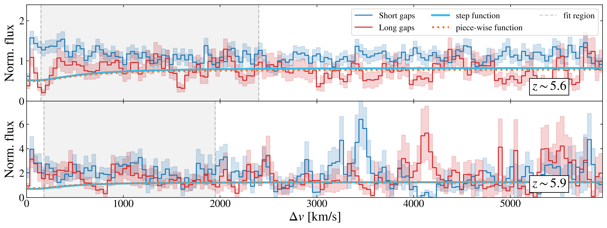
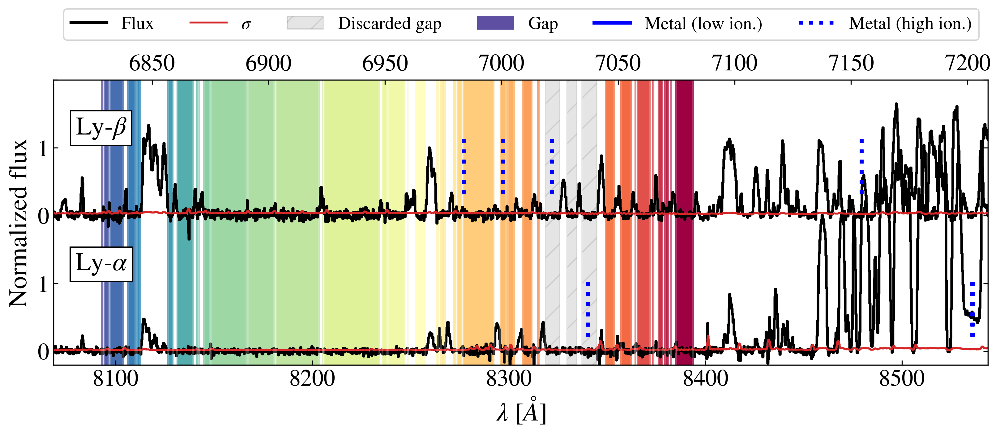
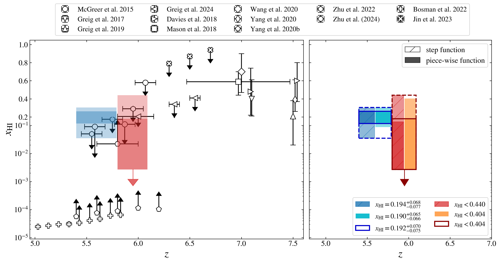

$\newcommand{\ensuremath}{}$
$\newcommand{\xspace}{}$
$\newcommand{\object}[1]{\texttt{#1}}$
$\newcommand{\farcs}{{.}''}$
$\newcommand{\farcm}{{.}'}$
$\newcommand{\arcsec}{''}$
$\newcommand{\arcmin}{'}$
$\newcommand{\ion}[2]{#1#2}$
$\newcommand{\textsc}[1]{\textrm{#1}}$
$\newcommand{\hl}[1]{\textrm{#1}}$
$\newcommand{\footnote}[1]{}$
$\newcommand{\PG}[1]{{\color{red} \bf  #1}}$
$\newcommand{\orcidauthorA}{0000-0003-1634-1283}$
$\newcommand{\orcidauthorB}{0000-0001-8582-7012}$
$\newcommand{\orcidauthorC}{0000-0003-0821-3644}$
$\newcommand{\orcidauthorD}{0000-0002-2423-7905}$
$\newcommand{\orcidauthorE}{0000-0003-3307-7525}$

# Damping wings in the Lyman-$\alpha$ forest

<mark>Appeared on: 2024-05-23</mark> -  _7 pages, 4 figures, submitted to A&A Letters_

B. Spina, et al. -- incl., <mark>P. Gaikwad</mark>

**Abstract:** Recent observations have positioned the endpoint of the Epoch of Reionisation (EoR) at redshift $z \sim 5.3$ . However, observations of the Lyman- $\alpha$ forest have not yet been able to discern whether reionisation occurred slowly and late, with substantial neutral hydrogen    persisting at redshift $\sim 6$ , or rapidly and earlier, with the apparent late end driven by the fluctuating UV background.    Gunn-Peterson (GP) absorption troughs    are solid indicators that reionisation is not complete until $z=5.3$ , but whether they contain significantly neutral gas has not yet been proven. We aim to answer this question by directly measuring, for the first time, the neutral hydrogen fraction ( $x_\mathrm{HI}$ ) at the end of the EoR ( $5 \lesssim z \lesssim 6$ ) in high-redshift quasars spectra. For high neutral fractions $x_\mathrm{HI}\gtrsim0.1$ , GP troughs exhibit damping wing (DW) absorption extending over $1000$ km s $^{-1}$ beyond the troughs. While conclusively detected in Lyman- $\alpha$ emission lines of quasars at $z\geq7$ , DWs are challenging to observe in the general Lyman- $\alpha$ forest due to absorption complexities and small-scale stochastic transmission features. We report the first successful identification of the stochastic DW signal adjacent to GP troughs at redshifts $z=5.6$ through careful stacking of the dark gaps in Lyman- $\alpha$ forest. We use the signal to present a measurement of the corresponding global $x_\mathrm{HI}=0.19\pm0.07$ $(_{-0.16}^{+0.11})$ at $1\sigma$ $(2\sigma)$ at $z=5.6$ and a limit $x_\mathrm{HI}<0.44$ at $z=5.9$ . The detection of this signal demonstrates the existence of substantially neutral islands near the conclusion of the EoR, unequivocally signaling a late-and-slow reionization scenario.

**Figure 2. -** Stacked spectrum around long and short gaps for two redshift bins (top: $z=5.6$, bottom: $z=5.9$). In each panel, the red and blue curves depict the stacked profiles of long and short gaps, respectively, with their widths being the uncertainties from bootstrap resampling. The continuous light-blue line and the dotted orange line indicate the best-fit transmission model fit to the stack around long gaps for the step-function model and the piece-wise model, respectively.  Long gaps are defined as those with velocity widths greater than $340$ km s$^{-1}$, while short gaps have lengths under $200$ km s$^{-1}$. The curves in the bottom panel show the models which are permitted at at $2\sigma$ level. (*plot2*)

**Figure 1. -** Example of the gap-finding procedure for the sight-line towards quasar ATLASJ029.9915-36.5658. The Ly$\alpha$(bottom) and Ly$\beta$(top) spectra are depicted along with identified gaps (colored bands). Contamination from metal systems are also displayed (blue vertical lines) and the corresponding gaps removed (gray-strip bands). In this example, a high-ionisation metal system potentially affecting the Ly$\alpha$ forest is identified, leading to the removal of $3$ joint gaps. (*plot1*)

**Figure 3. -** Constraints on the neutral fraction across cosmic time. The coloured solid and dashed boxes indicate our $1\sigma$ and $2\sigma$ constraints, respectively. Right: the constraints obtained in this work, in the two redshift bins and with the two $x_\mathrm{HI}$-$L$ relations proposed. Left: existing constraints from the literature: [McGreer and Mesinger (2015)](), [Greig, et. al (2017)](), [Greig, Mesinger and Bañados (2019)](), [Davies, Hennawi and Bañados (2018)](), [Mason, Treu and Dijkstra (2018)](), [Mason, Fontana and Treu (2019)](),   [Wang, Davies and Yang (2020)](), [Yang, Wang and Fan (2020)](), [Yang, Wang and Fan (2020)](),  [Zhu, Becker and Bosman (2022)](), [Bosman, Davies and Becker (2022)](), [Jin, Yang and Fan (2023)](), [Zhu, Becker and Bosman (2024)](). Some of the literature points have been slightly shifted in redshift, and the constraints of [Greig, Mesinger and Bañados (2024)]() have been combined for improved clarity. (*plot3*)

