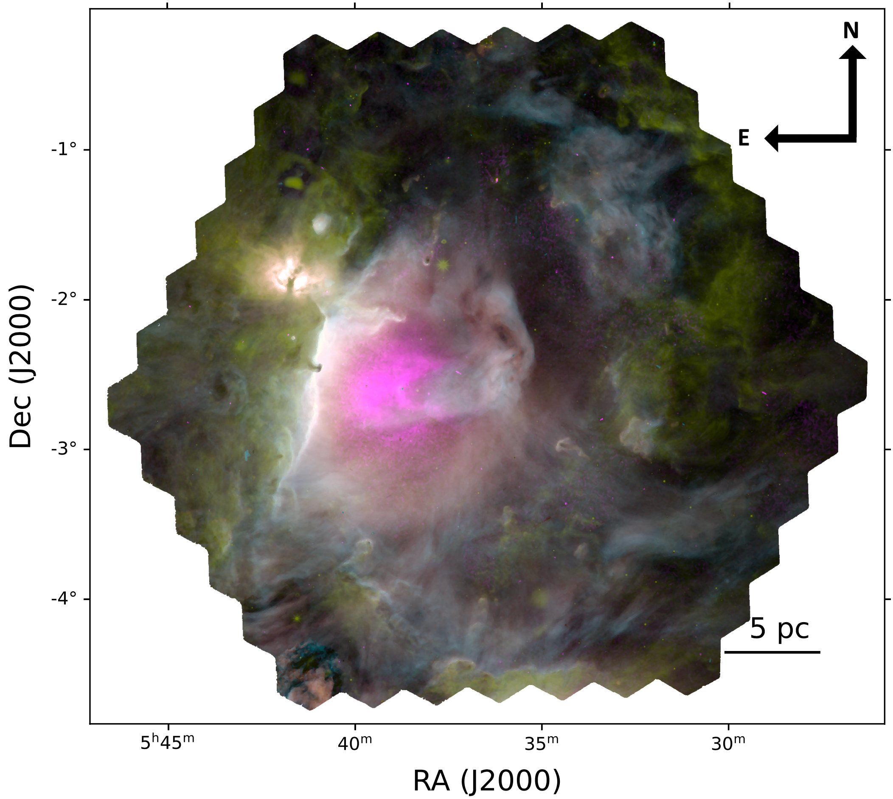
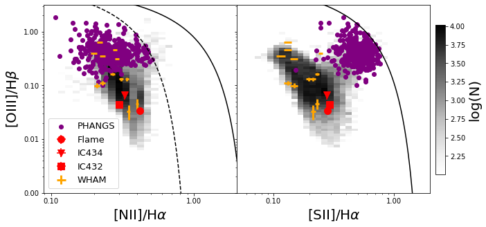

$\newcommand{\ensuremath}{}$
$\newcommand{\xspace}{}$
$\newcommand{\object}[1]{\texttt{#1}}$
$\newcommand{\farcs}{{.}''}$
$\newcommand{\farcm}{{.}'}$
$\newcommand{\arcsec}{''}$
$\newcommand{\arcmin}{'}$
$\newcommand{\ion}[2]{#1#2}$
$\newcommand{\textsc}[1]{\textrm{#1}}$
$\newcommand{\hl}[1]{\textrm{#1}}$
$\newcommand{\footnote}[1]{}$
$\newcommand{\oiii}{[O \textsc{iii}]}$
$\newcommand{\nii}{[N \textsc{ii}]}$
$\newcommand{\sii}{[S \textsc{ii}]}$
$\newcommand{\oi}{[O \textsc{i}]}$
$\newcommand{\niion}{[N \textsc{i}]}$
$\newcommand{\hei}{[He \textsc{i}]}$
$\newcommand{\siii}{[S \textsc{iii}]}$
$\newcommand{\oii}{[O \textsc{ii}]}$
$\newcommand{\neii}{[Ne \textsc{ii}]}$
$\newcommand{\hii}{H \textsc{ii}}$
$\newcommand{\ha}{H\alpha}$
$\newcommand{\hb}{H\beta}$
$\newcommand{\cii}{[C \textsc{ii}]}$
$\newcommand{\revone}$
$\newcommand{\OSU}{\label{OSU} Department of Astronomy, The Ohio State University, 140 West 18th Avenue, Columbus, Ohio 43210, USA}$
$\newcommand{\Alberta}{\label{Alberta} Department of Physics, University of Alberta, Edmonton, AB T6G 2E1, Canada}$
$\newcommand{\ANU}{\label{ANU} Research School of Astronomy and Astrophysics, Australian National University, Canberra, ACT 2611, Australia}$
$\newcommand{\IPAC}{\label{IPAC} Caltech-IPAC, 1200 E. California Blvd. Pasadena, CA 91125, USA}$
$\newcommand{\Carnegie}{\label{Carnegie} Observatories of the Carnegie Institution for Science, 813 Santa Barbara Street, Pasadena, CA 91101, USA}$
$\newcommand{ÇAPP}{\label{CCAPP} Center for Cosmology and Astroparticle Physics, 191 West Woodruff Avenue, Columbus, OH 43210, USA}$
$\newcommand{\CfA}{\label{CfA}Harvard-Smithsonian Center for Astrophysics, 60 Garden Street, Cambridge, MA 02138, USA}$
$\newcommand{\CITEVA}{\label{CITEVA} Centro de Astronomía (CITEVA), Universidad de Antofagasta, Avenida Angamos 601, Antofagasta, Chile}$
$\newcommand{\CNRS}{\label{CNRS} CNRS, IRAP, 9 Av. du Colonel Roche, BP 44346, F-31028 Toulouse cedex 4, France}$
$\newcommand{\ESO}{\label{ESO} European Southern Observatory, Karl-Schwarzschild Stra{\ss}e 2, D-85748 Garching bei München, Germany}$
$\newcommand{\ESOChile}{\label{ESOChile} European Southern Observatory, Avenida Alonso de Cordoba 3107, Casilla 19, Santiago 19001, Chile}$
$\newcommand{\HD}{\label{HD} Astronomisches Rechen-Institut, Zentrum für Astronomie der Universität Heidelberg, Mönchhofstra\ss e 12-14, D-69120 Heidelberg, Germany}$
$\newcommand{\ICRAR}{\label{ICRAR} International Centre for Radio Astronomy Research, University of Western Australia, 35 Stirling Highway, Crawley, WA 6009, Australia}$
$\newcommand{\IRAM}{\label{IRAM} Institut de Radioastronomie Millimétrique (IRAM), 300 Rue de la Piscine, F-38406 Saint Martin d'Hères, France}$
$\newcommand{\ITA}{\label{ITA} Universität Heidelberg, Zentrum für Astronomie, Institut für Theoretische Astrophysik, Albert-Ueberle-Str 2, D-69120 Heidelberg, Germany}$
$\newcommand{\IWR}{\label{IWR} Universität Heidelberg, Interdisziplinäres Zentrum für Wissenschaftliches Rechnen, Im Neuenheimer Feld 205, D-69120 Heidelberg, Germany}$
$\newcommand{\JHU}{\label{JHU} Department of Physics and Astronomy, The Johns Hopkins University, Baltimore, MD 21218, USA}$
$\newcommand{\Leiden}{\label{Leiden} Leiden Observatory, Leiden University, P.O. Box 9513, 2300 RA Leiden, The Netherlands}$
$\newcommand{\Maryland}{\label{Maryland} Department of Astronomy, University of Maryland, College Park, MD 20742, USA}$
$\newcommand{\MPE}{\label{MPE} Max-Planck-Institut für extraterrestrische Physik, Giessenbachstra{\ss}e 1, D-85748 Garching, Germany}$
$\newcommand{\MPIA}{\label{MPIA} Max-Planck-Institut für Astronomie, Königstuhl 17, D-69117, Heidelberg, Germany}$
$\newcommand{\Nagoya}{\label{Nagoya} Department of Physics, Nagoya University, Furo-cho, Chikusa-ku, Nagoya, Aichi 464-8602, Japan}$
$\newcommand{\NRAO}{\label{NRAO} National Radio Astronomy Observatory, 520 Edgemont Road, Charlottesville, VA 22903-2475, USA}$
$\newcommand{\OAN}{\label{OAN} Observatorio Astronómico Nacional (IGN), C/Alfonso XII, 3, E-28014 Madrid, Spain}$
$\newcommand{\ObsParis}{\label{ObsParis} Sorbonne Université, Observatoire de Paris, Université PSL, CNRS, LERMA, F-75014, Paris, France}$
$\newcommand{\Princeton}{\label{Princeton} Department of Astrophysical Sciences, Princeton University, Princeton, NJ 08544 USA}$
$\newcommand{\UToledo}{\label{UToledo} University of Toledo, 2801 W. Bancroft St., Mail Stop 111, Toledo, OH, 43606}$
$\newcommand{\Toulouse}{\label{Toulouse} Université de Toulouse, UPS-OMP, IRAP, F-31028 Toulouse cedex 4, France}$
$\newcommand{\UBonn}{\label{UBonn} Argelander-Institut für Astronomie, Universität Bonn, Auf dem Hügel 71, 53121 Bonn, Germany}$
$\newcommand{\UChile}{\label{UChile} Departamento de Astronomía, Universidad de Chile, Camino del Observatorio 1515, Las Condes, Santiago, Chile}$
$\newcommand{\UConn}{\label{UConn} Department of Physics, University of Connecticut, Storrs, CT, 06269, USA}$
$\newcommand{\UCSD}{\label{UCSD}Center for Astrophysics and Space Sciences, Department of Physics,  University of California, San Diego, 9500 Gilman Drive, La Jolla, CA 92093, USA}$
$\newcommand{\UGent}{\label{UGent} Sterrenkundig Observatorium, Universiteit Gent, Krijgslaan 281 S9, B-9000 Gent, Belgium}$
$\newcommand{\ULyon}{\label{ULyon} Univ Lyon, Univ Lyon 1, ENS de Lyon, CNRS, Centre de Recherche Astrophysique de Lyon UMR5574,\ F-69230 Saint-Genis-Laval, France}$
$\newcommand{\UMass}{\label{UMass} University of Massachusetts—Amherst, 710 N. Pleasant Street, Amherst, MA 01003, USA}$
$\newcommand{\UWyoming}{\label{UWyoming} Department of Physics and Astronomy, University of Wyoming, Laramie, WY 82071, USA}$
$\newcommand{\LAM}{\label{LAM} Aix Marseille Univ, CNRS, CNES, LAM (Laboratoire d’Astrophysique de Marseille), Marseille, France}$
$\newcommand{\UHawaii}{\label{UHawaii} Institute for Astronomy, University of Hawaii, 2680 Woodlawn Drive, Honolulu, HI 96822, USA}$
$\newcommand{\UCM}{\label{UCM} Departamento de Física de la Tierra y Astrofísica, Universidad Complutense de Madrid, E-28040, Spain}$
$\newcommand{\IPARC}{\label{IPARC} Instituto de Física de Partículas y del Cosmos IPARCOS, Facultad de Ciencias Físicas, Universidad Complutense de Madrid, E-28040, Spain}$
$\newcommand{\STScI}{\label{STScI} Space Telescope Science Institute, 3700 San Martin Drive, Baltimore, MD 21218, USA}$
$\newcommand{\McMaster}{\label{McMaster} Department of Physics and Astronomy, McMaster University, 1280 Main Street West, Hamilton, ON L8S 4M1, Canada}$
$\newcommand{\INAF}{\label{INAF} INAF -- Osservatorio Astrofisico di Arcetri, Largo E. Fermi 5, I-50157, Firenze, Italy}$
$\newcommand{\Sydney}{\label{Sydney} Sydney Institute for Astronomy, School of Physics A28, The University of Sydney, NSW 2006, Australia}$
$\newcommand{\CITA}{\label{CITA} Canadian Institute for Theoretical Astrophysics (CITA), University of Toronto, 60 St George St, Toronto, ON M5S 3H8, Canada}$
$\newcommand{\ASIAA}{\label{ASIAA} Institute of Astronomy and Astrophysics, Academia Sinica, No. 1, Sec. 4, Roosevelt Road, Taipei 10617, Taiwan}$
$\newcommand{\TKU}{\label{TKU} Department of Physics, Tamkang University, No.151, Yingzhuan Rd., Tamsui Dist., New Taipei City 251301, Taiwan}$
$\newcommand{\PSMA}{\label{PSMA} Penn State Mont Alto, 1 Campus Drive, Mont Alto, PA  17237, USA}$
$\newcommand{\ILL}{\label{ILL} ILL}$
$\newcommand{\stromlo}{\label{stromlo} Research School of Astronomy and Astrophysics, Australian National University, Mt Stromlo Observatory, Weston Creek, ACT 2611, Australia}$
$\newcommand{\UCatolica}{\label{UCatolica} Instituto de Astronomía, Universidad Católica del Norte, Av. Angamos 0610, Antofagasta, Chile}$
$\newcommand{\UT}{\label{UT} McDonald Observatory, The University of Texas at Austin, 1 University Station, Austin, TX 78712-0259, USA}$
$\newcommand{\Vanderbilt}{\label{Vanderbilt} Department of Physics and Astronomy, Vanderbilt University, VU Station 1807, Nashville, TN 37235, USA}$
$\newcommand{\UNF}{\label{UNF} Department of Physics, University of North Florida, 1 UNF Dr. Jacksonville FL 32224}$
$\newcommand{\NAOC}{\label{NAOC} Chinese Academy of Sciences South America Center for Astronomy, National Astronomical Observatories, CAS, Beijing 100101, China}$
$\newcommand{\CASA}{\label{CASA} Center for Astrophysics and Space Astronomy, University of Colorado, 389 UCB, Boulder, CO 80309-0389, USA}$
$\newcommand{\UNAM}{\label{UNAM} Universidad Nacional Autónoma de México, Instituto de Astronomía, AP 106, Ensenada 22800, BC, México}$
$\newcommand{\UDP}{\label{UDP} Instituto de Estudios Astrofísicos, Facultad de Ingeniería y Ciencias, Universidad Diego Portales, Av. Ejército Libertador 441, Santiago, Chile}$
$\newcommand{\Steward}{\label{Steward} Steward Observatory, University of Arizona, 933 N. Cherry Ave., Tucson, AZ 85721-0065, USA}$
$\newcommand{\APO}{\label{APO} Apache Point Observatory and New Mexico State University, P.O. Box 59,$
$Sunspot, NM 88349-0059, USA}$
$\newcommand{\UNAMCU}{\label{UNAMCU} Universidad Nacional Autónoma de México, Instituto de Astronomía, AP 70-264, CDMX 04510, México}$
$\newcommand{\UWash}{\label{UWash}Department of Astronomy, University of Washington, Seattle, WA, 98195}$
$\newcommand{Ç}{\label{CC}Department of Physics, Colorado College, Colorado Springs, CO 80903}$
$\newcommand{\Utah}{\label{Utah}Department of Physics and Astronomy, University of Utah, 115 S. 1400 E., Salt Lake City, UT 84112, USA}$
$\newcommand{\UConcepcion}{\label{UConcepcion}Departamento de Astronomía, Universidad de Concepción, Casilla 160-C, Concepción, Chile}$
$\newcommand{\FCLA}{\label{FCLA}Franco-Chilean Laboratory for Astronomy, IRL 3386, CNRS and Universidad de Chile, Santiago, Chile}$
$\newcommand{\Oklahoma}{\label{Oklahoma}Homer L. Dodge Department of Physics and Astronomy, University of Oklahoma, Norman, OK 73019, USA}$
$\newcommand{\UIUC}{\label{UIUC}Department of Astronomy, University of Illinois, Urbana, IL 61801, USA}$
$\newcommand{\Harvard}{\label{Harvard}Harvard-Smithsonian Center for Astrophysics, Cambridge, MA 02138, USA}$
$\newcommand{\caltech}{\label{caltech}Department of Astronomy, California Institute of Technology, Pasadena, CA 91125, USA}$
$\newcommand\natexlab{#1}$

# SDSS-V Local Volume Mapper (LVM): A Glimpse into Orion

<mark>Appeared on: 2024-05-27</mark> -  _12 pages, 9 figures, submitted to A&A_

<mark>K. Kreckel</mark>, et al. -- incl., <mark>J. Li</mark>, <mark>H.-W. Rix</mark>

**Abstract:** The Orion Molecular Cloud complex, one of the nearest (D $\sim$ 400 pc) and most extensively studied massive star-forming regions, is ideal for constraining the physics of stellar feedback, but its $\sim$ 12 deg diameter on the sky requires a dedicated approach to mapping ionized gas structures within and around the nebula. The Sloan Digital Sky Survey (SDSS-V) Local Volume Mapper (LVM) is a new optical integral field unit (IFU) that will map the ionized gas within the Milky Way and Local Group galaxies, covering 4300 deg $^2$ of the sky with the new LVM Instrument. We showcase optical emission line maps from LVM covering 12 deg $^2$ inside of the Orion belt region, with 195,000 individual spectra combined to produce images at 0.07 pc (35.3 $\arcsec$ ) resolution. This is the largest IFU map made (to date) of the Milky Way, and contains well-known nebulae (the Horsehead Nebula, Flame Nebula, IC 434, and IC 432),  as well as ionized interfaces with the neighboring dense Orion B molecular cloud. We resolve the ionization structure of each nebula, and map the increase in both the $\sii$ / $\ha$ and $\nii$ / $\ha$ line ratios at the outskirts of nebulae and along the ionization front with Orion B. $\oiii$ line emission is only spatially resolved within the center of the Flame Nebula and IC 434, and our $\sim$ 0.1 pc scale line ratio diagrams show how variations in these diagnostics are lost as we move from the resolved to the integrated view of each nebula. We detect ionized gas emission associated with the dusty bow wave driven ahead of the star $\sigma$ Orionis, where the stellar wind interacts with the ambient interstellar medium. The Horsehead Nebula is seen as a dark occlusion of the bright surrounding photo-disassociation region. This small glimpse into Orion only hints at the rich science that will be enabled by the LVM.

**Figure 5. -** Line emission and line ratios mapped across 20 pc$\times$20 pc of the Orion belt region. Top left: $\ha$ line emission is prominent within IC 434, the flame Nebula, and IC 432.
   Star symbols mark all individual ionizing O type (blue) and B type (cyan) stars, and dashed lines show the approximate boundaries of each nebula.  Missing individual pixels are masked fibers with bright stars where our simplistic stellar continuum fitting was insufficient.   Top center and right: $\sii$/$\ha$  and $\nii$/$\ha$ line ratio maps increase at the outskirts of IC 434 and the Flame nebulae. Bottom left: Dust extinction via the Balmer decrement increases along the extent of the neighboring Orion B molecular cloud, and peaks at the young embedded Flame Nebula. Bottom center: The increased dust concentration in the Flame Nebula is particularly pronounced in the $\sii$$\lambda$6717/$\sii$$\lambda$6731 line ratio, which traces changes in gas density.  Bottom right: $\oiii$/$\hb$ line ratios can only be mapped in the centers of IC 434 and the Flame Nebula. Higher values towards the center of IC 434 reflect the changing ionizing structure of the nebula, with more highly ionized oxygen found closer to the ionizing source.  (*fig:neb_conditions*)

**Figure 4. -** A glimpse into Orion with LVM. 108 tiles cover 4 deg $\times$ 4 deg (30 pc $\times$ 30 pc), producing a total of almost 195,000 spectra. Colors show different emission lines ($\ha$: orange, $\sii$6717+6731: light blue, $\oiii$5007: magenta) trace the ionization structure of the nebula, and carve a bubble into surrounding dense gas (WISE 12$\mu$m: yellow). The ionized gas emission traces wispy, filamentary structures and dusty eroding clouds and clumps.  The iconic Horsehead Nebula sits at the bright filamentary ionization front and photo-disassociation region between the central ionized nebula IC 434 and the dark neighboring molecular cloud Orion B to the east, while  channels for escaping radiation are apparent in the north.    (*fig:orion_3color*)

**Figure 6. -** Diagnostic line ratios (left: $\oiii$/$\hb$ vs $\nii$/$\ha$; right: $\oiii$/$\hb$ vs $\sii$/$\ha$) for all pixels with significant detections in all lines. The curves shown from \cite{Kewley2001}(solid) and \cite{Kauffmann2003}(dashed) are commonly used (in integrated and kpc regions) to distinguish photoionized gas from gas ionized by harder ionizing sources. Requiring the detection of $\oiii$  this diagnostic is limited to the areas of the Flame Nebula and the center of NGC 434 (see Figure \ref{fig:neb_conditions}), as well as to regions consistent with photoionization. Integrated results for IC 434 (triangle), IC 432 (square) and the Flame Nebula (circle) are overplotted, as well as integrated measurements from WHAM for single O-star powered Milky Way $\hii$ regions (orange) and extragalactic PHANGS $\hii$ regions with matched $\ha$ luminosity (purple). (*fig:bpt*)

