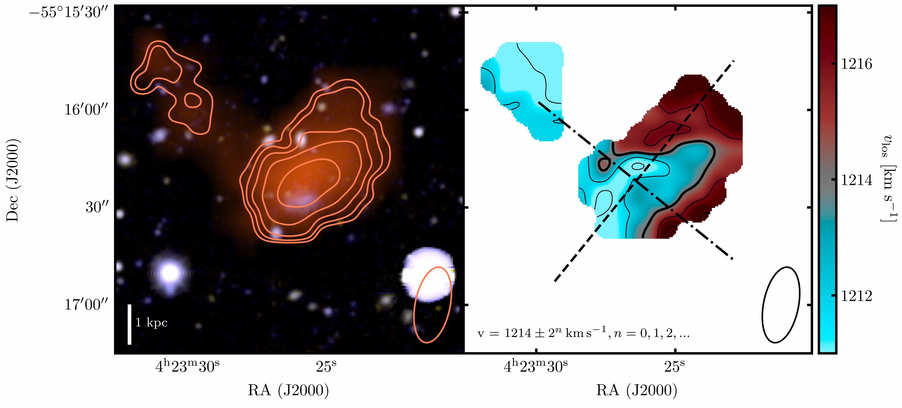
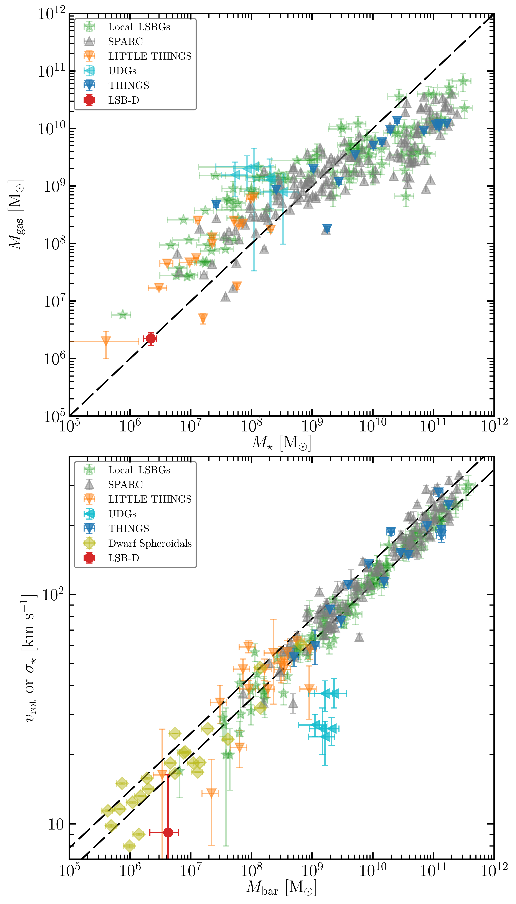

$\newcommand{\ensuremath}{}$
$\newcommand{\xspace}{}$
$\newcommand{\object}[1]{\texttt{#1}}$
$\newcommand{\farcs}{{.}''}$
$\newcommand{\farcm}{{.}'}$
$\newcommand{\arcsec}{''}$
$\newcommand{\arcmin}{'}$
$\newcommand{\ion}[2]{#1#2}$
$\newcommand{\textsc}[1]{\textrm{#1}}$
$\newcommand{\hl}[1]{\textrm{#1}}$
$\newcommand{\footnote}[1]{}$
$\newcommand{\fluxhi}{{S_{\rm 1.4  GHz}}}$
$\newcommand{\fluxco}{{S_{\rm CO   (2-1)}}}$
$\newcommand{\pow}{{\log P_{1.4   \rm GHz}}}$
$\newcommand{\matHI}{{\rm H {\hskip 0.02cm \tt I}}}$
$\newcommand{\CO}{\element[]CO}$
$\newcommand{\couno}{\element[][12]CO (1--0) }$
$\newcommand{\codue}{\element[][12]CO (2--1) }$
$\newcommand{\cotre}{{\element[][12]CO(3--2)} }$
$\newcommand{\brgamma}{Br\gamma}$
$\newcommand{\sisei}{[Si {\small VI}]}$
$\newcommand{\Htwozero}{H_{ 2} 0-0 S(0,1,2,5)}$
$\newcommand{\Htwouno}{H_{ 2} 1-0 S(0,1,2,3)}$
$\newcommand{\Htwotwo}{H_{ 2} 2-1 S(1,3)}$
$\newcommand{\Htwoz}{H_{ 2} 1-0 S(0)}$
$\newcommand{\Htwoi}{H_{ 2} 1-0 S(1)}$
$\newcommand{\Htwod}{H_{ 2} 1-0 S(2)}$
$\newcommand{\Htwot}{H_{ 2} 1-0 S(3)}$
$\newcommand{\Htwodz}{H_{ 2} 2-1 S(1)}$
$\newcommand{\Htwodt}{H_{ 2} 2-1 S(3)}$
$\newcommand{\mhtwo}{{M (H_{  2})}}$
$\newcommand{\kms}{ km~s^{-1}}$
$\newcommand{\ms}{ m~s^{-1}}$
$\newcommand{\ergs}{ erg~s^{-1}}$
$\newcommand{\ergscm}{ erg s^{-1} cm^{-2}}$
$\newcommand{\kmsMp}{km s^{-1}~Mpc^{-1}}$
$\newcommand{\Jyb}{Jy beam^{-1}}$
$\newcommand{\Jykms}{Jy km s^{-1}}$
$\newcommand{\mJyb}{mJy beam^{-1}}$
$\newcommand{\mJy}{mJy}$
$\newcommand{\whz}{W~Hz^{-1}}$
$\newcommand{\msun}{{{\rm M}_\odot}}$
$\newcommand{\msunyr}{{{\rm M}_\odot yr^{-1}}}$
$\newcommand{\lsun}{{L_\odot}}$
$\newcommand{\cmsq}{cm^{-2}}$
$\newcommand{\pcdue}{pc^{-2}}$
$\newcommand{\tspin}{T_{\rm spin}}$
$\newcommand{\atms}{atoms cm^{-2}}$
$\newcommand{\um }{\mum}$
$\newcommand{\eg}{\mbox{e.g.}}$
$\newcommand{\ie}{\mbox{i.e.}}$
$\newcommand{\etal}{{\sl et al.}}$
$\newcommand{\sauron}{{\texttt{SAURON}}}$
$\newcommand{\atlas}{{ATLAS^{\rm 3D}}}$
$\newcommand{\mgas}{{MeerGas}}$
$\newcommand{\mhon}{{MHONGOOSE}}$
$\newcommand{\lsb}{\mbox LSB-D}$
$\newcommand{\forn}{\mbox Fornax~A}$
$\newcommand{\cena}{\mbox Centaurus~A}$
$\newcommand{\nfi}{\mbox NGC~1566}$
$\newcommand{\pl}{{\em{Planck}}}$
$\newcommand{\meer}{{MeerKAT}}$
$\newcommand{\syn}{\tt{SYNAGE++}}$
$\newcommand{\cara}{{\tt CARACal}}$
$\newcommand{\vsys}{{v_{\rm sys}} }$
$\newcommand{\vrot}{{v_{\rm rot}} }$
$\newcommand{\MHILB}{{M_{\rm HI}/L_B}}$
$\newcommand{\nhi}{{N_{\rm H {\hskip 0.02cm \tt I}}}}$
$\newcommand{\mhi}{{M_{\rm H {\hskip 0.02cm \tt I}}}}$
$\newcommand{\alphac}{{\alpha_{\rm CO}}}$
$\newcommand{\MLB}{M/L_B}$
$\newcommand{\NB}[1]{\textcolor{red}{\textbf{[NB: #1]}}}$
$\newcommand{\HI}{\ion{H}{I}}$
$\newcommand{\halpha}{\ion{H\alpha}}$
$\newcommand{\hbeta}{\ion{H\beta}}$
$\newcommand{\nad}{\ion{NaI}~D}$
$\newcommand{\OIst}{[\ion{O}{I}]\lambda6300}$
$\newcommand{\OIsts}{[\ion{O}{I}]\lambda6364}$
$\newcommand{\OIIIqn}{[\ion{O}{III}]\lambda4959}$
$\newcommand{\OIIIfs}{[\ion{O}{III}]\lambda5007}$
$\newcommand{\NIIscq}{[\ion{N}{II}]\lambda6548}$
$\newcommand{\NIIsco}{[\ion{N}{II}]\lambda6583}$
$\newcommand{\SIIuno}{[\ion{S}{II}]\lambda6716}$
$\newcommand{\SIIdue}{[\ion{S}{II}]\lambda6731}$
$\newcommand{\SIIdoublet}{[\ion{S}{II}]\lambda\lambda6716,6731}$
$\newcommand{\OI}{[\ion{O}{I}]}$
$\newcommand{\OIII}{[\ion{O}{III}]}$
$\newcommand{\NII}{[\ion{N}{II}]}$
$\newcommand{\SII}{[\ion{S}{II}]}$
$\newcommand{\HII}{H{ \small II}}$
$\newcommand{\OIV}{[O{ \small IV}]}$
$\newcommand{\HII}{H{ \small II}}$
$\newcommand{\NII}{[N{ \small II}]}$
$\newcommand{\OIV}{[O{ \small IV}]}$
$\newcommand{\Htwo}{H_{ 2}}$

# MHONGOOSE discovery of a gas-rich low-surface brightness galaxy in the Dorado Group

<mark>Appeared on: 2024-05-28</mark> -  _18 pages, 14 figures, 5 tables; accepted for publication in A&A_

F. M. Maccagni, et al. -- incl., <mark>F. Walter</mark>

**Abstract:** We present the discovery of a low-mass gas-rich low-surface brightness galaxy in the Dorado Group, at a distance of 17.7 Mpc. Combining deep MeerKAT 21-cm observations from the MeerKAT $\HI$ Observations of Nearby Galactic Objects: Observing Southern Emitters (MHONGOOSE) survey with deep photometric images from the VST Early-type Galaxy Survey (VEGAS) we find a stellar and neutral atomic hydrogen ( $\HI$ ) gas mass of $M_\star = 2.23\times10^6$  $\msun$ and $\mhi$ $=1.68\times10^6$  $\msun$ , respectively. This low-surface brightness galaxy is the lowest mass $\HI$ detection found in a group beyond the Local Universe ( $D\gtrsim 10$ Mpc). The dwarf galaxy has the typical overall properties of gas-rich low surface brightness galaxies in the Local group, but with some striking differences. Namely, the MHONGOOSE observations reveal a very low column density ( $\sim 10^{18-19}$  $\cmsq$ ) $\HI$ disk with asymmetrical morphology possibly supported by rotation and higher velocity dispersion in the centre. There, deep optical photometry and UV-observations suggest a recent enhancement of the star formation. Found at galactocentric distances where in the Local Group dwarf galaxies are depleted of cold gas (at $390$ projected-kpc distance from the group centre), this galaxy is likely on its first orbit within the Dorado group. We discuss the possible environmental effects that may have caused the formation of the $\HI$ disk and the enhancement of star formation, highlighting the short-lived phase (a few hundreds of Myr) of the gaseous disk, before either SF or hydrodynamical forces will deplete the gas of the galaxy.

**Figure 11. -** Primary beam corrected flux-density $\HI$ emission detected by $\meer$ within a $1.5\times 1.5$ deg$^2$ field centred on $\nfi$(the imaged f.o.v. is marked by the dashed grey circle), overlaid on the DECaLS optical image in the g,r,z filters. The $\HI$ emission is a composite of flux-density maps derived from the multi-resolution datacubes. The resolutions shown by coloured contours are $12$\arcsec$\times10$\arcsec(red), $25$\arcsec$\times18$\arcsec(green), $32$\arcsec$\times23$\arcsec(blue), $65$\arcsec$\times64$\arcsec(purple), $94$\arcsec$\times92$\arcsec(yellow-green). For resolutions between $\sim 90$\arcsec and $25$\arcsec two contours are shown, $\ie$, $\nhi$$=3\sigma\times2^n$ with $n = 0, 2$. The $12$\arcsec$\times10$\arcsec resolution has further increasing contours ($n=0,2,4$...). The PSF of the multi-resolution maps are shown in the bottom-right corner with the same colour coding. Details on the $\HI$ properties of the sources in the field are given in Table \ref{tab:masses}.  (*fig:fullFieldCont*)

**Figure 12. -** * Left Panel*: DeCaLS optical image in the $g,r,z$ filters overlaid with the $\HI$ contours from the $25$\arcsec$\times18$\arcsec datacube used for the analysis in this paper. Levels increase as $4.6\times10^{18}\times 2^n$ $\cmsq$(n=0,1,2,3), where the first contour marks the mean $S/N=3$ detection limit. The PSF is shown in the bottom-right corner. Note the $\HI$ overlay in color with also the $32\times23$ $\arcsec$ map. * Right Panel*: Velocity field of the $\HI$ gas in $\lsb$. The systemic velocity ($v_{\rm sys} = 1214$ $\kms$) is marked by the thick black iso-velocity contour, the other contour levels are shown in the bottom-left corner. The dashed and dashed-dotted lines mark the directions of the major ($141^\circ$) and minor axes ($51^\circ$) of the $\HI$ disk, respectively (*fig:mom01*)

**Figure 6. -** * Top panel*: Gas mass versus stellar mass for a sample of galaxies in the Local Universe.  LITTLE-THINGS, SPARC and THINGS galaxies are marked by triangles (in orange, grey and blue, respectively). Local low surface brightness galaxies (LSBGs) from \citet[][]{McGaugh:2011,McGaugh:2017,mcGaugh:2021} are in green, and UDGs in cyan. $\lsb$ is marked by the red circle. The dashed line marks the $1:1$ linear relation. * Bottom panel*: The baryonic Tully–Fisher relation of Local Group dwarf and spiral galaxies \citep[dashed line][]{mcGaugh:2021}. Symbols are as in the top panel. For the Local LSBGs sample, pressure supported dwarfs (plotted against their velocity dispersion, $\sigma_v$) are marked by light green squares, while green triangles mark rotationally-supported galaxies, plotted against their rotational velocity $v_{\rm rot}$. (*fig:TF*)

