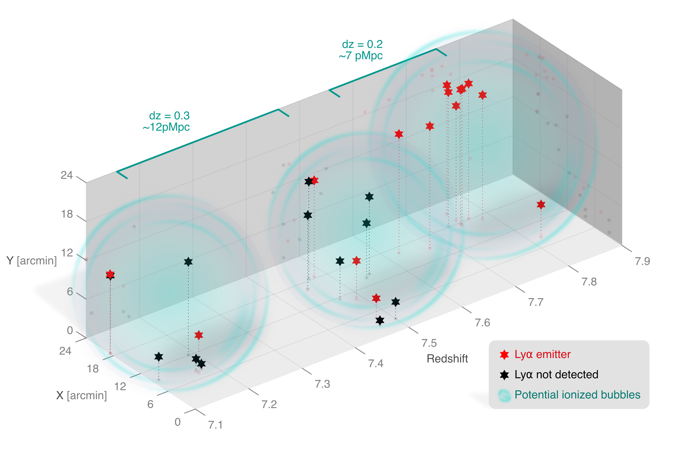

$\newcommand{\ensuremath}{}$
$\newcommand{\xspace}{}$
$\newcommand{\object}[1]{\texttt{#1}}$
$\newcommand{\farcs}{{.}''}$
$\newcommand{\farcm}{{.}'}$
$\newcommand{\arcsec}{''}$
$\newcommand{\arcmin}{'}$
$\newcommand{\ion}[2]{#1#2}$
$\newcommand{\textsc}[1]{\textrm{#1}}$
$\newcommand{\hl}[1]{\textrm{#1}}$
$\newcommand{\footnote}[1]{}$
$\newcommand{\grizli}{\textsc{grizli}}$
$\newcommand{\JWST}{\textit{JWST}}$
$\newcommand{\red}[1]{{\color{red} #1}}$
$\newcommand{\todo}[1]{\red{#1}}$
$\newcommand{\mh}[1]{\textcolor{teal}{[MH: #1]}}$
$\newcommand{\msun}{M_{\odot} }$
$\newcommand{\Zsun}{\ensuremath{Z_{\odot}}}$
$\newcommand{\zphot}{\ensuremath{z_{\rm phot}}}$
$\newcommand{\fesc}{\ensuremath{f_{esc}}}$
$\newcommand{\Ha}{H\alpha}$
$\newcommand{\Hb}{H\beta}$
$\newcommand{\Hd}{H\delta}$
$\newcommand{\Hg}{H\gamma}$
$\newcommand{\HI}{H {\sc i}}$
$\newcommand{\HeII}{He {\sc ii}}$
$\newcommand{\HeIIw}{\HeII \lambda1640}$
$\newcommand{\CIV}{C {\sc iv}}$
$\newcommand{\CIVw}{\CIV \lambda1548,1550}$
$\newcommand{\OIIIuv}{O {\sc iii}]}$
$\newcommand{\OIIIuvw}{\OIIIuv \lambda1661,1666}$
$\newcommand{\NIIuv}{N {\sc ii}]}$
$\newcommand{\NIIuvw}{\NIIuv \lambda1750}$
$\newcommand{\CIII}{C {\sc iii}]}$
$\newcommand{\CIIIw}{\CIII \lambda1908}$
$\newcommand{\OII}{[O {\sc ii}]}$
$\newcommand{\OIIw}{\OII \lambda\lambda3726,28}$
$\newcommand{\NeIII}{[Ne {\sc iii}]}$
$\newcommand{\NeIIIw}{\NeIII \lambda3869}$
$\newcommand{\logOH}{12+log[O/H]}$

# The First Billion Years, According to JWST

<mark>Appeared on: 2024-06-03</mark> -  _review article written by the attendees of the 2024 ISSI breakthrough workshop "The first billion year of the Universe", submitted. Comments welcome_

A. Adamo, et al. -- incl., <mark>E. Bañados</mark>, <mark>A. d. Graaff</mark>, <mark>M. Habouzit</mark>

**Abstract:** With stunning clarity, $\JWST$ has revealed theUniverse's first billion years. The scientific community is analyzing a wealth of $\JWST$ imaging and spectroscopic data from that era, and is in the process of rewriting the astronomy textbooks. Here, 1.5 years into the $\JWST$ science mission, we provide a snapshot of the great progress made towards understanding the initial chapters of our cosmic history.We highlight discoveries and breakthroughs, topics and issues that are not yet understood, and questions that will be addressed in the coming years, as $\JWST$ continues its revolutionary observations of the Early Universe. While this compendium is written by a small number of authors, invited to ISSI Bern in March 2024 as part of the 2024 ISSI Breakthrough Workshop, we acknowledge the work of a large community that is advancing our collective understanding of the evolution of the Early Universe.

**Figure 2. -** **a.** The distribution of absolute magnitudes and redshifts of spectroscopically-confirmed galaxies from pre-JWST candidates (blue dots) and from public JWST data sets (orange squares), showing the power of JWST to detect galaxies beyond redshift 6. The latter include compilations \citep{RobertsBorsani2024} and single targets \citep{castellano2024,carniani2024} observed with NIRSpec MSA observations, as well as NIRCam grism (FRESCO and EIGER; \citep{Oesch2023} and \citep{Daichi2023}, respectively).
    **b.** The cosmic SFR density over the first billion years (adapted from Figure 17 of \citep{Harikane2024}, as seen from HST/WFC3 samples (dark circles), compared to JWST/NIRCam estimates (light squares). A model of constant star formation efficiency is plotted in grey, for comparison. The model and all literature points are derived from \citep{Harikane2024}(and references therein), where the latter are integrated down to $M_{\rm UV}=-18$ mag. (*fig:MUV-z*)

**Figure 6. -** Spectroscopically-confirmed galaxies in the CEERS EGS field at $z = 7.1–7.8$, reproduced from \citep{Chen2024}. The presence of numerous Lyman-alpha emitting galaxies (red stars), including several with high equivalent widths ($>200$ Å) and Lyman-alpha escape fractions ($\gtrsim50\%$), in this field provides strong evidence for candidate ionized bubbles along the line of sight (shaded cyan regions -- for illustration purposes only). These early observations, primarily of $M_\mathrm{UV} < -19$ HST-selected sources, highlight the potential of JWST to create tomographic maps of ionized regions to learn about the reionization process on local scales. (*fig:bubble*)

**Figure 1. -** The cosmic timeline, from the origin of the Universe in the Big Bang, 13.8 billion years ago, till the present day. In the current standard picture,  the Universe underwent a period of accelerated expansion called "inflation" that expanded the Universe by about 60 orders of magnitude. The Universe then kept cooling and expanding until the next major epoch of "recombination" about $4\times 10^5$ yr later when the first hydrogen atoms formed. This was followed by the "Dark ages" of the Universe that lasted for a few hundred million years. The emergence of the earliest galaxies, a few hundred million years after the Big Bang, marked the start of the era of "cosmic dawn". The first galaxies also produced the first photons capable of ionizing the neutral hydrogen atoms permeating space, starting the Epoch of Reionization (EoR), the last major phase transition in the Universe. In the initial stages of reionization, isolated galaxies (light yellow dots) produced ionized regions (gray patches) that grew and merged  until the Universe was fully reionized. Image Credit: DELPHI project (ERC 717001). (*fig:universe_timeline*)

