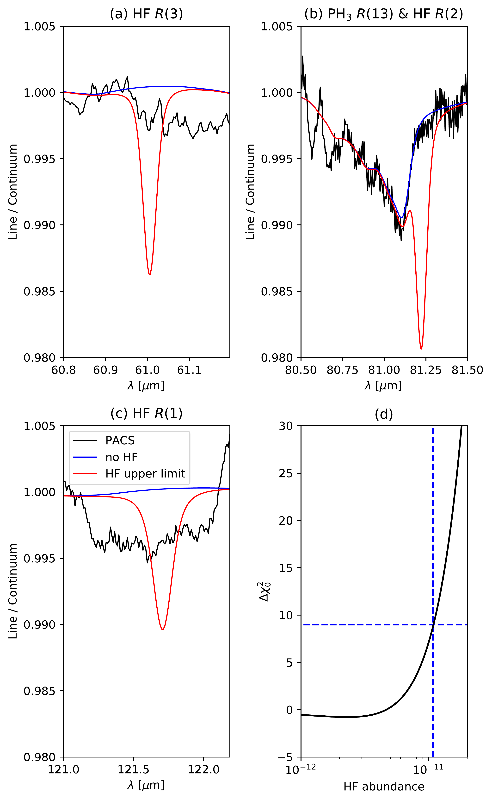
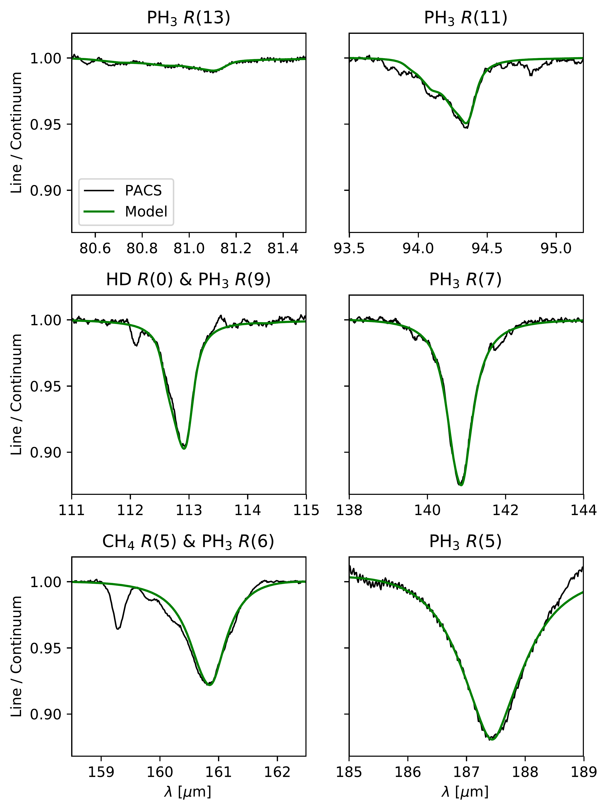
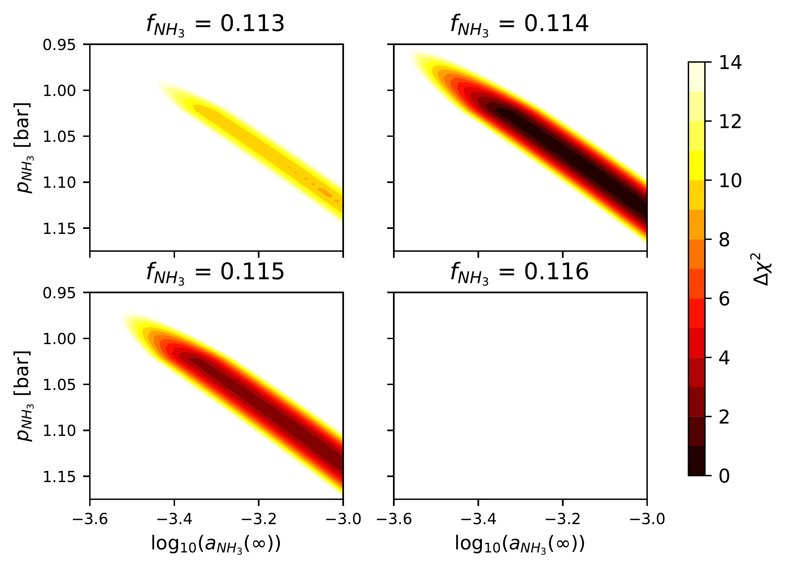

$\newcommand{\ensuremath}{}$
$\newcommand{\xspace}{}$
$\newcommand{\object}[1]{\texttt{#1}}$
$\newcommand{\farcs}{{.}''}$
$\newcommand{\farcm}{{.}'}$
$\newcommand{\arcsec}{''}$
$\newcommand{\arcmin}{'}$
$\newcommand{\ion}[2]{#1#2}$
$\newcommand{\textsc}[1]{\textrm{#1}}$
$\newcommand{\hl}[1]{\textrm{#1}}$
$\newcommand{\footnote}[1]{}$

# Abundances of trace constituents in Jupiter's atmosphere inferred from Herschel/PACS$\thanks{_ Herschel_ is an ESA space observatory with science instruments provided by European-led Principal Investigator consortia and with important participation from NASA.}$ observations

<mark>Appeared on: 2024-06-05</mark> -  _Accepted for publication in Astronomy and Astrophysics, 16 pages, 4 tables, 24 figures incl. Appendix_

<mark>C. Gapp</mark>, et al.

**Abstract:** On October 31, 2009, the Photodetector Array Camera and Spectrometer (PACS) on board the _Herschel_ Space Observatory observed far-infrared spectra of Jupiter in the wavelength range between 50 and 220 $ \mu$ m as part of the program "Water and Related Chemistry in the Solar System". The spectra have an effective spectral resolution between 900 and 3500, depending on the wavelength and grating order. We investigate the disk-averaged chemical composition of Jupiter's atmosphere as a function of height using these observations. We used the Planetary Spectrum Generator (PSG) and the least-squares fitting technique to infer the abundances of trace constituents. The PACS data include numerous spectral lines attributable to ammonia ($NH_3$ ), methane ($CH_4$ ), phosphine ($PH_3$ ), water ($H_2$ O), and deuterated hydrogen (HD) in the Jovian atmosphere and probe the chemical composition from $p\sim 275$ mbar to $p\sim 900$ mbar. From the observations, we infer an ammonia abundance profile that decreases from a mole fraction of $(1.7\pm 0.8)\times 10^{-4}$ at $p\sim 900$ mbar to $(1.7\pm 0.9)\times 10^{-8}$ at $p\sim 275$ mbar, following a fractional scale height of about $0.114$ . For phosphine, we find a mole fraction of $(7.2\pm 1.2)\times 10^{-7}$ at pressures higher than $(550\pm 100)$ mbar and a decrease of its abundance at lower pressures following a fractional scale height of $(0.09\pm 0.02)$ . Our analysis delivers a methane mole fraction of $(1.49\pm 0.09)\times 10^{-3}$ . Analyzing the HD $R(0)$ line at $112.1 \mu$ m yields a new measurement of Jupiter's D/H ratio, $\text{D/H}=(1.5\pm 0.6)\times 10^{-5}$ . Finally, the PACS data allow us to put the most stringent $3\sigma$ upper limits yet on the mole fractions of hydrogen halides in the Jovian troposphere. These new upper limits are $<1.1\times 10^{-11}$ for hydrogen fluoride (HF), $<6.0\times 10^{-11}$ for hydrogen chloride (HCl), $<2.3\times 10^{-10}$ for hydrogen bromide (HBr) and $<1.2\times 10^{-9}$ for hydrogen iodide (HI) and support the proposed condensation of hydrogen halides into ammonium halide salts in the Jovian troposphere.

**Figure 17. -** Results of the upper limit determination of Jupiter's atmospheric hydrogen fluoride (\ce{HF}) mole fraction using the PACS data and the a priori forward model (Sec. \ref{sec:model_setup}) including the derived ammonia and phosphine profiles (Subsec. \ref{subsec:nh3} and \ref{subsec:ph3}) and the inferred methane mole fraction (Subsec. \ref{subsec:ch4}). Panels (a) to (c) show the PACS data around the wavelengths of three \ce{HF} lines in the PACS spectral range. These plots also show forward model spectra including \ce{HF} with the inferred upper limit mole fraction and without \ce{HF} at all. Panel (d) shows the results of the least-squares comparison between model spectra assuming different \ce{HF} mole fractions and the PACS data using $\Delta\chi_0^2$(see Equation \ref{eq:delta_chi-squared0}). The criterion for the upper limit ($\Delta\chi_0^2=9$) is shown with a horizontal blue dashed line and the mole fraction at which it is met is shown using a vertical blue dashed line. In total, 1000 values for the \ce{HF} mole fraction between 0 and $1\times 10^{-9}$ were used in the forward model to compare the resulting model spectra with the PACS data. (*fig:hf*)

**Figure 9. -** PACS data and model spectra of the five phosphine bands used for the analysis of phosphine in Jupiter's atmosphere as well as the \ce{PH_3}$R(5)$ band. The forward model spectra were synthesized using $a_{\ce{PH_3}}(\infty)=7.2\times 10^{-7}$, $p_{\ce{PH_3}}=550 $mbar, and $f_{\ce{PH_3}}=0.09$. (*fig:ph3_lines*)

**Figure 5. -** Least-squares comparison between the PACS data of the \ce{NH_3}$R(2)$, $R(5)$, and $R(7)$ bands and the model spectra synthesized using grids of ammonia abundance profiles expressed in $\Delta\chi^2$(see Equation \ref{eq:delta_chi-squared}). (*fig:nh3_contours*)

