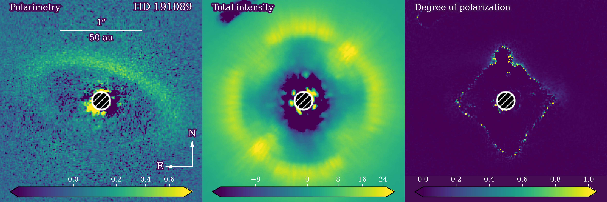
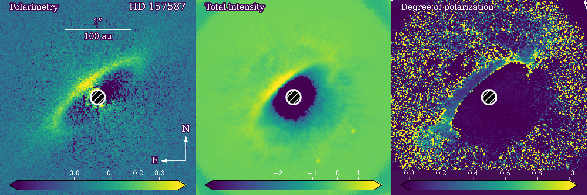
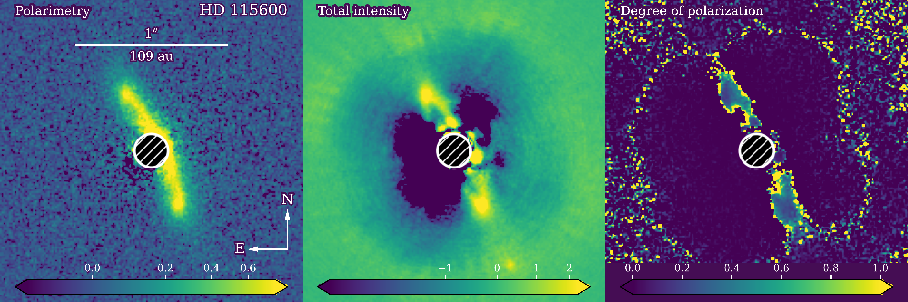
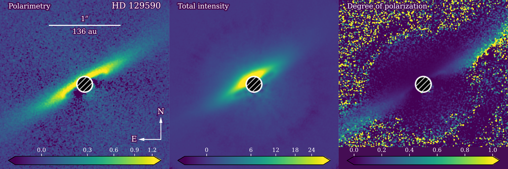
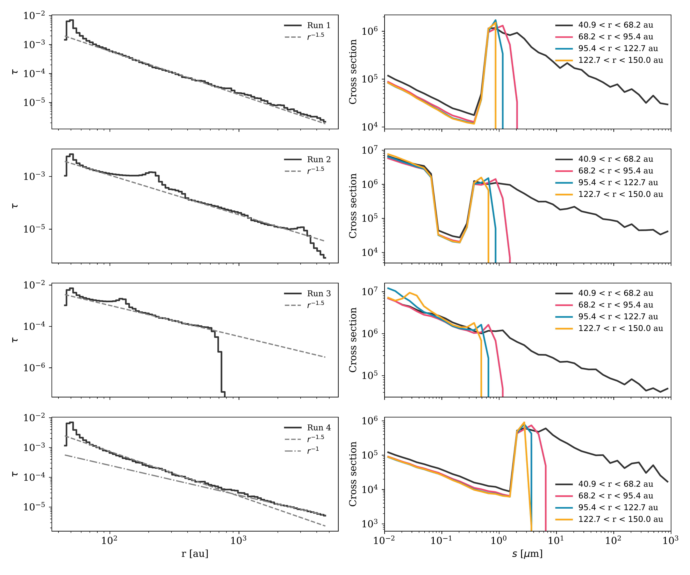
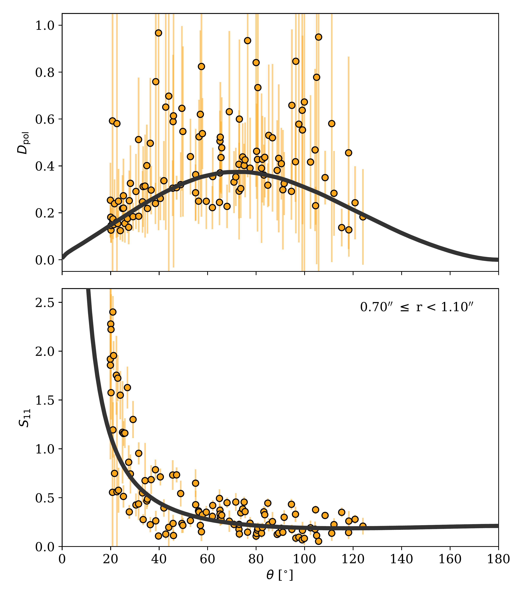

$\newcommand{\ensuremath}{}$
$\newcommand{\xspace}{}$
$\newcommand{\object}[1]{\texttt{#1}}$
$\newcommand{\farcs}{{.}''}$
$\newcommand{\farcm}{{.}'}$
$\newcommand{\arcsec}{''}$
$\newcommand{\arcmin}{'}$
$\newcommand{\ion}[2]{#1#2}$
$\newcommand{\textsc}[1]{\textrm{#1}}$
$\newcommand{\hl}[1]{\textrm{#1}}$
$\newcommand{\footnote}[1]{}$
$\newcommand{\cmark}{\ding{51}}$
$\newcommand{\xmark}{\ding{55}}$
$\newcommand\natexlab{#1}$

# The near-infrared degree of polarization in debris disks.$\thanks{Based on observations made with ESO Telescopes at the Paranal Observatory under programs ID 105.20GP.001 and 109.237K.001. The fits files of the observations are available in electronic form at the CDS via anonymous ftp to cdsarc.u-strasbg.fr (130.79.128.5) or via http://cdsweb.u-strasbg.fr/cgi-bin/qcat?J/A+A/}$

<mark>Appeared on: 2024-06-06</mark> -  _Accepted for publication in A&A, abstract shortened_

<mark>J. Olofsson</mark>, et al. -- incl., <mark>T. Henning</mark>

**Abstract:** Debris disks give us the unique opportunity to probe the properties of small $\mu$ m-sized particles, allowing us to peer into the constituents of their parent bodies, young analogs of comets and asteroids of our solar system. In the past, studies of the total intensity phase function, the brightness of the disk as a function of the scattering angle, have proven powerful to constrain the main characteristics of the dust particles in debris disks. Nonetheless, there can remain some degeneracies in the modeling that can be alleviated when considering polarized intensity observations. We obtained new near-infrared scattered light observations of four young debris disks, and used state-of-the-art algorithms to recover the total intensity and linear polarimetric images of the disks. These images allow us to constrain the degree of linear polarization as a function of the scattering angle. All four debris disks are detected in polarized intensity, and three are also recovered in total intensity. We measured peak degree of polarization of $\lesssim 40$ \% for all three disks. For the disk around HD 129590, we are furthermore able to determine the degree of polarization in the radiation pressure driven halo. To reproduce the observed polarization fractions, we find that the particles must consist of highly refractive and absorbing material. For HD 129590, by measuring the polarization fraction beyond the birth ring, we constrain the width of the size distribution to be smaller and smaller, compatible with the effect of radiation pressure. We put these findings to the test and present a self-consistent approach to produce synthetic images, assuming different profiles for the radiation pressure strength, and accounting for the presence of unbound grains. We find the contribution of these grains to be especially critical to reproduce the increasing degree of polarization with stellocentric distances. Some of our results (namely a very small blow-out size and very large $(n,k)$ values for the optical constants) required to reproduce the observed degree of polarization might seem difficult to reconcile with our understanding of cosmic dust. Similar results have been obtained for other disks and we discuss the current limitation of available light scattering models as well as possible avenues to alleviate these unfortunate limitations.

**Figure 4. -** _Top to bottom:_ observations of HD 191089, HD 157587, HD 115600, and HD 129590. _Left:_ polarimetry, _center:_ total intensity, _right:_ degree of polarization (polarimetry over total intensity). The scaling is linear for the right column and between $0$ and $1$, while in square root for the left and center columns. On the left panel, the horizontal bar represents $1$\arcsec$$ and the distance in au is reported below. North is up, East is right, as indicated by the compass on the leftmost panels. (*fig:full*)

**Figure 7. -** _Top to bottom:_ diagnostics for Runs 1 to 4, respectively. _Left:_ optical depth profile as a function of the stellocentric distance. The dashed line shows a profile in $r^{-1.5}$. For the bottom panel, the dashed-dotted line follows a profile in $r^{-1}$. _Right:_ cross-section as a function of the grain size $s$. The different colors show the cross-section measured in several concentric rings. (*fig:diag*)

**Figure 1. -** Observations and best fit model for HD 157587 (orange circles and solid black line, respectively). _Top:_ degree of polarization. _Bottom:_ total intensity phase function. The inner and outer radii for the stellocentric distances are indicated in the upper right of the bottom panel. (*fig:HD157*)

