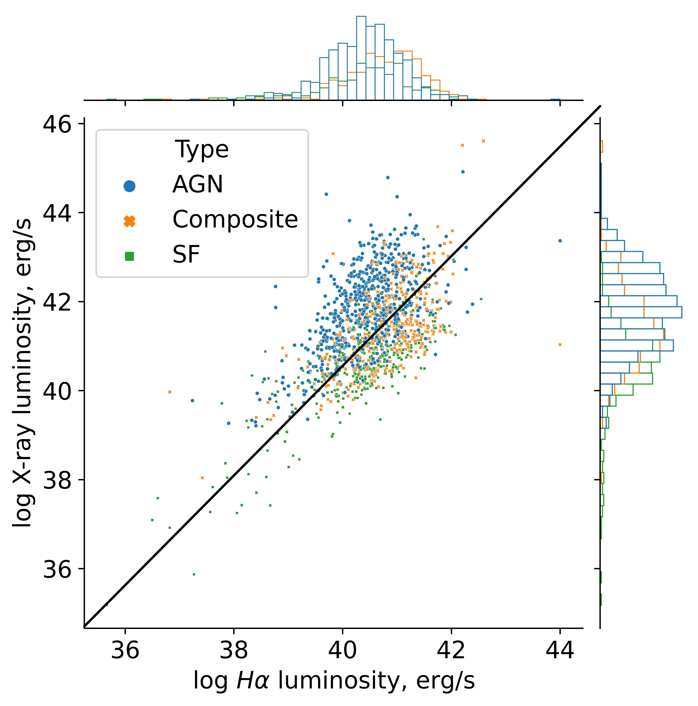
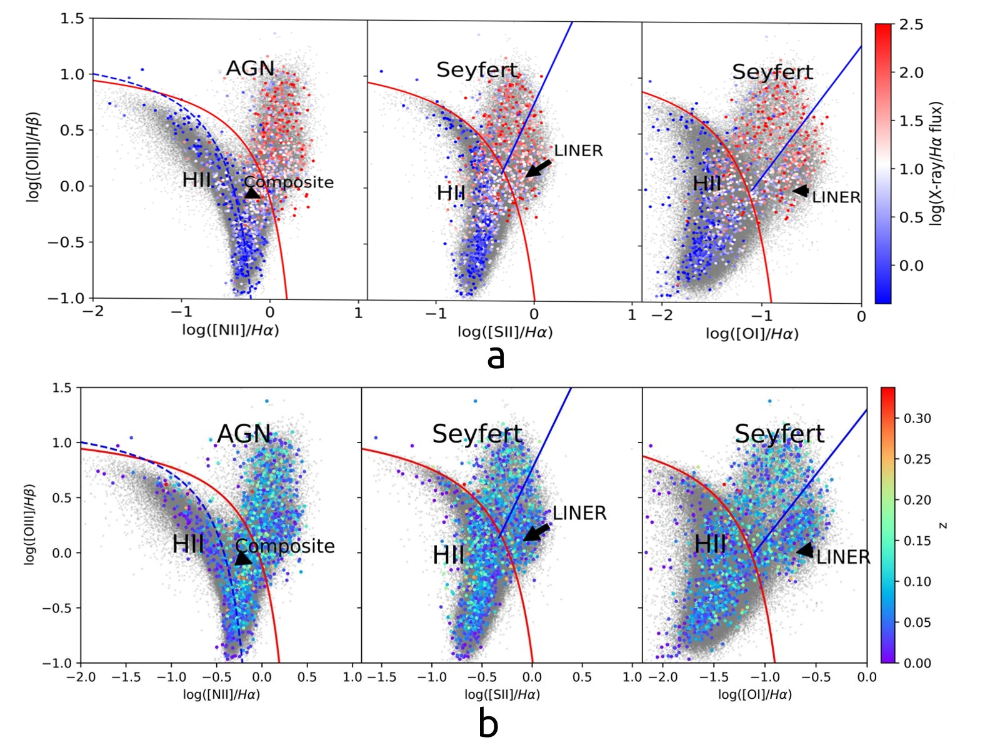
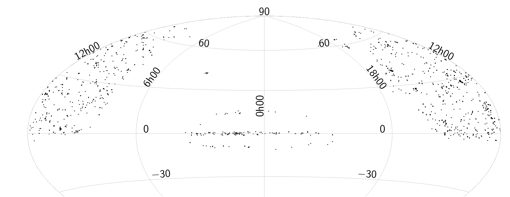

$\newcommand{\ensuremath}{}$
$\newcommand{\xspace}{}$
$\newcommand{\object}[1]{\texttt{#1}}$
$\newcommand{\farcs}{{.}''}$
$\newcommand{\farcm}{{.}'}$
$\newcommand{\arcsec}{''}$
$\newcommand{\arcmin}{'}$
$\newcommand{\ion}[2]{#1#2}$
$\newcommand{\textsc}[1]{\textrm{#1}}$
$\newcommand{\hl}[1]{\textrm{#1}}$
$\newcommand{\footnote}[1]{}$
$\newcommand{\thefigure}{A.\arabic{figure}}$
$\newcommand{\thetable}{A.\arabic{table}}$
$\newcommand\natexlab{#1}$

# What excites the optical emission in X-ray-selected galaxies? $\thanks{The catalogue of X-ray galaxies selected from SDSS is only available in electronic form at the CDS via anonymous ftp to cdsarc.u-strasbg.fr (130.79.128.5) or via \href{http://cdsweb.u-strasbg.fr/cgi-bin/qcat?J/A+A/}{http://cdsweb.u-strasbg.fr/cgi-bin/qcat?J/A+A/}}$

<mark>Appeared on: 2024-06-06</mark> -  _12 pages, 13 figures_

<mark>N. Pulatova</mark>, et al. -- incl., <mark>H.-W. Rix</mark>, <mark>R. Seeburger</mark>, <mark>M. Demianenko</mark>

**Abstract:** We present a study of $1347$ galaxies at $z<0.35$ with detected nuclear X-ray emission and optical emission line diagnostics in the Baldwin-Phillips-Terlevich (BPT) diagram. This sample was obtained by cross-matching the X-ray Multi-Mirror Mission Observatory - Newton (XMM-Newton) DR10 catalogue with Sloan Digital Sky Survey (SDSS) DR17 galaxies with well-measured line ratios.  The distribution of these sources in the BPT diagram covers all three excitation regimes: Ionized Hydrogen (HII) regions  (23 \% ), `composites' (30 \% ), and Seyfert galaxies with  the low ionization nuclear emission line regions (LINERs) (47 \% ). In contrast, the fraction of objects classified as active galacticnuclei (AGN) in the SDSS subsample selected for cross-match with XMM-Newton is only 13 \% . This fact illustrates that X-ray emission from galaxies commonly points towards the presence of AGN. Our data show, for the first time, a clear dependence of the BPT position on the ratio of the X-ray to $H\alpha$ fluxes. Sources dominated by X-ray emission lie in the Seyfert and LINER regimes of the BPT diagram. Most sources with a low X-ray-to- $H\alpha$ -luminosity ratio, $log_{10}(L_X/L_{H\alpha}) < 1.0$ , lie in the HII regime. In our sample, there are even 45 galaxies  that have $L^{Star}_{XR}/L^{Total}_{Xray}>0.5$ . In contrast, the positions of  the samplemembers in the BPT diagram exhibit ${no}$ dependence on the X-ray hardness ratio. Our finding suggests that the X-ray-to- $H\alpha$ ratio can help us to differentiate galaxies whose X-ray flux is dominated by an AGN ${from galaxies with}$ central X-ray binaries and other stellar X-ray sources.

**Figure 5. -** Positions of 1347 SDSS X-ray selected galaxies on X-ray versus $H\alpha$ luminosities plane. X-ray luminosity is in the range 0.2-12 keV and in $erg\cdot s^{-1}$, $H\alpha$ luminosity is in $erg\cdot s^{-1}\cdot$. Type of ionisation (AGNs, Composite, SF) corresponds to the position of X-ray galaxy on [OIII]/$H\beta$ versus [NII]/$H\alpha$ BPT diagram. AGNs are marked with blue circles, Composites - with orange crosses, and SF - with green squares. (*fig:X-ray-H-al*)

**Figure 9. -** Distribution on the BPT diagram  ([Baldwin, Phillips and Terlevich 1981]())  of $1347$ SDSS X-ray-selected galaxies. Empirical lines (dashed blue and solid red) that separate LINERs from Seyfert galaxies are from [Kewley, et. al (2006)](). The grey background circles show all the $204 895$ SDSS-DR17 galaxies that satisfy our basic optical quality cuts: all line fluxes have fractional uncertainties of $<0.13$ dex (33\%) and are `narrow' $\sigma_{line}<200 km/s$. The colour bar represents X-ray/H$\alpha$ flux ratio (6a) and redshift z (6b) and corresponds only to $1347$ SDSS X-ray-selected galaxies.  (*fig:BPT-DR17*)

**Figure 1. -** Distribution of the sample of 1347 X-ray-selected galaxies in equatorial coordinates. (*fig:RA-DE-disz*)

