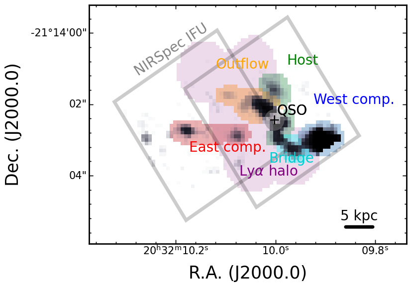
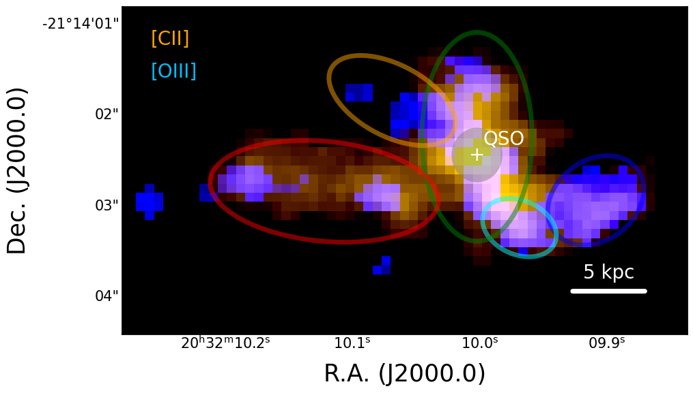
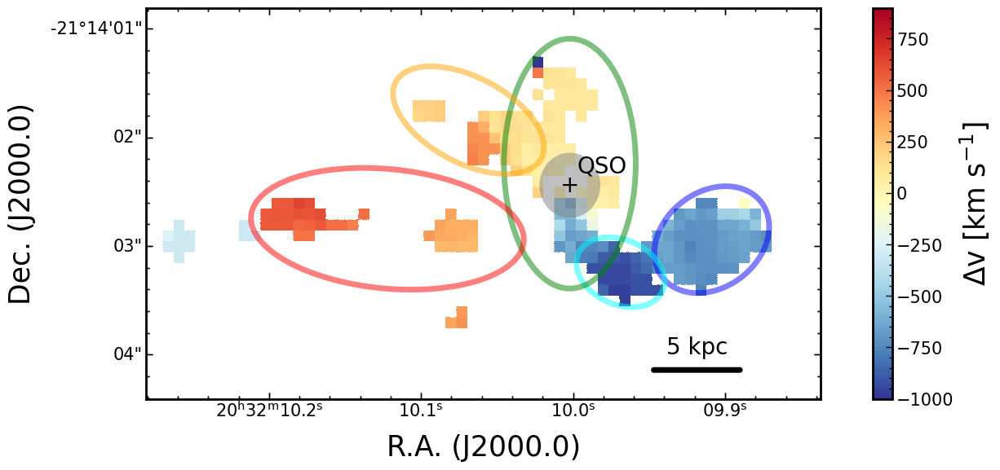
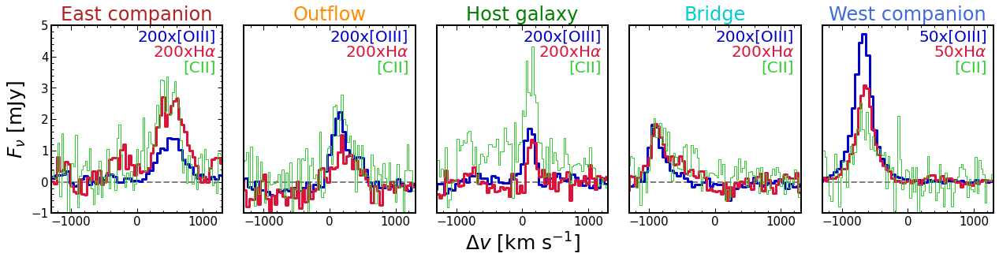
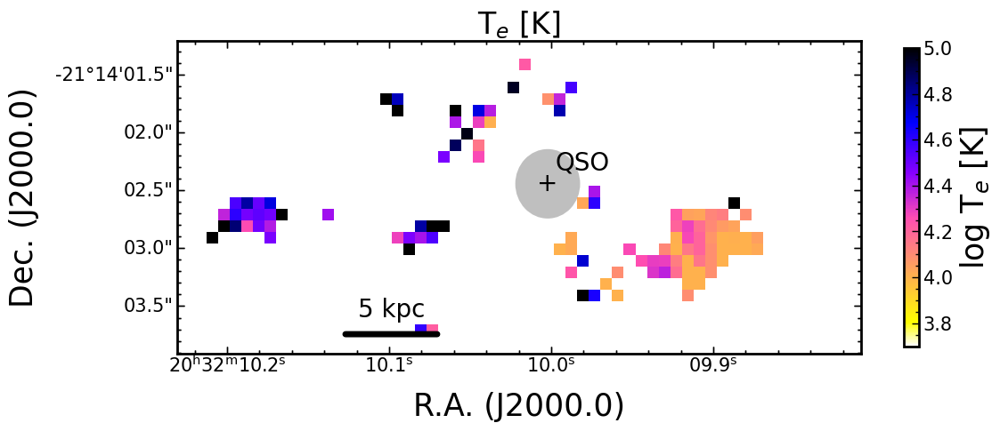
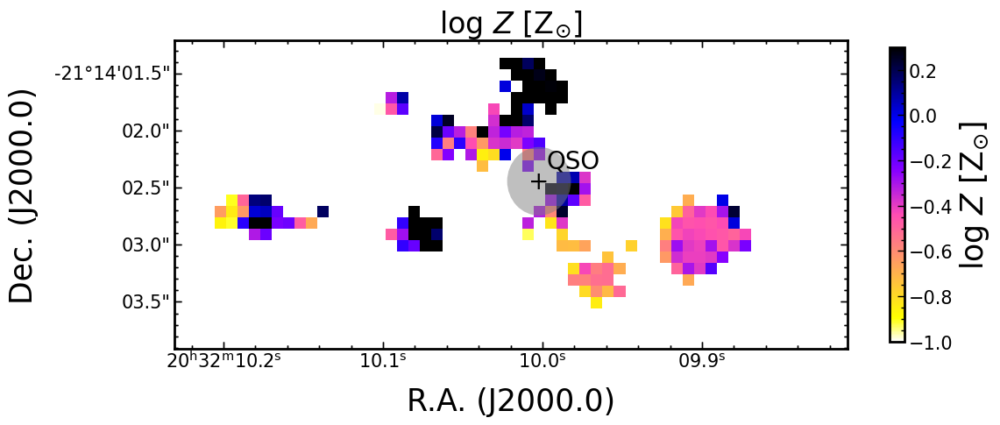

$\newcommand{\ensuremath}{}$
$\newcommand{\xspace}{}$
$\newcommand{\object}[1]{\texttt{#1}}$
$\newcommand{\farcs}{{.}''}$
$\newcommand{\farcm}{{.}'}$
$\newcommand{\arcsec}{''}$
$\newcommand{\arcmin}{'}$
$\newcommand{\ion}[2]{#1#2}$
$\newcommand{\textsc}[1]{\textrm{#1}}$
$\newcommand{\hl}[1]{\textrm{#1}}$
$\newcommand{\footnote}[1]{}$
$\newcommand{\Lsun}{L_\odot}$
$\newcommand{\Msun}{M_\odot}$
$\newcommand{\Zsun}{Z_\odot}$
$\newcommand{\Mbh}{M_{\rm BH}}$
$\newcommand{\Lhost}{L_{\rm host}}$
$\newcommand{\Mhost}{M_{\rm host}}$
$\newcommand{\Lya}{Ly\alpha}$
$\newcommand{\Ha}{H\alpha}$
$\newcommand{\Hb}{H\beta}$
$\newcommand{\Hg}{H\gamma}$
$\newcommand{\Hd}{H\delta}$
$\newcommand{\Hi}{H {\sc i}}$
$\newcommand{\Hii}{H {\sc ii}}$
$\newcommand{\Hei}{He {\sc i}}$
$\newcommand{\Heii}{He {\sc ii}}$
$\newcommand{\Ci}{[C {\sc i}]}$
$\newcommand{\Cii}{[C {\sc ii}]}$
$\newcommand{\Civ}{C {\sc iv}}$
$\newcommand{\Nii}{[N {\sc ii}]}$
$\newcommand{\Niv}{[N {\sc iv}]}$
$\newcommand{\Oi}{[O {\sc i}]}$
$\newcommand{\Oii}{[O {\sc ii}]}$
$\newcommand{\Oiii}{[O {\sc iii}]}$
$\newcommand{\Sii}{[S {\sc ii}]}$
$\newcommand{\kms}{km s^{-1}}$
$\newcommand{\um}{\mum}$
$\newcommand{\jykms}{Jy~km s^{-1}}$
$\newcommand{\Kkmspc}{K~km s^{-1} pc^2}$
$\newcommand{\lsim}{\mathrel{\rlap{\lower 3pt \hbox{\sim}} \raise 2.0pt \hbox{<}}}$
$\newcommand{\gsim}{\mathrel{\rlap{\lower 3pt \hbox{\sim}} \raise 2.0pt \hbox{>}}}$

# A quasar-galaxy merger at $z\sim 6.2$: rapid host growth via accretion of two massive satellite galaxies

<mark>Appeared on: 2024-06-12</mark> -  _15 pages, 16 figures. Accepted for publication in A&A_

R. Decarli, et al. -- incl., <mark>F. Walter</mark>, <mark>E. Bañados</mark>, <mark>S. Bosman</mark>, <mark>H.-W. Rix</mark>

**Abstract:** We present JWST/NIRSpec Integral Field Spectroscopy in the rest-frame optical bands of the system PJ308--21, a quasar at $z=6.2342$ caught as its host galaxy interacts with companion galaxies. We detect spatially extended emission of several emission lines ( $\Ha$ , $\Hb$ , $\Oiii$ , $\Nii$ , $\Sii$ , $\Heii$ ), which we use to study the properties of the ionized phase of the interstellar medium: the source and hardness of the photoionizing radiation field, metallicity, dust reddening, electron density and temperature, and star formation. We also marginally detect continuum starlight emission associated with the companion sources. We find that at least two independent satellite galaxies are part of the system. While the quasar host appears highly enriched and obscured, with AGN-like photoionization conditions, the western companion shows minimal dust extinction, low metallicity ( $Z\sim0.4$ $\Zsun$ ), and star-formation driven photoionization. The eastern companion shows higher extinction and metallicity ( $Z\sim0.8$ $\Zsun$ ) compared to the western companion, and it is at least partially photoionized by the nearby quasar. We do not find any indication of AGN in the companion sources. Our study shows that while the quasar host galaxy is already very massive ( $M_{\rm dyn}>10^{11}$ $\Msun$ ), it is still rapidly building up by accreting two relatively massive ( $M_{\rm star}\sim 10^{10}$ $\Msun$ ) companion sources. This dataset showcases the power of JWST in exposing the build-up of massive galaxies in the first Gyr of the Universe.

**Figure 15. -** * Left:* The $\Oi$ii$_{\rm 5007 Å}$ line emission map in the quasar+companion galaxies system PJ308--21 at $z$=6.2342, shown in gray scale (after PSF subtraction). The footprints of the NIRSpec IFU pointings are displayed in grey. We also mark the regions of the main components of the system with colored shading. * Right:* The same $\Oi$ii$_{\rm 5007 Å }$ map (in blue), now with the $\Ci$i$_{\rm 158 \mu m}$ map from \citet{decarli19} superimposed. The main regions are identified with ellipses: From left to right, the eastern companion (red), the outflow (orange), the quasar host galaxy (green), the bridge (cyan), and the western companion (blue). The $\Oi$ii  emission arises from the regions where $\Ci$i  is brightest, except for the "outflow" component where the $\Oi$ii  emission stretches beyond the $\Ci$i  emission. (*fig_system_map*)

**Figure 2. -** Velocity maps of $\Oi$ii$_{5007 Å}$ in the PJ308--21 system (* top panel*). The system shows a prominent velocity gradient: The western companion and the bridge connecting it to the quasar host galaxies show a blue shift of $\Delta v\approx-650$  and $-880$\kms  respectively compared to the system rest frame ($z=6.2342$, based on the $\Ci$i  emission). The host galaxy shows a prominent velocity gradient from South ($\Delta v\approx -700$\kms) to North ($\Delta v = +140$\kms). The eastern companion is redshifted with respect to the system's rest frame, with $\Delta v$ increasing at increasing distance from the quasar (up to $\Delta v \approx 650$\kms). The eastern companion shows a modest velocity dispersion ($\sigma_{\rm line}<140$\kms).  (*fig_gas_kin*)

**Figure 9. -** Maps of the electron density, $n_e$({\rm top}), based on the $\Sii$$_{6717 Å }$/$\Sii$$_{6731 Å }$ ratio; of the electron temperature, $T_e$, based on the $\Oi$ii$_{5007 Å }$/$\Oi$ii$_{4363 Å }$ line ratio; and of the gas--phase metallicity $Z$, based on the Scal-PG16 method (see text for details). (*fig_map_electron_nT*)

