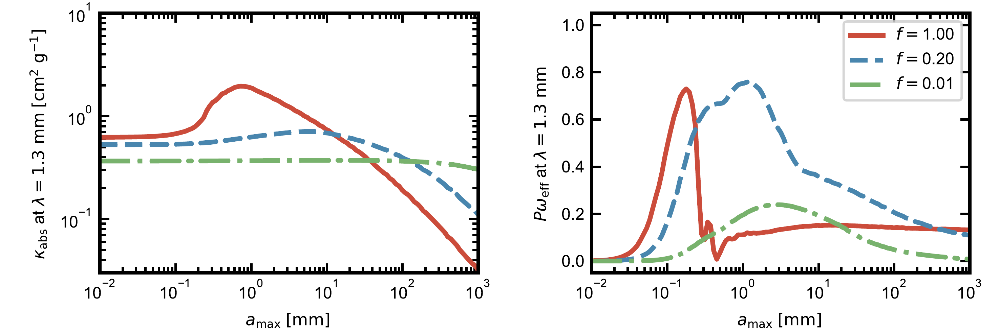
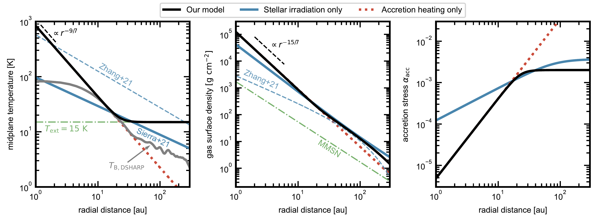
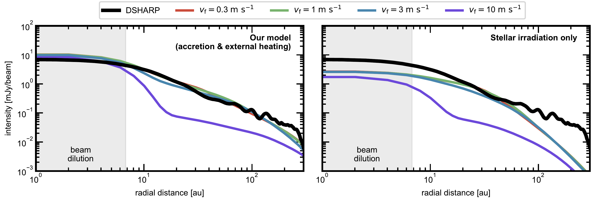

$\newcommand{\ensuremath}{}$
$\newcommand{\xspace}{}$
$\newcommand{\object}[1]{\texttt{#1}}$
$\newcommand{\farcs}{{.}''}$
$\newcommand{\farcm}{{.}'}$
$\newcommand{\arcsec}{''}$
$\newcommand{\arcmin}{'}$
$\newcommand{\ion}[2]{#1#2}$
$\newcommand{\textsc}[1]{\textrm{#1}}$
$\newcommand{\hl}[1]{\textrm{#1}}$
$\newcommand{\footnote}[1]{}$
$\newcommand$
$\newcommand{\baselinestretch}{1.0}$
$\newcommand{\refname}{References in the main text}$
$\newcommand{\refname}{References in Methods}$
$\newcommand{\figurename}{Supplementary Figure}$
$\newcommand{\refname}{References in Supplementary information}$

# $\bf$ Support for fragile porous dust in a gravitationally self-regulated disk around IM Lup

<mark>Appeared on: 2024-06-12</mark> -  _Accepted for publication. Author version_

<mark>T. Ueda</mark>, et al. -- incl., <mark>M. Flock</mark>, <mark>P. Sudarshan</mark>

**Abstract:** Protoplanetary disks, the birthplace of planets, are expected to be gravitationally unstable in their early phase of evolution.IM Lup, a well-known T-Tauri star, is surrounded by a protoplanetary disk with spiral arms likely caused by gravitational instability.The IM Lup disk has been observed using various methods, but developing a unified explanatory model is challenging.Here we present a physical model of the IM Lup disk that offers a comprehensive explanation for diverse observations spanning from near-infrared to millimeter wavelengths.Our findings underscore the importance of dust fragility in retaining the observed millimeter emission and reveal the preference for moderately porous dust to explain observed millimeter polarization.We also find that the inner disk region is likely heated by gas accretion, providing a natural explanation for bright millimeter emission within 20 au.The actively heated inner region in the model casts a 100-au-scale shadow, aligning seamlessly with the near-infrared scattered light observation.The presence of accretion heating also supports the fragile dust scenario in which accretion efficiently heat the disk midplane.Due to the fragility of dust, it is unlikely that a potential embedded planet at 100 au formed via pebble accretion in a smooth disk, pointing to local dust enhancement boosting pebble accretion or alternative pathways such as outward migration or gravitational fragmentation.

**Figure 8. -** 
Opacities at $\lambda=1.3$ mm obtained from our dust model.
Left: absorption opacity.
Right: polarization efficiency which is described by the product of the degree of linear polarization at scattering angle of $90^{\circ}$ and effective albedo.
The red solid line and blue dashed line denote compact ($f=0$) and porous ($f=0.2$) dust model, respectively.
The green dash-dotted line denotes the dust opacity with $f=0.01$ for reference.
The dust size distribution is assumed to have a power-law index of $-3$.
 (*fig:opac*)

**Figure 11. -** 
Summary of our model of the gas disk around IM Lup.
The black solid line denotes our model.
The blue solid line and red dotted line denotes the model with temperature solely determined by stellar irradiation ($T_{\rm MAPS}$; Eq. \ref{eq:Sierra}) and by accretion heating ($T_{\rm GSR,acc}$; Eq. \ref{eq:T_acc}), respectively.
The blue dashed lines show the conventional model \cite{Zhang+21} for which we assume $h_{\rm g}=c_{\rm s}/\Omega_{\rm K}$.
Left: midplane temperature profile. The gray solid line in the left panel denotes the observed brightness temperature at $\lambda=1.25 {\rm mm}$ taken by the ALMA DSHARP program \cite{Andrews+18}.
The green dash-dotted line denotes the temperature determined by external radiation (15 K).
Middle: gas surface density. The green dash-dotted line denotes the Minimum-Mass Solar Nebula model \cite{Hayashi81}.
Left: accretion parameter $\alpha_{\rm acc}$.
 (*fig:disk*)

**Figure 1. -** 
Comparison of the 1.25 mm intensity profile obtained from our models and the DSHARP observation.
The red, green, blue and purple solid lines denote the model with $v_{\rm f}=0.3$, 1, 3 and 10 ${\rm m s^{-1}}$, respectively, while the black solid line denotes the observed value obtained from DSHARP observation \cite{Andrews+18}.
The left panel shows our standard model in which the disk temperature is determined by accretion heating and external irradiation, while the right panel shows the model based on the temperature model in which the heating is solely by stellar irradiation (Eq. \ref{eq:Sierra}).
 (*fig:dsharp*)

