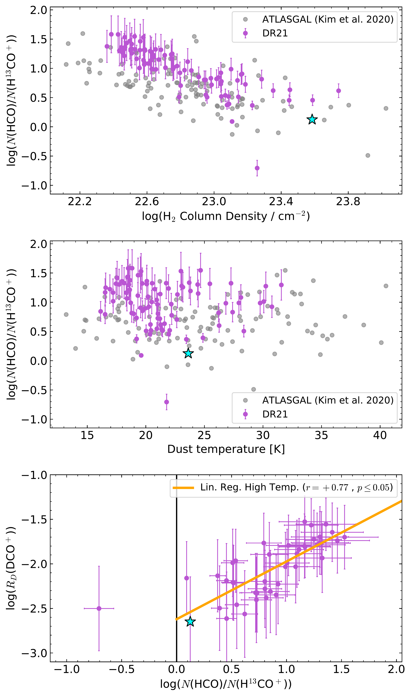
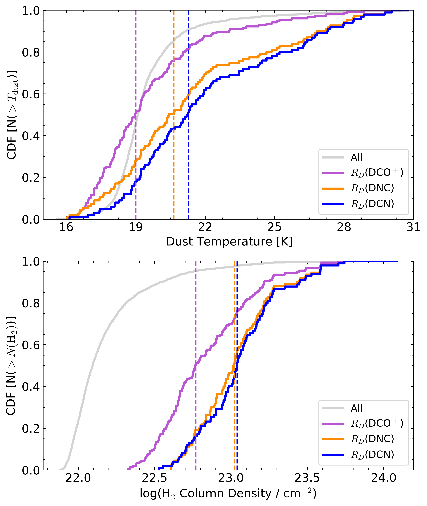

$\newcommand{\ensuremath}{}$
$\newcommand{\xspace}{}$
$\newcommand{\object}[1]{\texttt{#1}}$
$\newcommand{\farcs}{{.}''}$
$\newcommand{\farcm}{{.}'}$
$\newcommand{\arcsec}{''}$
$\newcommand{\arcmin}{'}$
$\newcommand{\ion}[2]{#1#2}$
$\newcommand{\textsc}[1]{\textrm{#1}}$
$\newcommand{\hl}[1]{\textrm{#1}}$
$\newcommand{\footnote}[1]{}$
$\newcommand{\hii}{H{\sc ii}}$
$\newcommand{\hi}{H{\sc i}}$
$\newcommand{\kms}{km s^{-1}}$

# The Cygnus Allscale Survey of Chemistry and Dynamical Environments: CASCADE

<mark>Appeared on: 2024-06-14</mark> -  _24 pages, 21 figures, accepted to A&A_

I. B. Christensen, et al. -- incl., <mark>H. Beuther</mark>, <mark>D. Semenov</mark>, <mark>S. Li</mark>

**Abstract:** Deuterated molecules and their molecular D/H-ratios ( $R_D$ (D)) are important diagnostic tools to study the physical conditions of star-forming regions. The degree of deuteration, $R_D$ (D), can be significantly enhanced over the elemental D/H-ratio depending on physical parameters such as temperature, density, and ionization fraction. Within the **C** ygnus **A** llscale **S** urvey of **C** hemistry **a** nd **D** ynamical **E** nvironments (CASCADE), we aim to explore the large-scale distribution of deuterated molecules in the nearby ( $d \sim 1.5$ kpc) Cygnus-X region, a giant molecular cloud complex that hosts multiple sites of high mass star formation. We focus on the analysis of large-scale structures of deuterated molecules in the filamentary region hosting the prominent $\hii$ region DR21 and DR21(OH), a molecular hot core that is at an earlier evolutionary state. The DR21 filament has been imaged using the IRAM 30-m telescope in a variety of deuterated molecules and transitions.    Here we discuss the $\ce{HCO+}$ , HNC and HCN molecules and their deuterated isotopologues $\ce{DCO+}$ , DNC and DCN, and their observed line emissions at 3.6, 2, and 1.3-mm. The spatial distributions of integrated line emissions from $\ce{DCO+}$ , DNC, and DCN reveal morphological differences. Notably, $\ce{DCO+}$ displays the most extended emission, characterized by several prominent peaks. Likewise, DNC exhibits multiple peaks, although its emission appears less extended compared to $\ce{DCO+}$ . In contrast to the extended emission of $\ce{DCO+}$ and DNC, DCN appears the least extended, with distinct peaks.    Focusing only on the regions where all three molecules are observed, the mean deuteration ratios for each species, $R_D$ , are 0.01 for both DNC and DCN, and $=0.005$ for $\ce{DCO+}$ , respectively.    Anti-correlations are found with deuterated molecules and dust temperature or $N$ ( $\ce{H2}$ ). The strongest anti-correlation is found with $R_D$ ( $\ce{DCO+}$ ) and $N$ ( $\ce{H2}$ ), with a Pearson correlation coefficient of $\rho = -0.74$ .    We analyze the SiO emission as a tracer for shocks and the $N$ (HCO)/ $N$ ( $\ce{H^13CO+}$ ) as a tracer for increased photodissociation by UV.    The anti-correlation of $R_D$ ( $\ce{DCO+}$ ) and $N$ ( $\ce{H2}$ ) is suggested to be a result of a combination of an increased photodissociation degree and shocks.    A strong positive correlation between the ratio of integrated intensities of DCN and DNC with their $^{13}$ C-isotopologues, are found in high column density regions.    The positive relationship between the ratios implies that the D-isotopologue of the isomers could potentially serve as a tracer for the kinetic gas temperature.

**Figure 11. -** Top and middle rows: The ground-state emission of \ce{DCO+}, DNC and DCN observed with the CASCADE-program and follow-up mapping with the IRAM-30m telescope. Bottom row: Maps for \ce{^13C} isotopologs. The intensities in  the maps are integrated over the velocity range $-7$ $\kms$ to $+0.5$\kms. HPBWs are displayed by the filled white circles in the lower left corner of each panel.
  For example,  the HPBW beam-size  is $34$\arcsec$$ for the map showing DNC (2--1),  16$\arcsec$ for DCO$^+$(3--2) and $11$\arcsec for  DCN (3--2).
  The white contours are showing levels of $4\sigma$,  $8\sigma$ and $12\sigma$. The stars mark DR21 Main (red) and DR21(OH) (blue). The locations of the F1 and F3 sub-filament  ([Schneider, Csengeri and Bontemps 2010]())  are indicated by red and magenta dashed curves, respectively.  (*fig:deutmaps*)

**Figure 5. -** $N$(HCO)/$N$(\ce{H^13CO+}) vs. $N$($H_2$) (top panel) and dust temperature (middle panel). The bottom panel shows the correlation of $N$(HCO)/$N$(\ce{H^13CO+}) with $R_D$(\ce{DCO+}). The purple points represent pixels in the DR21 filament above $4\sigma$ and the grey point shows the ATLASGAL sources from [Kim, Wyrowski and Urquhart (2020)](). The black vertical line represents the indicator of ongoing FUV chemistry $\geq 1$ ([Gerin, et. al 2009](), [Kim, Wyrowski and Urquhart 2020]()) .
  The blue star mark the surroundings of DR21(OH), where \ce{HCO}, \ce{H^13CO+} and \ce{DCO+} are detected. (*fig:ionizationHCO*)

**Figure 2. -** Cumulative distribution function (CDF) of dust temperature and \ce{H2} column density where \ce{DCO+}(purple), DNC (orange) or DCN (blue) is detected in the DR21 filament.
  The dust temperatures and \ce{H2} column density maps are taken from [Bonne, Bontemps and Schneider (2023)]().
  The horizontal dashed lines marks the mean dust temperature or column density of the sampled distributions, colorized with the respective detected molecular ratio. (*fig:phys_distribution*)

