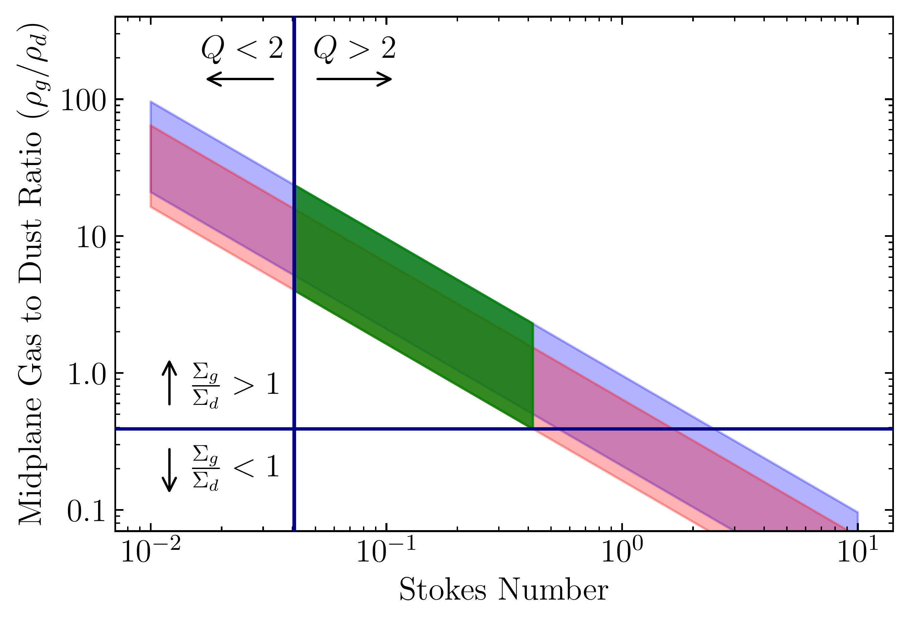
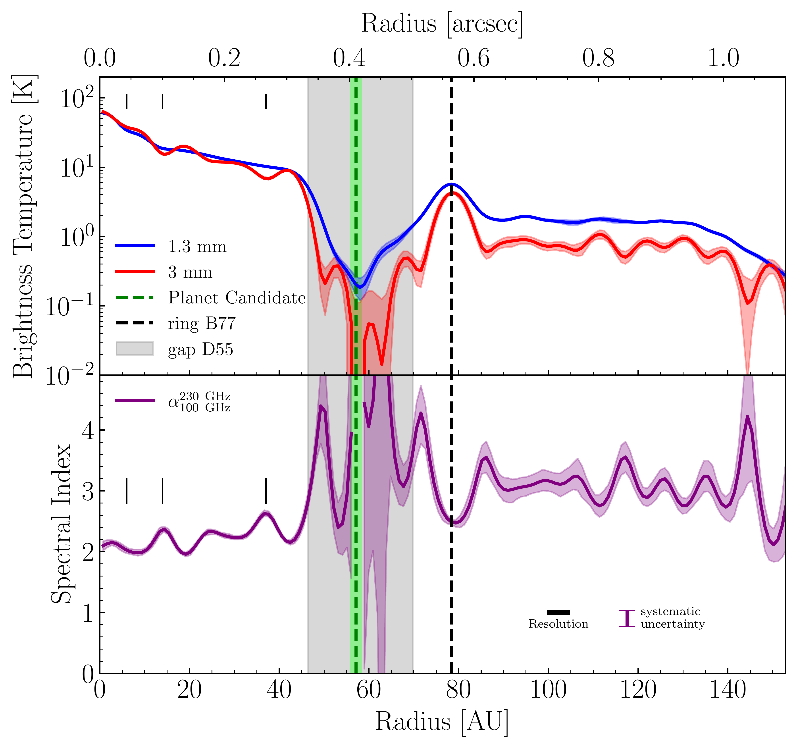
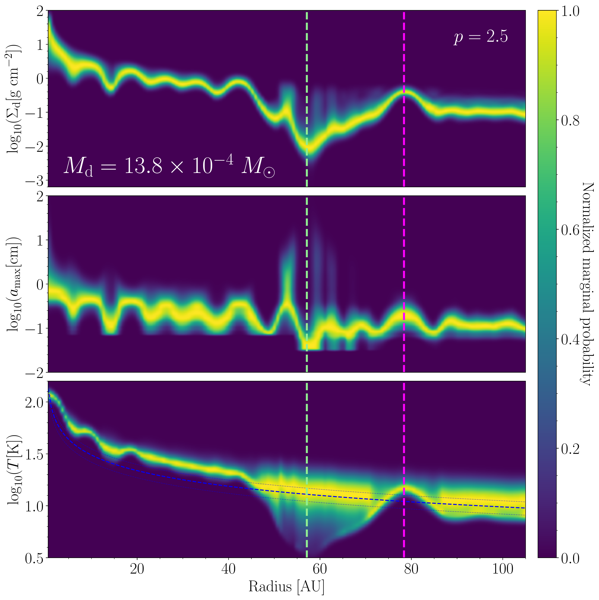
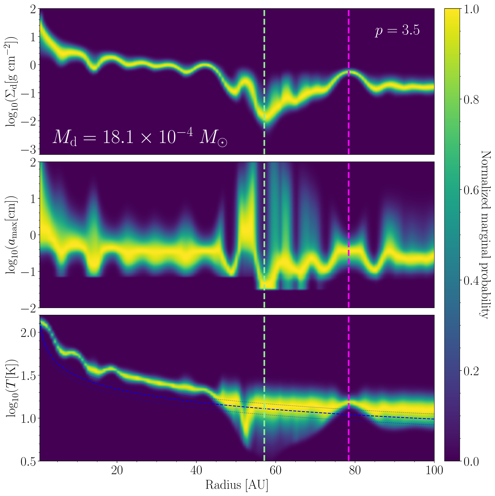

$\newcommand{\ensuremath}{}$
$\newcommand{\xspace}{}$
$\newcommand{\object}[1]{\texttt{#1}}$
$\newcommand{\farcs}{{.}''}$
$\newcommand{\farcm}{{.}'}$
$\newcommand{\arcsec}{''}$
$\newcommand{\arcmin}{'}$
$\newcommand{\ion}[2]{#1#2}$
$\newcommand{\textsc}[1]{\textrm{#1}}$
$\newcommand{\hl}[1]{\textrm{#1}}$
$\newcommand{\footnote}[1]{}$

# A Dust-Trapping Ring in the Planet-Hosting Disk of Elias 2-24

<mark>Appeared on: 2024-06-20</mark> -  _18 pages, 12 figures, accepted to ApJ_

A. S. Carvalho, et al. -- incl., <mark>M. Benisty</mark>

**Abstract:** Rings and gaps are among the most widely observed forms of substructure in protoplanetary disks. A gap-ring pair may be formed when a planet carves a gap in the disk, which produces a local pressure maximum following the gap that traps inwardly drifting dust grains and appears as a bright ring due to the enhanced dust density. A dust-trapping ring would provide a promising environment for solid growth and possibly planetesimal production via the streaming instability. We present evidence of dust trapping in the bright ring of the planet-hosting disk Elias 2-24, from the analysis of 1.3 mm and 3 mm ALMA observations at high spatial resolution (0.029 arcsec, 4.0 au). We leverage the high spatial resolution to demonstrate that larger grains are more efficiently trapped and place constraints on the local turbulence ( $8 \times 10^{-4} < \alpha_\mathrm{turb} < 0.03$ ) and the gas-to-dust ratio ( $\Sigma_g / \Sigma_d < 30$ ) in the ring. Using a scattering-included marginal probability analysis we measure a total dust disk mass of $M_\mathrm{dust} = 13.8^{+0.7}_{-0.5} \times 10^{-4}  M_\odot$ . We also show that at the orbital radius of the proposed perturber, the gap is cleared of material down to a flux contrast of 10 $^{-3}$ of the peak flux in the disk.

**Figure 15. -** **Left:** The marginal probability distributions of the Toomre $Q$ profile (upper panel) and the Stokes number profile (lower panel) sampled from the distributions shown in Figure \ref{fig:DustProfiles}. The candidate companion orbit radius is shown with the green dashed line and the ring center is shown with the magenta dashed line. The solid blue line marks the values preferred by the overall best-fit model. The white dashed lines in the upper panel show the $Q = 1$ and $Q = 1.7$ lines. Assuming a gas-to-dust ratio of 100, there are many locations in the disk where $Q < 1.7$, implying the disk would be gravitationally unstable. **Right:** The range of midplane gas to dust ratios in B77 estimated in Section \ref{sec:GasToDust}. The blue and red shaded regions indicate the upper and lower limits from the maximum and minimum $\sqrt{\alpha_\mathrm{turb}/\mathrm{St}}$ values in Table \ref{tab:gaussFits} for the 1.3 mm (blue) and 3 mm (red) data. The lower limit on allowed Stokes number (vertical dark blue line) is obtained by requiring gravitational stability, since we do not see spirals in the disk. The lower limit on $\rho_g/\rho_d$(horizontal dark blue line) is obtained by requiring the $\Sigma_g > \Sigma_d$. The "allowed" values between these limits are marked by the green shaded region.      (*fig:Toomre*)

**Figure 1. -** **Top:** Deconvolved radial intensity profiles computed from the 1.3 mm and 3 mm visibilities, with 1-$\sigma$ uncertainties shown as the blue and red shaded regions respectively. The green dashed line shows the semi-major axis of the protoplanet candidate reported in [Jorquera, Pérez and Chauvin (2021)](), with the green shading showing the astrometric uncertainty in its position. The grey shading marks the gap location and the black dashed line marks the center of the ring, both as defined in [Huang, Andrews and Dullemond (2018)](). **Bottom:** The radial profile of the spectral index $\alpha$ computed from the profiles in the top panel. The black scalebar shows the resolution element of the spectral index profile, while the purple bar indicates the systematic uncertainty in the spectral index $\alpha$ due to ALMA's 10\% absolute flux-scale uncertainty. The vertical hashes mark the locations of the smaller gaps discussed in Section \ref{sec:substructure}. (*fig:frankProfiles*)

**Figure 14. -** Radial profiles of the dust properties in the disk around Elias 24. The left column shows our results for $p = 2.5$, while the right column shows $p = 3.5$. The orbital radius of the candidate companion from [Jorquera, Pérez and Chauvin (2021)]() is shown with a green dashed line and the ring location is shown with a magenta dashed line. **Top:** The dust surface density profile. Notice the increase in surface density at the ring location and the significant decrease in the gap. **Center:** The maximum grain size profile, which also increases at the ring location, indicating potential grain growth in the ring. **Bottom:** The temperature profile distributions. The blue dotted line shows the prior temperature profile given by Equation \ref{eq:tempProf}, with $1 \sigma$ Gaussian standard deviations shown as blue dashed lines. (*fig:DustProfiles*)

