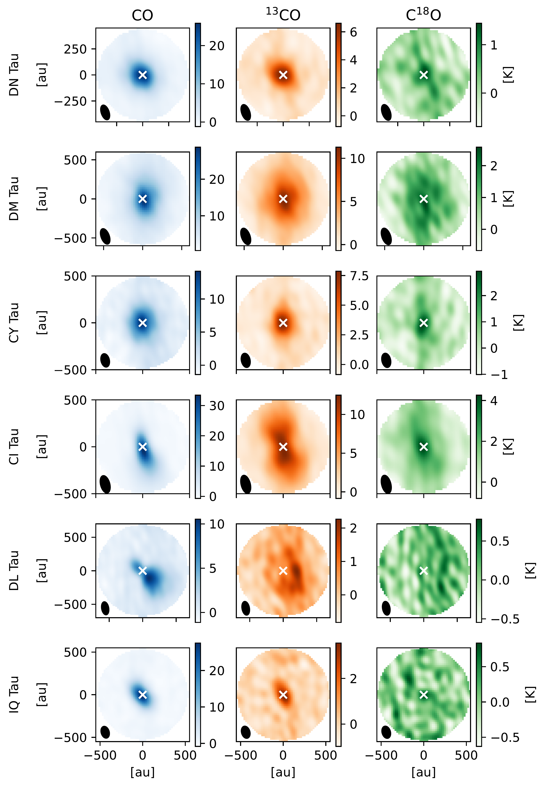

$\newcommand{\ensuremath}{}$
$\newcommand{\xspace}{}$
$\newcommand{\object}[1]{\texttt{#1}}$
$\newcommand{\farcs}{{.}''}$
$\newcommand{\farcm}{{.}'}$
$\newcommand{\arcsec}{''}$
$\newcommand{\arcmin}{'}$
$\newcommand{\ion}[2]{#1#2}$
$\newcommand{\textsc}[1]{\textrm{#1}}$
$\newcommand{\hl}[1]{\textrm{#1}}$
$\newcommand{\footnote}[1]{}$
$\newcommand{\molhyd}{\mathrm{H_2}  }$
$\newcommand{\CO}[2]{\mathrm{^{#1}C^{#2}O}}$

# PRODIGE - Planet-forming disks in Taurus with NOEMA

<mark>Appeared on: 2024-06-25</mark> -  _25 pages, 19 figures_

R. Franceschi, et al. -- incl., <mark>T. Henning</mark>, <mark>K. Schwarz</mark>, <mark>S. v. Terwisga</mark>

**Abstract:** To understand how planets form in protoplanetary disks, it is necessary to characterize their gas and dust distribution and masses. This requires a combination of high-resolution dust continuum and molecular line interferometric observations, coupled with advanced theoretical models of protoplanetary disk physics, chemical composition, and radiative transfer. We aim to constrain the gas density and temperature distributions as well as gas masses in several T Tauri protoplanetary disks located in Taurus. We use the $^{12}$ CO, $^{13}$ CO, and C $^{18}$ O (2-1) isotopologue emission observed at $0.9\arcsec$ with the IRAM NOrthern Extended Millimeter Array (NOEMA) as part of the MPG-IRAM Observatory Program PRODIGE (PROtostars and DIsks: Global Evolution   PIs: P. Caselli \& Th. Henning). Our sample consists of Class II disks with no evidence of strong radial substructures. We use these data to constrain the thermal and chemical structure of these disks through theoretical models for gas emission. To fit the combined optically thick and thin CO line data in Fourier space, we developed the DiskCheF code, which includes the parameterized disk physical structure, machine-learning (ML) accelerated chemistry, and the RADMC-3D line radiative transfer module. A key novelty of DiskCheF is the fast and feasible ML-based chemistry trained on the extended grid of the disk physical-chemical models precomputed with the ANDES2 code. This ML approach allows complex chemical kinetics models to be included in a time-consuming disk fitting without the need to run a chemical code. We present a novel approach to incorporate chemistry into disk modeling without the need to explicitly calculate a chemical network every time. Using this new disk modeling tool, we successfully fit the $^{12}$ CO, $^{13}$ CO, and C ${18}$ O (2-1) data from the CI, CY, DL, DM, DN, and IQ Tau disks. The combination of optically thin and optically thick CO lines allows us to simultaneously constrain the disk temperature and mass distribution, and derive the CO-based gas masses. The best-fit disk gas masses range between 0.005 and $0.04 M_{\sun}$ . These values are in reasonable agreement with the disk dust masses rescaled by a factor of 100 as well as with other indirect gas measurements via, for example, modeling of the wavelength dependence of the dust continuum emission radii, and HD and CO isotopologue emission.

**Figure 5. -** Vibrational stability equation of state
               $S_{\mathrm{vib}}(\lg e, \lg \rho)$.
               $>0$ means vibrational stability.
              Vibrational stability equation of state
               $S_{\mathrm{vib}}(\lg e, \lg \rho)$.
               $>0$ means vibrational stability.
              Nonlinear Model ResultsNonlinear Model ResultsSpectral types and photometry for stars in the
  region.Spectral types and photometry for stars in the
  region.List of nearby SNe used in this work.Summary for ISOCAM sources with mid-IR excess
(YSO candidates).Summary for ISOCAM sources with mid-IR excess
(YSO candidates). Sample stars with absolute magnitudecontinued. Sample stars with absolute magnitudecontinued.Shown in greyscale is a...Plotted above...Complexes characterisation.Line data and abundances ...Continued. (*FigVibStab*)

**Figure 24. -** Vibrational stability equation of state
               $S_{\mathrm{vib}}(\lg e, \lg \rho)$.
               $>0$ means vibrational stability.
              Nonlinear Model ResultsNonlinear Model ResultsSpectral types and photometry for stars in the
  region.Spectral types and photometry for stars in the
  region.List of nearby SNe used in this work.Summary for ISOCAM sources with mid-IR excess
(YSO candidates).Summary for ISOCAM sources with mid-IR excess
(YSO candidates). Sample stars with absolute magnitudecontinued. Sample stars with absolute magnitudecontinued.Shown in greyscale is a...Plotted above...Complexes characterisation.Line data and abundances ...Continued. (*FigVibStab*)

**Figure 7. -** Moment zero maps of the CO, $^{13}$CO and C$^{18}$O (2-1) emission for the disks chosen for the DiskCheF fitting. (*fig: mom0*)

