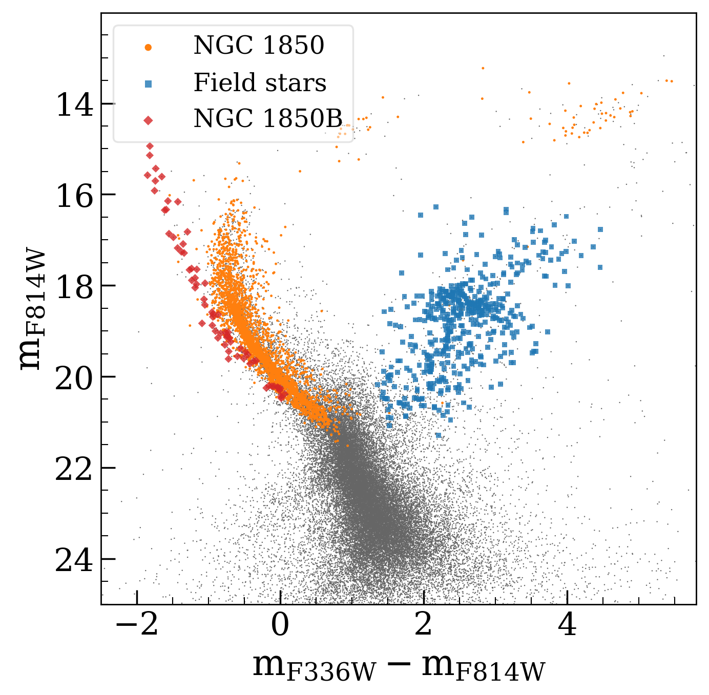
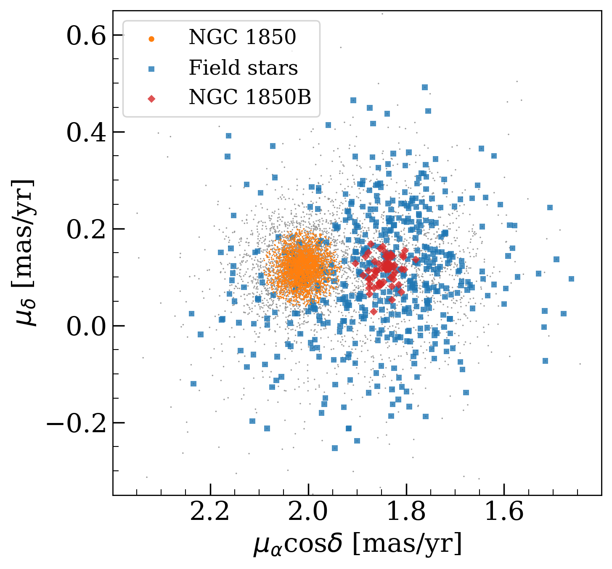
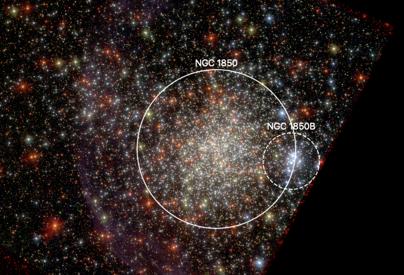

$\newcommand{\ensuremath}{}$
$\newcommand{\xspace}{}$
$\newcommand{\object}[1]{\texttt{#1}}$
$\newcommand{\farcs}{{.}''}$
$\newcommand{\farcm}{{.}'}$
$\newcommand{\arcsec}{''}$
$\newcommand{\arcmin}{'}$
$\newcommand{\ion}[2]{#1#2}$
$\newcommand{\textsc}[1]{\textrm{#1}}$
$\newcommand{\hl}[1]{\textrm{#1}}$
$\newcommand{\footnote}[1]{}$

# Hubble Space Telescope proper motions of Large Magellanic Cloud star clusters

<mark>Appeared on: 2024-06-26</mark> -  _27 pages, 15 figures. Accepted for publication in A&A. Astro-photometric catalogues are available at this https URL_

F. Niederhofer, et al. -- incl., <mark>M. Häberle</mark>

**Abstract:** We present proper motion (PM) measurements for a sample of 23 massive star clusters within the Large Magellanic Cloud using multi-epoch data from the _Hubble_ Space Telescope (HST). We combined archival data from the ACS/WFC and WFC3/UVIS instruments with observations from a dedicated HST programme, resulting in time baselines between 4.7 and 18.2 yr available for PM determinations. For bright well-measured stars, we achieved nominal PM precisions of 55 $\mu$ as yr $^{-1}$ down to 11 $\mu$ as yr $^{-1}$ . To demonstrate the potential and limitations of our PM data set, we analysed the cluster NGC 1850 and showcase a selection of different science applications. The precision of the PM measurements allows us to disentangle the kinematics of the various stellar populations that are present in the HST field. The cluster has a centre-of-mass motion that is different from the surrounding old field stars and also differs from the mean motion of a close-by group of very young stars. We determined the velocity dispersion of field stars to be $0.128\pm0.003$ mas yr $^{-1}$ (corresponding to $30.3\pm0.7$ km s $^{-1}$ ). The velocity dispersion of the cluster inferred from the PM data set most probably overestimates the true value, suggesting that the precision of the measurements at this stage is not sufficient for a reliable analysis of the internal kinematics of extra-galactic star clusters.  Finally, we exploit the PM-cleaned catalogue of likely cluster members to determine any radial segregation between fast and slowly-rotating stars, finding that the former are more centrally concentrated.  With this paper, we also release the astro-photometric catalogues for each cluster.

**Figure 11. -** Outline of the procedure to correct the PMs for high-frequency systematic effects. Panel (a) shows the VPD of sources towards NGC 1850. Likely cluster members were selected based on their PMs (within the red circle, which has a radius of 0.1 mas yr$^{-1}$ in the case of NGC 1850) and their positions in the CMD. Panel (b) shows the $m_{\rm F814W}$ vs $m_{\rm F438W}-m_{\rm F814W}$ CMD of all sources with measured PMs towards NGC 1850 (grey dots) and the final selection of well-measured cluster stars (black dots). Panels (c) and (d) show, separately for each PM component, the maps of the local mean raw PM field (before the high-frequency correction). Each point in the map is colour-coded according to the median PM of its closest 200 well-measured cluster stars. The corresponding maps of the a posteriori corrected PMs are displayed in panels (e) and (f). The points in these maps are coloured according to the same range in colour as in panels (c) and (d). (*fig:PM_correction*)

**Figure 15. -** The different populations in the field of NGC 1850. _Left_: $m_{\rm F814W}$ vs $m_{\rm F336W}-m_{\rm F814W}$ CMD highlighting the selected members of NGC 1850 (orange dots), NGC 1850B (red diamonds) and old field stars (blue squares). _Right_: VPD of the same populations.
 (*fig:ngc1850_populations*)

**Figure 4. -** Three-colour image of NGC 1850, created from HST observations in the F336W (blue), F438W (green) and F814W (red) filters. Member stars of
NGC 1850 are selected based on their motion and distance
from the cluster centre (white solid circle). Stars belonging to
the young group called NGC 1850B are selected as the young
sequence in the CMD that are located within the white dashed
circle and show consistent motions.  (*fig:ngc1850b*)

