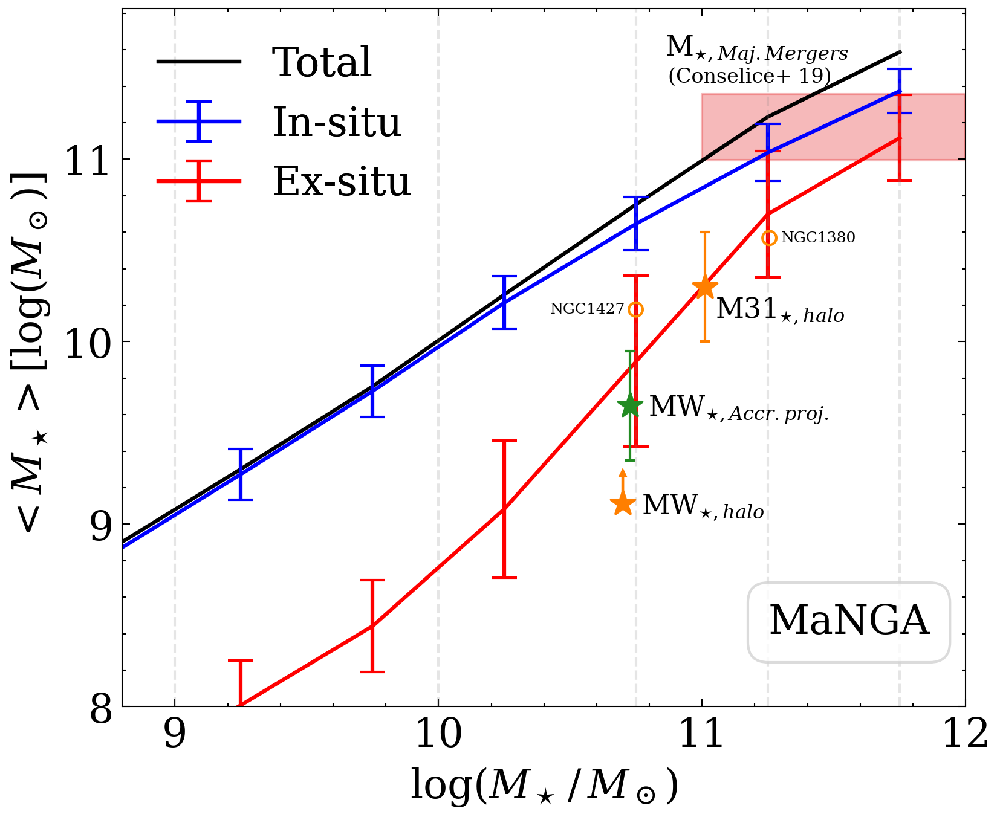
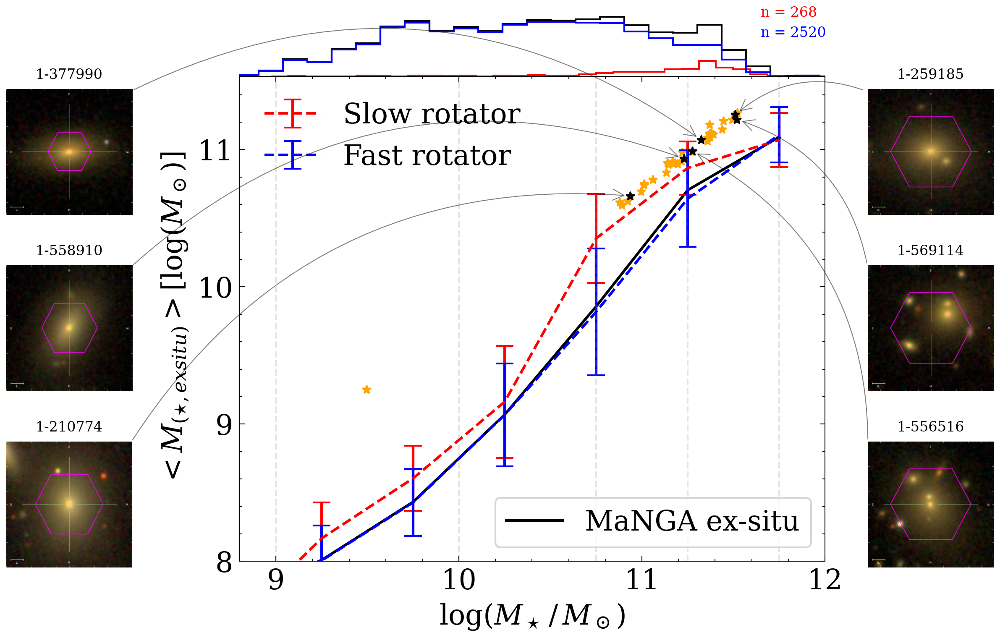
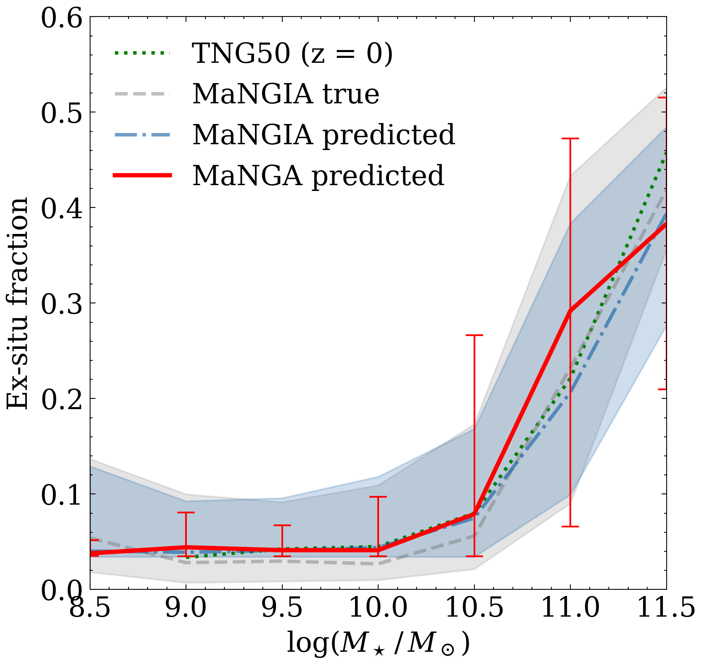
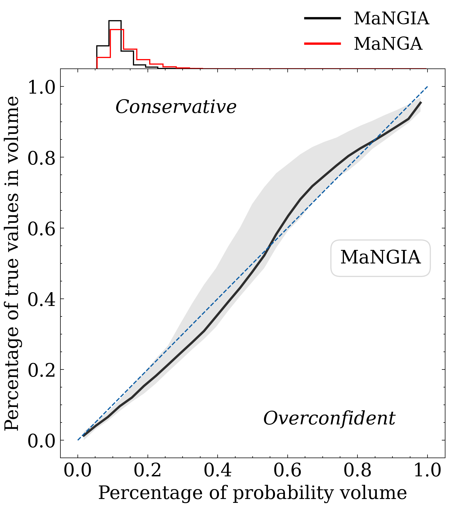

$\newcommand{\ensuremath}{}$
$\newcommand{\xspace}{}$
$\newcommand{\object}[1]{\texttt{#1}}$
$\newcommand{\farcs}{{.}''}$
$\newcommand{\farcm}{{.}'}$
$\newcommand{\arcsec}{''}$
$\newcommand{\arcmin}{'}$
$\newcommand{\ion}[2]{#1#2}$
$\newcommand{\textsc}[1]{\textrm{#1}}$
$\newcommand{\hl}[1]{\textrm{#1}}$
$\newcommand{\footnote}[1]{}$
$\newcommand{\rev}[1]{\textcolor{red}{#1}}$
$\newcommand{\apj}{$
$  Astrophysical Journal$
$}$
$\newcommand{\apjl}{$
$  Astrophysical Journal, Letters$
$}$
$\newcommand{\apjs}{$
$  Astrophysical Journal, Supplement$
$}$
$\newcommand{\aj}{$
$  Astronomical Journal$
$}$
$\newcommand{\araa}{$
$  Annual Review of Astron and Astrophysis$
$}$
$\newcommand{\mnras}{$
$  Monthly Notices of the RAS$
$}$
$\newcommand{\aap}{$
$  Astronomy and Astrophysics$
$}$
$\newcommand{\pasp}{$
$  Publications of the ASP$
$}$
$\newcommand{\rmxaa}{$
$  Revista Mexicana de Astronomia y Astrofisica$
$}$
$\newcommand{\na}{$
$  New Astronomy$
$}$

# Constraints on the in-situ and ex-situ stellar masses in nearby galaxies with Artificial Intelligence

<mark>Appeared on: 2024-07-02</mark> -  _16 pages, 7 Figures. Accepted for publication_

E. Angeloudi, et al. -- incl., <mark>L. Eisert</mark>, <mark>A. Pillepich</mark>

**Abstract:** The hierarchical model of galaxy evolution suggests that the impact of mergers is substantial on the intricate processes that drive stellar assembly within a galaxy. However, accurately measuring the contribution of accretion to a galaxy's total stellar mass and its balance with in-situ star formation poses a persistent challenge, as it is neither directly observable nor easily inferred from observational properties. Here, we present theory-motivated predictions for the fraction of stellar mass originating from mergers in a statistically significant sample of nearby galaxies, using data from MaNGA. Employing a robust machine learning model trained on mock MaNGA analogs (MaNGIA) in turn obtained from a cosmological simulation (TNG50), we unveil that in-situ stellar mass dominates almost across the entire stellar mass spectrum ( $10^9M_\odot<M_\star<10^{12}M_\odot$ ). Only in more massive galaxies ( $M_\star>10^{11}M_\odot$ ) does accreted mass become a substantial contributor, reaching up to 35-40 \% of the total stellar mass. Notably, the ex-situ stellar mass in the nearby universe exhibits significant dependence on galaxy characteristics, with higher accreted fractions favored by elliptical, quenched galaxies and slow rotators, as well as galaxies at the center of more massive dark matter halos.

**Figure 1. -** The contribution of the in-situ vs. the ex-situ stellar mass component to the total stellar mass for $\sim$ 10,000 MaNGA galaxies as it is predicted from the Neural Network model trained on the MaNGIA mock dataset. The mean total stellar mass at a given stellar mass bin is drawn with a black solid line and should roughly correspond to a straight line. The average  contribution of the in-situ stellar mass created through internal star formation at each stellar mass bin is drawn with a blue solid line. Correspondingly, the red solid line shows the average contribution originating from accretion/mergers (ex-situ). The error bars contain the 68 per cent of all data. For comparison, we plot the mass of the stellar halo (to distinguish from dark matter halo mass) for Milky Way2020ARA&A..58..205H and M312017MNRAS.466.1491H with orange stars (a proxy for accreted mass) and a rough projection of ex-situ stellar mass for Milky Way after it mergers with LMC with a green star (details in discussion). The open circles correspond to an independent ex-situ stellar mass measurement for two early-type galaxies, NGC 1380 and NGC 1427, members of the Fornax galaxy cluster, using population-orbital decomposition methods in combination with cosmological simulation TNG50 from ref.2022A&A...664A.115Z The red shaded region corresponds to an independent measurement of mass from major mergers for massive galaxies from ref. 2022ApJ...940..168C It is apparent that the in-situ stellar mass dominates across the stellar mass range. The ex-situ stellar mass contribution becomes significant only for massive galaxies, revealing a strong dependency of the level of accretion to the stellar mass. Our measurements are roughly compatible with completely independent measurements in the literature. (*fig:manga_recovery*)

**Figure 6. -** Dependencies of the ex-situ stellar mass on rotation. For comparison to the global relation, the mean stellar mass originating from accretion/mergers across the stellar mass range is drawn with a solid black line. At a fixed stellar mass, slow rotators (red dashed line) exhibit higher ex-situ stellar mass than their fast rotator counterparts (blue dashed line). The error bars contain the 68 per cent of the data. The star points correspond to outliers, galaxies classified as fast rotators with a predicted fraction of ex-situ stellar mass > 0.5. We plot 6 SDSS images of the outliers' sample and identify several intriguing actual fast rotators (left-hand side images) as well as galaxies undergoing a merger event (right-hand side images). The image labels correspond to the MaNGA ID of each galaxy. (*fig:exsitu_rotation*)

**Figure 2. -** Validation of the NN model and its uncertainties on the MaNGIA mock dataset and the MaNGA real galaxies. (a) The recovery of the median ex-situ stellar mass fraction vs. stellar mass relation for $\sim$ 10,000 MaNGA galaxies (red solid line) as it is predicted from the ensemble of the NN models trained on the MaNGIA mock dataset. For a visual validation of the model, both the ground-truth (grey dashed line) and the model predictions (blue dash-dotted line) are shown for the ex-situ fractions of the MaNGIA test set, revealing a close recovery of the underlying relation. The median relation for the TNG50 simulation, from which the MaNGIA sample originates, at redshift $z = 0$ is shown with a green dotted line. The shaded regions and error bars contain the 68 per cent of all data. (b) The coverage statistical test applied on the MaNGIA test set. The black solid line corresponds to the median of the uncertainty calibration of the models trained on MaNGIA. The perfect calibration for the uncertainties is shown with a diagonal dashed blue line. Our models seem to follow closely the perfect calibration, which is the desired behavior. On the top, we also show the distribution of the produced ensembled uncertainties of the models on MaNGIA and MaNGA and find that they are comparable, with the model producing slightly higher uncertainties on the unknown MaNGA dataset. (*fig:uncertainties*)

