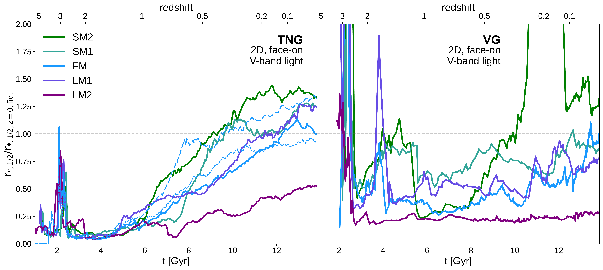
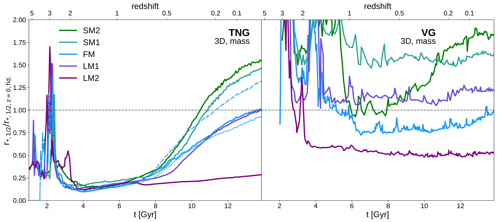
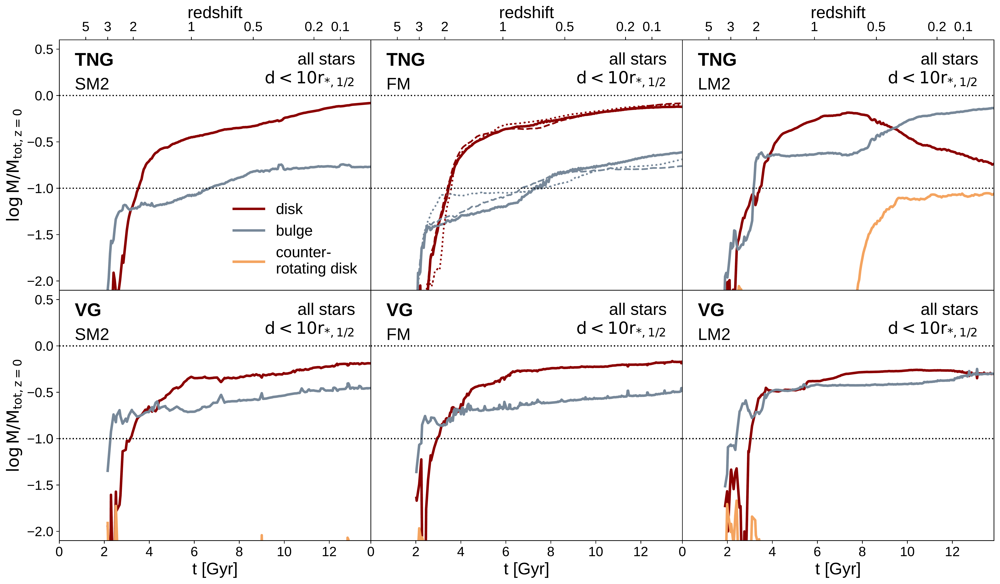
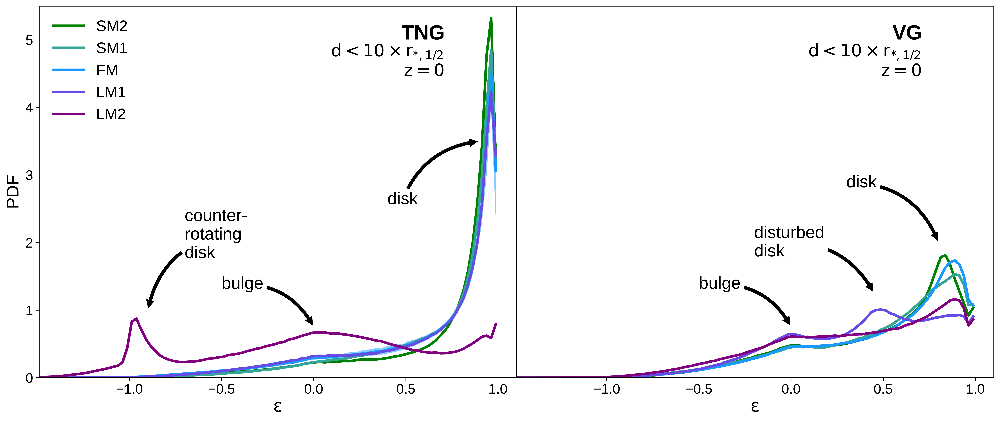

$\newcommand{\ensuremath}{}$
$\newcommand{\xspace}{}$
$\newcommand{\object}[1]{\texttt{#1}}$
$\newcommand{\farcs}{{.}''}$
$\newcommand{\farcm}{{.}'}$
$\newcommand{\arcsec}{''}$
$\newcommand{\arcmin}{'}$
$\newcommand{\ion}[2]{#1#2}$
$\newcommand{\textsc}[1]{\textrm{#1}}$
$\newcommand{\hl}[1]{\textrm{#1}}$
$\newcommand{\footnote}[1]{}$
$\newcommand{\MSUN}{{\rm M}_{\sun}}$
$\newcommand{\MHOST}{M_{\rm 200c, host}}$
$\newcommand{\RHOST}{r_{\rm 200c, host}}$
$\newcommand{\RSB}{r_{\rm *,SB=26.5}}$
$\newcommand{\RHALF}{r_{\rm *,1/2}}$
$\newcommand{\RHALFV}{r_{\rm V,1/2}}$
$\newcommand{\RHALFGEN}[1]{r_{\rm *,1/2,#1}}$
$\newcommand{\MSTAR}{M_{\rm *}}$
$\newcommand{\MGEN}[1]{M_{\rm #1}}$
$\newcommand{\RGEN}[1]{R_{\rm #1}}$
$\newcommand{\XXC}{\textbf{SM2}}$
$\newcommand{\XVC}{\textbf{SM1}}$
$\newcommand{\XC}{\textbf{FM}}$
$\newcommand{\XCX}{\textbf{LM1}}$
$\newcommand{\XCXX}{\textbf{LM2}}$
$\newcommand{\XCRII}{\textbf{FM-R2}}$
$\newcommand{\XCRIII}{\textbf{FM-R3}}$
$\newcommand{\targetMerger}{z \approx 2}$
$\newcommand{\vgn}{VG}$
$\newcommand{\tng}{TNG}$
$\newcommand{\gjNotes}[1]{{\color{Green} #1}}$
$\newcommand{\gjChanges}[1]{{\color{Black} #1}}$
$\newcommand{\apChanges}[1]{{\color{Blue} #1}}$
$\newcommand{\thebibliography}{\DeclareRobustCommand{\VAN}[3]{##3}\VANthebibliography}$

# The PARADIGM project I: How early merger histories shape the present-day sizes of Milky-Way-mass galaxies

<mark>Appeared on: 2024-07-02</mark> -  _Submitted to MNRAS. 22 pages. Comments are welcome_

G. D. Joshi, et al. -- incl., <mark>A. Pillepich</mark>

**Abstract:** The way in which mergers affect galaxy formation depends on both feedback processes, and on the geometry and strength of the mergers themselves. We introduce the PARADIGM project, where we study the response of a simulated Milky-Way-mass galaxy forming in a cosmological setting to differing merger histories, using genetically modified initial conditions. Each initial condition is simulated with the VINTERGATAN and IllustrisTNG codes. While VINTERGATAN has been developed with an emphasis on resolving the cold interstellar medium, IllustrisTNG uses a subgrid two-phase model and consequently scales to large volume simulations, making them ideal to examine complementary views on how merger histories and feedback interact. Our genetic modifications alter the mass ratio of an important $\targetMerger$ merger while maintaining the halo's $z=0$ mass. Whether simulated with VINTERGATAN or IllustrisTNG, smaller mass ratios for this early merger result in larger galaxies at $z=0$ , due to a greater build up of a kinematically cold disc. We conclude that such broad trends are robustly reproducible; however, the normalization of the resulting stellar sizes is substantially different in the two codes (ranging between $0.5-1.7 \rm{kpc}$ for VINTERGATAN but $1.3-7.0 \rm{kpc}$ for IllustrisTNG). The VINTERGATAN galaxies systematically form stars earlier, leading to a larger bulge component. Despite the difference in size normalization, both simulation suites lie on the observed size-mass relation for their respective morphological types. In light of these results, we discuss the interplay between internal processes and large scale gravitational interactions and gas accretion, and how the two galaxy models converge on similar emergent trends but along different evolutionary pathways.

**Figure 6. -** Evolution of 2D half-light (top) and 3D half-mass (bottom) radii for the $\tng$(left) and $\vgn$(right) sets of simulations. Each radius has been normalised by the $z=0$ radius of the fiducial run from the corresponding set. Bottom panels show the evolution of stellar mass within $3 $\RHALF$$. The dotted and dashed blue lines in the left panels show the re-simulations of the fiducial ICs with the $\tng$  model to show stochastic scatter ($\XC$RII  and $\XC$RIII  respectively). The $\tng$  galaxies show a clear trend of more rapid size growth as a function of time for the smaller merger scenarios, for both half-light and half-mass radii, beginning at $z \sim 1$. Such a trend is also seen for the $\vgn$  simulations when considering half-light radii; a trend is not obvious for the half-mass radii however, likely due to their larger bulge fractions (see Section \ref{sec:kinComp}). The rapid rise in half-light radius for the $\vgn$$\XXC$  simulation at $z \sim 0.2$ is caused by an influx of gas resulting in SF in the outskirts of the galaxy. We have restricted the y-axis values to show the majority of the trends in all simulations more clearly and therefore do not show the peak of this feature, which is approximately at $\RHALF/$\RHALF$GEN{\rm z=0,fid.} = 5.9$ and $z=0.2$. (*fig:sizeEvolution*)

**Figure 9. -** Evolution of the stellar mass in disc (red), bulge (gray) and counter-rotating disc (orange) components within $10 $\RHALF$$ as a function of cosmic time, for the $\tng$(top row) and $\vgn$(bottom row) simulations. The masses have been normalised by the galaxies' $z=0$ stellar mass within $10 $\RHALF$$. We omit the two intermediate runs for clarity. The two additional runs of the $\tng$  fiducial simulations ($\XC$RII  and $\XC$RIII) are shown with dotted and dashed curves in the top middle panel. Dotted black lines indicate 10 and 100 percent of $M_{\rm tot,z=0}$ for reference. In the $\tng$  simulations, the increase in $\targetMerger$  merger mass ratio results in a proportionally higher build-up of bulge mass compared to disc mass. In the $\vgn$  simulations, although the trends are not as clear. Additionally in the $\tng$$\XC$XX  case, we also see the rapid build-up of the counter-rotating disc component at $z \sim 0.5$, which then accounts for nearly 10 per cent of the galaxy mass. The simultaneous decrease in disc mass is not accompanied by a loss of total stellar mass, but rather due to the transfer of disc stars to the bulge component. In the $\vgn$$\XC$XX  case, we find a similar relative increase in bulge mass, resulting in an equal proportion of disc and bulge mass at $z=0$. (*fig:circCompEvolution_allStars*)

**Figure 8. -** Mass-weighted probability distribution functions of the circularity parameter $\epsilon$ for all stellar particles within $10 $\RHALF$$ at $z=0$. Both sets of simulations show a prominent disc component at $\epsilon \approx 0.9$ and a secondary bulge component at $\epsilon=0$, except for the $\XC$XX  cases which are bulge-dominated galaxies. Furthermore, the smaller merger scenarios result in a relatively more massive disc component. In the $\tng$  simulations, the disc component is proportionally more important and corresponds to a kinematically colder disc than in the $\vgn$  simulations. Two other important features are evident in the distributions: a `counter-rotating disc' in the $\tng$$\XC$XX  simulation, and a `disturbed disc' in the $\vgn$$\XC$X  simulation. (*fig:circDistributionZ0*)

