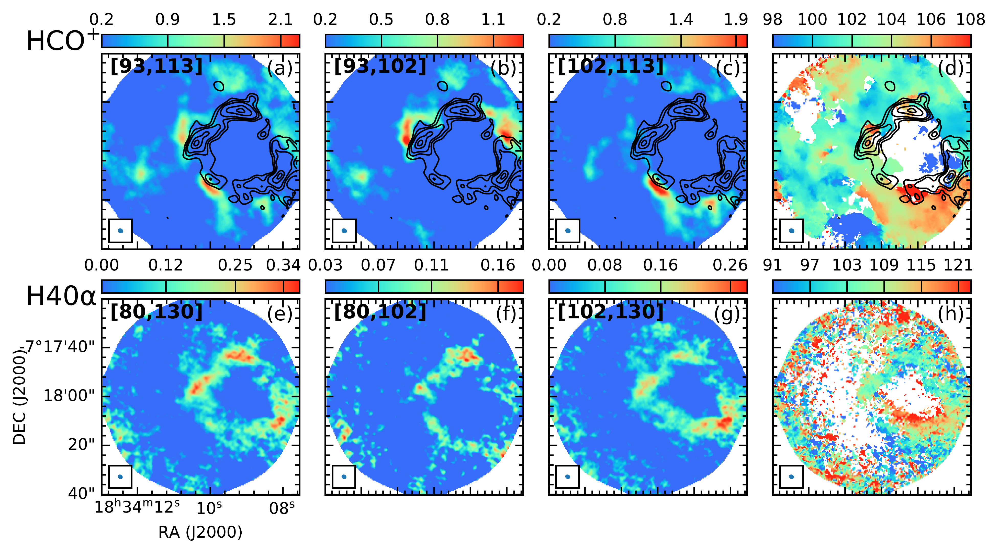
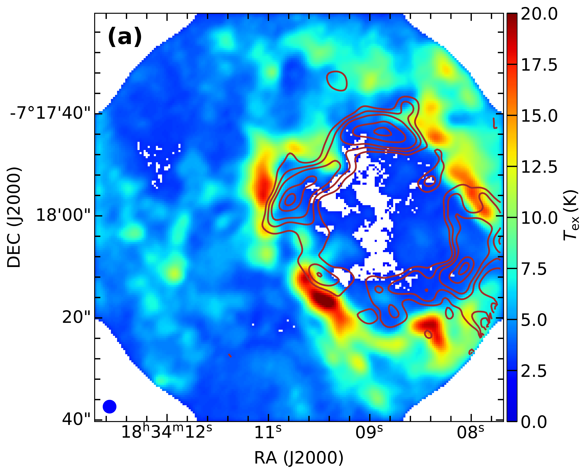
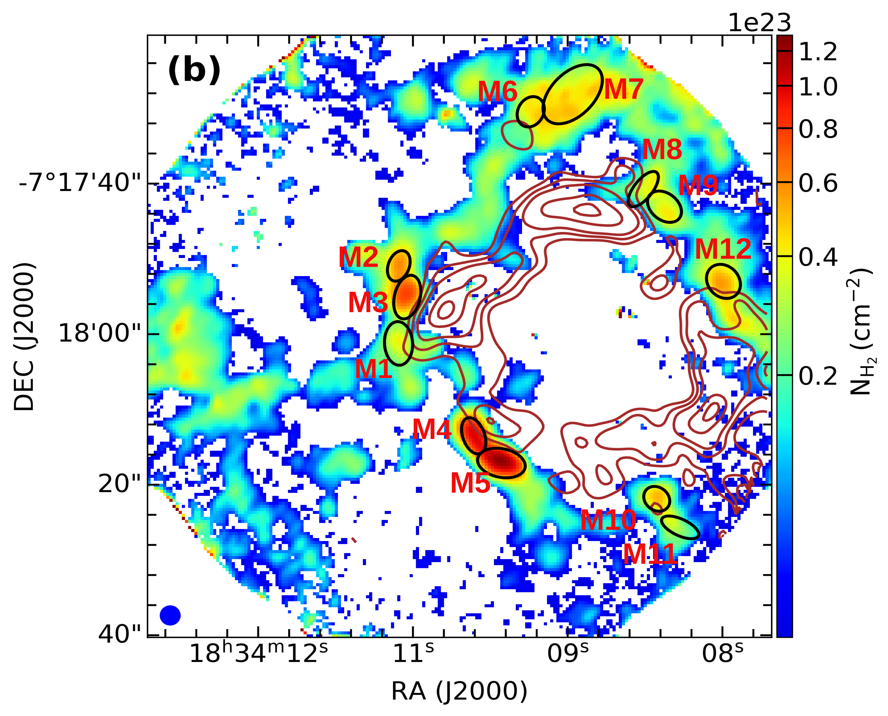

$\newcommand{\ensuremath}{}$
$\newcommand{\xspace}{}$
$\newcommand{\object}[1]{\texttt{#1}}$
$\newcommand{\farcs}{{.}''}$
$\newcommand{\farcm}{{.}'}$
$\newcommand{\arcsec}{''}$
$\newcommand{\arcmin}{'}$
$\newcommand{\ion}[2]{#1#2}$
$\newcommand{\textsc}[1]{\textrm{#1}}$
$\newcommand{\hl}[1]{\textrm{#1}}$
$\newcommand{\footnote}[1]{}$
$\newcommand{\vdag}{(v)^\dagger}$
$\newcommand$
$\newcommand$
$\newcommand$
$\newcommand$
$\newcommand$
$\newcommand{\HL}[1]{{\color{red}  #1}}$

# Direct observational evidence of multi-epoch massive star formation in G24.47+0.49

<mark>Appeared on: 2024-07-03</mark> -  _18 pages, 7 figures, accepted for publication in The Astrophysical Journal Letters_

A. Saha, et al. -- incl., <mark>S. Li</mark>

**Abstract:** Using new continuum and molecular line data from the ALMA Three-millimeter Observations of Massive Star-forming Regions (ATOMS) survey and archival VLA, 4.86 GHz data, we present direct observational evidence of hierarchical triggering relating three epochs of massive star formation in a ring-like H ${\small II}$ region, G24.47+0.49. We find from radio flux analysis that it is excited by a massive star(s) of spectral type O8.5V–O8V from the first epoch of star formation.The swept-up ionized ring structure shows evidence of secondary collapse, and within this ring a burst of massive star formation is observed in different evolutionary phases, which constitutes the second epoch.ATOMS spectral line (e.g., HCO $^+$ (1--0)) observations reveal an outer concentric molecular gas ring expanding at a velocity of $\sim$ 9 $ \rm km s^{-1}$ , constituting the direct and unambiguous detection of an expanding molecular ring.It harbors twelve dense molecular cores with surface mass density greater than 0.05 $ \rm g cm^{-2}$ , a threshold typical of massive star formation. Half of them are found to be subvirial, and thus in gravitational collapse, making them third  epoch of potential massive star-forming sites.

**Figure 3. -**  Morphology of the region associated with G24.47. (a) _ Spitzer_-IRAC colour composite image overlaid with VLA 4.86 GHz contours at 3, 7, 20, 50, 90, 110, 120 times $\sigma$(= 0.4 $\rm mJy beam^{-1}$). (b) VLA 4.86 GHz map overlaid with ATOMS H40$\alpha$ contours (Gaussian smoothed over 5 pixels) starting at 2$\sigma$(= 0.04 $\rm Jy beam^{-1} km s^{-1}$) in steps of 1$\sigma$. The displayed ellipses are identified VLA cores with their central positions (X) marked. The insets show the H40$\alpha$ spectra (boxcar smoothed by four channels; velocity resolution of 6.0 $\rm km s^{-1}$) of the cores along with their respective Gaussian fits.  The LSR velocity of 101.5 $\rm km s^{-1}$ is indicated in each. (c) ALMA 3 mm map overlaid with the H40$\alpha$ contours displayed in (b). The displayed ellipses are identified 3 mm cores with their central positions (+) marked. (d) Moment zero map (3-pixel smoothed using Gaussian kernel) of H$^{13}$CO$^+$ in the velocity range 93.0 to 113.0 $\rm km s^{-1}$. The displayed ellipses are identified molecular cores with their central positions (+) marked. Ellipses drawn in the lower left corner of (b), (c), and (d) represent the beams of the respective maps displayed. (*fig:RGB_vla_ha*)

**Figure 4. -** Moment zero (left three) and moment one (rightmost) maps of HCO$^+$ and H40$\alpha$ observed towards G24.47 are shown in panels (a) -- (d) and (e) -- (h), respectively. The velocity ranges used to obtain the moment zero maps are given in the top left of each panel. The colour bar indicates the flux scale in $\rm Jy beam^{-1} km s^{-1}$ and $\rm km s^{-1}$ for moment zero and moment one maps, respectively.
    The overlaid contours (in panels (a) -- (d)) show the H40$\alpha$ emission (presented as colorscale in panel (e)) with contour levels starting at 2$\sigma$( $\sigma =$ 0.04 $\rm Jy beam^{-1} km s^{-1}$) in steps of 1$\sigma$.
    These contours are smoothed over five pixels using Gaussian kernel. The moment zero maps (in panels (e) -- (g)) are smoothed across three pixels using Gaussian kernel.
    The beam is indicated at the bottom left corner in each panel. (*fig:moment-maps*)

**Figure 2. -** (a) Effective line of sight excitation temperature map generated using HCO$^+$. (b) Column density map towards G24.47, generated using molecular transitions H$^{13}$CO$^+$ and HCO$^+$. The ellipses represent the apertures of identified molecular cores. In both panels, the overlaid contours show the H40$\alpha$ emission with contour levels starting at 2$\sigma$( $\sigma =$ 0.04 $\rm Jy beam^{-1} km s^{-1}$) in steps of 1$\sigma$. These contours are smoothed over 5 pixels using Gaussian kernel.  The beam size of 2.5$\arcsec$ is indicated at the bottom left.  (*fig:cdmap_molcore*)

