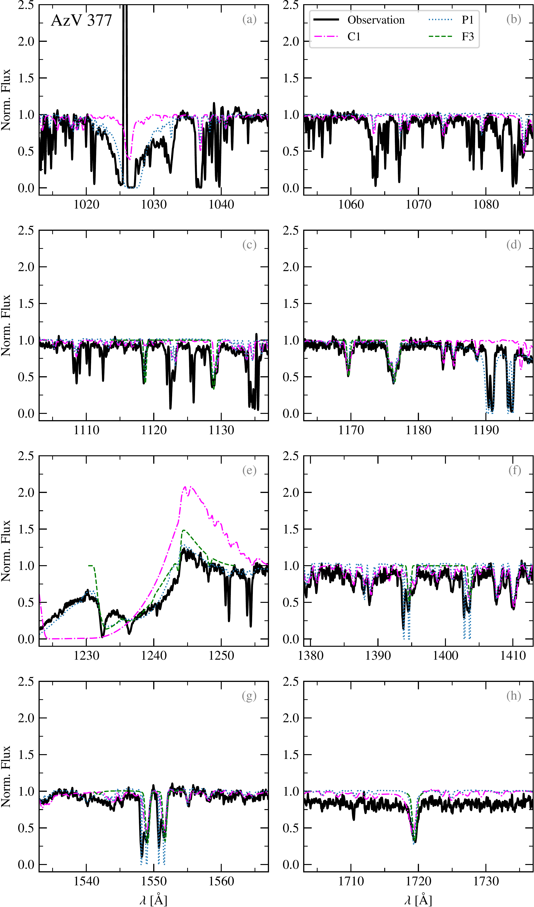
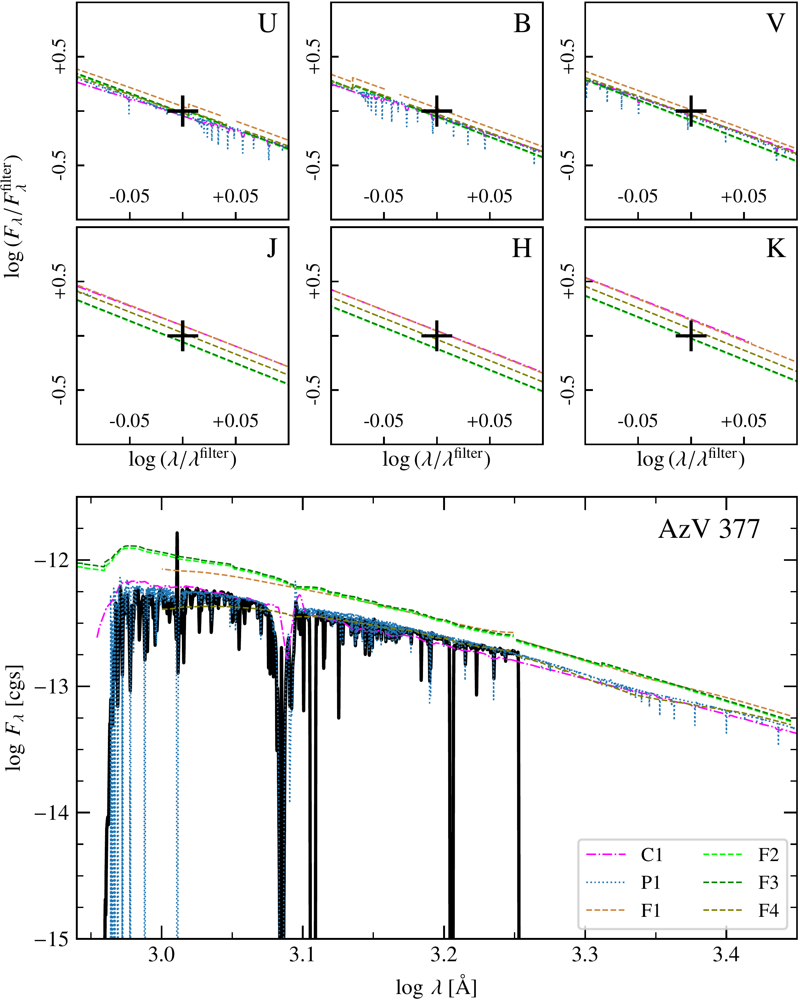
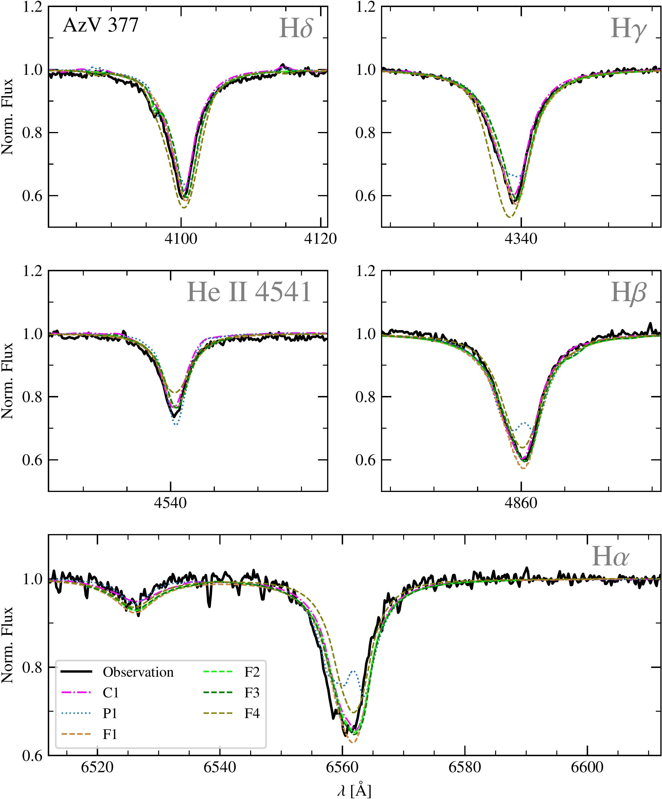

$\newcommand{\ensuremath}{}$
$\newcommand{\xspace}{}$
$\newcommand{\object}[1]{\texttt{#1}}$
$\newcommand{\farcs}{{.}''}$
$\newcommand{\farcm}{{.}'}$
$\newcommand{\arcsec}{''}$
$\newcommand{\arcmin}{'}$
$\newcommand{\ion}[2]{#1#2}$
$\newcommand{\textsc}[1]{\textrm{#1}}$
$\newcommand{\hl}[1]{\textrm{#1}}$
$\newcommand{\footnote}[1]{}$
$\newcommand{\Msun}{\ensuremath{\rm M_\odot}}$
$\newcommand{\mdot}{\ensuremath{\rm M_\odot yr^{-1}}}$
$\newcommand{\Lsun}{\ensuremath{\rm L_\odot}}$
$\newcommand{\Rsun}{\ensuremath{\rm R_\odot}}$
$\newcommand{\fuse}{\emph{FUSE}}$
$\newcommand{\stis}{\emph{STIS}}$
$\newcommand{\cosp}{\emph{COS}}$
$\newcommand{\hst}{\emph{HST}}$
$\newcommand{\eso}{\emph{ESO}}$
$\newcommand{\xshooter}{\emph{X-shooter}}$
$\newcommand{\teff}{T_\text{eff}}$
$\newcommand{\logg}{\log g}$
$\newcommand{\loggc}{\log g_\text{c}}$
$\newcommand{\vturb}{\varv_{\rm turb}}$
$\newcommand{\vmac}{\varv_{\rm mac}}$
$\newcommand{\vsini}{\varv\sin i}$
$\newcommand{\vrad}{\varv_{\rm rad}}$
$\newcommand{\radius}{R_{*}/R_{\odot}}$
$\newcommand{\mass}{M_{*}/M_{\odot}}$
$\newcommand{\logL}{\log (L_{*}/L_{\odot})}$
$\newcommand{\rstar}{R_{*}}$
$\newcommand{\mstar}{M_{*}}$
$\newcommand{\zsun}{{\rm Z}_{\odot}}$
$\newcommand{\lsun}{{\rm L}_{\odot}}$
$\newcommand{\ebv}{\rm E(B-V)}$
$\newcommand{\Rv}{R_{\rm v}}$
$\newcommand{\Mv}{M_{\rm v}}$
$\newcommand{\cmfgen}{\textsc{CMFGEN}}$

# X-Shooting ULLYSES: Massive Stars at low metallicity 

<mark>Appeared on: 2024-07-04</mark> -  _18+15 pages, 21+4 figures, under review at A&A, condensed abstract_

A. Sander, et al. -- incl., <mark>C. Larkin</mark>

**Abstract:** The spectral analysis of hot, massive stars is a fundamental astrophysical method to obtain their intrinsic properties and determine their feedback. With their inherent, radiation-driven winds, the quantitative spectroscopy for hot, massive stars requires a detailed numerical modeling of the atmosphere and an iterative treatment to obtain the best solution within a given physical and numerical framework. We present an overview of different techniques for the quantitative spectroscopy of hot stars employed within the X-Shooting ULLYSES collaboration, ranging from grid-based approaches to tailored spectral fits. By performing a blind test for selected targets, we gain an overview about the similarities and differences of the resulting stellar and wind parameters. Our study is not a systematic benchmark between different codes or methods, but aims to provide an overview of the parameter spread caused by different approaches. For three different stars from the XShooting ULLYSES sample (SMC O5 star AzV 377, LMC O7 star Sk -69 $^{\circ}$ 50, and LMC O9 star Sk -66 $^{\circ}$ 171), we employ different stellar atmosphere codes (CMFGEN, Fastwind , PoWR) and different strategies to determine their best-fitting model solutions. For our analyses, UV and optical spectroscopy are used to determined the stellar and wind properties with some methods relying purely on optical data for comparison. To determine the overall spectral energy distribution, we further employ additional available photometry from the literature. The effective temperatures for each of three different sample stars agree within $3 $ kK while the differences in $\log g$ can be up to $0.2 $ dex. Luminosity differences of up to $0.1 $ dex are resulting from different reddening assumptions, which seem to be systematically larger for the methods employing a genetic algorithm. All sample stars are found to be nitrogen-enriched. The terminal wind velocities are surprisingly similar and do not strictly follow the $\varv_\infty$ - $T_\text{eff}$ -relation. We find a reasonable agreement for the derived stellar and wind parameters between the different methods. Tailored fitting methods tend to be able to minimize or avoid discrepancies obtained with more course or automatized treatments. The inclusion of UV spectral data is essential for the determination of realistic wind parameters. For one target (Sk -69 $^{\circ}$ 50), we find clear indications of an evolved status.

**Figure 4. -** Comparison between the main UV profiles for AzV 377. The panels, from (a) to (h) depicts respectively the profiles of $\ion${O}{vi} 1032/1038 Å,
 $\ion${S}{iv} 1063/1073Å (and $\ion${He}{ii} 1085 Å), $\ion${P}{v} 1118/1128 Å, $\ion${C}{iii} 1176 Å, $\ion${N}{v} 1238/1242 Å, $\ion${Si}{iv} 1394/1403 Å, $\ion${C}{iv} 1548/1551 Å, $\ion${N}{iv} 1718 Å. Interstellar Ly$\alpha$ and Ly$\beta$ absorption affects some of the diagnostics, most notably the wing of $\ion${N}{v} 1238/1242 Å in case of larger terminal velocities (e.g., seen in AzV 377). (*fig:uv-AV377*)

**Figure 11. -** Zoom-in comparison of the spectral energy distributions from the different models for AzV 377 around the applied photometry (small upper panels, crosses mark photometric measurements) and the flux-calibrated UV spectra (big lower panel). (*fig:SED-zoom-AV377*)

**Figure 1. -** Comparison between the different methods in the Balmer lines and $\ion${He}{ii} $\lambda$4541 region for AzV 377. (*fig:balmer-AV377*)

