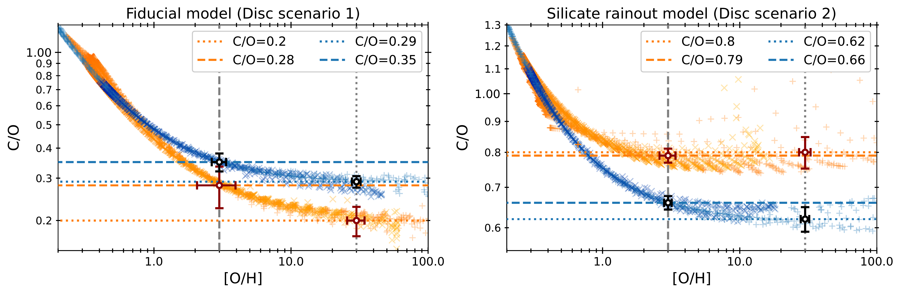
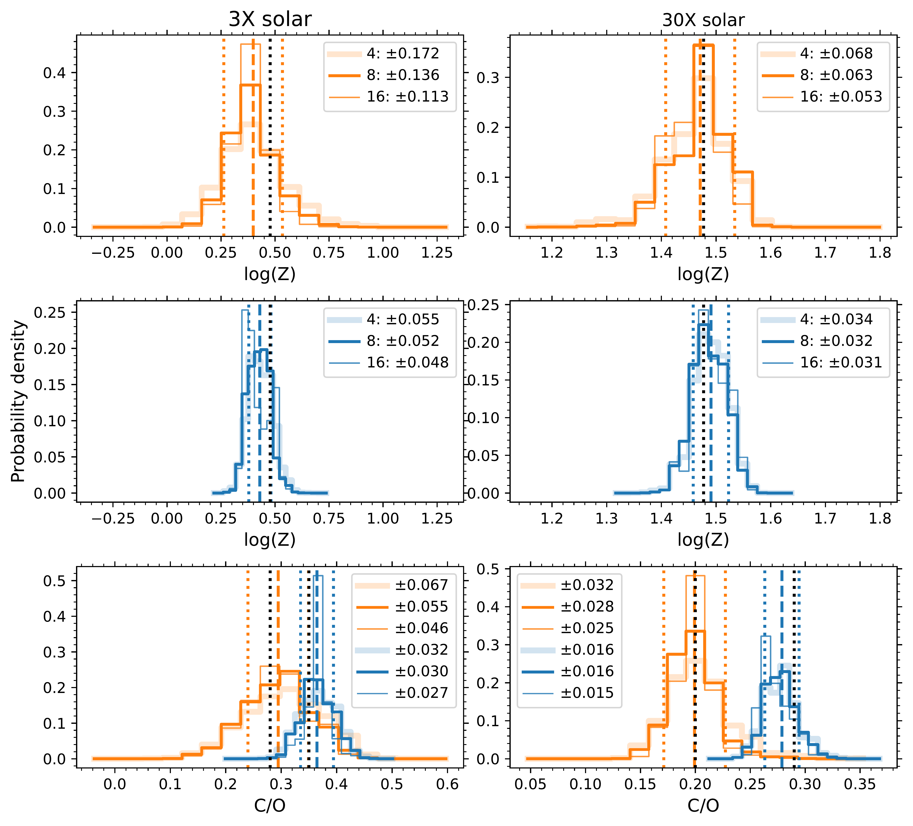
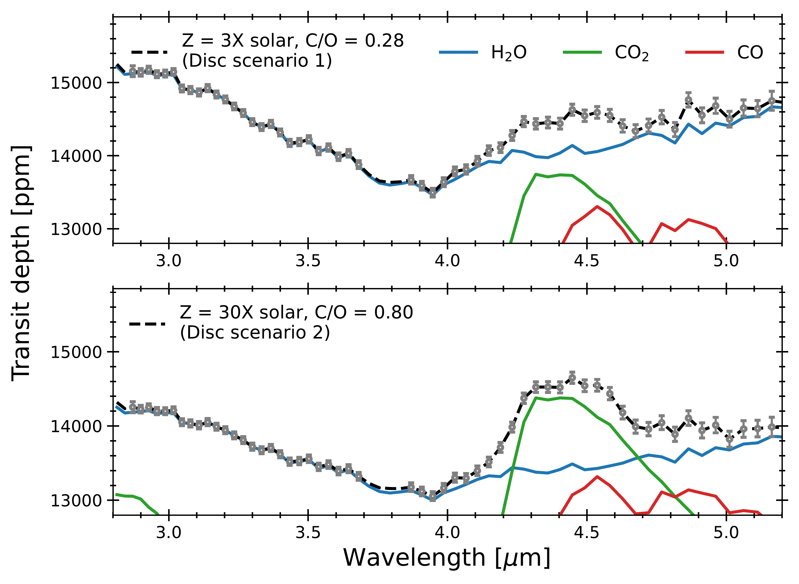

$\newcommand{\ensuremath}{}$
$\newcommand{\xspace}{}$
$\newcommand{\object}[1]{\texttt{#1}}$
$\newcommand{\farcs}{{.}''}$
$\newcommand{\farcm}{{.}'}$
$\newcommand{\arcsec}{''}$
$\newcommand{\arcmin}{'}$
$\newcommand{\ion}[2]{#1#2}$
$\newcommand{\textsc}[1]{\textrm{#1}}$
$\newcommand{\hl}[1]{\textrm{#1}}$
$\newcommand{\footnote}[1]{}$
$\newcommand{\Rsun}{R_{\odot}}$
$\newcommand{\Rjup}{R_{\mathrm{J}}}$
$\newcommand{\Mjup}{M_{\mathrm{J}}}$
$\newcommand{\Rp}{R_{\mathrm{P}}}$
$\newcommand{\Mp}{M_{\mathrm{P}}}$
$\newcommand{\Rs}{R_{\mathrm{*}}}$
$\newcommand{\Ms}{R_{\mathrm{*}}}$
$\newcommand{\Teq}{T_{\mathrm{eq}}}$
$\newcommand{◦ee}{^{\circ}}$
$\newcommand{\obliquity}{|\lambda|}$

# BOWIE-ALIGN: A JWST comparative survey of aligned vs misaligned hot Jupiters to test the dependence of atmospheric composition on migration history

<mark>Appeared on: 2024-07-05</mark> -  _13 pages, 8 figures, submitted to RASTI_

J. Kirk, et al. -- incl., <mark>E.-M. Ahrer</mark>

**Abstract:** A primary objective of exoplanet atmosphere characterisation is to learn about planet formation and evolution, however, this is challenged by degeneracies. To determine whether differences in atmospheric composition can be reliably traced to differences in evolution, we are undertaking a new survey with JWST to compare the compositions of a sample of hot Jupiters that orbit F stars above the Kraft break with different orbital alignments. Under the assumption that aligned planets migrate through the inner disc, while misaligned planets migrate after disc dispersal, the act of migrating through the inner disc should lead to a measurable difference in the C/O between aligned and misaligned planets. We expect the amplitude and sign of this difference to depend on the amount of planetesimal accretion and whether silicates accreted from the inner disc release their oxygen. Here, we identify all known exoplanets that are suitable for testing this hypothesis, describe our JWST survey, and use noise simulations and atmospheric retrievals to estimate our survey's sensitivity. With the selected sample of four aligned and four misaligned hot Jupiters, we will be sensitive to the predicted differences in C/O between aligned and misaligned hot Jupiters for a wide range of model scenarios.

**Figure 4. -** The C/O and [O/H](= Z) results of two models from the suite of models run in \citetalias{PenzlinBooth2024}\citeyear{PenzlinBooth2024}. Left panel: The C/O and [O/H] from the fiducial model (disc scenario 1), showing that aligned, disc-migrated planets (orange points) tend towards lower C/O than misaligned, high-eccentricity migrated planets (blue points) due to the accretion of O-rich ices in the inner disc. The dashed and dotted lines indicate the two values of metallicity and four values of C/O that were adopted in our simulation setup here. The white circles with uncertainties show the precision with which we'll be able to measure these values from an eight-planet sample (four aligned and four misaligned planets). Right panel: The C/O and [O/H] from the silicate rainout model (disc scenario 2), whereby silicates do not release their O into the atmospheres of exoplanets upon accretion. In this case, aligned, disc-migrated planets (orange points) tend towards higher C/O than misaligned, high-eccentricity migrated planets (blue points). Again, the dashed and dotted lines indicate the two values of metallicity and four values of C/O that were adopted in our simulation setup here. (*fig:anna_models*)

**Figure 5. -** The retrieved $\log Z$ and C/O posteriors from the model atmospheres with $\log Z$ and C/O set by the fiducial disc model (scenario 1). The left column corresponds to the $3\times$ solar metallicity cases, and the right column to $30\times$ solar. Top row: the combined $\log Z$ posteriors from the aligned planets for a *total* sample size of 4 (2 aligned, 2 misaligned), 8 (4 aligned, 4 misaligned) and 16 (7 aligned, 9 misaligned) planets, with the legend giving the standard deviations of these distributions. The darkest line corresponds to our actual sample size of 8 planets. The vertical dashed and dotted orange lines indicate the mean and standard deviation of the 8 planet posterior. The vertical dotted black line indicates the input value. Second row: $\log Z$ posteriors for the misaligned planets. Bottom row: the C/O posteriors for both the aligned (orange) and misaligned planets (blue). (*fig:posteriors_fiducial*)

**Figure 2. -** Two example forward models used in this analysis, both created for TrES-4b (an aligned target). Top panel: a $3\times$ solar metallicity, $\mathrm{C/O} = 0.28$ forward model (black dashed line), corresponding to the fiducial disc model (disc scenario 1, Section \ref{sec:model_predictions} and Figure \ref{fig:anna_models}, left panel). The grey uncertainties correspond to the estimated JWST precision at a spectral resolution of $R=100$. The colour lines show the contribution of different species to the overall opacity, using line lists for $H_2$O from \protect[Polyansky, et. al (2018)](https://ui.adsabs.harvard.edu/abs/2018MNRAS.480.2597P), $CO_2$ from \protect[Tashkun and Perevalov (2011)](https://ui.adsabs.harvard.edu/abs/2011JQSRT.112.1403T), and CO from \protect[Faure, et. al (2013)](https://ui.adsabs.harvard.edu/abs/2013JQSRT.116...79F), [ and Gordon (2017)](https://ui.adsabs.harvard.edu/abs/2017JQSRT.203....3G). Bottom panel: a $30\times$ solar metallicity, $\mathrm{C/O} = 0.80$ forward model (black line), corresponding to the silicate rainout disc model (disc scenario 2, Section \ref{sec:model_predictions} and Figure \ref{fig:anna_models}, right panel). (*fig:opacities*)

