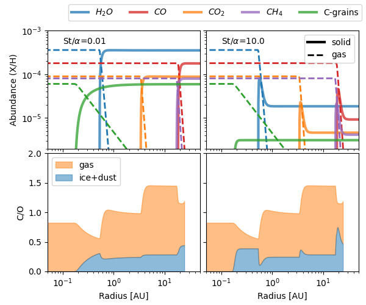
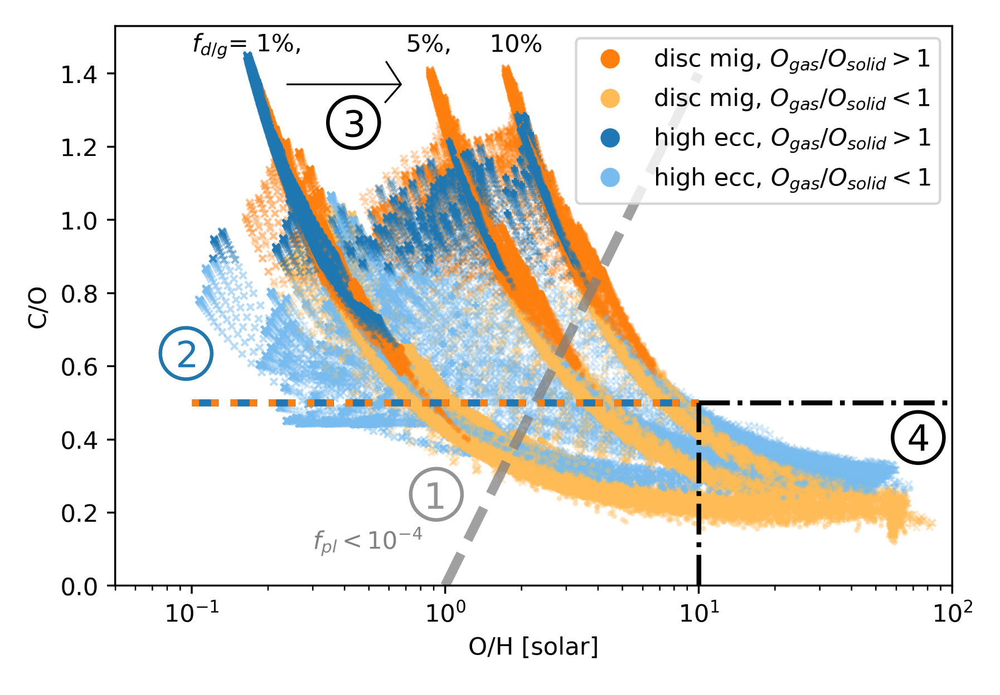
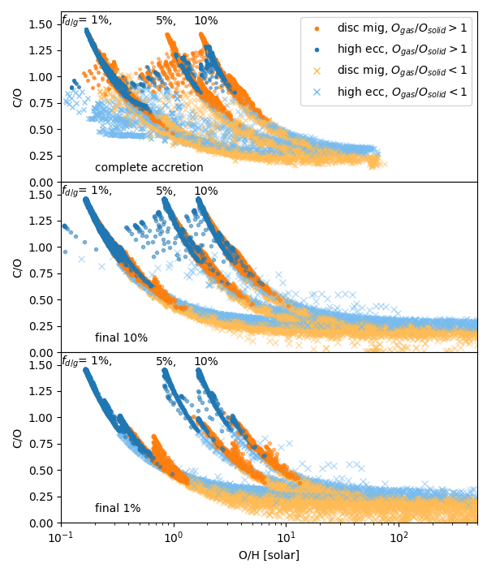

$\newcommand{\ensuremath}{}$
$\newcommand{\xspace}{}$
$\newcommand{\object}[1]{\texttt{#1}}$
$\newcommand{\farcs}{{.}''}$
$\newcommand{\farcm}{{.}'}$
$\newcommand{\arcsec}{''}$
$\newcommand{\arcmin}{'}$
$\newcommand{\ion}[2]{#1#2}$
$\newcommand{\textsc}[1]{\textrm{#1}}$
$\newcommand{\hl}[1]{\textrm{#1}}$
$\newcommand{\footnote}[1]{}$
$\newcommand{\prt}[2]{\frac{\partial #1}{\partial #2}}$
$\newcommand{\Prt}[1]{\frac{\partial}{\partial #1}}$
$\newcommand{\PPrt}[1]{\frac{\partial^2}{\partial #1^2}}$
$\newcommand{\todo}[1]{\textcolor{red}{\bf (todo: #1)}}$
$\newcommand{\checks}[1]{\textcolor{blue}{\bf #1}}$
$\newcommand{\new}[1]{\textcolor{black}{\bf #1}}$
$\newcommand{\quest}[1]{\textcolor{magenta}{\bf #1}}$
$\newcommand{\anna}[1]{\textcolor{magenta}{#1}}$
$\newcommand{\rab}[1]{\textcolor{darkgreen}{#1}}$
$\newcommand{\jeo}[1]{\textcolor{blue}{#1}}$
$\newcommand{\kirk}[1]{\textcolor{orange}{#1}}$
$\newcommand{\ep}{e_\mathrm{p}}$
$\newcommand{\ap}{a_\mathrm{p}}$
$\newcommand{\St}{\mathrm{St}}$
$\newcommand{\rh}{r_\mathrm{hill}}$
$\newcommand{\Rsun}{\ensuremath{R_{\odot}}}$
$\newcommand{\Rjup}{\ensuremath{R_{\mathrm{J}}}}$
$\newcommand{\Mjup}{\ensuremath{M_{\mathrm{J}}}}$
$\newcommand{\Rp}{\ensuremath{R_{\mathrm{P}}}}$
$\newcommand{\Mp}{\ensuremath{M_{\mathrm{P}}}}$
$\newcommand{\Rs}{\ensuremath{R_{\mathrm{*}}}}$
$\newcommand{\Ms}{\ensuremath{R_{\mathrm{*}}}}$
$\newcommand{\Teq}{\ensuremath{T_{\mathrm{eq}}}}$
$\newcommand{◦ee}{\ensuremath{^{\circ}}}$
$\newcommand{\obliquity}{\ensuremath{|\lambda|}}$
$\newcommand{\um}{\ensuremath{\mu \text{m}}}$
$\newcommand{\beq}{\begin{equation}}$
$\newcommand{\eeq}{\end{equation}}$
$\title[BOWIE-ALIGN: Modelling the compositions of disc- and high-e migrated gas giants]{BOWIE-ALIGN: How formation and migration histories of giant planets impact atmospheric compositions}$
$\author[Penzlin, Booth et al.]{Anna~B.T. Penzlin^{1}\thanks{E-mail: a.penzlin@imperial.ac.uk}\thanks{Authors contributed equally.},$
$Richard~A. Booth^{2}\footnotemark[2],$
$James Kirk^{1},$
$James E. Owen^{1},$
$E. Ahrer^{3},$
$\newauthor$
$Duncan A. Christie^{3},$
$Alastair B. Claringbold^{4,5},$
$Emma Esparza-Borges^{6,7},$
$M. López-Morales^{8},$
$\newauthor$
$N. J. Mayne^{9},$
$Mason McCormack^{10},$
$Annabella Meech^{8,11},$
$Vatsal Panwar^{4,5},$
$Diana Powell^{10},$
$\newauthor$
$Denis E. Sergeev^{9},$
$Jake Taylor^{11},$
$Peter J. Wheatley^{4,5},$
$Maria Zamyatina^{9},$
$BOWIE+ collaboration$
$\ ^{1}Astrophysics Group, Department of Physics, Imperial College London, Prince Consort Rd, London, SW7 2AZ, UK \ ^{2}School of Physics and Astronomy, University of Leeds, Leeds LS2 9JT, UK\ ^{3}Max Planck Institute for Astronomy (MPIA), Königstuhl 17, 69117 Heidelberg, Germany\ ^{4}Centre for Exoplanets and Habitability, University of Warwick, Gibbet Hill Road, Coventry CV4 7AL, UK\ ^{5}Department of Physics, University of Warwick, Gibbet Hill Road, Coventry CV4 7AL, UK\ ^{6}Instituto de Astrofísica de Canarias, San Cristóbal de La Laguna, Tenerife E-38200, Spain \ ^{7}Departamento de Astrofísica, Universidad de La Laguna, San Cristóbal de La Laguna, Tenerife E-38200, Spain\ ^{8}Center for Astrophysics {\rm \mid} Harvard {\rm \&} Smithsonian, 60 Garden St, Cambridge, MA 02138, USA\ ^{9}Department of Physics and Astronomy, Faculty of Environment, Science and Economy, University of Exeter, Exeter EX4 4QL, UK\ ^{10}Department of Astronomy and Astrophysics, University of Chicago, IL, 60657, USA\ ^{11}Department of Physics, University of Oxford, Keble Road, Oxford, OX1 3RH, UK\ }$
$\date{Accepted XXX. Received YYY; in original form ZZZ}$
$\pubyear{2024}$
$\begin{document}$
$\label{firstpage}$
$\pagerange{\pageref{firstpage}--\pageref{lastpage}}$
$\maketitle$
$\begin{abstract}{$
$Hot Jupiters present a unique opportunity for measuring how planet formation history shapes present-day atmospheric composition. However, due to the myriad pathways influencing composition, a well-constructed sample of planets is needed to determine whether formation history can be accurately traced back from atmospheric composition.$
$To this end, the BOWIE-ALIGN survey will compare the compositions of 8 hot Jupiters around F stars, 4 with orbits aligned with the stellar rotation axis and 4 misaligned.$
$Using the alignment as an indicator for planets that underwent disc migration or high-eccentricity migration, one can determine whether migration history produces notable differences in composition between the two samples of planets.$
$This paper describes the planet formation model that motivates our observing programme. Our model traces the accretion of chemical components from the gas and dust in the disc over a broad parameter space to create a full, unbiased model sample from which we can estimate the range of final atmospheric compositions.$
$For high metallicity atmospheres (O/H\geq10 \times solar), the C/O ratios of aligned and misaligned planets diverge, with aligned planets having lower C/O (<0.25) due to the accretion of oxygen-rich silicates from the inner disc. However, silicates may$
$rain out instead of releasing their oxygen into the atmosphere. This would significantly increase the C/O of aligned planets (C/O >0.6), inverting the trend between the aligned and misaligned planets. Nevertheless, by comparing statistically significant samples of aligned and misaligned planets, we expect atmospheric composition to constrain how planets form.$
$}$
$\end{abstract}$
$\begin{keywords}$
$Planet formation -- Protoplanetary discs$
$\end{keywords}$
$\n\end{document}\end{equation}}$
$\newcommand{\eeq}{\end{equation}}$
$\newcommand{\vec}[1]{\bm{\mathrm{#1}}}$

# BOWIE-ALIGN: How formation and migration histories of giant planets impact atmospheric compositions

<mark>Appeared on: 2024-07-04</mark> -  _11pages 10 figures, (appendix: 6 page, 4 figures), submitted to mnras_

A. B. Penzlin, et al. -- incl., <mark>E.-M. Ahrer</mark>

**Abstract:** Hot Jupiters present a unique opportunity for measuring how planet formation history shapes present-day atmospheric composition. However, due to the myriad pathways influencing composition, a well-constructed sample of planets is needed to determine whether formation history can be accurately traced back from atmospheric composition.To this end, the BOWIE-ALIGN survey will compare the compositions of 8 hot Jupiters around F stars, 4 with orbits aligned with the stellar rotation axis and 4 misaligned.Using the alignment as an indicator for planets that underwent disc migration or high-eccentricity migration, one can determine whether migration history produces notable differences in composition between the two samples of planets.This paper describes the planet formation model that motivates our observing programme. Our model traces the accretion of chemical components from the gas and dust in the disc over a broad parameter space to create a full, unbiased model sample from which we can estimate the range of final atmospheric compositions.For high metallicity atmospheres ( $O/H\geq10 \times$ solar), the C/O ratios of aligned and misaligned planets diverge, with aligned planets having lower C/O ( $<0.25$ ) due to the accretion of oxygen-rich silicates from the inner disc. However, silicates mayrain out instead of releasing their oxygen into the atmosphere. This would significantly increase the C/O of aligned planets (C/O $>0.6$ ), inverting the trend between the aligned and misaligned planets. Nevertheless, by comparing statistically significant samples of aligned and misaligned planets, we expect atmospheric composition to constrain how planets form.

**Figure 1. -** Molecule abundances throughout the disc in gas and ice (top) and the resulting C/O ratio (bottom). The left panels show a disc with nearly no dust drift. The right panels show the enhancements near the icelines of fast drifting dust. To achieve a constant flux in all discs, the level of solid composition to gas composition scales with the drift velocity. (*fig:disc*)

**Figure 3. -** The final atmosphere compositions from the full parameter range in Table \ref{tab:models}. The marker symbol corresponds to the temperature ($ \times \rightarrow 125$ K, $ + \rightarrow 150$ K, $\circ \rightarrow 200$ K). Orange markers represent the disc migrated planets and blue markers represent the high-eccentricity migrated planets. Saturated markers show gas dominated accretion. The three different tracks correspond to different dust-to-gas flux ratios and are labelled. The dashed grey line indicates the critical values for models with planetesimal accretion fraction less than $<10^{-4}$, all such models are confined to the left side of the line. The coloured dashed line indicates the minimum C/O ratio for gas dominated accretion ($\mathrm{O_{gas}}/\mathrm{O_{dust}}>1$). (*fig:all_set*)

**Figure 9. -** The final atmosphere compositions when counting all, only the final 10 \% and final 1 \% of accreted material. The marker symbols and colours are the same as in Fig. \ref{fig:all_set}. (*fig:fin_set*)

