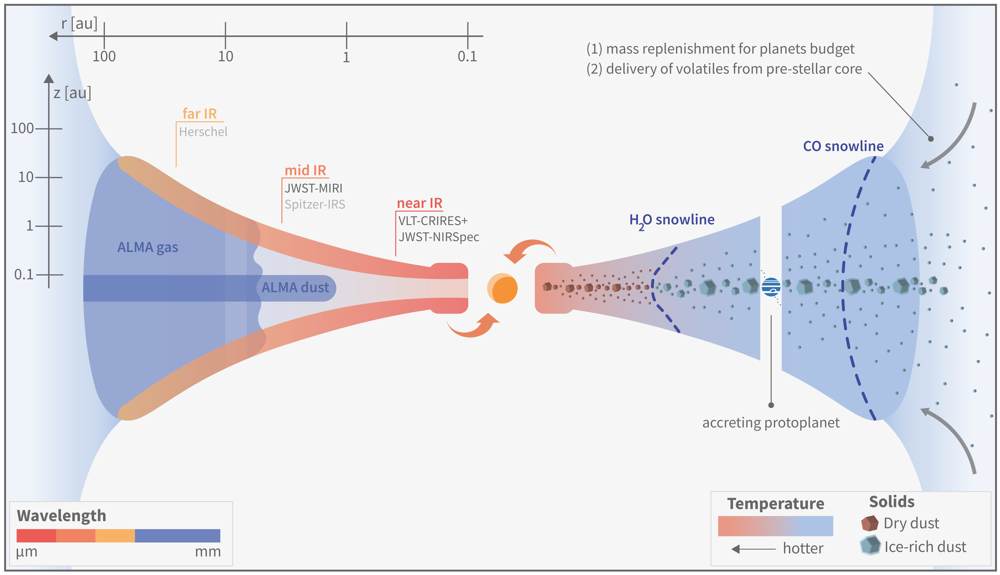
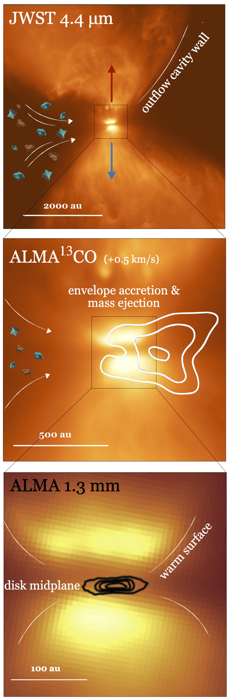
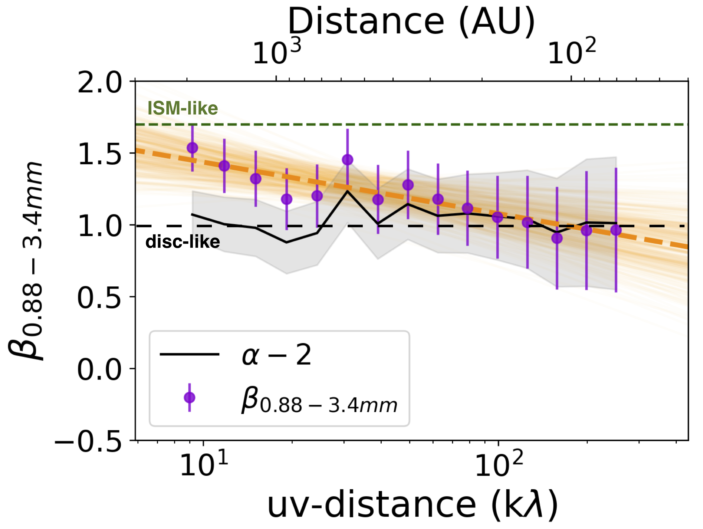

$\newcommand{\ensuremath}{}$
$\newcommand{\xspace}{}$
$\newcommand{\object}[1]{\texttt{#1}}$
$\newcommand{\farcs}{{.}''}$
$\newcommand{\farcm}{{.}'}$
$\newcommand{\arcsec}{''}$
$\newcommand{\arcmin}{'}$
$\newcommand{\ion}[2]{#1#2}$
$\newcommand{\textsc}[1]{\textrm{#1}}$
$\newcommand{\hl}[1]{\textrm{#1}}$
$\newcommand{\footnote}[1]{}$
$\newcommand{\gp}[1]{\textcolor{teal}{\textbf{GP:} #1}}$
$\newcommand{\teff}{T\rm_{eff }}$
$\newcommand{\kms}{\mathrm{km s}^{-1}}$
$\newcommand\natexlab{#1}$

# Planet Formation and Disk Chemistry

<mark>Appeared on: 2024-07-08</mark> -  _9 pages, 5 figures, Chapter IV of the National Congress of (proto-)Planetary Astrochemistry (CNAP II) Proceedings_

<mark>G. Perotti</mark>, et al.

**Abstract:** Over the past decade, progress in observational capabilities, combined with theoretical advancements, have transformed our comprehension of the physics and chemistry during planet formation. Despite these important steps forward, open questions persist on the chemical and physical evolution of solids in their journey from the collapsing molecular cores to disks and planetary bodies. This chapter is a repository of such burning questions. It has the ambition to identify the most promising avenues for future research based on current observational and modeling opportunities. $\keywords{Planet formation, Protoplanetary disks, Circumstellar matter, Dust, Gas}$

**Figure 5. -** Schematics of a planet-forming disk. The illustration highlights facilities used to probe different dust and gas disk reservoirs. Figure by A. Houge. (*fig:disk_sketch*)

**Figure 1. -** Complementary JWST and ALMA observations the L1527 IRS protostar. _Top:_ JWST/NIRCam image highlighting the wide molecular outflow (PID: 2739). _Middle:_ ALMA $^{13}$CO contours showing a snapshot of gas moving at +0.5 km/s with respect to the central source (PID: 2019.1.00261.L). _Bottom:_ ALMA 1.3 mm dust emission contours probing the disk midplane (adapted from \citealt{2023ApJ...951...10V}). (*fig:L1527*)

**Figure 2. -** Multi-wavelength dust opacity spectral index ($\beta_{0.88-3.4 mm}$) across the envelope of L1527, as a function of ALMA antennas baseline length or, equivalently, recovered physical scale (top x-axis). The probed scales go from 2000 au to 100 au. A gradient in dust properties across scales could be explained by dust growth to sub-millimeter sizes, variations in the chemical compositions of grains, or outwards transport of disk grains along outflows. Adapted from \citep{Cacciapuoti2023}. (*fig:LC23*)

