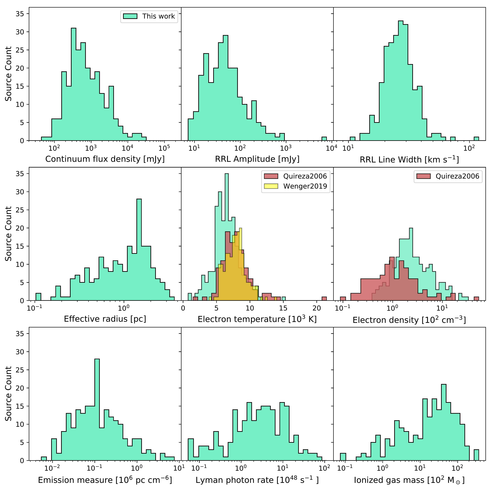
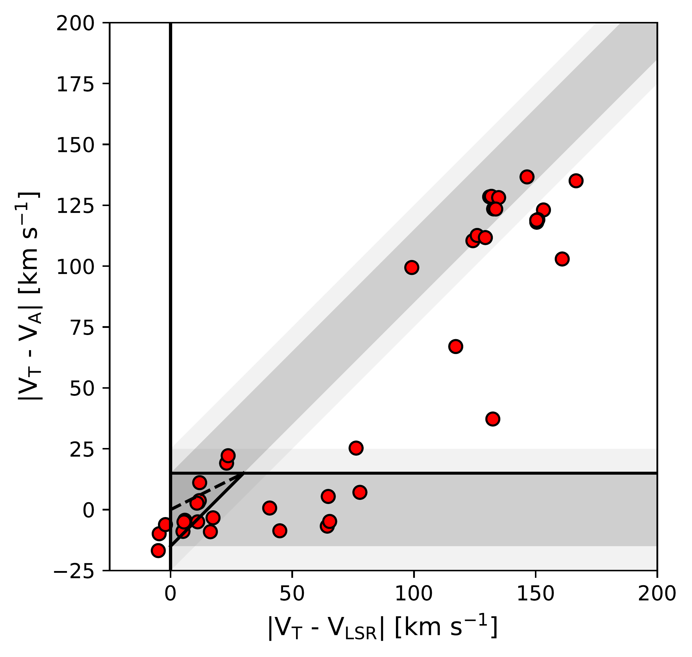
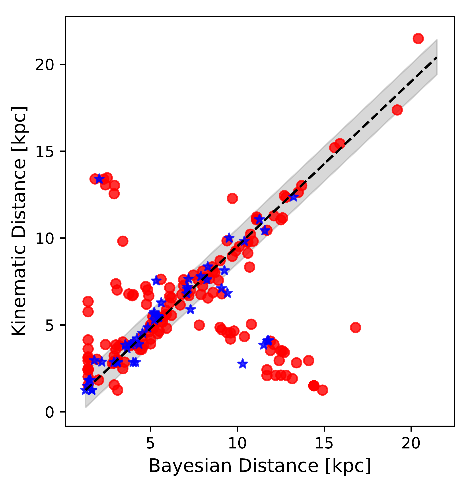
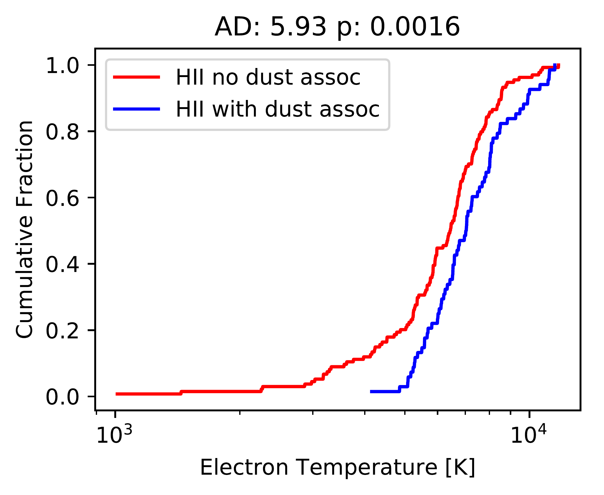
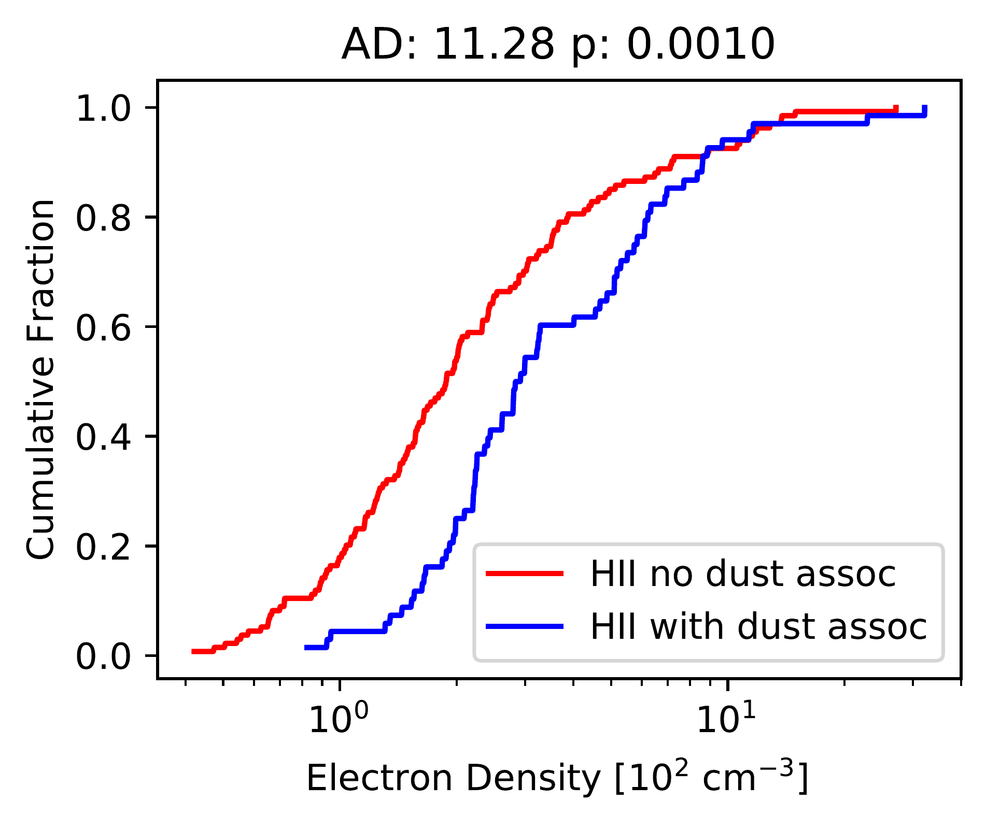
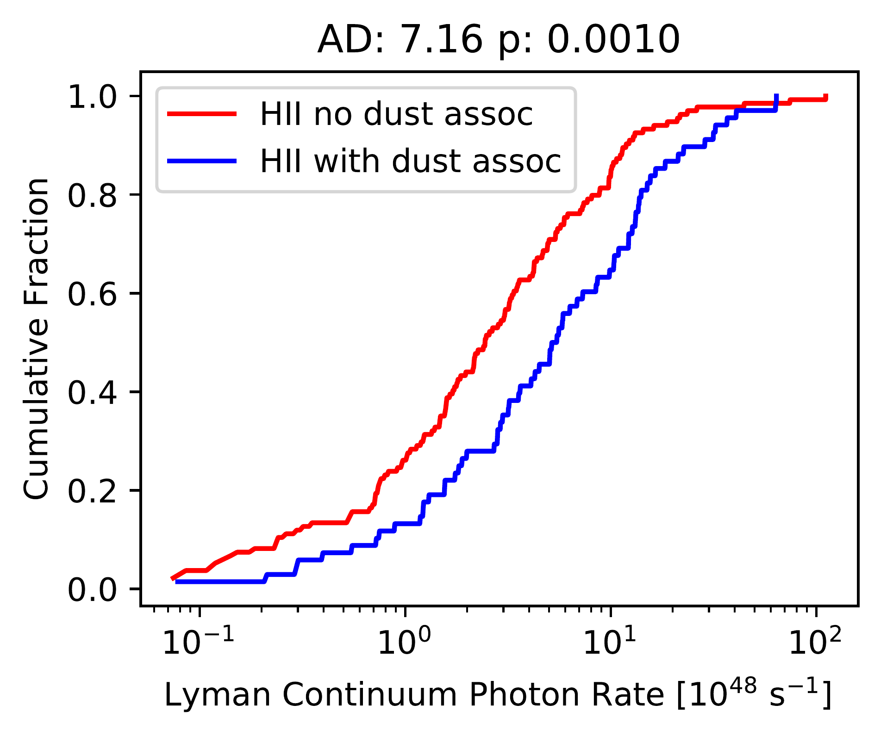
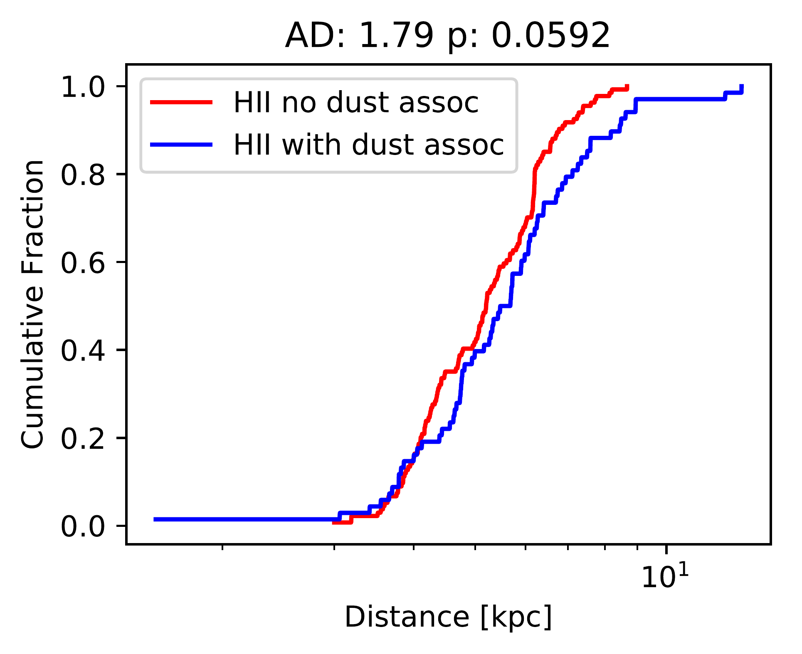

$\newcommand{\ensuremath}{}$
$\newcommand{\xspace}{}$
$\newcommand{\object}[1]{\texttt{#1}}$
$\newcommand{\farcs}{{.}''}$
$\newcommand{\farcm}{{.}'}$
$\newcommand{\arcsec}{''}$
$\newcommand{\arcmin}{'}$
$\newcommand{\ion}[2]{#1#2}$
$\newcommand{\textsc}[1]{\textrm{#1}}$
$\newcommand{\hl}[1]{\textrm{#1}}$
$\newcommand{\footnote}[1]{}$

# A global view on star formation: The GLOSTAR Galactic plane survey \ X. Galactic $\ion{H}{ii}$ region catalog using radio recombination lines$\thanks{Tables \ref{tab:catalog} and \ref{tab:phy_prop} are only available in electronic form at the CDS via anonymous ftp to \url{cdsarc.u-strasbg.fr} (130.79.128.5) or via \url{http://cdsweb.u-strasbg.fr/cgi-bin/qcat?J/A+A/}. }$

<mark>Appeared on: 2024-07-09</mark> -  _Accepted for publication in A&A_

S. Khan, et al. -- incl., <mark>H. Beuther</mark>

**Abstract:** Studies of Galactic $\ion{H}{ii}$ regions are of crucial importance for studying star formation and the evolution of the interstellar medium. Gaining an insight into their physical characteristics contributes to a more comprehensive understanding of these phenomena. The GLOSTAR project aims to provide a GLObal view on STAR formation in the Milky Way by performing an unbiased and sensitive survey. This is achieved by using the extremely wideband (4 $-$ 8 GHz) _C_ -band receiver of the _Karl G. Jansky_ Very Large Array and the Effelsberg 100 m telescope. Using radio recombination lines observed in the GLOSTAR survey with the VLA in D-configuration with a typical line sensitivity of 1 $\sigma \sim \rm 3.0 mJy beam^{-1}$ at $\sim \rm 5 km s^{-1}$ and an angular resolution of 25 $\arcsec$ , we cataloged 244 individual Galactic $\ion{H}{ii}$ regions ( $-$ 2 $◦ \leq$ $\ell$ $\leq$ 60 $◦$ \& | _b_ | $\leq$ 1 $◦$ and 76 $◦ \leq$ $\ell$ $\leq$ 83 $◦$ \& $-$ 1 $◦ \leq$ _b_ $\leq$ 2 $◦$ ) and derived their physical properties. We examined the mid-infrared (MIR) morphology of these $\ion{H}{ii}$ regions and find that a significant portion of them exhibit a bubble-like morphology in the GLIMPSE 8 $\mu$ m emission. We also searched for associations with the dust continuum and sources of methanol maser emission, other tracers of young stellar objects, and find that 48 \% and 14 \% of our $\ion{H}{ii}$ regions, respectively, are coextensive with those. We measured the electron temperature for a large sample of $\ion{H}{II}$ regions within Galactocentric distances spanning from 1.6 to 13.1 kpc and derived the Galactic electron temperature gradient  as $\sim$ 372 $\pm$ 28 K kpc $^{-1}$ with an intercept of 4248 $\pm$ 161 K, which is consistent with previous studies.

**Figure 15. -** Distributions of various $\ion${H}{ii} region physical properties from top left to bottom right, continuum flux density, RRL amplitude, RRL FWHM, effective radius, electron temperature, electron density, EM, Lyman photon rate, and ionized gas mass. The electron temperature reported by [Quireza, et. al (2006)]() is indicated in red, while the one reported by [Wenger, et. al (2019)]() is shown in yellow, and these are compared to the GLOSTAR $\ion${H}{ii} region sample (aquamarine). On average, the electron temperature of GLOSTAR $\ion${H}{ii} regions (6707 K) is lower than that of [Quireza, et. al (2006)]()(8214 K) and [Wenger, et. al (2019)]()(8055 K). Electron density histograms are presented for both the GLOSTAR (aquamarine) and [Quireza, et. al (2006)]()(red) $\ion${H}{ii} region samples. On average, the GLOSTAR nebulae have higher electron density than the [Quireza, et. al (2006)]() sources. (*fig:phy_prop_dist*)

**Figure 11. -** Top panel: Plot of the difference in source velocity ($\rm V_{lsr}$) and the velocity of tangent point ($\rm V_T$), versus the difference in the velocity of the first absorption minimum ($\rm V_A$) and the $\rm V_T$. The diagonal and horizontal shaded regions represent the expected location of the near and far distance sources, respectively, while the solid line shows the approximate boundaries  ([Kolpak, et. al 2003](), [Urquhart, Hoare and Lumsden 2012]()) . The dashed diagonal line divides the darker triangular region in the lower left quadrant of the plot into two regions: sources above the line are more likely to be at a near distance, while those below are more likely to be at a far distance. Bottom panel: Plot shows the relation between the distance determined using the Bayesian method presented by [Reid, et. al (2016)](), [Reid, Menten and Brunthaler (2019)]() and the near/far distance determined using the [Reid, Menten and Brunthaler (2014)]() rotation curve. The red circles and blue stars represent the distances taken from literature and obtained distance for 53 $\ion${H}{ii} regions, respectively. The solid black line shows the line of equality, and the gray shaded region represents $\pm$1 kpc.  (*fig:final_dist*)

**Figure 18. -** Comparison between the properties of GLOSTAR $\ion${H}{ii} regions that are associated with ATLASGAL dust clumps (in red) and those that are not linked to ATLASGAL clumps (in blue). CDFs are presented for various properties of GLOSTAR $\ion${H}{ii} regions. The results of the Anderson-Darling (AD) tests, indicated above each plot, provide insights into the statistical significance of the observed differences. (*fig:dust_without_dust_hist*)

