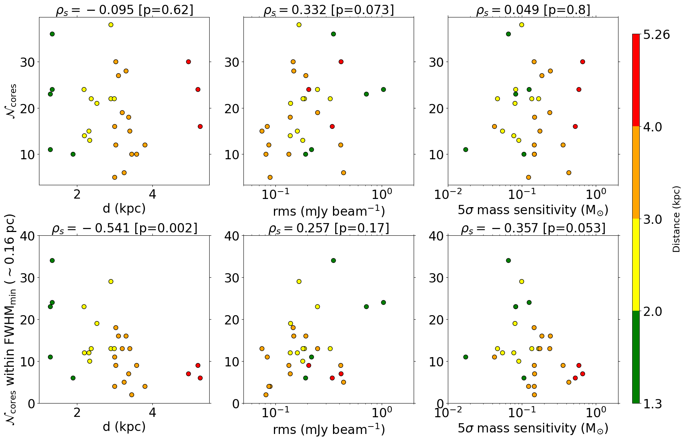
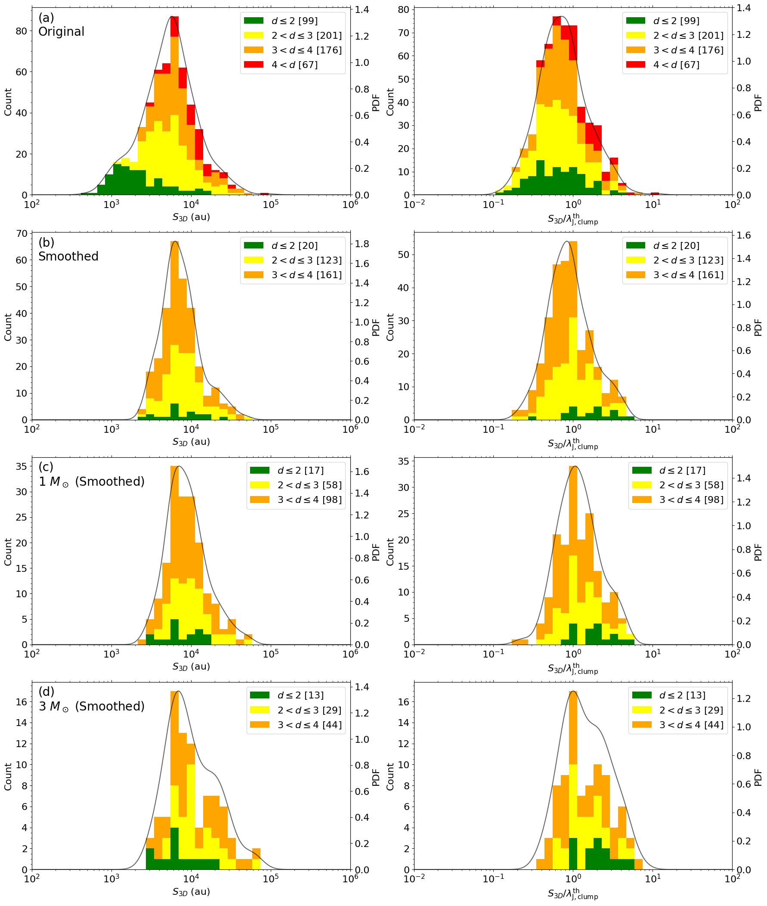

$\newcommand{\ensuremath}{}$
$\newcommand{\xspace}{}$
$\newcommand{\object}[1]{\texttt{#1}}$
$\newcommand{\farcs}{{.}''}$
$\newcommand{\farcm}{{.}'}$
$\newcommand{\arcsec}{''}$
$\newcommand{\arcmin}{'}$
$\newcommand{\ion}[2]{#1#2}$
$\newcommand{\textsc}[1]{\textrm{#1}}$
$\newcommand{\hl}[1]{\textrm{#1}}$
$\newcommand{\footnote}[1]{}$
$\newcommand{\vdag}{(v)^\dagger}$
$\newcommand$
$\newcommand$
$\newcommand{\JL}{\lambda_{\mathrm{J, clump}}^{\mathrm{th}}}$
$\newcommand{\tJL}{\lambda_{\mathrm{J, clump}}^{\mathrm{tur}}}$
$\newcommand{\JM}{\mathrm{M}_{\mathrm{J, clump}}^{\mathrm{th}}}$
$\newcommand{\tJM}{\mathrm{M}_{\mathrm{J, clump}}^{\mathrm{tur}}}$
$\newcommand{\Add}[1]{\textbf{#1}}$

# Digging into the Interior of Hot Cores with ALMA (DIHCA). IV. Fragmentation in High-mass Star-Forming Clumps

<mark>Appeared on: 2024-07-10</mark> -  _30 pages, 18 figures, Accepted in ApJ_

K. Ishihara, et al. -- incl., <mark>S. Li</mark>

**Abstract:** Fragmentation contributes to the formation and evolution of stars.Observationally, high-mass stars are known to form multiple-star systems, preferentially in cluster environments.Theoretically, Jeans instability has been suggested to determine characteristic fragmentation scales, and thermal or turbulent motion in the parental gas clump mainly contributes to the instability.To search for such a characteristic fragmentation scale, we have analyzed ALMA 1.33 mm continuum observations toward 30 high-mass star-forming clumps taken by the Digging into the Interior of Hot Cores with ALMA (DIHCA) survey.We have identified 573 cores using the dendrogram algorithm and measured the separation of cores by using the Minimum Spanning Tree (MST) technique.The core separation corrected by projection effects has a distribution peaked  around 5800 au.In order to remove biases produced by different distances and sensitivities, we further smooth the images to a common physical scale and perform completeness tests.Our careful analysis finds a characteristic fragmentation scale of $\sim$ 7000 au, comparable to the thermal Jeans length of the clumps. We conclude that thermal Jeans fragmentation plays a dominant role in determining the clump fragmentation in high-mass star-forming regions, without the need of invoking turbulent Jeans fragmentation.

**Figure 11. -** Top panels: target distance, rms noise level and $5\sigma$ mass sensitivity against the number of identified cores.
Bottom panels: target distances, rms noise level and $5\sigma$ mass sensitivity against the number of identified cores within the same physical area whose diameter is the minimum of the FWHM ($\sim$16 pc) of the FoV in the regions.
The header of each panel shows the Spearman's rank coefficient $\rho_s$ and the p-value.
The color coding shows the target distances.
 (*fig:correlations*)

**Figure 3. -** _ top_: Distribution of the angular separation obtained from MST for the entire sample. The solid line shows the log-pdf produced by Gaussian Kernel Density Estimation. Vertical lines represent minimum, mean, and maximum angular resolutions, respectively.
    _ middle_: Cumulative distribution of core separations divided by the angular resolution of the observations for clumps in each distance.
    _ bottom_: Separation distribution in au scale by converting the angular separation into a physical separation using the source distance. Vertical lines represent minimum, mean, and maximum linear resolutions, respectively.
     (*fig:sep_obs_ori*)

**Figure 13. -** 
    Separation distribution in various styles. Left panels display them in physical scale. Right panels display them in normalized to the clump thermal Jeans length. Each column represents as follows. Core separation measured from
    (a) original images,
    (b) smoothed images,
    (c) for cores whose mass is higher than $1 M_\odot$, and
    (d) the cores whose mass is higher than  $3 M_\odot$.
     (*fig:sep_3d*)

