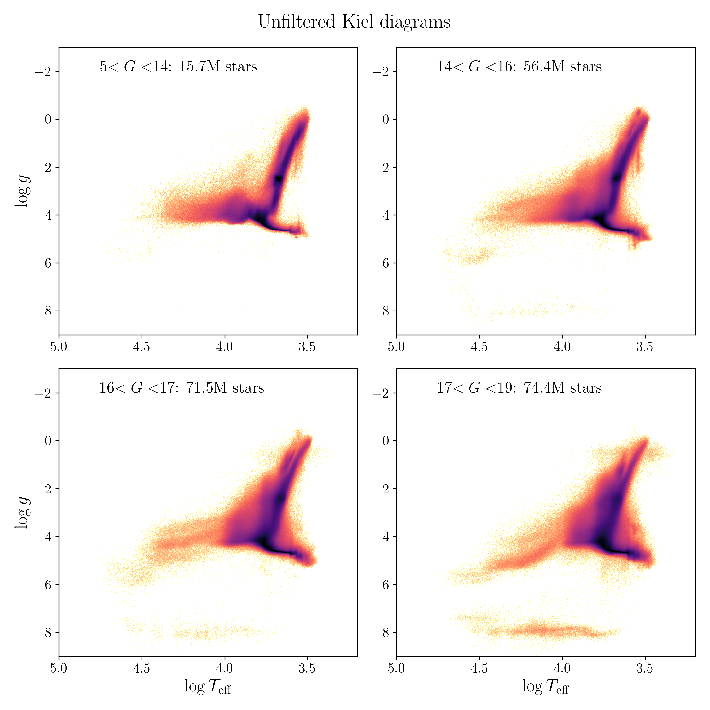
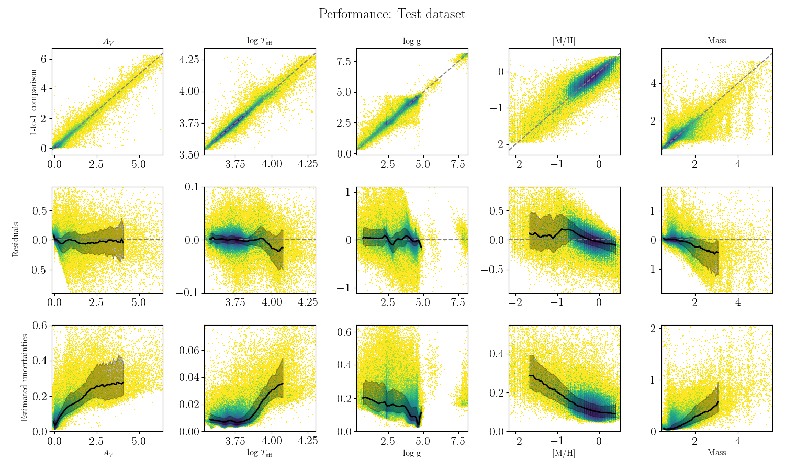
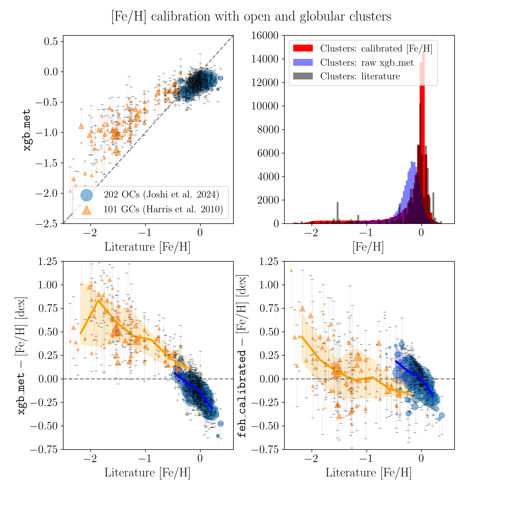

$\newcommand{\ensuremath}{}$
$\newcommand{\xspace}{}$
$\newcommand{\object}[1]{\texttt{#1}}$
$\newcommand{\farcs}{{.}''}$
$\newcommand{\farcm}{{.}'}$
$\newcommand{\arcsec}{''}$
$\newcommand{\arcmin}{'}$
$\newcommand{\ion}[2]{#1#2}$
$\newcommand{\textsc}[1]{\textrm{#1}}$
$\newcommand{\hl}[1]{\textrm{#1}}$
$\newcommand{\footnote}[1]{}$
$\newcommand{\fa}[1]{\textcolor{blue}{#1}}$
$\newcommand{\sn}[1]{\textcolor{olive}{#1}}$

# Transferring spectroscopic stellar labels\ to 217 million $_ Gaia_$ DR3 XP stars with ${\tt SHBoost}$

<mark>Appeared on: 2024-07-10</mark> -  _Submitted to A&A. 13 pages, 13 figures + references & appendices. Data available at this https URL_

A. Khalatyan, et al. -- incl., <mark>G. Guiglion</mark>

**Abstract:** With $_ Gaia_$ Data Release 3 (DR3), new and improved astrometric, photometric, and spectroscopic measurements for 1.8 billion stars are available. Alongside this wealth of new data, however, come challenges in finding increasingly efficient and accurate computational methods to use for analysis. In this paper we explore the feasibility of using machine-learning regression as a method of extracting basic stellar parameters and line-of-sight extinctions, given spectro-photometric data. To this end, we build a stable gradient-boosted random-forest regressor ( ${\tt xgboost}$ ), trained on spectroscopic data, capable of producing output parameters with reliable uncertainties from $_ Gaia_$ DR3 data (most notably the low-resolution XP spectra) without ground-based spectroscopic observations. Using Shapley additive explanations, we are also able to interpret how the predictions for each star are influenced by each data feature. For the training and testing of the network, we use high-quality parameters obtained from the ${\tt StarHorse}$ code for a sample of around eight million stars observed by major spectroscopic surveys (APOGEE, GALAH, LAMOST, RAVE, SEGUE, and GES), complemented by curated samples of hot stars, very metal-poor stars, white dwarfs, and hot sub-dwarfs. The training data cover the whole sky, all Galactic components, and almost the full magnitude range of the $_ Gaia_$ DR3 XP sample of more than 217 million objects that also have parallaxes. We achieve median uncertainties (at $G\approx16$ ) of 0.20 mag in V-band extinction, 0.01 dex in logarithmic effective temperature, 0.20 dex in surface gravity, 0.18 dex in metallicity, and $12\%$ in mass (over the full $_ Gaia_$ DR3 XP sample, with considerable variations in precision as a function of magnitude and stellar type). We succeed in predicting competitive results based on $_ Gaia_$ DR3 XP spectra compared to classical isochrone or spectral-energy distribution fitting methods we employed in earlier work, especially for the parameters $A_V$ , $T_{\rm eff}$ , and metallicity. Finally, we showcase some potential applications of this new catalogue (e.g. extinction maps, metallicity trends in the Milky Way, extended maps of young massive stars, metal-poor stars, and metal-rich stars).

**Figure 1. -** Unfiltered _ Kiel_ diagrams of the full _ Gaia_ DR3 XP sample, in four broad bins of observed $G$ magnitude. (*fig:kiel*)

**Figure 11. -** Performance of the {\tt xgboost} models for the test datasets for each of the training labels. In the top row, we show the {\tt SHBoost}(mean) parameters predicted from _ Gaia_ DR3, 2MASS, and AllWISE against the spectroscopic values (test labels). The middle row shows the residuals (predicted $-$ "true"). The bottom row shows the formal uncertainties (derived with {\tt xgboost-distributions}). Each panel contains logarithmic density plots of the full sample of 217 million stars. The lines and shaded regions in the middle and bottom rows show the running median and 1$\sigma$ quantiles, respectively.
     (*fig:validation-onetoone*)

**Figure 8. -** [Fe/H] calibration based on members of open and globular clusters. Top left panel: One-to-one comparison of the {\tt xgb\_met} values for open and globular cluster members with spectroscopic [Fe/H] measurements from the literature (using \citealt{Joshi2024} for open clusters and \citealt{Harris2010} for globular clusters). Second row: residuals between {\tt xgb\_met} and literature [Fe/H](left panel) and {\tt feh\_calibrated} and literature [Fe/H], showing the improvement achieved by our proposed calibration. Top right panel: comparison of the three metallicity distributions (literature, {\tt xgb\_met}, and {\tt feh\_calibrated}) for the cluster sample. (*fig:feh_calib*)

