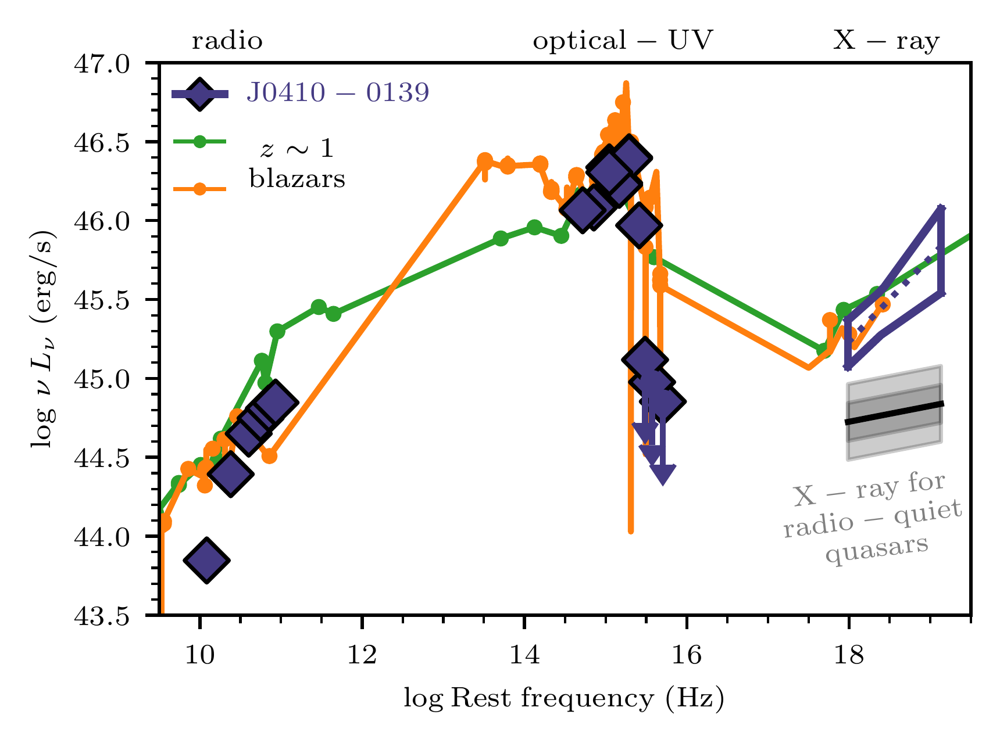
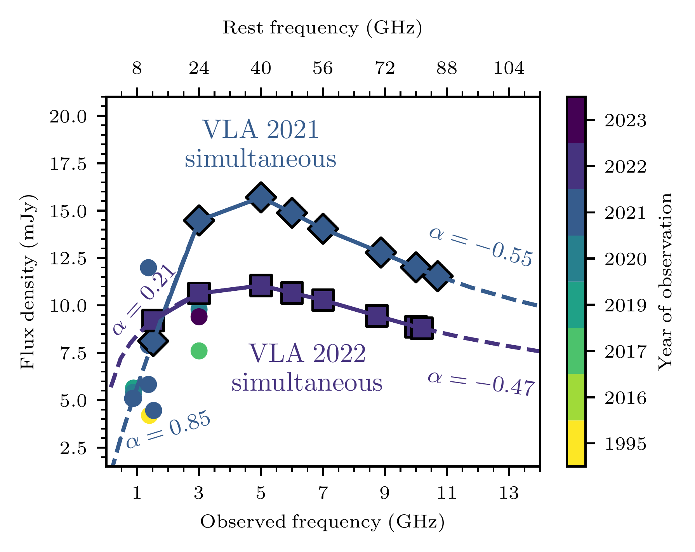
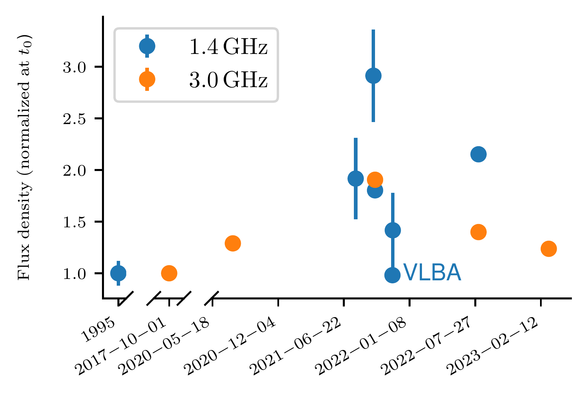
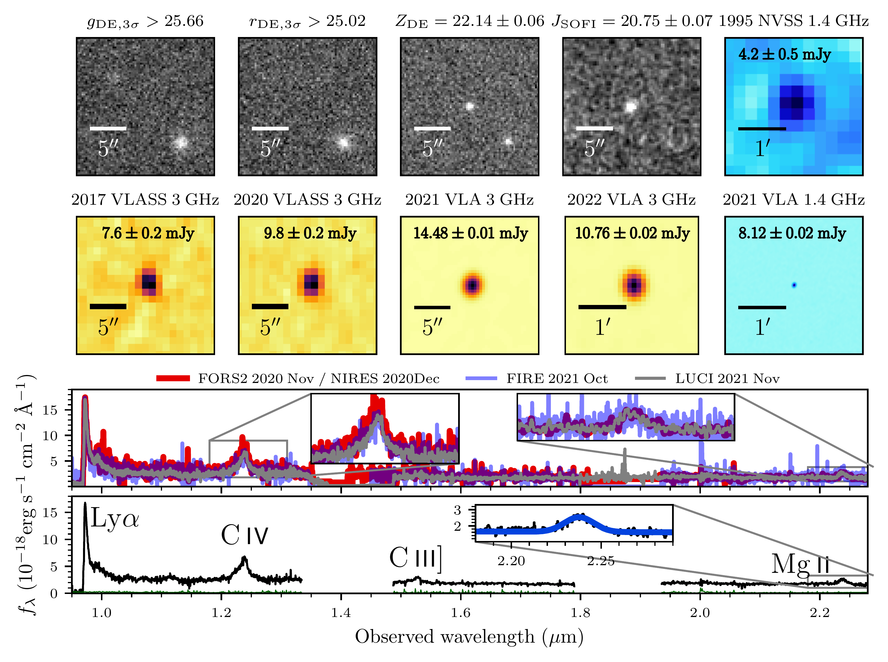
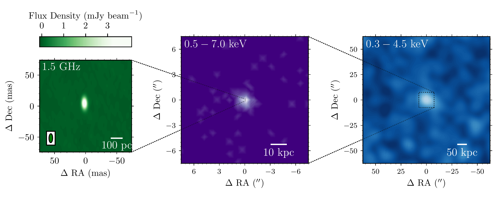

$\newcommand{\ensuremath}{}$
$\newcommand{\xspace}{}$
$\newcommand{\object}[1]{\texttt{#1}}$
$\newcommand{\farcs}{{.}''}$
$\newcommand{\farcm}{{.}'}$
$\newcommand{\arcsec}{''}$
$\newcommand{\arcmin}{'}$
$\newcommand{\ion}[2]{#1#2}$
$\newcommand{\textsc}[1]{\textrm{#1}}$
$\newcommand{\hl}[1]{\textrm{#1}}$
$\newcommand{\footnote}[1]{}$
$\newcommand{\fhi}{\overline{x}_{\mathrm{H}\ensuremath{\textsc{i}}}}$
$\newcommand{\hi}{H\ensuremath{ \textsc{i}}}$
$\newcommand{\oi}{O\ensuremath{ \textsc{i}}}$
$\newcommand{\mgii}{Mg\ensuremath{ \textsc{ii}}}$
$\newcommand{\cii}{[C\ensuremath{ \textsc{ii}}]}$
$\newcommand{\ciib}{C\ensuremath{ \textsc{ii}}}$
$\newcommand{\ciii}{C\ensuremath{ \textsc{iii}}]}$
$\newcommand{\civ}{C\ensuremath{ \textsc{iv}}}$
$\newcommand{\feii}{Fe\ensuremath{ \textsc{ii}}}$
$\newcommand{\siii}{Si\ensuremath{ \textsc{ii}}}$
$\newcommand{\farcs}{\mbox{.\!\!^{\prime\prime}}}$
$\newcommand{\kms}{{\rm km s}\ensuremath{^{-1}}}$
$\newcommand{\gt}{\ensuremath{>}}$
$\newcommand{\lt}{\ensuremath{<}}$
$\newcommand{\ap}{\ensuremath{\sim}}$
$\newcommand{\Jntt}{\ensuremath{J_{\rm SOFI}}}$
$\newcommand{\Hntt}{\ensuremath{H_{\rm SOFI}}}$
$\newcommand{\Kntt}{\ensuremath{Ks_{\rm SOFI}}}$
$\newcommand{\blazar}{J0410--0139}$
$\newcommand$
$\newcommand$
$\newcommand{\aap}{Astron. Astrophys.}$
$\newcommand$
$\newcommand$
$\newcommand$
$\newcommand$
$\newcommand$
$\newcommand$
$\newcommand{\pasa}{Public. of the Astron. Soc. of Australia}$
$\newcommand{\thefootnote}{\fnsymbol{footnote}}$
$\newcommand{\thefigure}{E\arabic{figure}}$
$\newcommand{\thetable}{E\arabic{table}}$

# A blazar in the epoch of reionization

<mark>Appeared on: 2024-07-11</mark> -  _Submitted_

<mark>E. Bañados</mark>, et al. -- incl., <mark>S. Belladitta</mark>, <mark>F. Walter</mark>, <mark>Z.-L. Xie</mark>, <mark>Y. Khusanova</mark>

**Abstract:** **Relativistic jets are thought to play a crucial role in the formation of massive galaxies and supermassive black holesblandford2019**.Here we report multi-wavelength and multi-epoch observations of the quasar VLASS J041009.05$-$013919.88 (hereafter J0410--0139) at redshift $z=7.0$,  powered by a $7\times10^8 M_\odot$ black hole.Its radio variability,  X-ray properties,  and compact radio emission on parsec scales reveal that J0410--0139 is a blazar with a relativistic jet aligned with our line of sight.  This blazar's existence implies that many more similar (unaligned) jetted sources must exist at $z \sim 7$.One scenario is that we observe an intrinsically low-power radio jet,  but we see it at high luminosity due to relativistic beaming effects.  In this case,  a large fraction ($>80\%$) of the UV bright quasars must have a similar jet to match the number density expected from the UV quasar luminosity function\cite{matsuoka2023.  These jets can enhance the growth of supermassive black holesjolley2008 and substantially affect their host galaxiesventuri2021.However, the implications would be even more severe if the quasar belongs to the top 10\% radio luminous quasarsbanados2015a, liu2021, as measured if the beaming enhancement is less than a factor of $10-15$.In this scenario, there should be hundreds to thousands of radio-quiet quasars at $z \sim 7$ with intrinsic properties similar to \blazarvolonteri2011, ghisellini2013---in strong tension with the number density of bright quasars derived from their UV luminosity function. To reconcile these results, most black hole growth at $z \sim 7$ must happen in an obscured phase, as some models predictjohnson2022, satyavolu2023.The existence of supermassive black holes in the epoch of reionization is facilitated by significant jet-enhanced or obscured super-Eddington accretion.}

**Figure 2. -** \small**Spectral energy distribution (SED) and radio lightcurve of $\blazar$**. _**(a)**_: Rest-frame SED from radio to X-rays. Only the VLA 2021 simultaneous observations are shown in this panel. The X-ray region considers $2\sigma$ uncertainties in the X-ray photon index and flux densities. The green and orange SEDs are from low redshift blazarsmassaro2015 with similar radio and X-ray luminosities (5BZQJ1232--0224 at $z=1$ and 5BZQJ1443+6332 at $z=1.4$). The gray shaded regions are the 1 and 2$\sigma$ expected X-ray luminosity for a radio-quiet quasar with the same $L_{2500}$ as $\blazar$lusso2016.
_**(b)**: Radio SED in linear scale._ The data points are color-coded by year of observation for visualization purposes; the measurements with their exact dates are listed in Table \ref{tab:obs}.  The quasar is highly variable at all radio frequencies with multi-epoch observations (see also Fig. \ref{fig:discovery}). The diamonds (squares) are VLA 2021 (2022) observations taken in the same observing block, yielding a quasi-simultaneous view of the SED  (within 15 minutes in the rest frame).
 The dashed lines are power-law extrapolations from the low and high-frequency simultaneous measurements.
_**(c)**: 1.4 and 3.0  GHz radio lightcurve._ All data points are normalized to the first flux density at hand for each frequency. For the 1.4 GHz lightcurve we considered all data measurements between 1.37 and 1.5 GHz, and they are corrected to 1.4 GHz using $\alpha=0.85$ if observed before 2022 and $\alpha=0.21$ if observed after 2022 (see panel b).
 (*fig:sed*)

**Figure 1. -** \small**Photometry and spectra of the quasar $\blazar$ at $z=7.0$.**
The grayscale postage stamps are optical and near-infrared images, while the radio images are shown with different colormaps (3 GHz in orange and 1.4 GHz in light blue).  The 1995 NVSS 1.4 and the 2022 VLA 3 GHz images were taken in the most compact VLA configuration and, therefore, have the lowest resolution (see Table \ref{tab:obs}). The 2021 VLA 1.4 GHz image is shown with the same size as the lower resolution images to demonstrate that there is only one radio source in the field. There is strong evidence for radio variability.
 The quasar was first spectroscopically identified on 7 November 2020 with a 30 min exposure with the FORS2 spectrograph at the VLT. The second-to-bottom panel compares the VLT/FORS2, Keck/NIRES, Magellan/FIRE, and LBT/LUCI spectra.
 All spectra of $\blazar$ in the rest-frame UV are consistent, with no evidence of variability in the broad line region or accretion disk.
 The bottom panel shows the combined spectrum (and the $1\sigma$ error in green). The inset shows a Gaussian fit to the $\mgii$ line, from which we derive a black hole mass of $6.9^{+0.5}_{-0.4}\times 10^8 M_\odot$ and an Eddington ratio of $L_{\rm bol}/L_{\rm Edd}=1.22\pm 0.08$.
 (*fig:discovery*)

**Figure 3. -** \small**Very Long Baseline Array (VLBA) 1.5 GHz high angular resolution image (left), _Chandra**/ACIS 0.5--7.0 keV (center), and \textit{XMM_/EPIC 0.3--4.5 keV image (right) of $\blazar$}. _Left:_ The VLBA beam size is $14.3 \times 5.9$ mas ($ 75 \times 37$ pc).
The source is marginally resolved with a size $< 3$ mas ($<16$ pc).
_Center and Right:_$\blazar$ is unresolved in the _XMM_ and _Chandra_ images and is the strongest X-ray source in the field. VLBA and X-ray images reveal a single compact dominant source, supporting the blazar interpretation.
 (*fig:vlba_xmm*)

