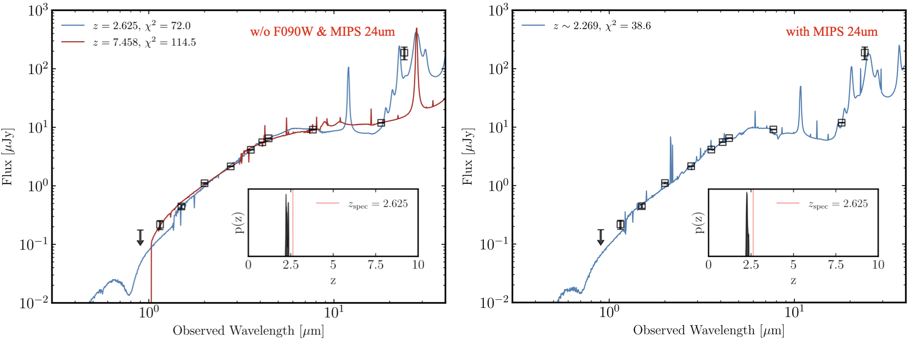
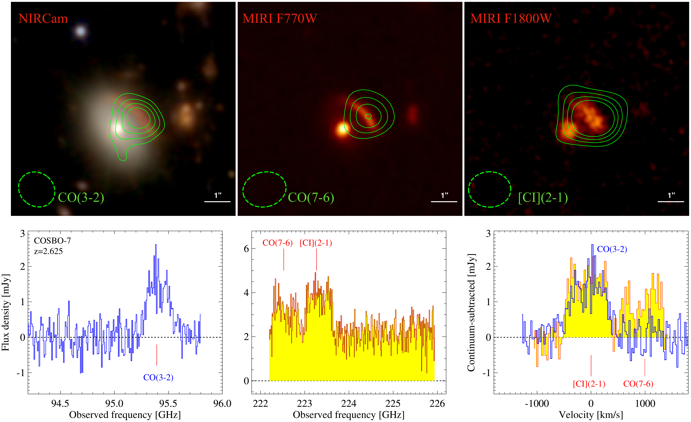
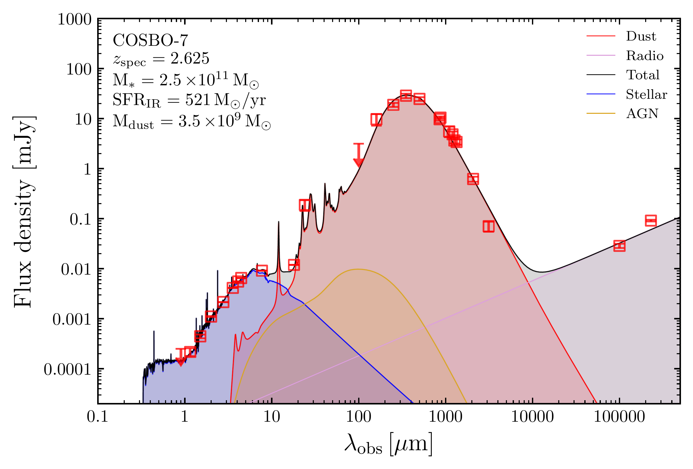

$\newcommand{\ensuremath}{}$
$\newcommand{\xspace}{}$
$\newcommand{\object}[1]{\texttt{#1}}$
$\newcommand{\farcs}{{.}''}$
$\newcommand{\farcm}{{.}'}$
$\newcommand{\arcsec}{''}$
$\newcommand{\arcmin}{'}$
$\newcommand{\ion}[2]{#1#2}$
$\newcommand{\textsc}[1]{\textrm{#1}}$
$\newcommand{\hl}[1]{\textrm{#1}}$
$\newcommand{\footnote}[1]{}$
$\newcommand$
$\newcommand$

# A photo-$z$ cautionary tale: Redshift confirmation of COSBO-7 at $z=2.625$

<mark>Appeared on: 2024-07-11</mark> -  _Submitted to A&A Letter_

S. Jin, et al. -- incl., <mark>E. Schinnerer</mark>

**Abstract:** Photometric redshifts are widely used in studies of dusty star-forming galaxies (DSFGs), but catastrophic photo- $z$ failure can undermine all redshift-dependent results. Here we report the spectroscopic redshift confirmation of COSBO-7, a strongly lensed DSFG in the COSMOS-PRIMER field.Recently, using 10 bands of JWST NIRCam and MIRI imaging data on COSBO-7, Ling et al. (2024) reported a photometric redshift solution of $z\gtrsim7.0$ , favored by four independent spectral energy distribution (SED) fitting codes, and therefore providing an appealing candidate of the most distant massive DSFG. This photo- $z$ solution was also supported by a single line detection in ALMA Band 3 consistent with CO(7-6) at $z=7.46$ .However, our new ALMA observations robustly detect two lines in Band 6 identified as CO(7-6) and [ CI ] (2-1) at $z_{\rm spec}=2.625$ , and thus the Band 3 line as CO(3-2). The three robust line detections decidedly place COSBO-7  at $z=2.625$ , refuting the photo- $z$ solution.We derive physical parameters by fitting NIR-to-mm photometry and lens modeling, revealing that COSBO-7 is a main-sequence galaxy.We examine possible reasons for this photo- $z$ failure and attribute it to (1) the likely underestimation of photometric uncertainty at 0.9 $\mu$ m, and (2) the lack of photometry at wavelengths beyond 20 $\mu$ m.Notably, we recover a bona-fide $z_{\rm phot}\sim 2.3$ by including the existing MIPS $24 \mu$ m photometry, demonstrating the critical importance of mid-infrared data for photo- $z$ robustness.This work highlights a common challenge in modeling SEDs of DSFGs, cautioning against the reliability of photometric redshifts, as well as pseudo-spectroscopic redshifts based on single line detection.

**Figure 5. -** NIR-to-MIR SED of COSBO-7 fitted with \texttt{Bagpipes}. _ Left:_ The fitting without F090W upper limit and $24\mu$m photometry, with the PDF($z$) shown in sub-panel. We also show the SEDs and $\chi^2$ for both $z=2.625$ and $7.458$ cases. _ Right:_ The best-fit with MIPS $24\mu$m photometry. We present the PDF($z$) with $z_{\rm spec}$ in sub-panel.
 (*fig:NIR-sed*)

**Figure 4. -** JWST images and ALMA spectra of COSBO-7. _ Top:_ We show the NIRCam color image (Blue: F090W+F115W+F150W; Green: F200W+F277W; Red: F356W+F410M+F444W), and MIRI images overlaid with contours of CO and [CI] emission. Contours are shown in 4, 6, 8, 10$\sigma$ levels. The beams are shown as dashed ellipses. _ Bottom:_ In the left and middle panels, we show the CO(3-2) and CO(7-6)+[CI](2-1) spectra in observed frequencies. The right panel shows the continuum-subtracted spectra as a function of velocity. (*fig-spec*)

**Figure 1. -** Panchromatic SED of COSBO-7 fitted with \texttt{STARDUST} ([Kokorev, Magdis and Davidzon 2021]()) . The F090W upper limit is shown in $3\sigma$ level. Radio photometry are not included in the fitting, we extrapolated a radio component using the IR luminosity and the IR-radio relation from [Delvecchio, Daddi and Sargent (2021)](). Parameters are not corrected for lensing magnification.
 (*fig:sed*)

