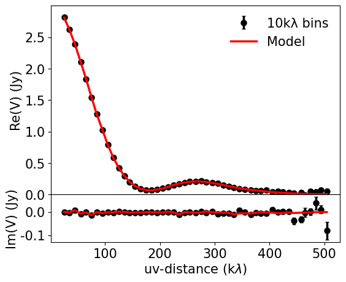
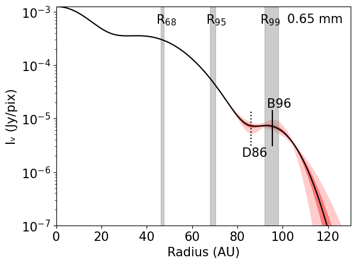

$\newcommand{\ensuremath}{}$
$\newcommand{\xspace}{}$
$\newcommand{\object}[1]{\texttt{#1}}$
$\newcommand{\farcs}{{.}''}$
$\newcommand{\farcm}{{.}'}$
$\newcommand{\arcsec}{''}$
$\newcommand{\arcmin}{'}$
$\newcommand{\ion}[2]{#1#2}$
$\newcommand{\textsc}[1]{\textrm{#1}}$
$\newcommand{\hl}[1]{\textrm{#1}}$
$\newcommand{\footnote}[1]{}$

# From traffic jams to roadblocks: The outer regions of TW Hya with ALMA Band 8

<mark>Appeared on: 2024-07-11</mark> -  _Accepted for publication in A&A. The associated data can be found in: this https URL_

S. Das, N. Kurtovic, <mark>M. Flock</mark>

**Abstract:** ${Current ALMA surveys often underestimate protoplanetary disk sizes as many disks have extended low surface-brightness regions that fall below ALMA's detection limits. To effectively capture faint millimeter continuum emission in these outer regions, increased sensitivity is required.}$ In order to gain insights on the ${connection between disk structure and}$ planet formation, we aim to uncover ${continuum}$ emission in the outer regions of the disk around TW Hya. ${Additionally, we aim to investigate the evolution of this disk by studying its dust properties.}$ We present Atacama Large Millimeter Array (ALMA) observations of TW Hya at 0.65 mm with $\sim$ 0.5 arcsecond angular resolution, together with high angular resolution archival ${observations}$ at 0.87 mm, 1.3 mm, 2.1 mm and 3.1 mm. We constrain the outer disk emission ${with both image-plane retrieval, and visibility-plane modeling with non-parametric and parametric fitting tools.}$ Our results confirm emission in the outer disk regions of TW Hya (60 au $\leq$ R $\leq$ 110 au) at 0.65 mm, 0.87 mm and 1.3 mm. ${With image-plane retrieval}$ , we resolve the new continuum gap and ring, namely D79 and B86, at 0.87 mm and 1.3 mm. ${With visibility-plane modeling}$ , we also detect this substructure at 0.65 mm, and it is consistent in location with the outer ring proposed by \citealp{ilee}{at the 1$\sigma$ level} . ${Furthermore, it}$ has a high spectral index of 3.7, which may indicate dust grain sizes $\ll$ 1 mm. It may be a dust trap or a traffic jam, that has a flux density of $\sim$ 60 mJy and a mass (1.59 $M_\oplus$ ) that accounts for up to 2 \% of the dust disk at 0.65 mm. We confirm the existence of a faint ring in the outer regions of TW Hya at multiple millimeter wavelengths. ${With visibility-plane modeling, we are able to set constrains that are 3 times better than the resolution of our Band 8 observations.}$

**Figure 5. -** Vibrational stability equation of state
               $S_{\mathrm{vib}}(\lg e, \lg \rho)$.
               $>0$ means vibrational stability.
              Vibrational stability equation of state
               $S_{\mathrm{vib}}(\lg e, \lg \rho)$.
               $>0$ means vibrational stability.
              Nonlinear Model ResultsNonlinear Model ResultsSpectral types and photometry for stars in the
  region.Spectral types and photometry for stars in the
  region.List of nearby SNe used in this work.Summary for ISOCAM sources with mid-IR excess
(YSO candidates).Summary for ISOCAM sources with mid-IR excess
(YSO candidates). Sample stars with absolute magnitudecontinued. Sample stars with absolute magnitudecontinued.Shown in greyscale is a...Plotted above...Complexes characterisation.Line data and abundances ...Continued. (*FigVibStab*)

**Figure 7. -** {Results of parametric modeling}: _(Left)_ The re-centered and deprojected visibilities of the 0.65 mm observation binned to 10 k$\lambda$, where the top row shows the real part and the bottom row shows the imaginary part. The visibilities of the best fit model is shown in red. _(Right)_ Intensity profile of the TW Hya protoplanetary disk at 0.65 mm made with 5000 random posteriors of our MCMC sample. The median intensity profile is shown with a black curve, whereas the 1$\sigma$ and 3$\sigma$ uncertainties are shown with dark and light red shaded regions respectively. The local minima and maxima representing a dark gap and a bright ring at 86 au and 96 au are shown with dotted and solid lines respectively. The disk size estimates are shown as $R_{68}$, $R_{95}$ and $R_{99}$ in the form of gray columns. (*fig:mcmc_profile*)

**Figure 12. -** Vibrational stability equation of state
               $S_{\mathrm{vib}}(\lg e, \lg \rho)$.
               $>0$ means vibrational stability.
              Nonlinear Model ResultsNonlinear Model ResultsSpectral types and photometry for stars in the
  region.Spectral types and photometry for stars in the
  region.List of nearby SNe used in this work.Summary for ISOCAM sources with mid-IR excess
(YSO candidates).Summary for ISOCAM sources with mid-IR excess
(YSO candidates). Sample stars with absolute magnitudecontinued. Sample stars with absolute magnitudecontinued.Shown in greyscale is a...Plotted above...Complexes characterisation.Line data and abundances ...Continued. (*FigVibStab*)

