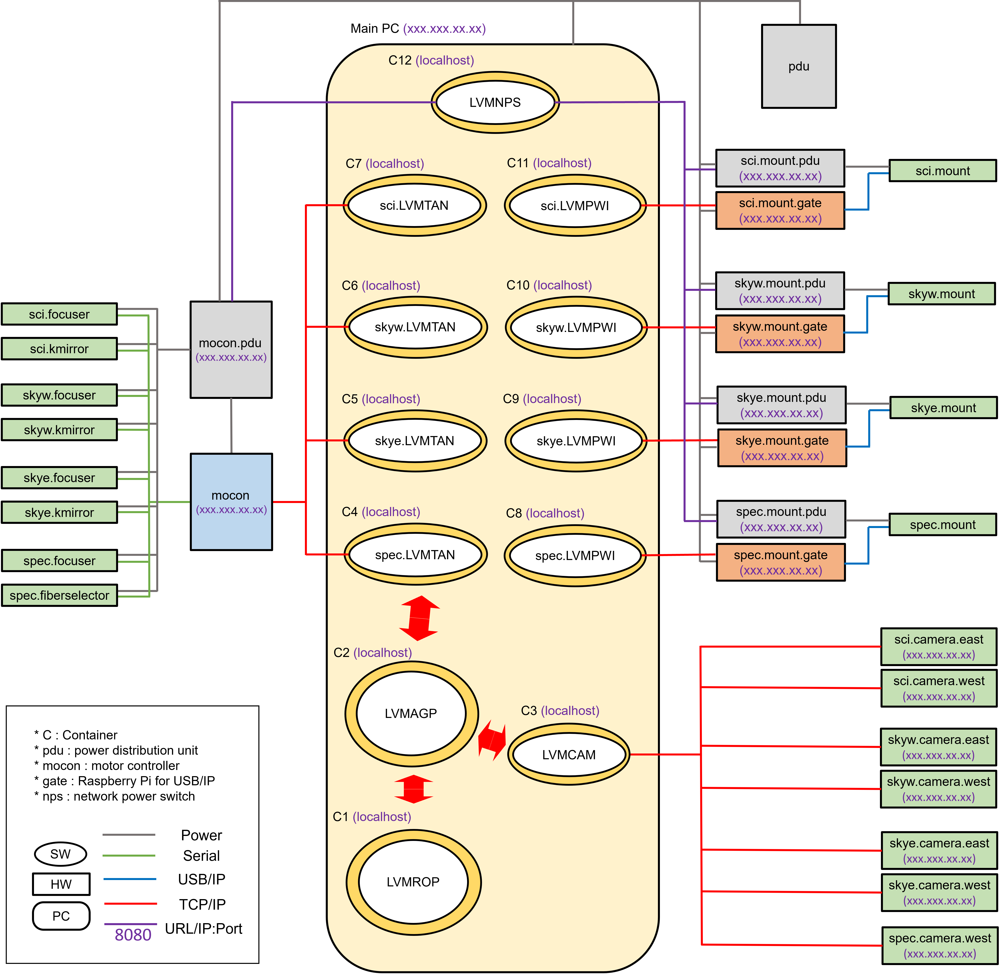
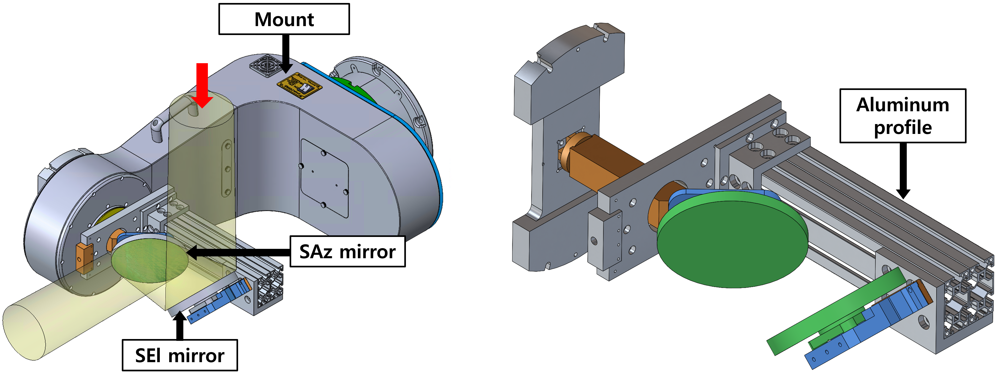
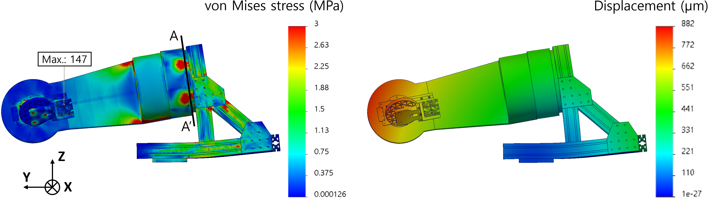

$\newcommand{\ensuremath}{}$
$\newcommand{\xspace}{}$
$\newcommand{\object}[1]{\texttt{#1}}$
$\newcommand{\farcs}{{.}''}$
$\newcommand{\farcm}{{.}'}$
$\newcommand{\arcsec}{''}$
$\newcommand{\arcmin}{'}$
$\newcommand{\ion}[2]{#1#2}$
$\newcommand{\textsc}[1]{\textrm{#1}}$
$\newcommand{\hl}[1]{\textrm{#1}}$
$\newcommand{\footnote}[1]{}$
$\newcommand{\cftdotsep}{\cftnodots}$

# Telescope control software and proto-model siderostat for the SDSS-V Local Volume Mapper

<mark>Appeared on: 2024-07-12</mark> -  _29 pages, 15 figures, in press at Journal of Astronomical Telescopes, Instruments, and Systems_

H. Ahn, et al. -- incl., <mark>F. Briegel</mark>, <mark>M. Kuhlberg</mark>

**Abstract:** The fifth Sloan Digital Sky Survey (SDSS-V) Local Volume Mapper (LVM) is a wide-field integral field unit (IFU) survey that uses an array of four 160 mm fixed telescopes with siderostats to minimize the number of moving parts. Individual telescope observes the science field or calibration field independently and is synchronized with the science exposure. We developed the LVM Acquisition and Guiding Package (LVMAGP) optimized telescope control software program for LVM observations, which can simultaneously control four focusers, three K-mirrors, one fiber selector, four mounts (siderostats), and seven guide cameras. This software is built on a hierarchical architecture and the SDSS framework and provides three key sequences: autofocus, field acquisition, and autoguide. We designed and fabricated a proto-model siderostat to test the telescope pointing model and LVMAGP software. The mirrors of the proto-model were designed as an isogrid open-back type, which reduced the weight by 46 \% and enabled reaching thermal equilibrium quickly. Additionally, deflection due to bolting torque, self-gravity, and thermal deformation was simulated, and the maximum scatter of the pointing model induced by the tilt of optomechanics was predicted to be $4'.4$ , which can be compensated for by the field acquisition sequence. We performed a real sky test of LVMAGP with the proto-model siderostat and obtained field acquisition and autoguide accuracies of $0".38$ and $1".5$ , respectively. It met all requirements except for the autoguide specification, which will be resolved by more precise alignment among the hardware components at Las Campanas Observatory.

**Figure 2. -** System architecture, including all individual instruments and ICS instances under the telescope subsystem
    System architecture, including all individual instruments and ICS instances under the telescope subsystem. Each system element is denoted in the format "telescope unit.element." Connections between components are illustrated by lines, with the type of connection indicated by the color of line. The chrome yellow oval indicates the container where the software runs. LVMAGP communicates with controllers in containers C4 to C11, although the arrow only points to the spec.LVMTAN actor to simplify the figure.
     (*fig:architecture_allinst*)

**Figure 7. -** 3D mechanical design of the proto-model siderostat in 3D view
    3D mechanical design of the proto-model siderostat in 3D view (left) with the mount and (right) without the mount. The SAz and SEl mirrors are colored green and indicated by black arrows. The mirror holders (blue), adapters (orange), and base module (gray) are all assembled. The proto-model siderostat is in the home position, where it points to the zenith. In the left panel, the light path is expressed with light entering direction and indicated with a red arrow. In the right panel, the aluminum profile part is indicated with a black arrow. (*fig:siderostat_design*)

**Figure 9. -** Stress and displacement of the proto-model siderostat at the zenith position at the temperature of $-5^\circ$C(left) Loaded von Mises stress and (right) displacement of the proto-model siderostat at the zenith position at the temperature of $-5^\circ$C. The figures are 300 times more exaggerated than the actual variations. The maximum stress point is indicated in the left panel; however, this point is a stress singularity and should be excluded from the evaluation of FoS. Actual maximum stress is applied by bolting torque on section A-A$'$, where the wedge and mount are connected by bolting. (*fig:FEA_optomech*)

