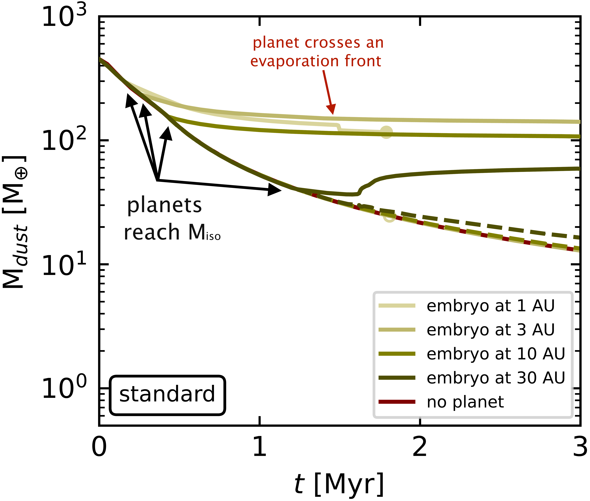
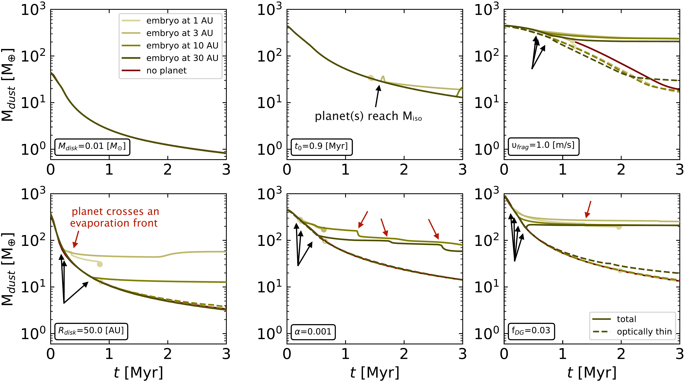
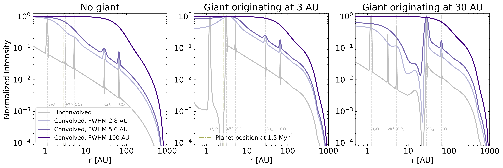

$\newcommand{\ensuremath}{}$
$\newcommand{\xspace}{}$
$\newcommand{\object}[1]{\texttt{#1}}$
$\newcommand{\farcs}{{.}''}$
$\newcommand{\farcm}{{.}'}$
$\newcommand{\arcsec}{''}$
$\newcommand{\arcmin}{'}$
$\newcommand{\ion}[2]{#1#2}$
$\newcommand{\textsc}[1]{\textrm{#1}}$
$\newcommand{\hl}[1]{\textrm{#1}}$
$\newcommand{\footnote}[1]{}$
$\newcommand{\be}{\begin{equation}}$
$\newcommand{\ee}{\end{equation}}$
$\newcommand{\notes}[1]{\textcolor{violet}{\textit{#1}}}$
$\title{There is no disk mass budget problem of planet formation}$
$\author{Sofia Savvidou \inst{1}$
$\and Bertram Bitsch \inst{2,1}}$
$\offprints{S. Savvidou,\ \email{savvidou@mpia.de}}$
$\institute{$
$Max-Planck-Institut für Astronomie, Königstuhl 17, 69117 Heidelberg, Germany$
$\and$
$Department of Physics, University College Cork, Cork, Ireland}$
$\date{Received date / Accepted date }$
$\begin{document}$
$\abstract{The inferred dust masses from Class II protoplanetary disk observations are lower than or equal to the masses of the observed exoplanet systems. This poses the question of how planets form if their natal environments do not contain enough mass. This hypothesis has entered the literature as the "mass budget problem" of planet formation. We utilize numerical simulations of planet formation via pebble and gas accretion, including migration, in a viscously evolving protoplanetary disk, while tracing the time evolution of the dust mass. As expected, we find that the presence of a giant planet in the disk can influence the evolution of the disk itself and prevent rapid dust mass loss by trapping the dust outside its orbit. Early formation is crucial for giant planet formation, as we found in our previous work; therefore, our findings strengthen the hypothesis that planet formation has already occurred or is ongoing in Class II disks. Most importantly, we find that the optically thin dust mass significantly underestimates the total dust mass in the presence of a dust-trapping deep gap. We also show that the beam convolution would smear out the feature from a deep gap, especially if the planet forms in the inner disk. Such hidden dust mass, along with early planet formation, could be the answer to the hypothetical mass budget problem.}$
$\keywords{protoplanetary disks -- planets and satellites: formation, gaseous planets -- circumstellar matter -- methods: numerical}$
$\maketitle$
$\n\end{document}\end{equation}}$
$\newcommand{\ee}{\end{equation}}$
$\newcommand{\notes}[1]{\textcolor{violet}{\textit{#1}}}$

# There is no disk mass budget problem of planet formation

<mark>Appeared on: 2024-07-12</mark> -  _8 pages, 4 figures, submitted to A&A_

<mark>S. Savvidou</mark>, B. Bitsch

**Abstract:** The inferred dust masses from Class II protoplanetary disk observations are lower than or equal to the masses of the observed exoplanet systems. This poses the question of how planets form if their natal environments do not contain enough mass. This hypothesis has entered the literature as the "mass budget problem" of planet formation. We utilize numerical simulations of planet formation via pebble and gas accretion, including migration, in a viscously evolving protoplanetary disk, while tracing the time evolution of the dust mass. As expected, we find that the presence of a giant planet in the disk can influence the evolution of the disk itself and prevent rapid dust mass loss by trapping the dust outside its orbit. Early formation is crucial for giant planet formation, as we found in our previous work; therefore, our findings strengthen the hypothesis that planet formation has already occurred or is ongoing in Class II disks. Most importantly, we find that the optically thin dust mass significantly underestimates the total dust mass in the presence of a dust-trapping deep gap. We also show that the beam convolution would smear out the feature from a deep gap, especially if the planet forms in the inner disk. Such hidden dust mass, along with early planet formation, could be the answer to the hypothetical mass budget problem.

**Figure 1. -** Dust mass as a function of time for the same planets as in Fig. 1 in [ and Savvidou (2023)](), using the standard set of parameters (Table \ref{Tab:parameters}). The dashed lines show the time evolution of the optically thin dust mass and the red line shows the time evolution of the dust mass for a simulation without a planet. The dot marks the last dust mass if a planet reaches the inner edge of the disk. (*Fig:t-Mdust_main*)

**Figure 3. -** Same as Fig. \ref{Fig:t-Mdust_main}, with one parameter changed (marked in each panel) compared to the standard model (bold in Table \ref{Tab:parameters}). These correspond to the same planets as in Fig. 2 in [ and Savvidou (2023)](). (*Fig:t-Mdust*)

**Figure 4. -** Normalized intensity as a function of orbital distance at 1.5 Myr, comparing the uncolvolved intensity with the ones convolved with three different beams of 0.02" and 0.04" at 140 pc (2.8 and 5.6 AU), and 0.34" at 232 pc (100 AU). The gray dashed lines show the evaporation fronts that mainly cause the spikes in the intensity. The examples with a giant correspond to the standard set of parameters (Fig. \ref{Fig:t-Mdust_main}), while the example without a giant corresponds to a low-mass disk (top, left plot in Fig. \ref{Fig:t-Mdust}). (*Fig:r-I*)

