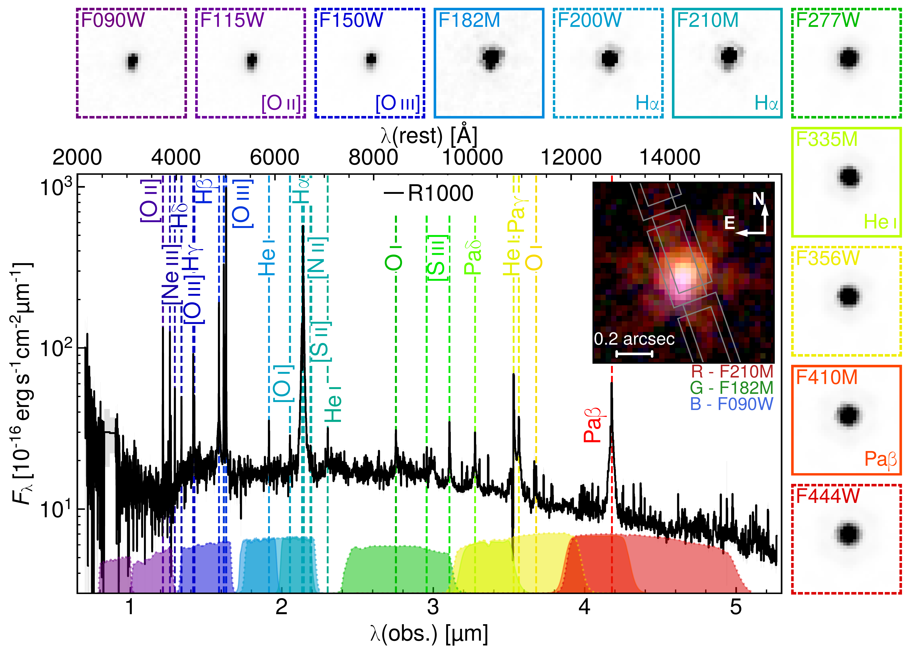
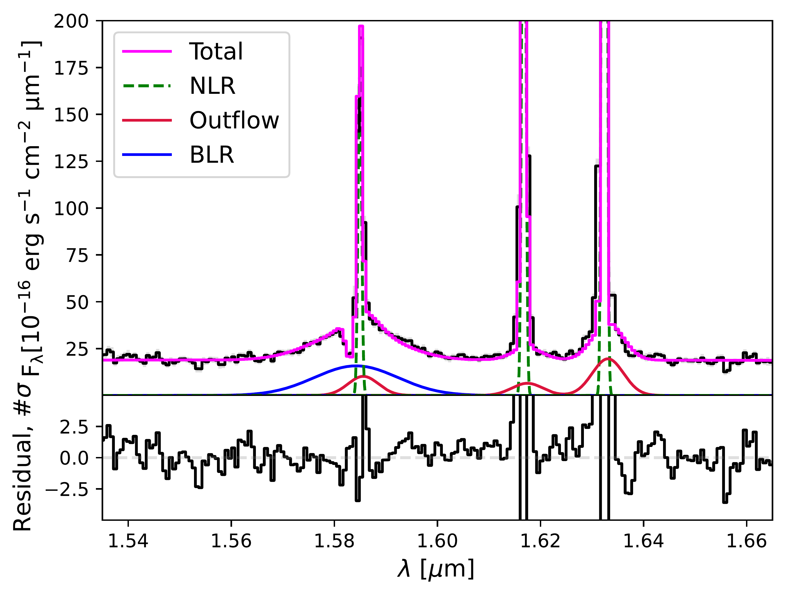
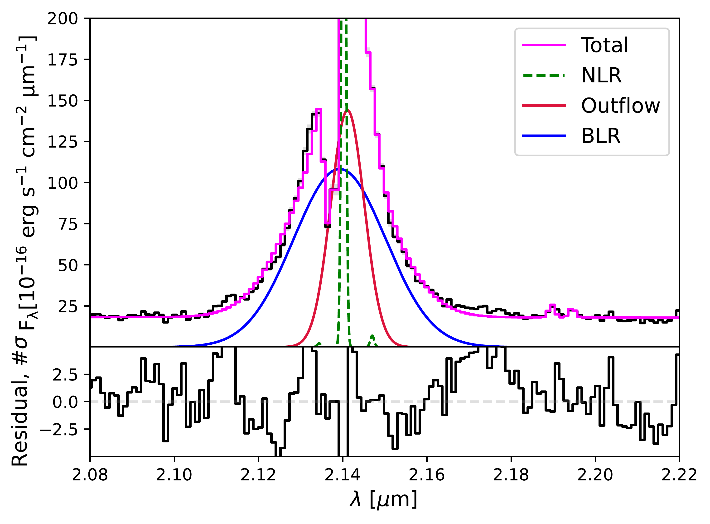
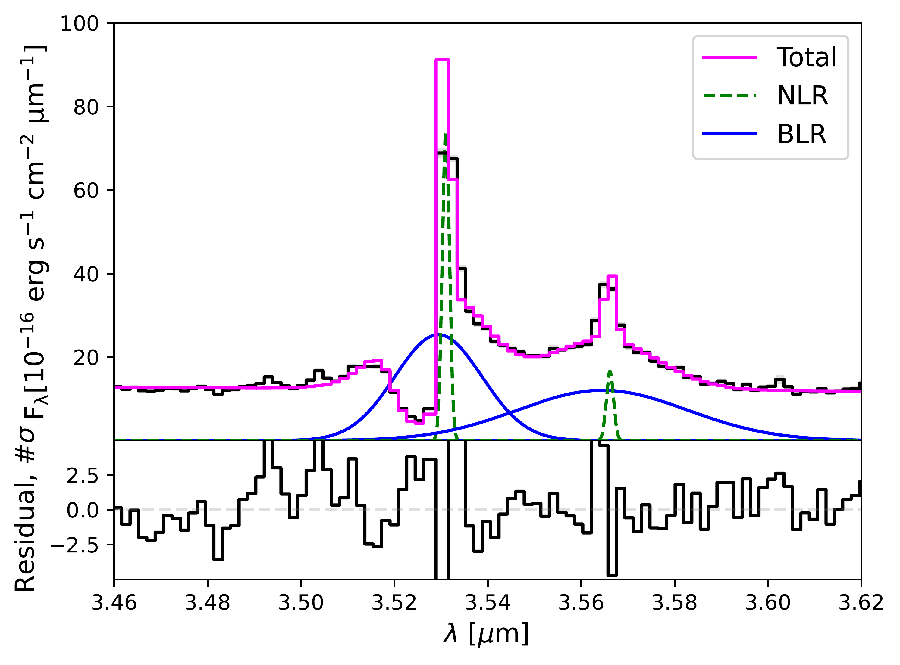
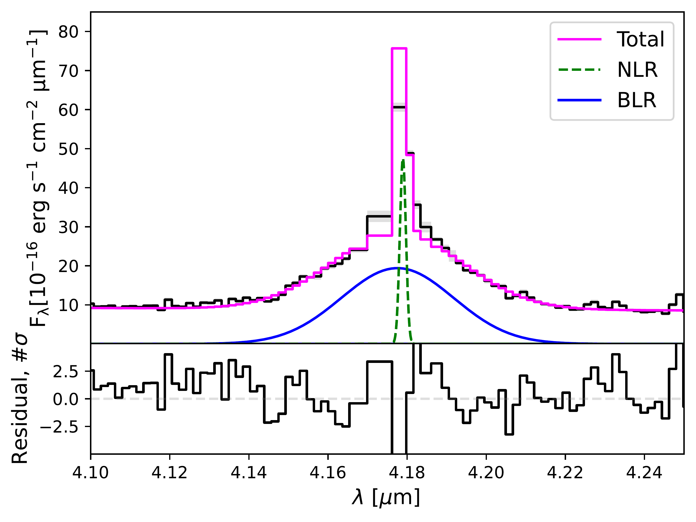
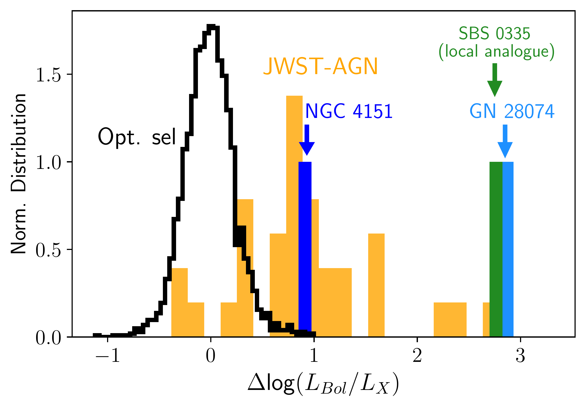

$\newcommand{\ensuremath}{}$
$\newcommand{\xspace}{}$
$\newcommand{\object}[1]{\texttt{#1}}$
$\newcommand{\farcs}{{.}''}$
$\newcommand{\farcm}{{.}'}$
$\newcommand{\arcsec}{''}$
$\newcommand{\arcmin}{'}$
$\newcommand{\ion}[2]{#1#2}$
$\newcommand{\textsc}[1]{\textrm{#1}}$
$\newcommand{\hl}[1]{\textrm{#1}}$
$\newcommand{\footnote}[1]{}$
$\newcommand{\HII}{H {\sc ii}\rm }$
$\newcommand{\NII}{{[N {\sc ii}]}}$
$\newcommand{\NIIs}{{[N {\sc ii}] }}$
$\newcommand{\NVs}{{[N {\sc V}] }}$
$\newcommand{\NVl}{{N {\sc V} \lambda}}$
$\newcommand{\NIIl}{{[N {\sc ii}] \lambda}}$
$\newcommand{\NeIII}{{[Ne {\sc iii}]}}$
$\newcommand{\NeIIIs}{{[Ne {\sc iii}] }}$
$\newcommand{\NeIIIl}{{[Ne {\sc iii}] \lambda}}$
$\newcommand{\NeIV}{{[Ne {\sc iv}]}}$
$\newcommand{\NeIVs}{{[Ne {\sc iv}] }}$
$\newcommand{\NeIVl}{{[Ne {\sc iv}] \lambda}}$
$\newcommand{\NeV}{{[Ne {\sc v}]}}$
$\newcommand{\NeVs}{{[Ne {\sc v}] }}$
$\newcommand{\NeVl}{{[Ne {\sc v}] \lambda}}$
$\newcommand{\SII}{{[S {\sc ii}]}}$
$\newcommand{\SIIs}{{[S {\sc ii}] }}$
$\newcommand{\SIIl}{{[S {\sc ii}] \lambda}}$
$\newcommand{\SIIll}{{[S {\sc ii}] \lambda\lambda}}$
$\newcommand{\SIII}{{[S {\sc iii}]}}$
$\newcommand{\SIIIs}{{[S {\sc iii}] }}$
$\newcommand{\SIIIl}{{[S {\sc iii}] \lambda}}$
$\newcommand{\OIII}{{[O {\sc iii}]}}$
$\newcommand{\OIV}{{[O {\sc iv}]}}$
$\newcommand{\OIIIs}{{[O {\sc iii}] }}$
$\newcommand{\OIIIl}{{[O {\sc iii}] \lambda}}$
$\newcommand{\OII}{{[O {\sc ii}]}}$
$\newcommand{\OIIs}{{[O {\sc ii}] }}$
$\newcommand{\OIIl}{{[O {\sc ii}] \lambda}}$
$\newcommand{\OIIll}{{[O {\sc ii}] \lambda\lambda}}$
$\newcommand{\OI}{{[O {\sc i}]}}$
$\newcommand{\OIs}{{[O {\sc i}] }}$
$\newcommand{\OIl}{{[O {\sc i}] \lambda}}$
$\newcommand{\CII}{{[C {\sc ii}]}}$
$\newcommand{\CIIs}{{C {\sc ii}] }}$
$\newcommand{\CIII}{{C {\sc iii}]}}$
$\newcommand{\CIIIs}{{C {\sc iii}] }}$
$\newcommand{\CIIIll}{\CIIIs\lambda\lambda}$
$\newcommand{\CIV}{{C {\sc iv}}}$
$\newcommand{\CIVs}{{C {\sc iv} }}$
$\newcommand{\CIVll}{{C {\sc iv} \lambda\lambda}\xspace}$
$\newcommand{\CIVl}{{[C {\sc iv} \lambda}\xspace}$
$\newcommand{\HeII}{{He {\sc ii} }}$
$\newcommand{\HeI}{{He {\sc i} }}$
$\newcommand{\HeIIl}{{He {\sc ii} \lambda}}$
$\newcommand{\FeII}{{[Fe {\sc ii}] }}$
$\newcommand{\Ha}{H\alpha}$
$\newcommand{\Has}{H\alpha }$
$\newcommand{\Hb}{H\beta}$
$\newcommand{\Hg}{H\gamma}$
$\newcommand{\Hbs}{H\beta }$
$\newcommand{\purpletxt}[1]{\textcolor{purple}{#1}}$
$\newcommand{\RMcomm}[1]{{\color{teal}[RM: #1]}}$
$\newcommand{\arraystretch}{1.5}$
$\newcommand{\arraystretch}{1.3}$
$\newcommand{\arraystretch}{1.3}$
$\newcommand{\arraystretch}{1.3}$
$\newcommand{\arraystretch}{1.3}$
$\newcommand{\thebibliography}{\DeclareRobustCommand{\VAN}[3]{##3}\VANthebibliography}$

# JADES - The Rosetta Stone of JWST-discovered AGN: deciphering the intriguing nature of early AGN

<mark>Appeared on: 2024-07-12</mark> -  _21 pages 8 figures in main text. Submitted to MNRAS_

I. Juodžbalis, et al. -- incl., <mark>A. d. Graaff</mark>

**Abstract:** JWST has discovered a large population of Active Galactic Nuclei (AGN) at high redshift. Many of these newly discovered AGN have broad permitted lines (typically H $\alpha$ ), but are extremely weak in the X-rays.Here we present the NIRSpec spectrum of the most extreme of these objects, GN-28074, an AGN at $z=2.26$ with prominent Balmer, Paschen and $\HeI$ broad lines, and with the highest limit on the bolometric to X-ray luminosity ratio among all spectroscopically confirmed AGN in GOODS. This source is also characterized by a mid-IR excess, most likely associated with the AGN torus' hot dust. The high bolometric luminosity and moderate redshift of this AGN allow us to explore its properties more in depth relative to other JWST-discovered AGN. The NIRSpec spectrum reveals prominent, slightly blueshifted absorption of H $\alpha$ , H $\beta$ and $\HeI$ $\lambda$ 10830. The Balmer absorption lines require gas with densities of $n_{\rm H}> 10^8 {\rm cm}^{-3}$ , inconsistent with an ISM origin, but fully consistent with clouds in the Broad Line Region (BLR). This finding suggests that at least part of the X-ray weakness is due to high (Compton thick) X-ray absorption by (dust-free) clouds in the BLR, or in its outer, slowly outflowing regions.GN-28074 is also extremely radio-weak. The radio weakness can also be explained in terms of absorption, as the inferred density of the clouds responsible for H $\alpha$ absorption makes them optically thick to radio emission through free-free absorption. Alternatively, in this and other JWST-discovered AGN, the nuclear magnetic field may have not developed properly yet, resulting both in intrinsically weak radio emission and also lack of hot corona, hence intrinsic X-ray weakness. Finally, we show that recently proposed scenarios, invoking hyper-dense and ultra-metal-poor outflows or Raman scattering to explain the broad H $\alpha$ , are completely ruled out.

**Figure 7. -** R1000 spectrum of GN-28074 with emission lines marked. The fluxes on the y axis are presented in _ logarithmic_ scale to better showcase weaker lines and the shape of the continuum. All bright permitted lines appear to have broad components while the continuum showcases the characteristic `v' shape found in some objects of the LRD population. The false-colour NIRCam image (inset) highlights the point-source nature of the object, and the position of the MSA slitlets (grey rectangles). We note a pink region to the south-east, denoting a deficiency in F182M flux (see text for a discussion). The rest of the NIRCam single-band cutouts highlight the extended emission (only discernible at SW wavelengths); the angular size of these cutouts is the same as the RGB image. (*fig:full_spec*)

**Figure 8. -** R1000 spectrum expanded around some of the permitted lines of GN-28074 and showing the associated spectral fits. The broad line region (BLR) and the (extended) outflow components are plotted as solid blue and red lines respectively. The narrow components are shown with dashed green lines. The combined fit, including the absorption absorption components, is shown in magenta. **Top left: **$\Hb$s and $\OIII$$\lambda\lambda$5007,4959 complex, showcasing the deep absorption in $\Hb$s and broadening of $\OIII$$\lambda\lambda$5007,4959 lines due to the presence an outflow. **Top right: **$\Ha$s, $\NII$$\lambda\lambda$6548,6583 and $\SII$$\lambda\lambda$6716,6731 . Notable is the relative weakness of the $\NII$$\lambda\lambda$6549,6585 and $\SII$$\lambda\lambda$6716,6731 doublets. **Bottom left: ** Combined $\HeI$$\lambda$10830 and Pa$\gamma$ line fit. The ionized outflow component is not required here by the data. **Bottom right: ** Fit to the Pa$\beta$ line. Due to wavelength calibration issues, this line is slightly offset to the rest and thus requires separate kinematics to properly fit. The ionized outflow is absent just as in the Pa$\gamma$ + $\HeI$$\lambda$10830 fit. (*fig:spectrum_abs*)

**Figure 2. -** Distribution of the bolometric to X-ray luminosity ratio, relative to the relation inferred for low-redshift optically-selected AGN (whose distribution is shown with a black, hollow histogram). The distribution of JWST-discovered AGN in GOODS (the vast majority of which are actually lower limits on $L_{Bol}/L_X$) is shown with the solid, amber histogram. The lower limit for GN-280974 is indicated with the blue bar. We also show the lower limit observed in SBS 0335-052E, which is a nearby AGN with similar properties as the new population of the JWST-discovered AGN. We also show the value for the `prototypical' Seyfert 1 NGC-4151 which shows H$\alpha$, H$\beta$ and HeI absorption, just like GN-28074, and strong (and variable) X-ray absorption. (*fig:hist_Xrays*)

