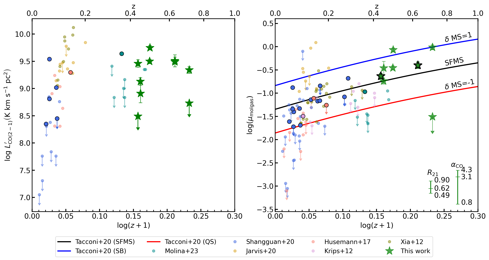
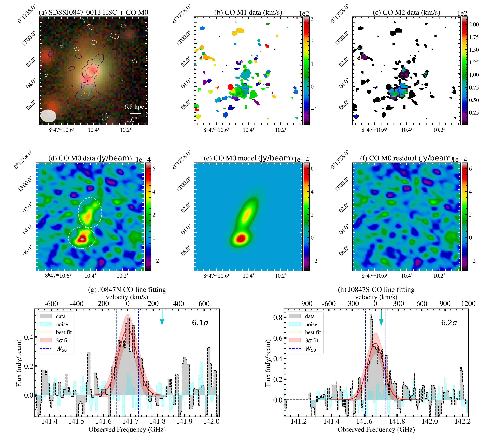
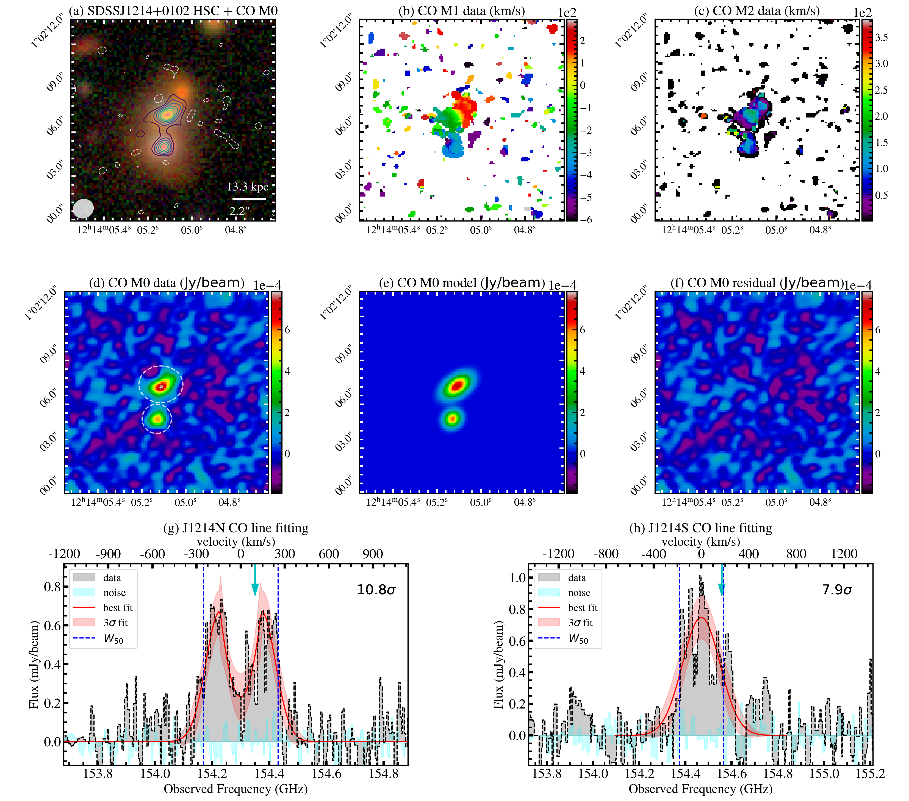

$\newcommand{\ensuremath}{}$
$\newcommand{\xspace}{}$
$\newcommand{\object}[1]{\texttt{#1}}$
$\newcommand{\farcs}{{.}''}$
$\newcommand{\farcm}{{.}'}$
$\newcommand{\arcsec}{''}$
$\newcommand{\arcmin}{'}$
$\newcommand{\ion}[2]{#1#2}$
$\newcommand{\textsc}[1]{\textrm{#1}}$
$\newcommand{\hl}[1]{\textrm{#1}}$
$\newcommand{\footnote}[1]{}$
$\newcommand{\vdag}{(v)^\dagger}$
$\newcommand$
$\newcommand$
$\newcommand$
$\newcommand$
$\newcommand$
$\newcommand$
$\newcommand$
$\newcommand$
$\newcommand$
$\newcommand$
$\newcommand$
$\newcommand{\thebibliography}{\DeclareRobustCommand{\VAN}[3]{##3}\VANthebibliography}$

# Rich and diverse molecular gas environments of closely-separated dual quasars viewed by ALMA

<mark>Appeared on: 2024-07-15</mark> - 

S. Tang, et al. -- incl., <mark>K. Jahnke</mark>

**Abstract:** We present a study of the molecular gas in five closely-spaced ( $R_{\perp}<20$ kpc) dual quasars ( $L_{\rm bol}\gtrsim10^{44} \mathrm{erg s}^{-1}$ ) at redshifts $0.4<z<0.8$ with the Atacama Large Millimeter/submillimeter Array. The dual quasar phase represents a distinctive stage during the interaction between two galaxies for investigating quasar fueling and feedback effects on the gas reservoir. The dual quasars were selected from the Sloan Digital Sky Survey and Subaru/Hyper Suprime-Cam Subaru Strategic Program, with confirmatory spectroscopic validation. Based on the detection of the CO J=2--1 emission line with Band 4, we derived key properties including CO luminosities, line widths, and molecular gas masses for these systems. Among the ten quasars of the five pairs, eight have line detections exceeding $5\sigma$ . The detected sources prominently harbor substantial molecular gas reservoirs, with molecular gas masses ( $\mmg$ ) between $10^{9.6-10.5} \mathrm{M_{\odot}}$ , and molecular gas-to-stellar mass ratios ( $\umg$ ) spanning $18-97\%$ . The overall $\umg$ of these dual quasars agrees with that of inactive star-forming main-sequence galaxies at comparable redshifts, indicating no clear evidence of quenching. However, intriguing features in each individual system show possible evidence of AGN feedback, matter transfer, and compaction processes.

**Figure 4. -** Left: $\lcotwo$ as a function of redshift for the dual quasars in this study (green stars) and single quasars from the literature (colored dots). Right: Molecular gas to stellar mass ratio ($\umg = \mmg / M_*$) as a function of the redshift, using symbols similar to those in the left panel. Additionally, the figure includes the best-fitting results for the star-forming main sequence (SFMS), starburst (SB), and quiescent (QS) galaxies represented by black, blue, and red solid lines, respectively. The uncertainties associated with $R_{21}$ and $\alpha_{\mathrm{CO}}$ values are displayed at the bottom right. The pair of SDSS J0847-0013 and J1416+0033 are shown as a single data point (the green stars with black edges) because their host galaxies cannot be separated in HSC image, and we only have one $M_*$(thus one $\umg$) measurement for each pair. (*fig:gas_frac*)

**Figure 5. -** CO (J=2--1) properties of SDSS J0847-0013. (a): CO M0 (intensity) map as described in Section \ref{subsec:observation}. The underlying color image is from Subaru/HSC $g$, $r$, and $i$ band data. The white ellipse at the bottom left indicates the beam size of our ALMA observation, and the projected optical separation between the two nuclei is shown as the scale bar at the bottom right with angular and physical scales. (b): CO M1 (velocity) map generated with \texttt{immoment} in unit of km/s. The velocity center is selected to be the center of the Gaussian model of the CO profile in panel (g). (c): CO M2 (dispersion) map generated with \texttt{immoment} in unit of km/s. (d): Same CO M0 map as in panel (a) with the flux level shown by the scale bar. (e): 2D gaussian model of CO M0 map generated from \texttt{imfit}. (f): CO residuals of the M0 map after subtracting the model in panel (e) from the data in Panel (d). (g) and (h): Emission line profiles of the two sources extracted from the regions marked in panel (d) together with the noise spectra extracted from offset regions from the sources, the best-fit model with 3$\sigma$ uncertainties from lmfit, and $W_{50}$ of the emission line. The arrows at the top indicate the expected position of the CO line based on the optical spectroscopic redshift. (*fig:0847_CO_map*)

**Figure 6. -** CO properties of SDSS J1214+0102. The format is similar to Figure \ref{fig:0847_CO_map} (*fig:1214_CO_map*)

