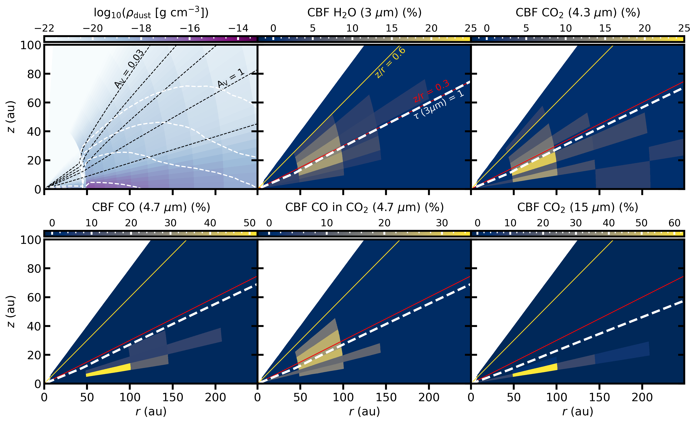
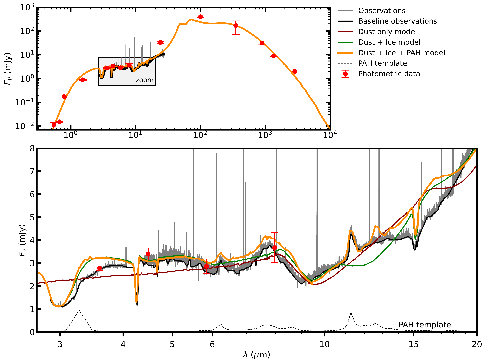

$\newcommand{\ensuremath}{}$
$\newcommand{\xspace}{}$
$\newcommand{\object}[1]{\texttt{#1}}$
$\newcommand{\farcs}{{.}''}$
$\newcommand{\farcm}{{.}'}$
$\newcommand{\arcsec}{''}$
$\newcommand{\arcmin}{'}$
$\newcommand{\ion}[2]{#1#2}$
$\newcommand{\textsc}[1]{\textrm{#1}}$
$\newcommand{\hl}[1]{\textrm{#1}}$
$\newcommand{\footnote}[1]{}$
$\newcommand{\micron}{\textmu m\xspace}$
$\newcommand{\ditto}[1][.0pt]{\xrfill[.7ex]{#1}~\textquotedbl~\xrfill[.7ex]{#1}}$
$\newcommand{\as}[1]{{\color{ForestGreen}AS: #1}}$
$\newcommand{\jn}[1]{{\color{red!50!blue}\;[JN:~#1]}}$
$\newcommand{\ed}[1]{\textcolor{darkorange}{[ED:~#1]}}$
$\newcommand{\SubItem}[1]{{\setlength\itemindent{15pt}\item[*]#1}}$
$\newcommand{\orcidlink}[1]{\protect\href{https://orcid.org/#1}{\protect\includegraphics[width=8pt]{orcid.png}}}$

# A JWST/MIRI analysis of the ice distribution and PAH emission in the protoplanetary disk HH 48 NE

<mark>Appeared on: 2024-07-16</mark> -  _16 pages, 11 figures, accepted in A&A_

J. A. Sturm, et al. -- incl., <mark>G. Perotti</mark>

**Abstract:** Ice-coated dust grains provide the main reservoir of volatiles that play an important role in planet formation processes and may become incorporated into planetary atmospheres.    However, due to observational challenges, the ice abundance distribution in protoplanetary disks is not well constrained.    With the advent of the _James Webb_ Space Telescope (JWST) we are in a unique position to observe these ices in the near- to mid-infrared and constrain their properties in Class II protoplanetary disks. We present JWST Mid-InfraRed Imager (MIRI) observations of the edge-on disk HH 48 NE carried out as part of the Director’s Discretionary Early Release Science program Ice Age, completing the ice inventory of HH 48 NE by combining the MIRI data (5 -- 28 $\micron$ ) with those of NIRSpec (2.7 -- 5 $\micron$ ). We used radiative transfer models tailored to the system, including silicates, ices, and polycyclic aromatic hydrocarbons (PAHs) to reproduce the observed spectrum of HH 48 NE with a parameterized model.    The model was then used to identify ice species and constrain spatial information about the ices in the disk. The mid-infrared spectrum of HH 48 NE is relatively flat with weak ice absorption features.    We detect $\ce{CO2}$ , $\ce{NH3}$ , $\ce{H2O}$ and tentatively $\ce{CH4}$ and $\ce{NH4+}$ .    Radiative transfer models suggest that ice absorption features are produced predominantly in the 50 -- 100 au region of the disk. The $\ce{CO2}$ feature at 15 $\micron$ probes a region closer to the midplane ( $z/r$ = 0.1 -- 0.15) than the corresponding feature at 4.3 $\micron$ ( $z/r$ = 0.2 -- 0.6), but all observations trace regions significantly above the midplane reservoirs where we expect the bulk of the ice mass to be located.    Ices must reach a high scale height ( $z/r \sim 0.6$ ; corresponding to modeled dust extinction $A_{\rm v} \sim 0.1$ ), in order to be consistent with the observed vertical distribution of the peak ice optical depths.    The weakness of the $\ce{CO2}$ feature at 15 $\micron$ relative to the 4.3 $\micron$ feature and the red emission wing of the 4.3 $\micron$ $\ce{CO2}$ feature are both consistent with ices being located at high elevation in the disk.    The retrieved $\ce{NH3}$ abundance and the upper limit on the $\ce{CH3OH}$ abundance relative to $\ce{H2O}$ are significantly lower than those in the interstellar medium (ISM), but consistent with cometary observations.    The contrast of the PAH emission features with the continuum is stronger than for similar face-on protoplanetary disks, which is likely a result of the edge-on system geometry.    Modeling based on the relative strength of the emission features suggests that the PAH emission originates in the disk surface layer rather than the ice absorbing layer. Full wavelength coverage is required to properly study the abundance distribution of ices in disks.    To explain the presence of ices at high disk altitudes, we propose two possible scenarios: a disk wind that entrains sufficient amounts of dust, thus blocking part of the stellar UV radiation, or vertical mixing that cycles enough ices into the upper disk layers to balance ice photodesorption from the grains.

**Figure 10. -** Top left: total dust density distribution in the model with internal shielding (radial $A_\mathrm{V}$; black dashed) at 0.03, 0.1, 0.3, 1, and 10 mag and external shielding (vertical $A_\mathrm{V}$; white dashed) at 0.01, 0.03, 0.1, and 1 mag from top to bottom. The other panels show the contribution function (CBF), i.e., the contribution of a specific region to the total absorption of the ice feature in percentages. The pure CO ice at high abundance is added for reference, but we argue in the main text that this component is not observed. The absorbing area is the region in the disk that contribute significantly to the total absorption. The red and yellow lines indicate the fiducial and best fit photodesorption snow surface, respectively, for reference. The thick, dashed, white line shows the $\tau=1$ surface at the ice feature wavelength. We would like to note that viewing angle is really important and is 83◦ in this case (*fig:CBF*)

**Figure 8. -** Overview of the source integrated spectrum of HH 48 NE (grey), with the continuum baseline underneath the gas lines shown in black with a zoom-in on the JWST wavelength range 2.7 -- 27 $\micron$. Different ice radiative transfer models are shown for comparison with the observations. The initial model constrained from photometric data points, HST, and ALMA observations  ([Sturm, McClure and Law 2023](), [Sturm, McClure and Bergner 2023]())  is shown in blue. A similar model was fine-tuned to the NIRSpec and MIRI spectrum with only refractory dust (red), dust and ice (green), and dust, ice, and PAHs (orange). The PAH opacity template used is shown in the bottom without extinction corrections  ([Visser, Geers and Dullemond 2007]()) .
     (*fig:SED comparison*)

**Figure 12. -** Sketch of the three pieces of evidence for elevated ices in HH 48 NE. The orange line demonstrates the effect of including the ices high up in the disk on the vertical absorption profile (panel 1.), the relative strength of the 4.3 to 15 $\micron$\ce{CO2} features (panel 2.), and the scattering wing of the 4.3 $\micron$\ce{CO2} feature (panel 3.). Two scenarios are proposed: a dusty disk wind blocking part of the UV emission from the star (Scenario A.) or vertical mixing stirring up ice to the surface (Scenario B.). (*fig:sketch*)

