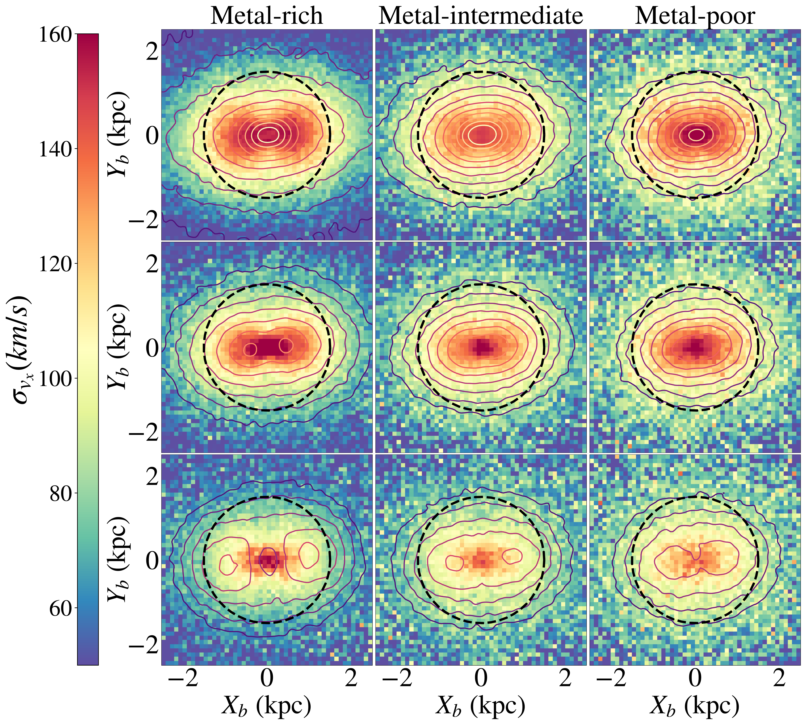
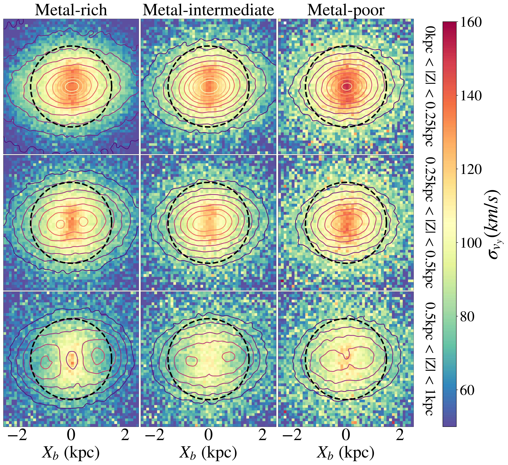
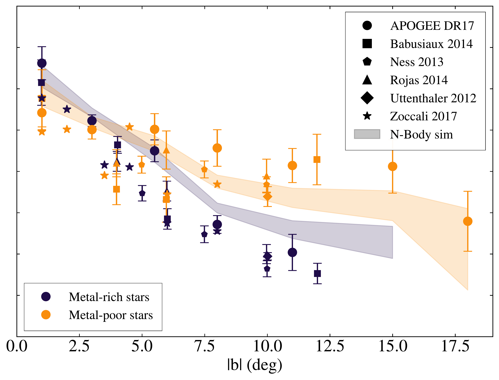

$\newcommand{\ensuremath}{}$
$\newcommand{\xspace}{}$
$\newcommand{\object}[1]{\texttt{#1}}$
$\newcommand{\farcs}{{.}''}$
$\newcommand{\farcm}{{.}'}$
$\newcommand{\arcsec}{''}$
$\newcommand{\arcmin}{'}$
$\newcommand{\ion}[2]{#1#2}$
$\newcommand{\textsc}[1]{\textrm{#1}}$
$\newcommand{\hl}[1]{\textrm{#1}}$
$\newcommand{\footnote}[1]{}$
$\newcommand{\paola}[1]{\textcolor{magenta}{{#1}}}$

# The disc origin of the Milky Way bulge

<mark>Appeared on: 2024-07-16</mark> -  _12 pages, 9 figures_

T. Boin, et al. -- incl., <mark>S. Ghosh</mark>

**Abstract:** Previous studies of the chemo-kinematic properties of stars in the Galactic bulge have revealed a puzzling trend. Along the bulge minor axis,  and close to the Galactic plane, metal-rich stars display a higher line-of-sight velocity dispersion compared to metal-poor stars, while at higher latitudes metal-rich stars have lower velocity dispersions than metal-poor stars, similar to what is found in the Galactic disc. In this work, we re-examine this issue, by studying the dependence of line-of-sight velocity dispersions on metallicity and latitude in the latest APOGEE Data Release 17, confirming the results of previous works. We then analyse an $N$ -body simulation of a Milky Way-like galaxy, also taking into account observational biases introduced by the APOGEE selection function. We show that the inversion in the line-of-sight velocity dispersion-latitude relation observed in the Galactic bulge -- where the velocity dispersion of metal-rich stars becomes greater than that of metal-poor stars as latitude decreases -- can be reproduced by our model.  We show that this inversion is a natural consequence of a scenario in which the bulge is  a boxy/peanut-shaped structure, whose metal-rich and metal-poor  stars mainly originate from the thin and thick disc of the Milky Way, respectively. Due to their cold kinematics, metal-rich, thin disc stars, are efficiently trapped in the boxy/peanut bulge, and, at low latitudes, show a strong barred morphology, which - given the bar orientation with respect to the Sun-Galactic centre direction  - results in high velocity dispersions which are larger than those attained by the metal-poor populations. Extremely metal-rich stars in the Galactic bulge, which have received renewed attention in the literature, do follow the same trends as those of the metal-rich populations. The  line-of-sight velocity-latitude relation observed in the Galactic bulge for metal-poor and metal-rich stars are thus both an effect of the intrinsic nature of the Galactic bulge (i.e. mostly secular) and of the angle at which we observe it from the Sun.

**Figure 4. -** Maps of the velocity dispersion maps for the bar-oriented $\sigma_{v_{Xb}}$(_left panel_) and $\sigma_{v_{Yb}}$(_right panel_) components. Each population (metal-rich, metal-intermediate and metal-poor) correspond to a column in each panel, and different height cuts are represented on each row (0 kpc < |Z| < 0.25 kpc, 0.25 kpc < |Z| < 0.5 kpc and 0.5 kpc < |Z| < 1 kpc). The axis are bar-oriented, isodensity contours are shown as colored lines, and a 1.5 kpc region around the galactic centre is shown as a dotted black circle. (*fig:xy_v*)

**Figure 3. -** _Left panel_: Line-of-sight velocity dispersion $\sigma_{v_{los}}$ profiles of our quality APOGEE sample (_error bar curves_) and of our mock catalogue (_shaded areas of height $\pm \sigma$_). The profiles are plotted for stars with |$\ell$|$<2^\circ$ and |X| $<$ 1.5kpc. _Right panel_: Line-of-sight velocity dispersion $\sigma_{v_{los}}$ profiles of our quality APOGEE sample (_error bar with circle symbol_) and of our mock catalogue (_shaded areas of height $\pm \sigma$_), compared to results from [ and Babusiaux (2014)]() and [ and Babusiaux (2010)]()(_squares_), Ness_2013(_pentagons_), [ and Rojas-Arriagada (2014)]()(_triangles_), [ and Uttenthaler (2012)]()(_diamonds_), [ and Zoccali (2017)]()(_stars_). (*fig:disp_apogee_sim*)

**Figure 2. -** _Top panel:_ face-on (X-Y-plane) density map of the $N$-Body simulation stars _(left column)_, APOGEE stars _(middle column)_ and our mock catalogue stars _(right column)_. Superimposed are the |X| < 1.5kpc distance bounds and $\pm$ 20  longitude bounds in white, as well as a green line to guide the eye indicating the angle of the galactic bar and the Sun  at X=-8.12 kpc,Y=0 kpc (white star symbol). _Bottom panels:_ corresponding density maps in the Galactic ($\ell$,$b$) plane. The colors indicate relative densities for each of the 3 catalogues separately. (*fig:xy_lb*)

