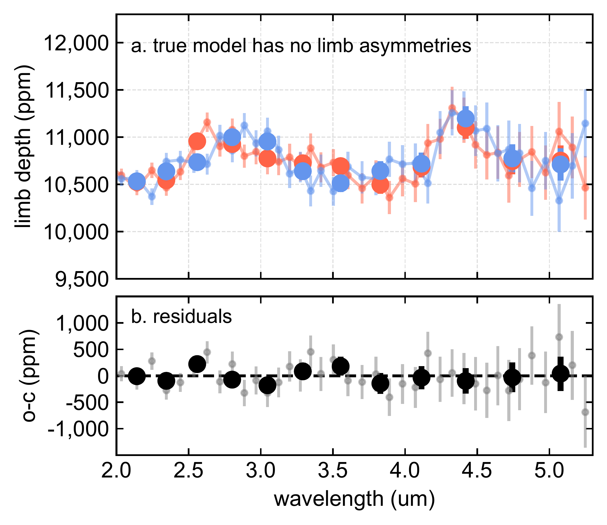
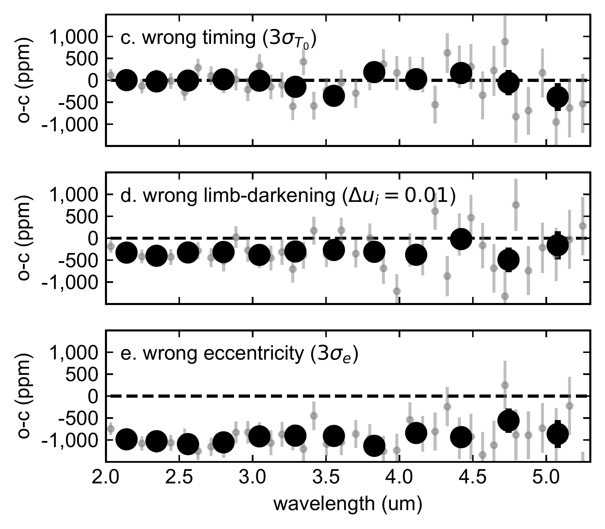
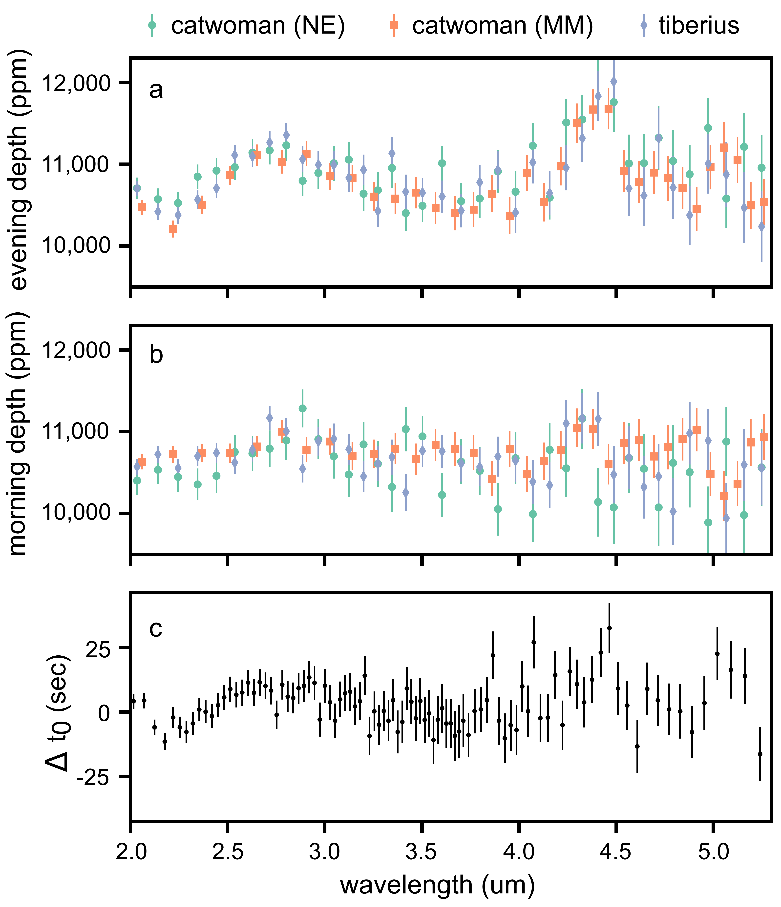

$\newcommand{\ensuremath}{}$
$\newcommand{\xspace}{}$
$\newcommand{\object}[1]{\texttt{#1}}$
$\newcommand{\farcs}{{.}''}$
$\newcommand{\farcm}{{.}'}$
$\newcommand{\arcsec}{''}$
$\newcommand{\arcmin}{'}$
$\newcommand{\ion}[2]{#1#2}$
$\newcommand{\textsc}[1]{\textrm{#1}}$
$\newcommand{\hl}[1]{\textrm{#1}}$
$\newcommand{\footnote}[1]{}$
$\newcommand{\bibinfo}[2]{#2}$
$\newcommand{\eprint}[2][]{\url{#2}}$
$\newcommand{\doi}[1]{\url{https://doi.org/#1}}$
$\newcommand{\bibinfo}[2]{#2}$
$\newcommand{\eprint}[2][]{\url{#2}}$
$\newcommand{\doi}[1]{\url{https://doi.org/#1}}$
$\newcommand$
$\newcommand$
$\newcommand$
$\newcommand$
$\newcommand$
$\newcommand$
$\newcommand$
$\newcommand$
$\newcommand$
$\newcommand$
$\newcommand$
$\newcommand$
$\newcommand$
$\newcommand{\floatpagefraction}{1}$
$\newcommand{\floatpagefraction}{1}$
$\newcommand{\figurename}{Extended Data Fig.}$
$\newcommand{\tablename}{Extended Data Table}$
$\newcommand{\theHfigure}{Extended Data Fig.~\arabic{figure}}$
$\newcommand{\thetable}{Extended Data Table \arabic{table}}$
$\newcommand{\theHtable}{Extended Data Table \arabic{table}}$
$\newcommand\url{#1}$
$\newcommand{\urlprefix}{URL }$
$\newcommand\url{#1}$
$\newcommand{\urlprefix}{URL }$

# $\centering{Inhomogeneous terminators on the exoplanet WASP-39 b}$

<mark>Appeared on: 2024-07-16</mark> -  _Published in Nature at this https URL. All code to produce plots (with data) can be found at this https URL_

\fnm{Néstor}\sur{Espinoza}, et al.

**Abstract:**            Transmission spectroscopy has been a workhorse technique over the past two decades to constrain the physical and chemical properties of exoplanet atmospheres. One of its classical key assumptions is that the portion of the atmosphere it probes -- the terminator region -- is homogeneous. Several works in the past decade, however, have put this into question for highly irradiated, hot ($T_{eq}\gtrsim 1000$ K) gas giant exoplanets both empirically and via 3-dimensional modelling. While models predict clear differences between the evening (day-to-night) and morning (night-to-day) terminators, direct morning/evening transmission spectra in a wide wavelength range has not been reported for an exoplanet to date. Under the assumption of precise and accurate orbital parameters on WASP-39 b, here we report the detection of inhomogeneous terminators on the exoplanet WASP-39 b, which allows us to retrieve its morning and evening transmission spectra in the near-infrared ($2-5\ \mu$m) using JWST. We observe larger transit depths in the evening which are, on average, $405 \pm 88$ ppm larger than the morning ones, also having qualitatively larger features than the morning spectrum. The spectra are best explained by models in which the evening terminator is hotter than the morning terminator by $177^{+65}_{-57}$ K with both terminators having C/O ratios consistent with solar. General circulation models (GCMs) predict temperature differences broadly consistent with the above value and point towards a cloudy morning terminator and a clearer evening terminator.         

**Figure 2. -** **The morning and evening spectrum of WASP-39 b from JWST NIRSpec/PRISM observations.****a-b.** The total transit depth by adding the morning and evening spectra (**a**, grey points) along with the individual morning (blue points) and evening (red points) spectrum of WASP-39 b as derived from our lightcurve modeling (**b**). Big points are datapoints at $R=30$ shown for illustration; smaller points are at $R=100$. The best-fit, chemically-consistent models (black solid line in **a**, red and blue solid lines in **b**; fitted to the $R=100$ spectra) are consistent with a hotter evening terminator (see text for details). **c-d.** Residuals from the best-fit model (red points for the evening, blue points for the morning); dashed line marks 0. {All errorbars represent 1-standard deviation.} (*fig:morning-evening-spectra*)

**Figure 7. -** **Robustness of limb asymmetry detection to transit parameters and assumptions.** To study the robustness of our extracted morning and evening spectra for the NIRSpec/PRISM
    observations, we simulated transit lightcurves using
    \texttt{batman} and then fitted those using \texttt{catwoman} with different assumptions, leaving all parameters fixed but the depths of
    the morning and evening limbs. **a-b.** Null case on which the
    true model has no limb asymmetries and the input transit parameters are unchanged; the \texttt{catwoman} fits
    correctly recover the same morning (blue) and evening (red) spectra
    (top). The difference $\Delta$ between the morning and the evening
    spectra are consistent with zero, as expected from this null case (bottom). **c.** Same experiment
    as in a., but generating a light curve with a time-of-transit center 3-$\sigma$ away from the fixed value, which amounts to an offset of 3.4
    seconds. The difference $\Delta$ is consistent with zero, suggesting
    our inferences are robust against this parameter. **d.** Same
    experiment, but generating a light curve that had limb-darkening
    coefficients of the quadratic law offset by 0.01. Note how this injects
    a systematic offset in the difference between the morning and evening
    spectra; depending on the direction of this offset, this can lead to
    mornings having larger depths than evenings or viceversa. **e.**
    Same experiment, but generating a transit lightcurve with a non-zero
    eccentricity consistent at 3-$\sigma$ with the white-lightcurve fits of Carter \& May et al. (in review; $e=0.035$, $\omega = 10$ deg). Note how this slight eccentricity can
    generate significantly larger mornings than evenings, due to the asymmetry an eccentric orbit imprints on the transit lightcurve. For WASP-39 b, this eccentricity effect cannot generate larger evenings than mornings, which is what we observe. This suggests our results are also robust against this parameter (see text for details). {All errorbars represent 1-standard deviation.} (*fig:experiments*)

**Figure 4. -** **Different approaches at detecting limb asymmetries from NIRSpec/PRISM data.****a-b.** Evening (top) and morning (middle) depths as extracted from three independent analyses of our NIRSpec/PRISM lightcurves; one using the \texttt{catwoman} framework with limb-darkening as free parameters with a prior (NE), a framework leaving those fixed (MM) and a framework on which half-ingress and half-egress are fitted independently using a \texttt{batman} lightcurve model (Tiberius); see text for details. Note the agreement between approaches for both terminators, and how the amplitude of the features seem to be smaller in the morning terminator **c.** An independent look at limb asymmetries by fitting for a wavelength-dependent time-of-transit center to each wavelength-dependent lightcurve. As with the top and middle panels, differences between the limbs as tracked by the time-of-transit center seem to be largest between
    2-3.5 $\mu$m, i.e., around the water bands. {All errorbars represent 1-standard deviation.} (*fig:all-data*)

