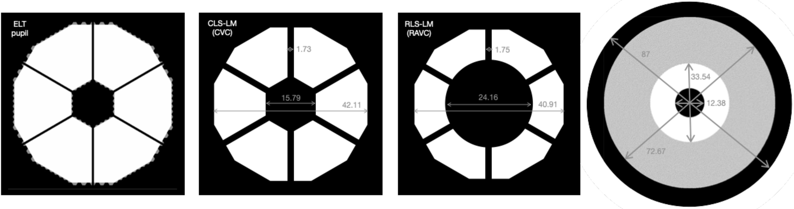
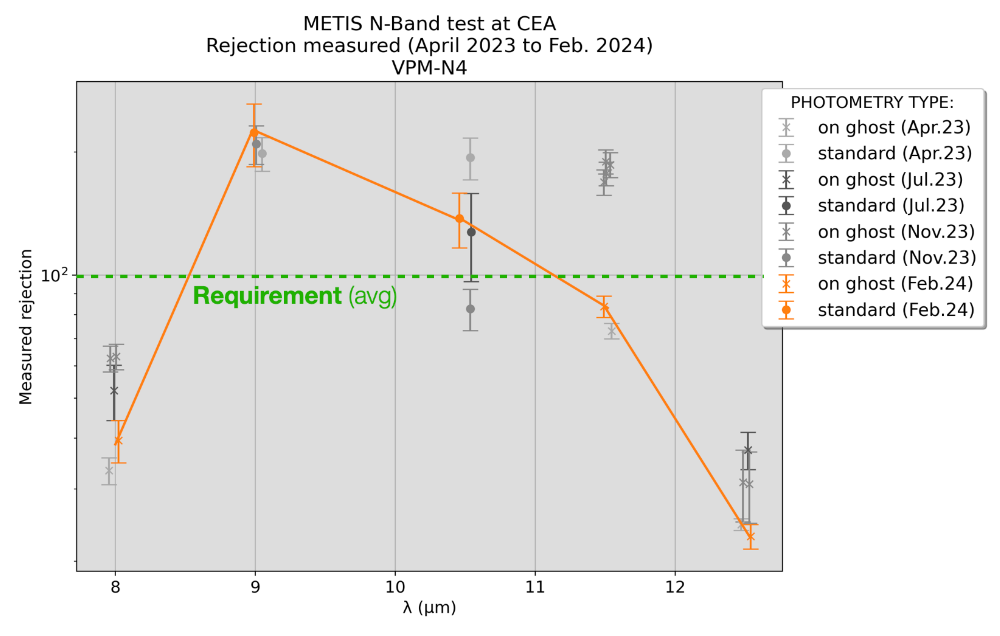
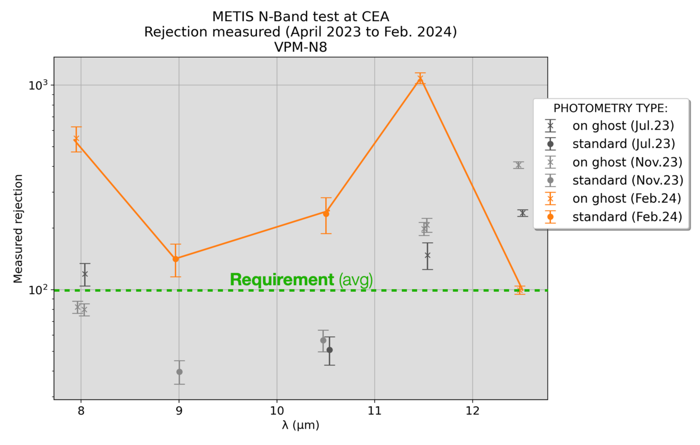

$\newcommand{\ensuremath}{}$
$\newcommand{\xspace}{}$
$\newcommand{\object}[1]{\texttt{#1}}$
$\newcommand{\farcs}{{.}''}$
$\newcommand{\farcm}{{.}'}$
$\newcommand{\arcsec}{''}$
$\newcommand{\arcmin}{'}$
$\newcommand{\ion}[2]{#1#2}$
$\newcommand{\textsc}[1]{\textrm{#1}}$
$\newcommand{\hl}[1]{\textrm{#1}}$
$\newcommand{\footnote}[1]{}$
$\newcommand{\baselinestretch}{1.0}$

# METIS high-contrast imaging: from final design to manufacturing and testing

<mark>Appeared on: 2024-07-16</mark> -  _16 pages, paper presented at SPIE Astronomical Telescopes + Instrumentation 2024_

O. Absil, et al. -- incl., <mark>T. Bertram</mark>, <mark>R. v. Boekel</mark>, <mark>M. Feldt</mark>

**Abstract:** The Mid-infrared ELT Imager and Spectrograph (METIS) is one of the first-generation scientific instruments for the ELT, built under the supervision of ESO by a consortium of research institutes across and beyond Europe. Designed to cover the 3 to 13 $\mu$ m wavelength range, METIS had its final design reviewed in Fall 2022, and has then entered in earnest its manufacture, assembly, integration, and test (MAIT) phase. Here, we present the final design of the METIS high-contrast imaging (HCI) modes. We detail the implementation of the two main coronagraphic solutions selected for METIS, namely the vortex coronagraph and the apodizing phase plate, including their combination with the high-resolution integral field spectrograph of METIS, and briefly describe their respective backup plans (Lyot coronagraph and shaped pupil plate). We then describe the status of the MAIT phase for HCI modes, including a review of the final design of individual components such as the vortex phase masks, the grayscale ring apodizer, and the apodizing phase plates, as well as a description of their on-going performance tests and of our plans for system-level integration and tests. Using end-to-end simulations, we predict the performance that will be reached on sky by the METIS HCI modes in presence of various environmental and instrumental disturbances, including non-common path aberrations and water vapor seeing, and discuss our strategy to mitigate these various effects. We finally illustrate with mock observations and data processing that METIS should be capable of directly imaging temperate rocky planets around the nearest stars.

**Figure 2. -** lyot_Left._ ELT input pupil, illustrating our dodecagonal/hexagonal all-glass approximation (white) compared to the full input pupil (gray). _Middle._ Design of the Lyot stops associated with the classical (middle left) and ring-apodized (middle right) vortex modes, as implemented at IMG-LM-PP1. Sizes are in given in mm, with the ELT nominal diameter corresponding to 45 mm in this pupil plane. _Right._ Design of the ring apodizer (RAP). Sizes are in given in mm, with the ELT nominal diameter corresponding to 68 mm in this pupil plane. The relative dimensions of all masks with respect to the input ELT pupil are respected to illustrate the amount of oversizing or undersizing in the various edges. (*fig:lyot*)

**Figure 3. -** APP-IMG phase pattern and resultant monochromatic PSF. _Left._ Phase of the vAPP as a function of position in the METIS cold stop pupil. _Right._ The two (monochromatic) coronagraphic PSFs formed by this phase pattern, located on either side of a central leakage term of about 1\% intensity relative to the input on-axis starlight. (*fig:app-img*)

**Figure 5. -** Measured performance of two of the three N-band VPMs manufactured for METIS (_left_: VPM-N4, _right_: VPM-N8). Not displayed here is VPM-N9, which shows very similar performance to VPM-N8. The final, consolidated measurements are displayed in orange, with ealier results in shades of gray. In the case of VPM-N8, the gray-colored measurements were obtained before the re-etching of the VPM, showing poor early performance. The requirement in terms of average rejection rate across the N band is displayed with a green dashed line for reference. (*fig:vpm-n*)

