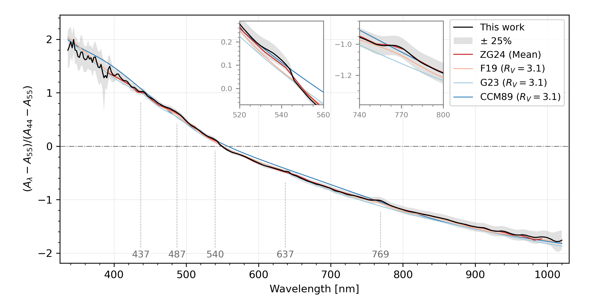
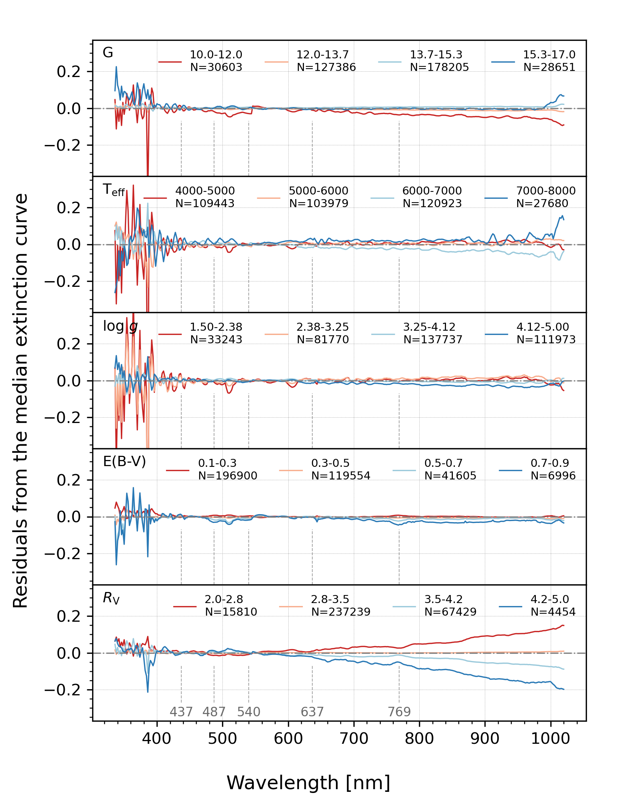
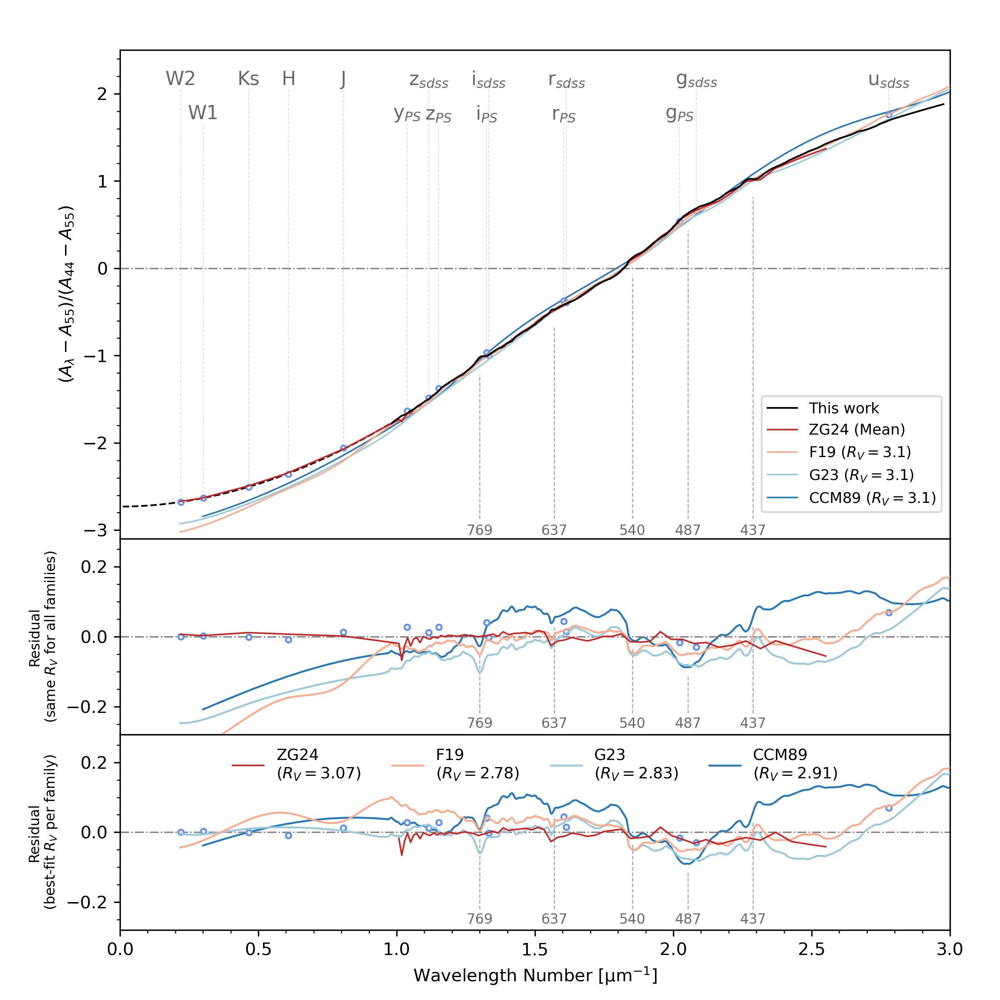

$\newcommand{\ensuremath}{}$
$\newcommand{\xspace}{}$
$\newcommand{\object}[1]{\texttt{#1}}$
$\newcommand{\farcs}{{.}''}$
$\newcommand{\farcm}{{.}'}$
$\newcommand{\arcsec}{''}$
$\newcommand{\arcmin}{'}$
$\newcommand{\ion}[2]{#1#2}$
$\newcommand{\textsc}[1]{\textrm{#1}}$
$\newcommand{\hl}[1]{\textrm{#1}}$
$\newcommand{\footnote}[1]{}$
$\newcommand$
$\newcommand$
$\newcommand$
$\newcommand$
$\newcommand$
$\newcommand$
$\newcommand$
$\newcommand$
$\newcommand$

# An Empirical Extinction Curve Revealed by Gaia XP Spectra and LAMOST

<mark>Appeared on: 2024-07-18</mark> -  _11 pages, 5 figures, accepted for publication in ApJ_

<mark>R. Zhang</mark>, et al. -- incl., <mark>X. Zhang</mark>

**Abstract:** We present a direct measurement of extinction curves using corrected $\gaia$ XP spectra \citep{2024ApJS..271...13H} of the common sources in $\gaia$ DR3 and LAMOST DR7.Our analysis of approximately 370 thousand high-quality samples yielded a high-precision average extinction curve for the Milky Way.After incorporating infrared photometric data from 2MASS and WISE, the extinction curve spans wavelengths from 0.336 to 4.6 $\mu$ m.We determine an average $R_{55}$ of $2.730 \pm 0.007$ , corresponding to $\RV = 3.073 \pm 0.009$ , and a near-infrared power-law index $\alpha$ of $1.935 \pm 0.037$ .Our study confirmed some intermediate-scale structures within the optical range.Two new features were identified at 540 and 769 nm, and their intensities exhibited a correlation with extinction and $\RV$ .This extinction curve can be used to investigate the characteristics of dust and enhance the extinction correction of Milky Way stars.A Python package for this extinction curve is available \citep{ruoyi_zhang_2024_12621834} .

**Figure 2. -** The median extinction curve and its comparison with literature.
    The black line is the median extinction curve, while the gray shadow indicates the distribution range for 25\% to 75\% of stars.
    The models from ZG24, \citetalias{2019ApJ...886..108F}, \citetalias{2023ApJ...950...86G}, and \citetalias{1989ApJ...345..245C} are illustrated by red, pink, light blue, and blue lines, respectively.
    The gray dashed lines and the wavelength labels indicate the locations of the possible ISSs. (*fig-MEC*)

**Figure 3. -** The difference between the average extinction curve of samples within varying parameter ranges and the overall median curve.
    From top to bottom, these panels display the impact of the following parameters: G band magnitude, $\teff$, $\logg$, $\ebv$, and $\RV$.
    Colors represent different ranges of each parameter.
     (*fig-relevance*)

**Figure 5. -** 
    Comparisons between the median extinction curve and literature models along with photometric data.
    _ Top panel_: The black solid and dashed lines are the median extinction and infrared extension curves, respectively. The red, pink, light blue, and blue lines are extinction models from ZG24, \citetalias{2019ApJ...886..108F}, \citetalias{2023ApJ...950...86G}, and \citetalias{1989ApJ...345..245C}, respectively. Blue open circles indicate the median $k(\lambda-55)$ and median $\lambda_{\rm{eff}}$ for each passband, with error bars included, although they are nearly imperceptible. The names of the corresponding passbands are labeled at the top. The gray dashed lines and the wavelength labels indicate the locations of the possible ISSs.
    _ Middle panel_: The residuals obtained by subtracting the median extinction curve from the four models in the top panel.
    _ Bottom panel_: The residual curves corresponding to the best-fit $\RV$ values.
     (*fig-liter*)

