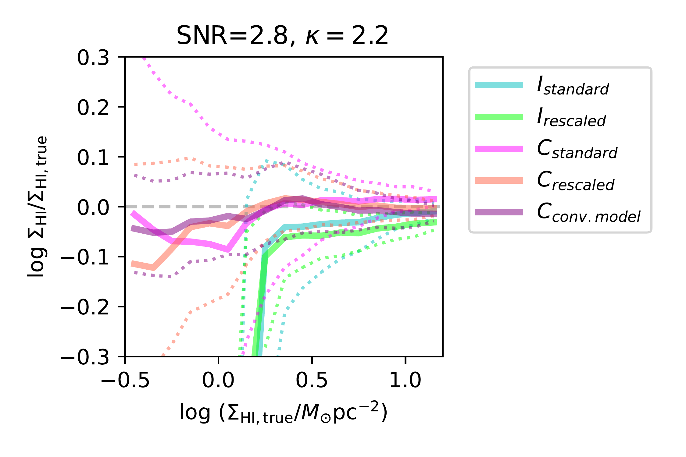
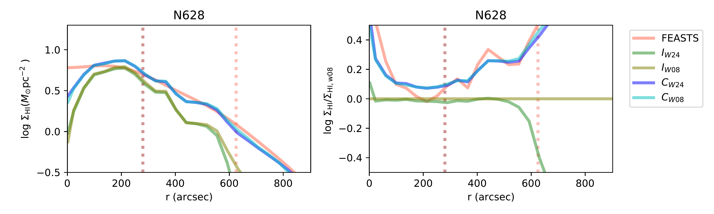
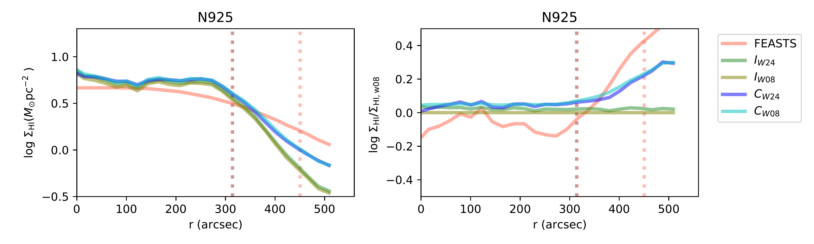
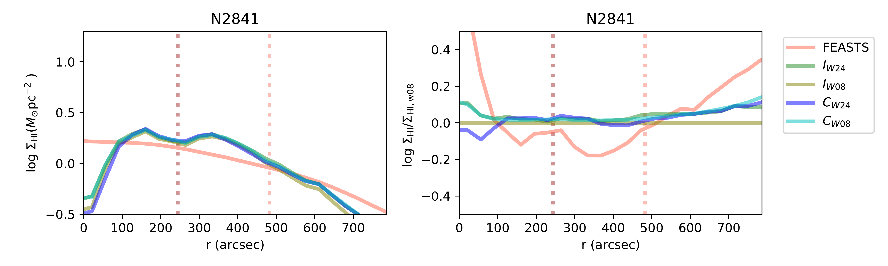
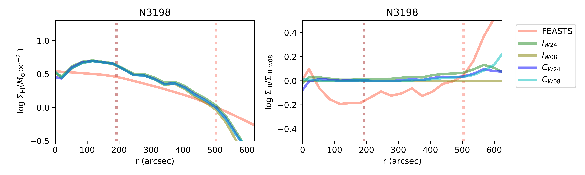
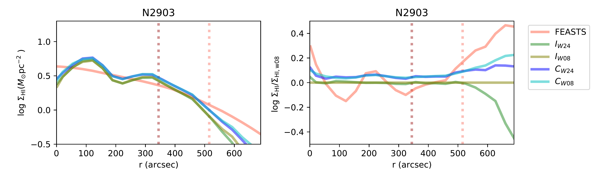
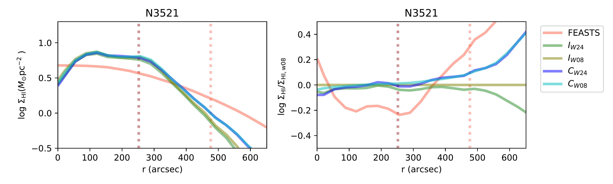
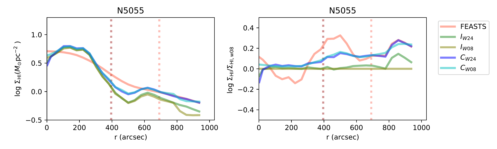
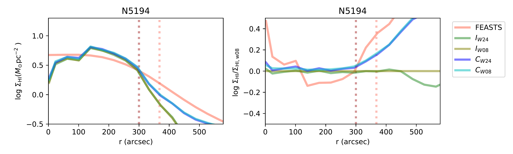

$\newcommand{\ensuremath}{}$
$\newcommand{\xspace}{}$
$\newcommand{\object}[1]{\texttt{#1}}$
$\newcommand{\farcs}{{.}''}$
$\newcommand{\farcm}{{.}'}$
$\newcommand{\arcsec}{''}$
$\newcommand{\arcmin}{'}$
$\newcommand{\ion}[2]{#1#2}$
$\newcommand{\textsc}[1]{\textrm{#1}}$
$\newcommand{\hl}[1]{\textrm{#1}}$
$\newcommand{\footnote}[1]{}$
$\newcommand{\hi}{{\rm H}{\textsc i}}$
$\newcommand{\angstrom}{\text{\normalfontÅ}}$
$\newcommand{◦ee}{\ensuremath{\text{\textdegree}}}$
$\newcommand{\jyb}{\rm{Jy~beam^{-1} }}$
$\newcommand{\jykms}{\rm{Jy~km~s^{-1} }}$
$\newcommand{\jybkms}{\rm{Jy~beam^{-1}~km~s^{-1} }}$
$\newcommand{\mjybi}{\rm{mJy~beam_{i}^{-1} }}$
$\newcommand{\mjyb}{\rm{mJy~beam^{-1} }}$
$\newcommand{\mjybs}{\rm{mJy~beam_{s}^{-1} }}$
$\newcommand{\jybs}{\rm{Jy~beam_{s}^{-1} }}$
$\newcommand{\mjybkms}{\rm{mJy~beam^{-1}~km~s^{-1} }}$
$\newcommand{\kms}{\rm{km~s^{-1} }}$
$\newcommand{\cmsq}{\rm{ cm^{-2} } }$
$\newcommand{\NHI}{N_{\rm HI}}$
$\newcommand{\Msun}{\rm{M_{\odot}}}$
$\newcommand{\Msunyr}{\rm{M_{\odot}} ~{\rm yr}^{-1} }$
$\newcommand{\Msunyrkpcsq}{\rm{M_{\odot}} ~{\rm yr}^{-1}~{\rm kpc}^{-2} }$
$\newcommand{\Msunpcsq}{\rm{M_{\odot}} ~{\rm pc}^{-2}}$
$\newcommand{\SHI}{\Sigma_{\rm HI}}$
$\newcommand{\Ssfr}{\Sigma_{\rm SFR}}$
$\newcommand{\Sst}{\Sigma_*}$

#  FEASTS Combined with Interferometry (II):Significantly Changed HI Surface Densities and Even More Inefficient Star Formation in Galaxy Outer Disks

<mark>Appeared on: 2024-07-23</mark> -  _27 pages, the second paper of "FEASTS Combined with Interferometry". Data is available on the page this http URL_

J. W. (王菁), et al. -- incl., <mark>F. Walter</mark>

**Abstract:** We update the $\hi$ surface density measurements for a subset of 17 THINGS galaxies by dealing with the short-spacing problem of the original VLA $\hi$ images.It is the same sample that [Bigiel, Leroy and Walter (2010)]() used to study the relation between $\hi$ surface densities and star formation rate surface densities in galaxy outer disks, which are beyond the optical radius $r_{25}$ .For ten galaxies, the update is based on combining original THINGS VLA $\hi$ images with $\hi$ images taken by the single-dish FAST in the FEASTS program.The median increment of $\hi$ surface densities in outer disks is 0.15 to 0.4 dex at a given new $\hi$ surface density.Several galaxies change significantly in the shape of radial profiles $\hi$ surface densities, and seven galaxies are now more than 1- $\sigma$ below the $\hi$ size-mass relation.We update the $\hi$ star formation laws in outer disks.The median relation between $\hi$ surface densities and star formation rate surface densities based on pixelwise measurements shifts downward by around 0.15 dex because the $\hi$ surface density values shift rightward, and the scatter increases significantly.The scatter of the relation, indicating the star forming efficiency, exhibits a much stronger positive correlation with the stellar mass surface density than before.Thus, detecting the previously missed, diffuse $\hi$ due to short-spacing problem of the VLA observation is important in revealing the true condition and variation of star formation possibly regulated by stellar feedbacks in localized environment of outer disks.

**Figure 3. -** 
The recovering capabilities of pixelwise $\SHI$ of different types of $\hi$ images for the $\kappa=2.2$\& SNR$=2.8$ mock dataset.
The simulated disk based on which the mock images are taken has a power spectral index $\kappa=2.2$, and the VLA data has a median SNR$=2.8$.
Different colors show different types of mock $\hi$ images from which the measurements are made.
For each mock $\hi$ image type, the logarithm difference of $\SHI$ measured from mock images from the true values are plotted as a function of the true $\SHI$.
The solid, thick curves show the median distribution of $\SHI$ difference as a function of true $\SHI$, and the dotted curves the scatters.
The scatters are measured as the 25 and 75 percentiles.
  (*fig:pixNHI_mock_ref*)

**Figure 5. -**  Comparing radial profiles of $\SHI$ measured from different images for galaxies in the FEASTS subset.
Each row is for a galaxy, with the left panel showing the radial profiles and the right panel the profile difference with respect to the $I_\text{W08}$ measurements.
For each galaxy, the comparison involves two sets of THINGS-only measurements, $I_\text{W08}$(olive) and $I_\text{W24}$(green), based on the W08 and W24 residual-rescaled data cubes respectively.
It also involves two sets of combined images, $C_\text{W08}$(cyan) and $C_\text{W24}$(blue), using the W08 residual-rescaled image and the W24 convolved model to combined with the FEASTS image respectively.
It also includes profiles directly measured from the FEASTS images (red).
The pink and brown dotted vertical lines mark the positions of $R_{\rm HI}$(derived from $C_\text{W24}$ profile) and $r_{25}$ respectively.
To be continued.
 (*fig:prof1*)

**Figure 6. -** Comparing radial profiles of $\SHI$ measured from different images for galaxies in the FEASTS subset.
Continued.   (*fig:prof1*)

