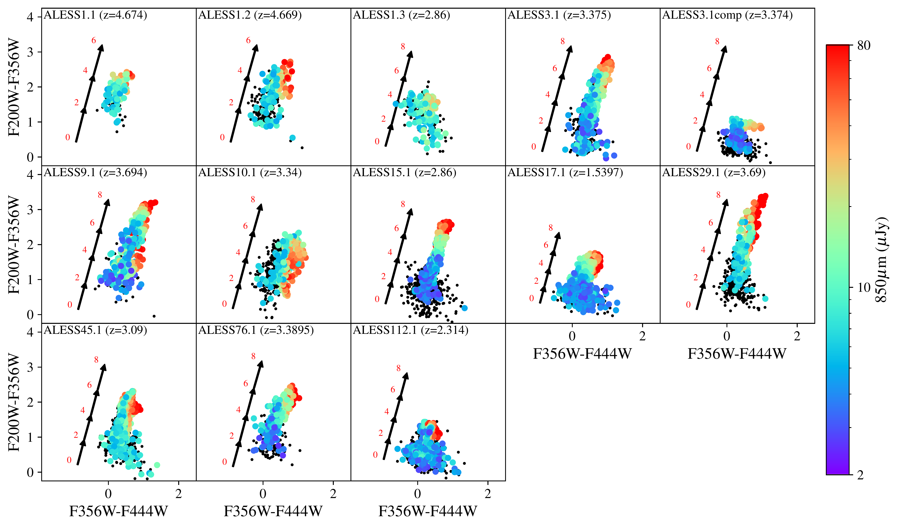
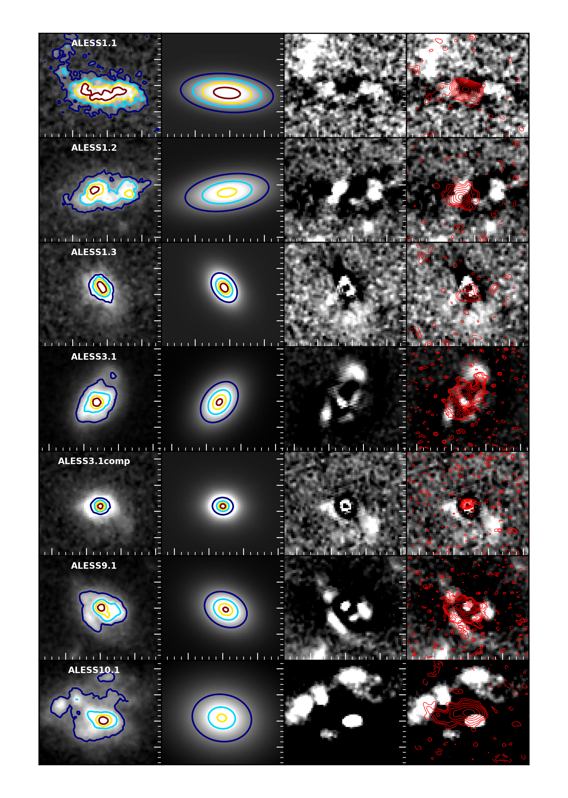
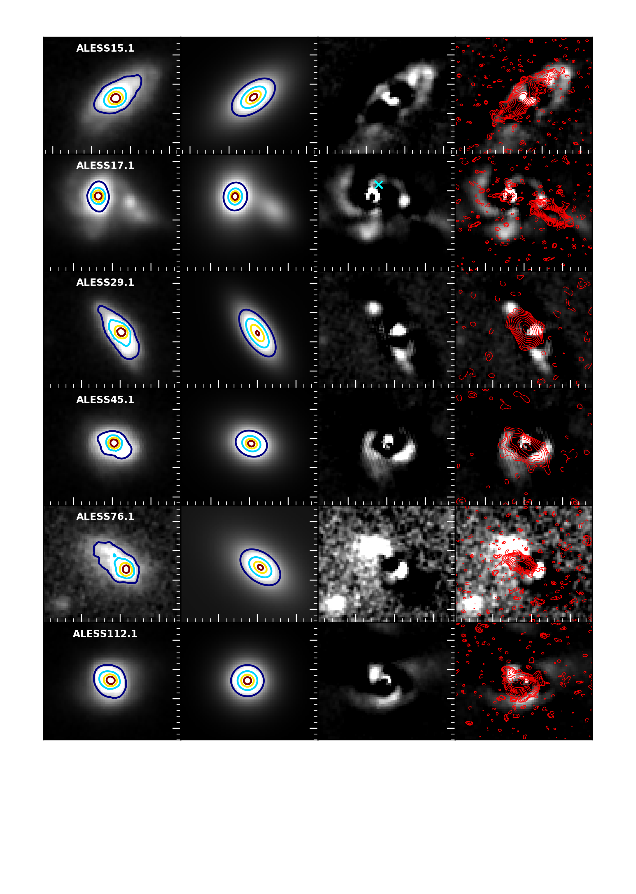
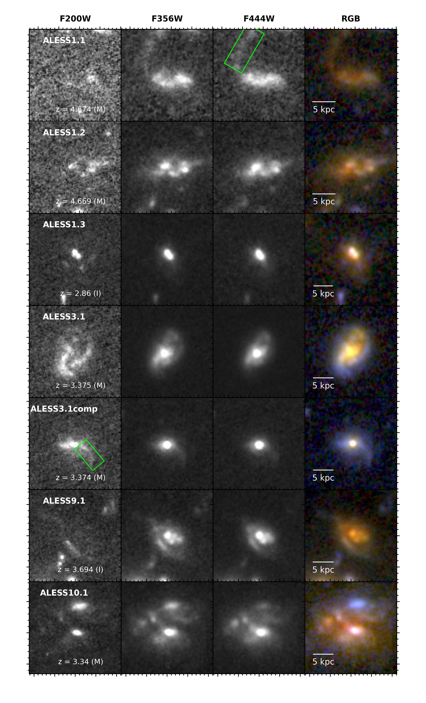
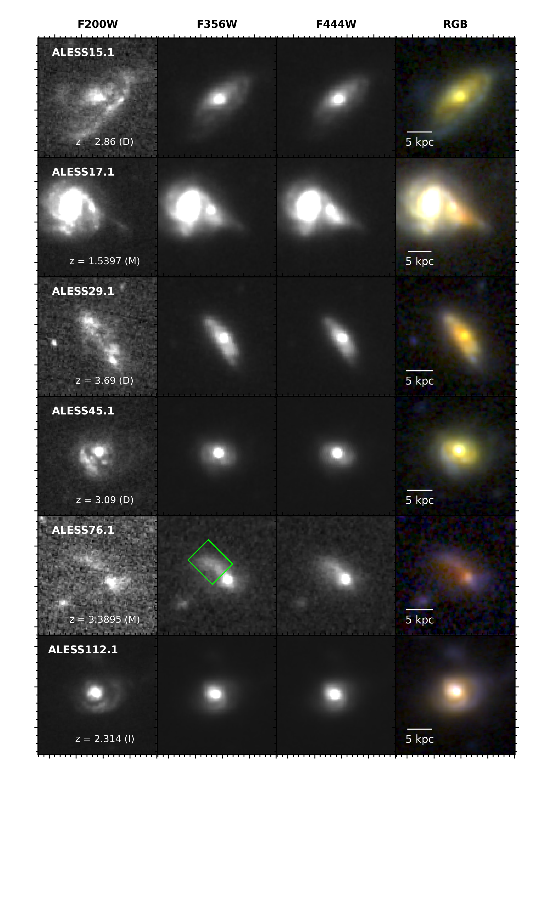

$\newcommand{\ensuremath}{}$
$\newcommand{\xspace}{}$
$\newcommand{\object}[1]{\texttt{#1}}$
$\newcommand{\farcs}{{.}''}$
$\newcommand{\farcm}{{.}'}$
$\newcommand{\arcsec}{''}$
$\newcommand{\arcmin}{'}$
$\newcommand{\ion}[2]{#1#2}$
$\newcommand{\textsc}[1]{\textrm{#1}}$
$\newcommand{\hl}[1]{\textrm{#1}}$
$\newcommand{\footnote}[1]{}$
$\newcommand{\vdag}{(v)^\dagger}$
$\newcommand$
$\newcommand$
$\newcommand{\baselinestretch}{1.1}$
$\newcommand{\baselinestretch}{1.0}$

# ALESS-JWST: Joint (sub-)kiloparsec JWST and ALMA imaging of $z\sim3$ submillimeter galaxies reveals heavily obscured bulge formation events

<mark>Appeared on: 2024-07-23</mark> -  _26 pages, 10 figures. Submitted to ApJ. Comments welcome_

J. A. Hodge, et al. -- incl., <mark>J. Li</mark>, <mark>F. Walter</mark>, <mark>E. Schinnerer</mark>

**Abstract:** We present JWST NIRCam imaging targeting 13 $z$ $\sim$ 3 infrared-luminous ( $L_{\rm IR}\sim5\times10^{12}L_{\odot}$ ) galaxies from the ALESS survey with uniquely deep, high-resolution (0.08 $"$ --0.16 $"$ ) ALMA 870 $\mu$ m imaging. The 2.0-4.4 $\mu$ m (observed frame) NIRCam imaging reveals the rest-frame near-infrared stellar emission in these submillimeter-selected galaxies (SMGs) at the same (sub-)kpc resolution as the 870 $\mu$ m dust continuum. The newly revealed stellar morphologies show striking similarities with the dust continuum morphologies at 870 $\mu$ m, with the centers and position angles agreeing for most sources, clearly illustrating that the spatial offsets reported previously between the 870 $\mu$ m and HST morphologies were due to strong differential dust obscuration. The F444W sizes are 78 $\pm$ 21 \% larger than those measured at 870 $\mu$ m, in contrast to recent results from hydrodynamical simulations that predict larger 870 $\mu$ m sizes. We report evidence for significant dust obscuration in F444W for the highest-redshift sources, emphasizing the importance of longer-wavelength MIRI imaging. The majority of the sources show evidence that they are undergoing mergers/interactions, including tidal tails/plumes---some of which are also detected at 870 $\mu$ m. We find a clear correlation between NIRCam colors and 870 $\mu$ m surface brightness on $\sim$ 1 kpc scales, indicating that the galaxies are primarily red due to dust---not stellar age---and we show that the dust structure on $\sim$ kpc-scales is broadly similar to that in nearby galaxies. Finally, we find no strong stellar bars in the rest-frame near-infrared, suggesting the extended bar-like features seen at 870 $\mu$ m are highly obscured and/or gas-dominated structures that are likely early precursors to significant bulge growth.

**Figure 8. -** NIRCam color-color diagrams showing F200W--F356W versus F356W--F444W colors for individual 60$\times$60 mas regions within each galaxy with $>$5$\sigma$ detections in all three NIRCam filters. The data points are color-coded by their corresponding 870$\mu$m flux surface density if the aperture has at least a 1$\sigma$ detection in the ALMA 870$\mu$m map; otherwise the data points are colored black.
Vectors indicating the predicted impact on this color space of varying $A_{\rm V}$ are shown for comparison and were obtained with {\sc Magphys}\citep[][see text for details]{daCunha_2008, daCunha_2015}.
 The vectors are plotted with a shift 1 dex to the left for clarity. The majority of the sources show a correlation between redder NIRCam colors and 870$\mu$m surface brightness.
 (*fig:color-color*)

**Figure 5. -** {\sc Galfit} modeling of the NIRCam F444W images for the
13 targeted SMGs. For each source, the columns show the NIRCam F444W image (1st column), the best-fit Sérsic profile model (2nd column),
 the residuals (3rd column), as well as a comparison of those residuals to the ALMA 870$\mu$m contours overlaid in red (4th column).
The first and second column are scaled with a linear stretch between 0.25\% and 99\%, with contours showing 20\%, 40\%, 60\%, and 80\% of the peak intensity of the data (i.e., column 1). The third and fourth columns are shown with a linear stretch and the peak intensity scaled down by a factor of 5 to highlight the discrepancies. We note there is no qualitative difference to the residuals when the fits with freely varying $n$ values are shown instead.
870$\mu$m contours start at $\pm$2$\sigma$ and increase in powers of $\sqrt{2}$, where $\sigma=$19$\mu$Jy. Panels are 2$"\times$2$"$, or $\sim$15 kpc at $z\sim3$. See Section \ref{sec:galfit} for details.  The cyan cross overlaid on the third column for ALESS 17.1 shows the position of the known X-ray AGN
\citep[corrected for the median offset between the X-ray catalog and Gaia DR1;][]{Luo_2017}, indicating it is associated with the optically bright companion rather than the SMG.
 (*fig:JWSTgalfit*)

**Figure 3. -** JWST NIRCam cutouts (3$"\times$3$"$, or $\sim$25$\times$25 kpc at $z\sim3$)
of the 13 sources. For each galaxy, the columns show (from left): F200W, F356W, F444W, and the corresponding RGB image. Individual filters are scaled with a linear stretch between 0.25\% and 99.5\%, except for ALESS 17.1, where a maximum of 95.0\% is used to highlight the faint red submillimeter galaxy to the West and the brighter companion to the East. Most of the targeted SMGs are heavily dust-attenuated even with NIRCam's 2$\mu$m filter but are significantly less obscured above 3.5$\mu$m ($\simeq$1$\mu$m rest-frame). Some examples of apparent tidal tails are highlighted with boxes in the filter where they are most visible, and the panels are labeled with redshift and visual classification (Disk, Indeterminate, or Merger; See Section \ref{sec:classification}.)  (*fig:NRCfilters*)

