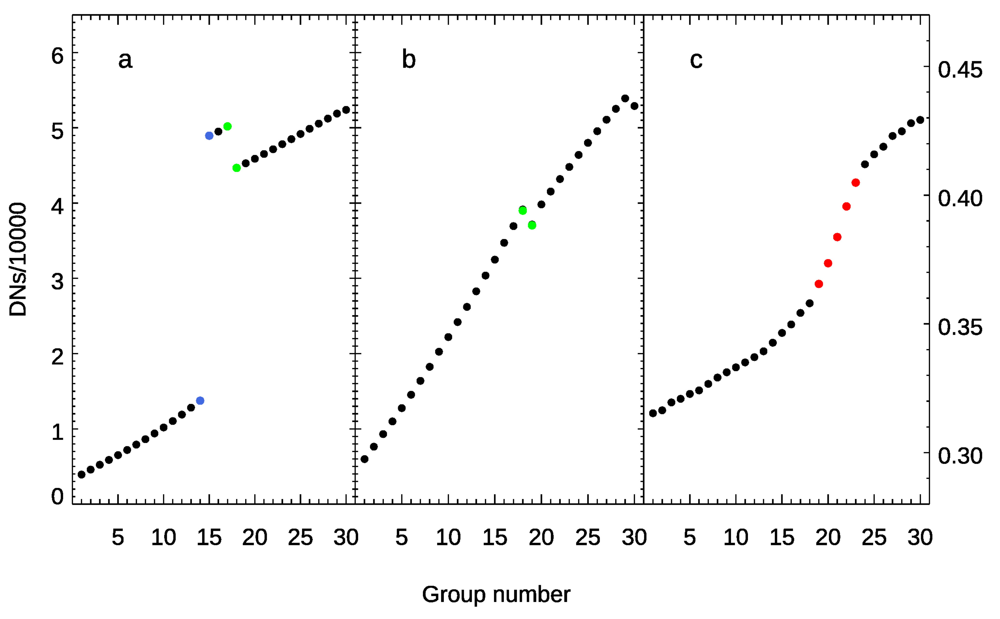
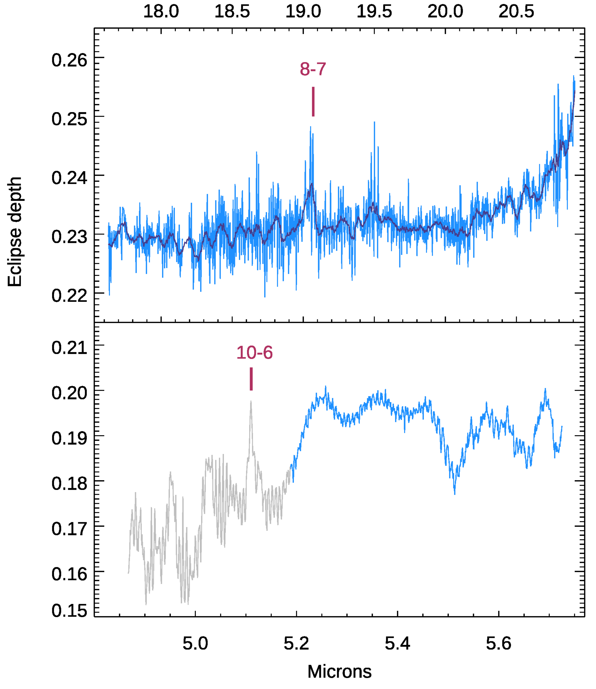
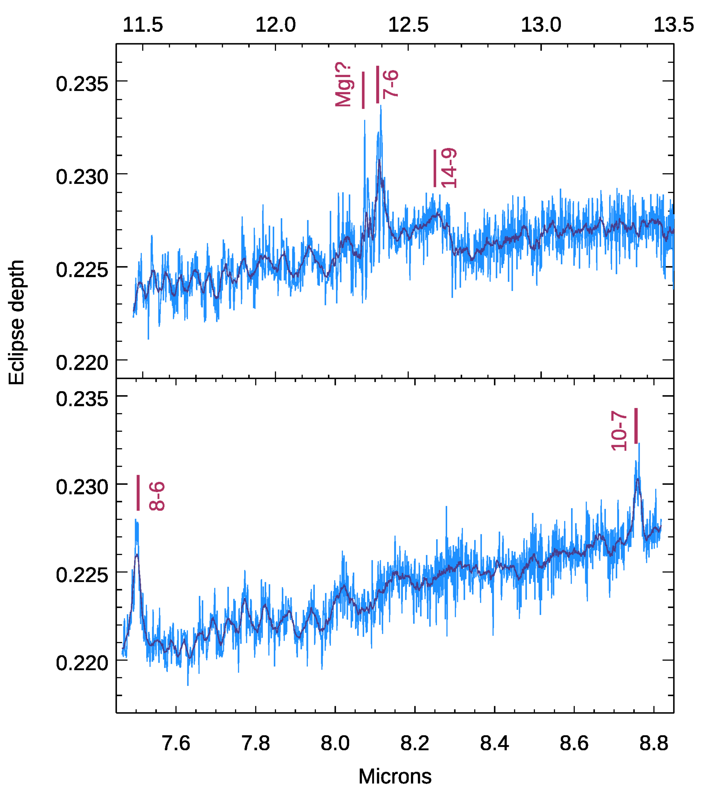
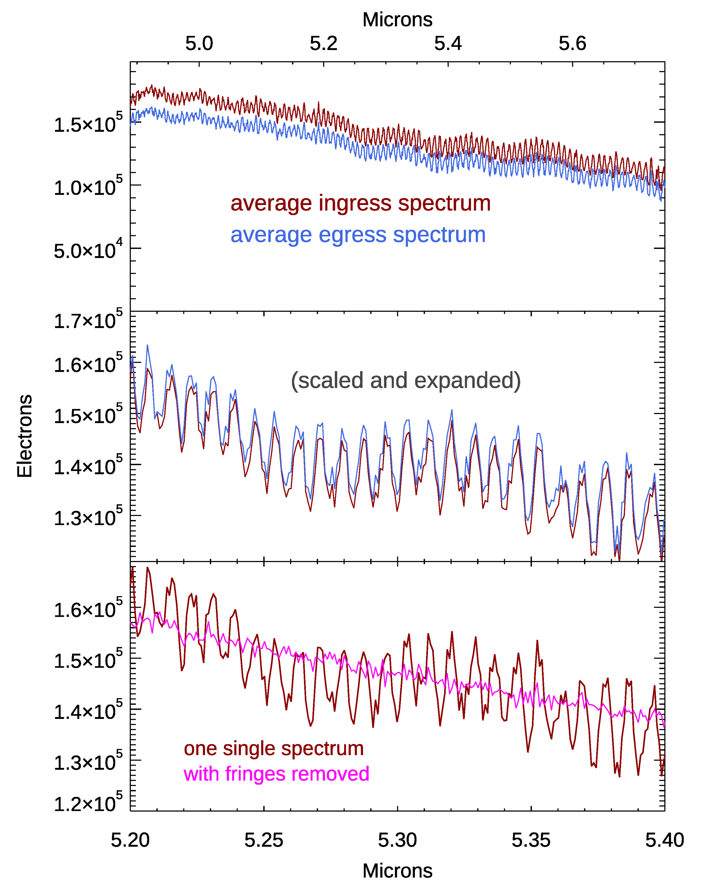

$\newcommand{\ensuremath}{}$
$\newcommand{\xspace}{}$
$\newcommand{\object}[1]{\texttt{#1}}$
$\newcommand{\farcs}{{.}''}$
$\newcommand{\farcm}{{.}'}$
$\newcommand{\arcsec}{''}$
$\newcommand{\arcmin}{'}$
$\newcommand{\ion}[2]{#1#2}$
$\newcommand{\textsc}[1]{\textrm{#1}}$
$\newcommand{\hl}[1]{\textrm{#1}}$
$\newcommand{\footnote}[1]{}$
$\newcommand{\vdag}{(v)^\dagger}$
$\newcommand$
$\newcommand$

# Toward Exoplanet Transit Spectroscopy Using JWST/MIRI's Medium Resolution Spectrometer

<mark>Appeared on: 2024-07-24</mark> -  _Accepted for PASP. 23 pages, 14 figures, 4 tables_

D. Deming, et al. -- incl., <mark>J. Bouwman</mark>

**Abstract:** The Mid-Infrared Instrument (MIRI)'s Medium Resolution Spectrometer (the MRS) on JWST has potentially important advantages for transit and eclipse spectroscopy of exoplanets, including lack of saturation for bright host stars, wavelength span to longward of 20 microns, and JWST's highest spectral resolving power.  We here test the performance of the MRS for time series spectroscopy by observing the secondary eclipse of the bright stellar eclipsing binary R Canis Majoris.  Our observations push the MRS into saturation at the shortest wavelength, more than for any currently known exoplanet system.  We find strong charge migration between pixels that we mitigate using a custom data analysis pipeline.  Our data analysis recovers much of the spatial charge migration by combining detector pixels at the group level, via weighting by the point spread function.  We achieve nearly photon-limited performance in time series data at wavelengths longward of 5.2 microns.  In 2017, Snellen et al. suggested that the MRS could be used to detect carbon dioxide absorption from the atmosphere of the temperate planet orbiting Proxima Centauri.  We infer that the relative spectral response of the MRS versus wavelength is sufficiently stable to make that detection feasible.  As regards the secondary eclipse of this Algol-type binary, we measure the eclipse depth by summing our spectra over the wavelengths in four channels, and also measuring the eclipse depth as observed by TESS.  Those eclipse depths require a temperature for the secondary star that is significantly hotter than previous observations in the optical to near-IR, probably due to irradiation by the primary star.  At full spectral resolution of the MRS, we find atomic hydrogen recombination emission lines in the secondary star, from principal quantum levels $n=$ 7, 8, 10, and 14.

**Figure 2. -** Examples of non-ideal ramps in the R CMa data, using the brightest portion of the spectrum (channel 1 in grating position A/SHORT).  The points in blue, green, and red are real data points, but are plotted in color to call attention to the effects we discuss.  Panels 'a' and 'b' show jumps in the data.  The blue points mark a positive jump due to a cosmic ray hit.  The green points in panels a and b show negative jumps. Panel c shows the brighter-fatter effect; the red points mark an increase in slope due to charge migration from an adjoining pixel.  The Y-axes are in data numbers (DNs) divided by 10,000; read the left axis for panels a and b, panel c axis on the right. (*fig: first_group*)

**Figure 11. -** Left: Secondary eclipse spectrum of R CMa in channel-1 (bottom) and channel-4 (top).  The portion of the channel-1 spectrum plotted in gray is deemed unreliable due to saturation (see \S\ref{sec: saturation}). Right: Eclipse spectrum in channels 2 (bottom) and 3 (top).  All spectra are plotted at single-pixel resolution (light blue), and smoothed over 10-pixels (dark blue).  Several hydrogen recombination emission lines are marked, with their upper and lower levels noted.  For example, the n=7 to n=6 line of atomic hydrogen is seen prominently at 12.37 $\mu$m.  See text for discussion of the spectral features. (*fig: spectra_hydrogen*)

**Figure 12. -** Spectral fringes in the MRS spectra of R CMa.  _ Top panel (wavelength scale at top):_ Average of all integrations for a single spatial slice at both ingress and egress. Note the similarity of the fringe pattern for those two visits, that are separated by 18 days. _ Middle panel (wavelength scale at bottom):_ Expansion of the fringes from the top panel in both wavelength and electron number, and normalization to equal signals, so that the similarity of the fringes at both visits is more apparent.  _ Bottom panel (wavelength scale at bottom):_ Spectrum of a randomly selected single integration during ingress, with the defringed spectrum for that integration overplotted. (*fig: fringes*)

