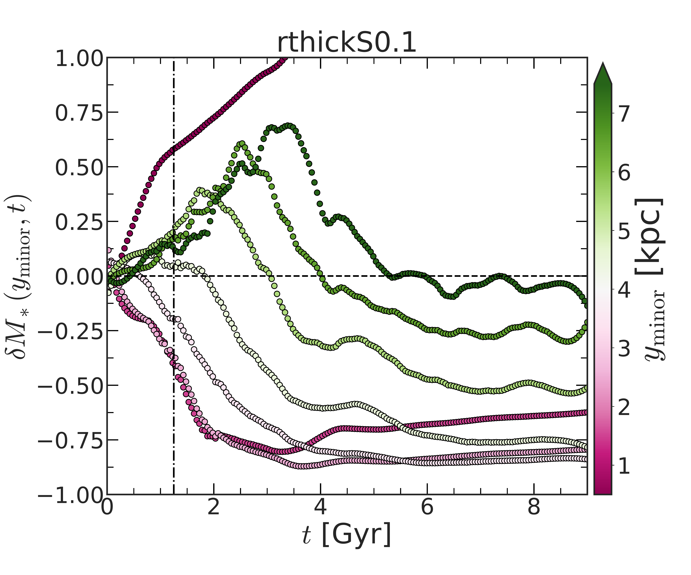
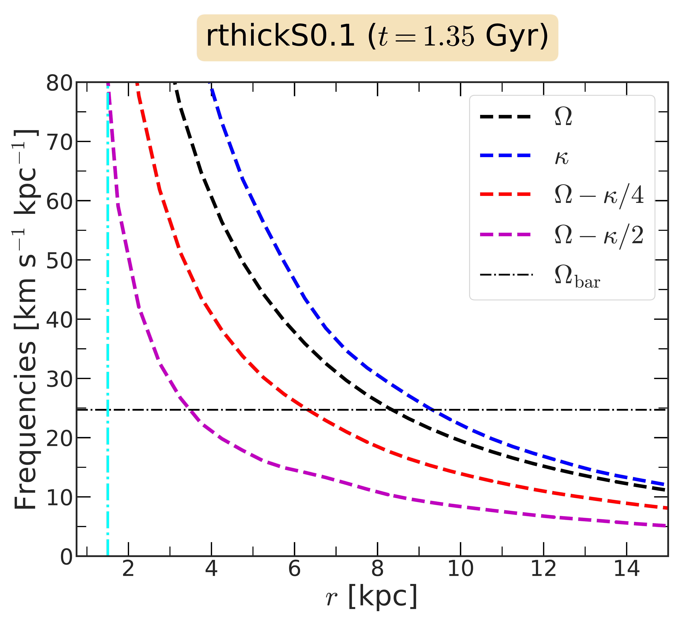

$\newcommand{\ensuremath}{}$
$\newcommand{\xspace}{}$
$\newcommand{\object}[1]{\texttt{#1}}$
$\newcommand{\farcs}{{.}''}$
$\newcommand{\farcm}{{.}'}$
$\newcommand{\arcsec}{''}$
$\newcommand{\arcmin}{'}$
$\newcommand{\ion}[2]{#1#2}$
$\newcommand{\textsc}[1]{\textrm{#1}}$
$\newcommand{\hl}[1]{\textrm{#1}}$
$\newcommand{\footnote}[1]{}$
$\newcommand{\kms}{\mbox{\>{\rm km  s^{-1}}}}$
$\newcommand{\pc}{\>{\rm pc}}$
$\newcommand{\kpc}{\mbox{\>{\rm kpc}}}$
$\newcommand{\kkms}{\mbox{\>{\rm kpc  km  s^{-1}}}}$
$\newcommand{\kmsk}{\mbox{\>{\rm km  s^{-1}  kpc^{-1}}}}$
$\newcommand{\Gyr}{\mbox{\>{\rm Gyr}}}$
$\newcommand{\Myr}{\mbox{\>{\rm Myr}}}$
$\newcommand{\yr}{\mbox{\>{\rm yr}}}$
$\newcommand{\Msun}{\>{\rm M_{\odot}}}$
$\newcommand{\Rd}{\mbox{R_{\rm d}}}$
$\newcommand{\zd}{\mbox{z_{\rm d}}}$
$\newcommand{\md}{\mbox{M_{\rm d}}}$
$\newcommand{\vgsr}{\mbox{V_{\rm GSR}}}$
$\newcommand$
$\newcommand$
$\newcommand$
$\newcommand{\avg}[1]{\mbox{\left<{#1}\right>}}$
$\newcommand{\sig}[1]{\mbox{\sigma_{#1}}}$
$\newcommand{\feh}{\mbox{\rm[Fe/H]}}$
$\newcommand{\al}{\mbox{\rm \alpha}}$
$\newcommand{\alfe}{\mbox{\rm[O/Fe]}}$
$\newcommand{\tf}{\mbox{\tau}}$
$\newcommand{\rs}{\mbox{R_s}}$
$\newcommand{\abar}{\mbox{A_{\rm bar}}}$
$\newcommand{\vb}{\mbox{V_{\rm breath}}}$
$\newcommand{\vbend}{\mbox{V_{\rm bend}}}$
$\newcommand$
$\newcommand{\update}[1]{\textbf{\color{cyan} #1}}$

# Closing the gap: secular evolution of bar-induced dark gaps in presence of thick discs

<mark>Appeared on: 2024-07-24</mark> -  _13 pages, 12 figures, 1 table (including appendix), accepted for publication in MNRAS_

<mark>S. Ghosh</mark>, et al.

**Abstract:** The presence of dark gaps, a preferential light deficit along the bar minor axis, is observationally well known. The properties of dark gaps are thought to be associated with the properties of bars, and their spatial locations are often associated with bar resonances. However, a systematic study, testing the robustness and universality of these assumptions, is still largely missing.  Here, we investigate the formation and evolution of bar-induced dark gaps using a suite of $N$ -body models of (kinematically cold) thin and (kinematically hot) thick discs with varying thick disc mass fraction, and different thin-to-thick disc geometry. We find that dark gaps are a natural consequence of the trapping of disc stars by the bar. The properties of dark gaps (such as strength and extent) are well correlated with the properties of bars. For stronger dark gaps, the fractional mass loss along the bar minor axis can reach up to $\sim 60-80$ percent of the initial mass contained, which is redistributed within the bar. These trends hold true irrespective of the mass fraction in the thick disc and the assumed disc geometry.In all our models harbouring slow bars, none of the resonances (corotation, Inner Lindblad resonance, and 4:1 ultra-harmonic resonance) associated with the bar correspond to the location of dark gaps, thereby suggesting that the location of dark gaps is not a _universal proxy_ for these bar resonances, in contrast with earlier studies.

**Figure 11. -** Face-on surface brightness distribution, calculated at the end of the simulation run ($t = 9 $\Gyr$$), for all thin+thick models considered here.
Black solid lines denote the contours of constant surface brightness. For each case, the bar is placed along the $x$-axis. The magenta and the blue dashed lines denote the bar major and minor axis, respectively. The black dashed circle denotes the location of maximum brightness contrast ($\Delta \mu_{\rm max}$), for details see the text. _Left panels_ show the surface brightness distribution for the rthickS models whereas  _middle panels_ and _right panels_ show the surface brightness distribution for the rthickE  and rthickG models, respectively. The thick disc fraction ($f_{\rm thick}$) varies from 0.1 to 0.9 (top to bottom), as indicated in the left-most panel of each row. A magnitude zero-point ($m_0$) of $22.5$ mag arcsec$^{-2}$ and  $\Upsilon_{T}/\Upsilon_{t}$ =1.2 are used to create the surface brightness from the intrinsic particle distribution. Here, 1 arcsec = $1 $\kpc$$. (*fig:densmap_endsteps_appendix*)

**Figure 1. -** Fractional mass loss, at different spatial locations along the bar minor axis, $\delta M_{*} (y_{\rm minor}, t)$(Eq. \ref{eq:mass_loss_FranStyle}), as a function of time for the thin+thick model rthickS0.1. The colour bar shows the spatial locations along the bar minor axis. The vertical dash-dotted line denotes the epoch of bar formation, $\tau_{\rm bar}$. $1 < y_{\rm minor}/ $\kpc$ < 5$ denotes the region of the dark gap. For details, see section \ref{sec:mass_loss_growth}. (*fig:mass_loss_along_minorAxis_FranStyle*)

**Figure 2. -** Radial variation of the circular frequency ($\Omega$), epicyclic frequency ($\kappa$), $\Omega -\kappa/2$, and $\Omega- \kappa/4$(see the legend), calculated at $t = 1.35 $\Gyr$$ for the model rthickS0.1. The horizontal dash-dotted black line denotes the bar pattern speed ($\Omega_{\rm bar}$) at that epoch while the vertical cyan line denotes the location of the dark gap ($R_{\rm DG}$) at the same epoch. (*fig:circularVel_example*)

