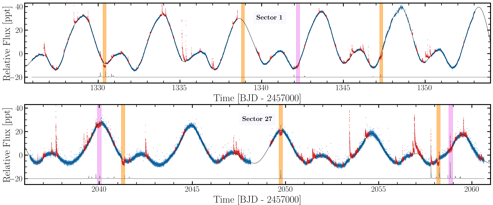
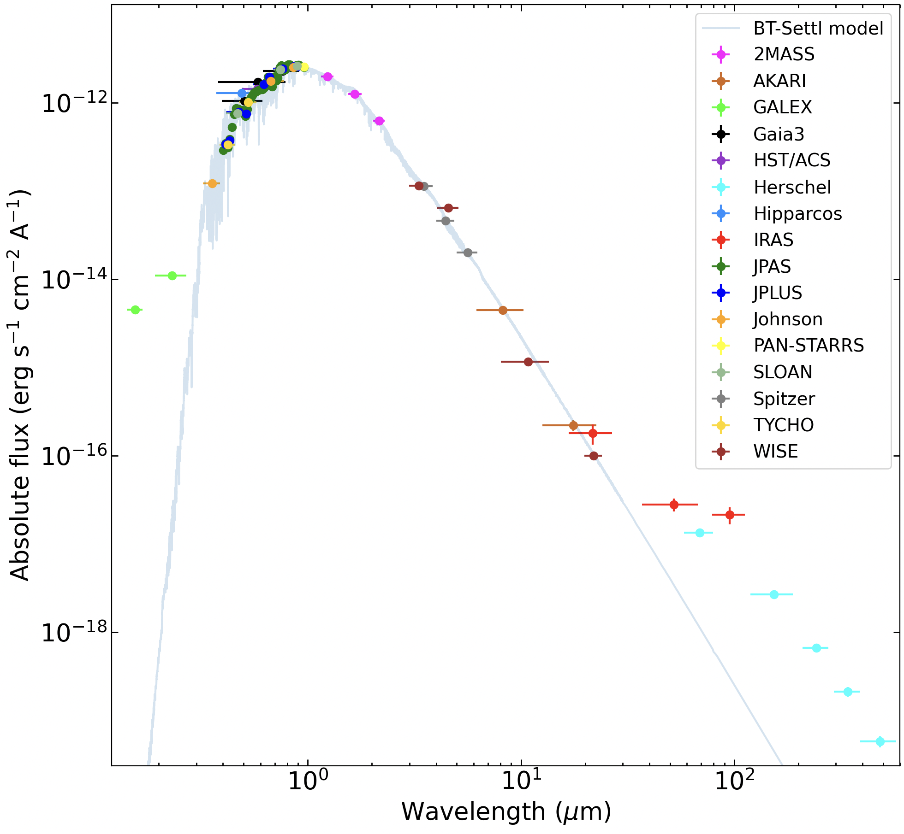
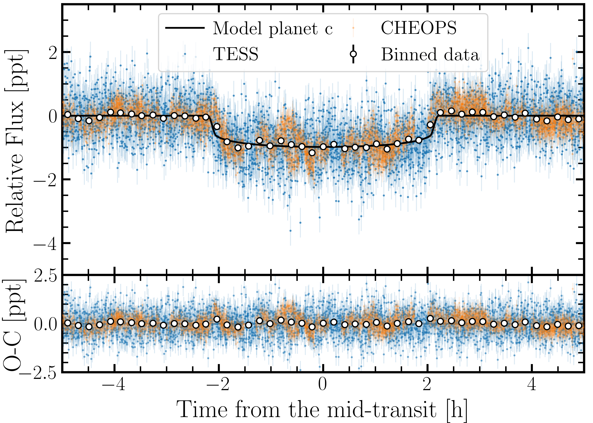

$\newcommand{\ensuremath}{}$
$\newcommand{\xspace}{}$
$\newcommand{\object}[1]{\texttt{#1}}$
$\newcommand{\farcs}{{.}''}$
$\newcommand{\farcm}{{.}'}$
$\newcommand{\arcsec}{''}$
$\newcommand{\arcmin}{'}$
$\newcommand{\ion}[2]{#1#2}$
$\newcommand{\textsc}[1]{\textrm{#1}}$
$\newcommand{\hl}[1]{\textrm{#1}}$
$\newcommand{\footnote}[1]{}$
$\newcommand{\arraystretch}{1.2}$
$\newcommand{\arraystretch}{1.2}$
$\newcommand{\arraystretch}{1.25}$
$\newcommand{\arraystretch}{1.3}$
$\newcommand{\arraystretch}{1.3}$
$\newcommand\hyper{@linkstart##1##2 $
$}$
$\newcommand\hyper{@linkstart##1##2 $
$}$
$\newcommand\hyper{@linkstart##1##2 $
$}$
$\newcommand\hyper{@linkstart##1##2 $
$}$

# Revisiting the dynamical masses of the transiting planets in the young AU Mic system: Potential AU Mic b inflation at $\sim$20 Myr$\thanks{Full Tables \ref{tab:rv_CARMV}, \ref{tab:rv_CARMN}, \ref{tab:rv_HARPS}, and \ref{tab:rv_SPIRou} are only available in electronic form at the CDS via anonymous ftp to cdsarc.u-strasbg.fr (130.79.128.5) or via \url{http://cdsweb.u-strasbg.fr/cgi-bin/qcat?J/A+A/}}$

<mark>Appeared on: 2024-07-24</mark> -  _Accepted in A&A. 28 pages, 15 figures_

M. Mallorquín, et al. -- incl., <mark>T. Henning</mark>

**Abstract:** Understanding planet formation is important in the context of the origin of planetary systems in general and of the Solar System in particular, as well as to predict the likelihood of finding Jupiter, Neptune, and Earth analogues around other stars. We aim to precisely determine the radii and dynamical masses of transiting planets orbiting the young M star AU Mic using public photometric and spectroscopic datasets. We performed a joint fit analysis of the TESS and CHEOPS light curves and more than 400 high-resolution spectra collected with several telescopes and instruments. We characterise the stellar activity and physical properties (radius, mass, density) of the transiting planets in the young AU Mic system through joint transit and radial velocity fits with Gaussian processes. We determine a radius of $R_{p}^{b}$ = 4.79 $\pm$ 0.29 R $_\oplus$ , a mass of $M_{p}^{b}$ = 9.0 $\pm$ 2.7 M $_\oplus$ , and a bulk density of $\rho_{p}^{b}$ = 0.49 $\pm$ 0.16 g cm $^{-3}$ for the innermost transiting planet AU Mic b. For the second known transiting planet, AU Mic c, we infer a radius of $R_{p}^{c}$ = 2.79 $\pm$ 0.18 R $_\oplus$ , a mass of $M_{p}^{c}$ = 14.5 $\pm$ 3.4 M $_\oplus$ , and a bulk density of $\rho_{p}^{c}$ = 3.90 $\pm$ 1.17 g cm $^{-3}$ . According to theoretical models, AU Mic b may harbour an H $_{2}$ envelope larger than 5 \% by mass, with a fraction of rock and a fraction of water. AU Mic c could be made of rock and/or water and may have an H $_{2}$ atmosphere comprising at most 5 \% of its mass. AU Mic b has retained most of its atmosphere but might lose it over tens of millions of years due to the strong stellar radiation, while AU Mic c likely suffers much less photo-evaporation because it lies at a larger separation from its host. Using all the datasets in hand, we determine a 3 $\sigma$ upper mass limit of $M_{p}^{[d]}\sin{i}$ = 8.6 M $_{\oplus}$ for the AU Mic 'd' TTV-candidate. In addition, we do not confirm the recently proposed existence of the planet candidate AU Mic 'e' with an orbital period of 33.4 days. We investigated the level of the radial velocity variations and show that it is lower at longer wavelength with smaller changes from one observational campaign to another.

**Figure 10. -** TESS light curve of AU Mic. The PDCSAP flux used in the analysis is shown as blue dots. The data considered as flares or transits are shown as red dots. The black and grey lines represent the stellar activity models for the stellar rotation and for the flares, respectively. The flare model was vertical shifted for a better visualisation. The vertical orange and purple bands indicate the timing of the planetary transits for AU Mic b and c, respectively. (*fig:LC_TESS*)

**Figure 1. -** Photometric SED of AU Mic (coloured dots) covers 0.13 $\mu$m to 670 $\mu$m. The photospheric emission of a 3600 K dwarf with solar metallicity is shown by the blue line \citep[BT-Settl model;][]{Allard2012}. AU Mic shows significant flux excesses at wavelengths shorter than 0.3 $\mu$m and longer than 40 $\mu$m, which are compatible with stellar activity and the presence of a circumstellar debris disc \citep{Kalas2004}, respectively. Horizontal error bars account for the width of the filter passbands. Effective wavelengths and widths of the passbands are taken from the Virtual Observatory filter database \citep{bayo2008}. (*fig:SED*)

**Figure 5. -** Phase-folded light curves around transits of AU Mic b (top panel) and AU Mic c (bottom panel) for the alternative transit model. In each sub-panel, the TESS (blue dots) and CHEOPS data (orange dots) are shown, along with the binned data (white dots), the best TESS transit-fit model (black line) in the top, and the residuals from the best-fit in the bottom.
 (*fig:PH_folded*)

