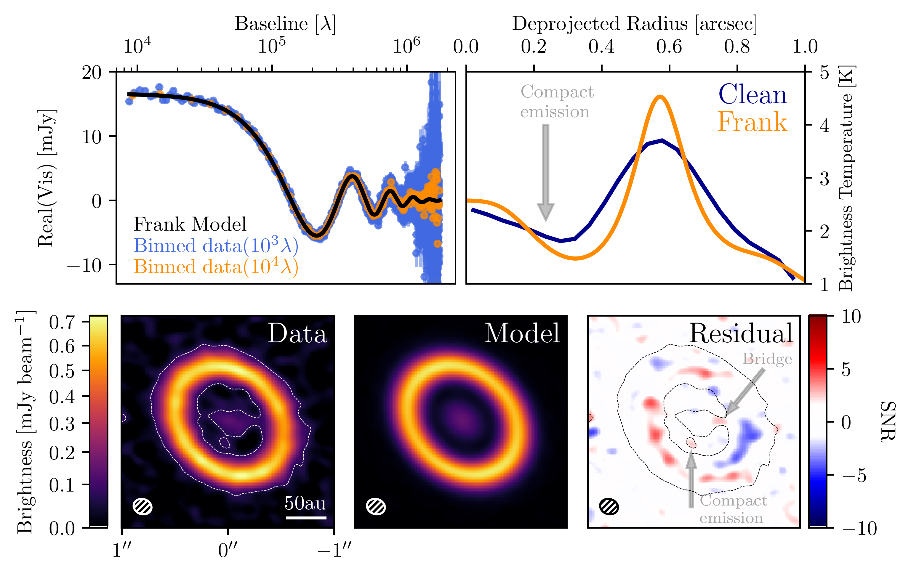
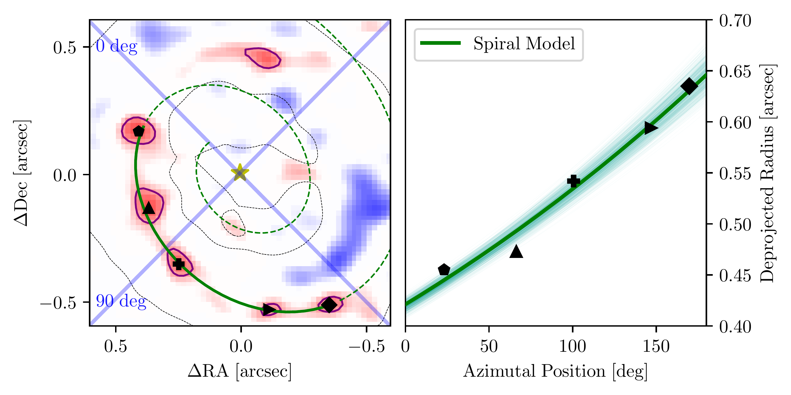
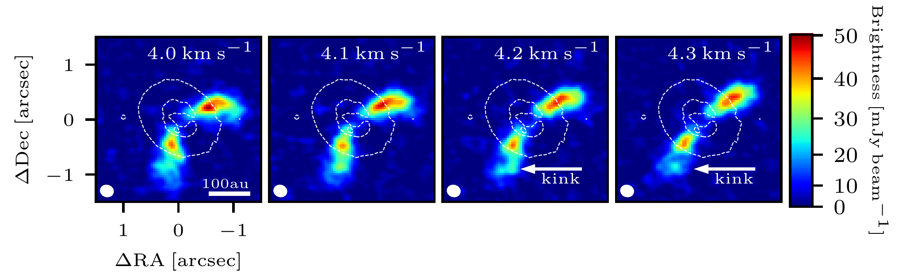

$\newcommand{\ensuremath}{}$
$\newcommand{\xspace}{}$
$\newcommand{\object}[1]{\texttt{#1}}$
$\newcommand{\farcs}{{.}''}$
$\newcommand{\farcm}{{.}'}$
$\newcommand{\arcsec}{''}$
$\newcommand{\arcmin}{'}$
$\newcommand{\ion}[2]{#1#2}$
$\newcommand{\textsc}[1]{\textrm{#1}}$
$\newcommand{\hl}[1]{\textrm{#1}}$
$\newcommand{\footnote}[1]{}$
$\newcommand{\vdag}{(v)^\dagger}$
$\newcommand$
$\newcommand$

# Hints of planet formation signatures in a large-cavity disk \ studied in the AGE-PRO ALMA Large Program

<mark>Appeared on: 2024-07-24</mark> -  _24 pages, 15 figures_

A. Sierra, et al. -- incl., <mark>K. Schwarz</mark>

**Abstract:** Detecting planet signatures in protoplanetary disks is fundamental to understanding how and where planets form. In this work, we report dust and gas observational hints of planet formation in the disk around 2MASS-J16120668-301027, as part of the ALMA Large Program "AGE-PRO: ALMA survey of Gas Evolution in Protoplanetary disks". The disk was imaged with the Atacama Large Millimeter/submillimeter Array (ALMA) at Band 6 (1.3 mm) in dust continuum emission and four molecular lines: $^{12}$ CO(J=2-1), $^{13}$ CO(J=2-1),  C $^{18}$ O(J=2-1), and $H_2$ CO(J=3 $_{(3,0)}$ -2 $_{(2,0)}$ ).Resolved observations of the dust continuum emission (angular resolution of $\sim 150$ mas, 20 au) show a ring-like structure with a peak at $0.57 ^{\prime \prime}$ (75 au), a deep gap with a minimum at 0.24 $^{\prime \prime}$ (31 au), an inner disk, a bridge connecting the inner disk and the outer ring, along with a spiral arm structure, and a tentative detection (to $3\sigma$ ) of a compact emission at the center of the disk gap, with an estimated dust mass of $\sim 2.7-12.9$ Lunar masses.  We also detected a kinematic kink (not coincident with any dust substructure) through several $^{12}$ CO channel maps (angular resolution $\sim$ 200 mas, 30 au), located at a radius of $\sim 0.875^{\prime \prime}$ (115.6 au).After modeling the $^{12}$ CO velocity rotation around the protostar, we identified a purple tentative rotating-like structure at the kink location with a geometry similar to that of the disk.We discuss potential explanations for the dust and gas substructures observed in the disk, and their potential connection to signatures of planet formation.

**Figure 11. -** Dust continuum modeling of the disk around J16120. Top left panel: Observed binned visibilities (blue and orange dots, at a bin size of $10^{3}$ and $10^{4} \lambda$, respectively), and visibility model (black curve) of the dust continuum data. Top right panel: Deprojected continuum radial profile from the image plane (blue curve) and from the visibility fit non-convolved model (orange curve). The arrow marks the radial position of the compact emission. Bottom left panel: CLEAN image of the dust continuum data. Bottom middle panel: CLEAN image of the visibility model. Bottom right panel: CLEAN image of the visibility residuals. The iso-contour in the bottom panels is at a 3$\sigma$ level. (*fig:continuum-analysis*)

**Figure 12. -** Spiral arm structure inferred from the disk azimuthal asymmetries. Left panel: Zoom into the residual map in Figure \ref{fig:continuum-analysis}. Black markers are the position of the spiral arm structure, the green solid line is the best fit spiral model, and its extrapolation is shown as a green dashed line. The purple lines around the red knots are 3$\sigma$ iso-contours.
    The blue lines at 0 and 90 degrees are the disk major and minor axis, respectively.
    Right panel: Azimuthal position and deprojected radius of the spiral arm structure (black markers), and best fit model (green solid line). The thin turquoise solid lines represent 1000 random chains from the posterior distribution. (*fig:continuum-residual*)

**Figure 13. -** Selected $^{12}$CO channel maps of J16120. The white iso-contour is taken from the dust continuum emission in Figure \ref{fig:continuum-analysis}. The synthesized beam and the channel velocity are shown in the bottom-left and top-right corner of each panel, respectively. The color bar is not linear but slightly adjusted to highlight the kink emission. (*fig:CO-channels*)

