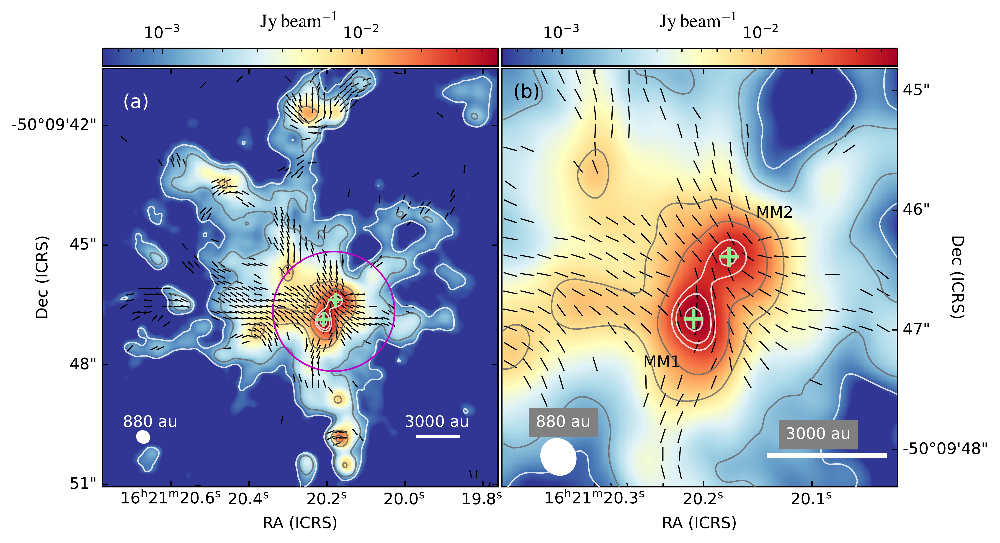
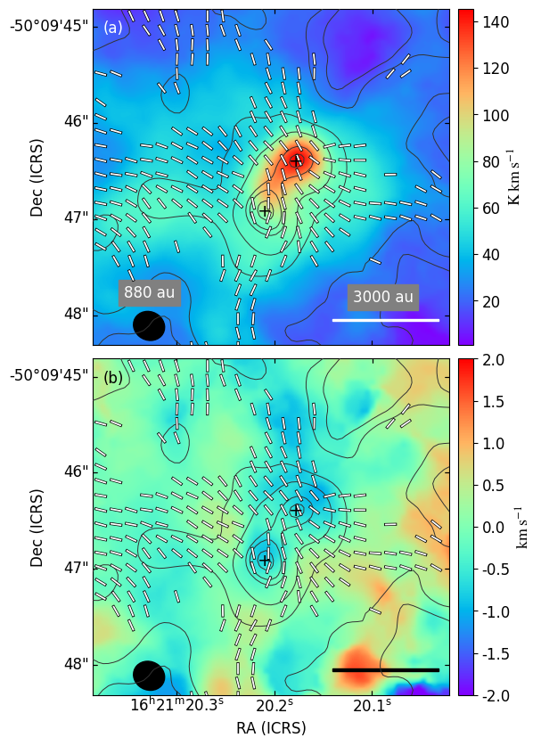
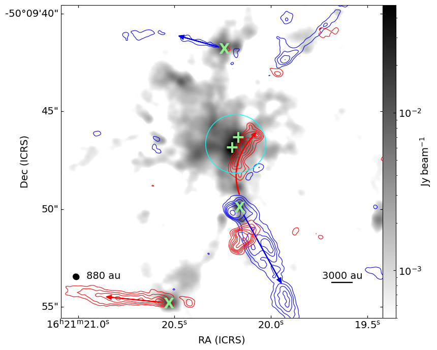

$\newcommand{\ensuremath}{}$
$\newcommand{\xspace}{}$
$\newcommand{\object}[1]{\texttt{#1}}$
$\newcommand{\farcs}{{.}''}$
$\newcommand{\farcm}{{.}'}$
$\newcommand{\arcsec}{''}$
$\newcommand{\arcmin}{'}$
$\newcommand{\ion}[2]{#1#2}$
$\newcommand{\textsc}[1]{\textrm{#1}}$
$\newcommand{\hl}[1]{\textrm{#1}}$
$\newcommand{\footnote}[1]{}$
$\newcommand{\bpos}{B_{\mathrm{pos}}}$

# Magnetic Fields in Massive Star-forming Regions (MagMaR): Unveiling an Hourglass Magnetic Field in G333.46$-$0.16 using ALMA

<mark>Appeared on: 2024-07-24</mark> - 

P. Saha, et al. -- incl., <mark>J. Liu</mark>, <mark>S. Li</mark>, <mark>H. Beuther</mark>

**Abstract:** $\noindent$ The contribution of the magnetic field to the formation of high-mass stars is poorly understood. We report the high-angular resolution ( $\sim0.3^{\prime\prime}$ , 870 au) map of the magnetic field projected on the plane of the sky ( $\bpos$ ) towards the high-mass star forming region G333.46 $-$ 0.16 (G333), obtained with the Atacama Large Millimeter/submillimeter Array (ALMA) at 1.2 mm as part of the Magnetic Fields in Massive Star-forming Regions (MagMaR) survey. The $\bpos$ morphology found in this region is consistent with a canonical "hourglass" which suggest a dynamically important field. This region is fragmented into two protostars separated by $\sim1740$ au. Interestingly, by analysing H $^{13}$ CO $^{+}$ ( $J=3-2$ ) line emission, we find no velocity gradient over the extend of the continuum which is consistent with a strong field. We model the $\bpos$ , obtaining a marginally supercritical mass-to-flux ratio of 1.43, suggesting a initially strongly magnetized environment. Based on the Davis–Chandrasekhar–Fermi method, the magnetic field strength towards G333 is estimated to be $5.7$ mG.The absence of strong rotation and outflows towards the central region of G333 suggests strong magnetic braking, consistent with a highly magnetized environment. Our study shows that despite being a strong regulator, the magnetic energy fails to prevent the process of fragmentation, as revealed by the formation of the two protostars in the central region.

**Figure 5. -** **(a)** The B$_\mathrm{POS}$ geometry (black line segments) towards G333, obtained after rotating the polarization segments by 90$^{\circ}$, overplotted on ALMA 1.2 mm dust continuum emission. The B$_\mathrm{POS}$ segments have arbitrary length and plotted above the 3$\sigma$($\sigma=29\mu$Jy beam$^{-1}$ for Stokes $Q$ and $U$) level. Contours correspond to dust continuum emission 5, 10, 50, 100, 190, 230, 300 and 340 times $\sigma$($=160 \mu$Jy beam$^{-1}$). The positions of MM1 and MM2 are marked as `+' symbols. The circle in magenta represents the area of analysis. The scale bar and the beamsize of 880 au are displayed on the bottom right and bottom left sides, respectively. The line segments are drawn following the Nyquist sampling (every three pixels each of size $0.05^{\prime\prime}$). **(b)** Magnified view of the area of analysis. Symbols are the same as in panel **(a)**. (*fig:bpos*)

**Figure 1. -** **(a)** The moment 0 or integrated intensity map of H$^{13}$CO$^{+}$ line emission. **(b)** The moment 1 or intensity weighted velocity map of the same. The white line segments show the B$_\mathrm{POS}$ geometry and the contours outline the dust continuum emission (same as Figure \ref{fig:bpos}). The positions of MM1 and MM2 are marked as `+' symbols. The scale bar and the spatial resolution are displayed on the bottom right and bottom left sides, respectively, in all panels. (*fig:mom_maps*)

**Figure 4. -** Molecular outflows identified in $^{12}$CO $(J=3-2)$ overplotted on our observed 1.2 mm dust continuum emission. The plus symbols mark the positions of MM1 and MM2. The circle in cyan shows the region of analysis. The blueshifted and redshifted outflows are shown in blue and red contours, respectively. The blue contours are drawn with levels 3,5,7,9,12, and 18 times 0.13 Jy beam$^{-1}$. The red contours are drawn with levels 3,5,7,9,11,15,20, and 25 times 0.10 Jy beam$^{-1}$. The possible sources driving the ouflows are marked using green `X' symbols. The red and blue arrows show the directions of the redshifted and blueshifted outflows, respectively. (*fig:outflow*)

