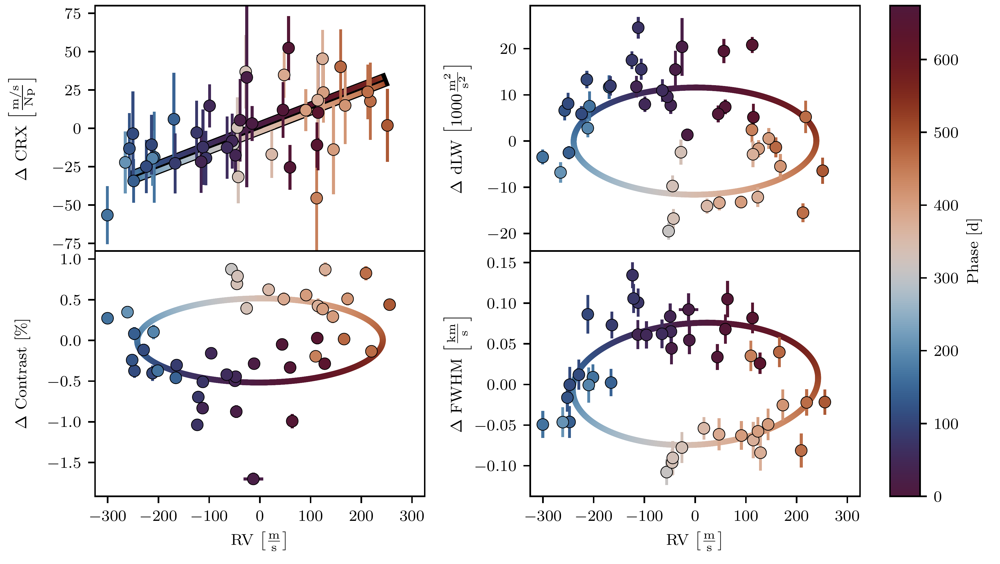
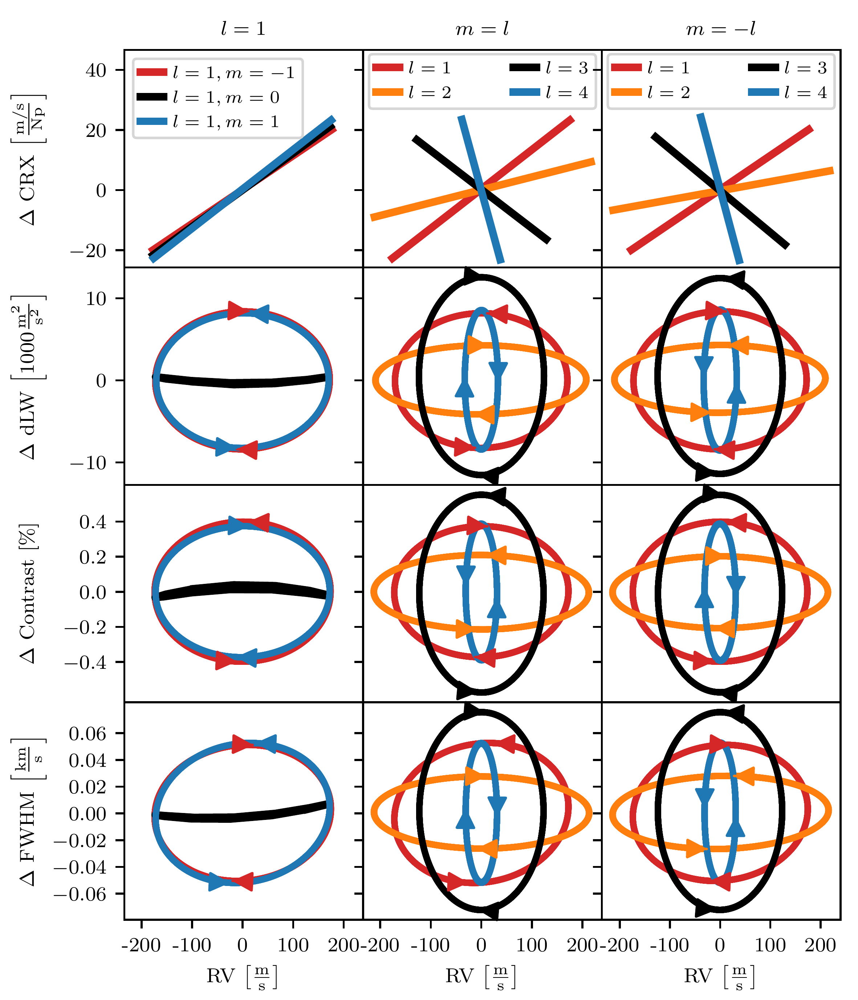
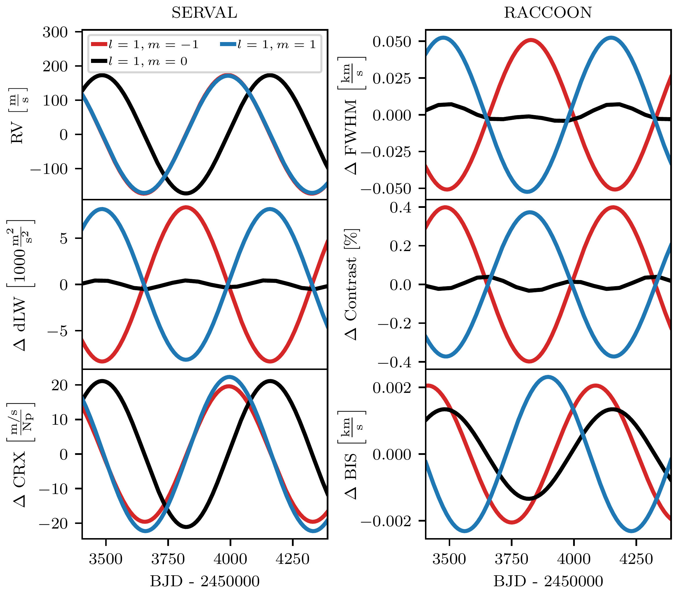

$\newcommand{\ensuremath}{}$
$\newcommand{\xspace}{}$
$\newcommand{\object}[1]{\texttt{#1}}$
$\newcommand{\farcs}{{.}''}$
$\newcommand{\farcm}{{.}'}$
$\newcommand{\arcsec}{''}$
$\newcommand{\arcmin}{'}$
$\newcommand{\ion}[2]{#1#2}$
$\newcommand{\textsc}[1]{\textrm{#1}}$
$\newcommand{\hl}[1]{\textrm{#1}}$
$\newcommand{\footnote}[1]{}$

# Non-radial oscillations mimicking a brown dwarf orbiting the cluster giant NGC 4349 No. 127

<mark>Appeared on: 2024-08-01</mark> -  _23 pages, 14 figures. Accepted in A&A. Abstract abridged for arXiv submission_

<mark>D. Spaeth</mark>, et al.

**Abstract:** Several evolved stars have been found to exhibit long-period radial velocity variations that cannot be explained by planetary or brown dwarf companions. Non-radial oscillations caused by oscillatory convective modes have been put forth as an alternative explanation, but no modeling attempt has yet been undertaken. We provide a model of a non-radial oscillation, aiming to explain the observed variations of the cluster giant NGC 4349 No. 127. The star was previously reported to host a brown dwarf companion, but whose existence was later refuted in the literature. We reanalyzed 58 archival HARPS spectra of the intermediate-mass giant NGC 4349 No. 127. We reduced the spectra using the SERVAL and RACCOON pipelines, acquiring additional activity indicators. We searched for periodicity in the indicators and correlations between the indicators and radial velocities. We further present a simulation code able to produce synthetic HARPS spectra, incorporating the effect of non-radial oscillations, and compare the simulated results to the observed variations. We discuss the possibility that non-radial oscillations cause the observed variations. We find a positive correlation between chromatic index and radial velocity, along with closed-loop Lissajous-like correlations between radial velocity and each of the spectral line shape indicators (full width at half maximum, and contrast of the cross-correlation function and differential line width). Simulations of a low-amplitude, retrograde, dipole ( $l=1, m=1$ ), non-radial oscillation can reproduce the observed behavior and explain the observables. Photometric variations below the detection threshold of the available ASAS-3 photometry are predicted. The oscillation and stellar parameters are largely in agreement with the prediction of oscillatory convective modes. The periodic variations of the radial velocities and activity indicators, along with the respective phase shifts, measured for the intermediate-mass cluster giant NGC 4349 No. 127, can be explained by a non-radial oscillation.

**Figure 8. -** Observed (data points) and simulated (lines) correlations between the activity indicators and the RVs for 44 spectra taken prior to the HARPS fiber change. For each panel, the mean (RV and any of the indicators, respectively) was subtracted.
    Each data point is color-coded with the phase according to the best RV period $P=674.0 \mathrm{d}$.
    While the CRX (top left) shows a significant positive correlation with the RVs (r=0.54, $p(_F_\textrm{-test})=0.002\%$), dLW, FWHM, and contrast of the CCF are correlated with the RVs in a closed-loop behavior.
    We plot the linear (CRX) and elliptical fits (dLW, FWHM, contrast) to the simulated data points for the best model of a $l=1, m=1$ oscillation mode as solid lines applying the same color-coding. As a linear relationship is predicted between CRX and RV, we plot the ascending and descending phase relations on top of the black fit to the simulations. The simulated ellipses can closely reproduce the observed behavior including the amplitudes, phases, and directions of correlation. (*fig:corr*)

**Figure 11. -** Correlation plots between the activity indicators and the RVs for modes with $l=1$(left column), $m=l$(center column), and $m=-l$(right column). Linear correlations were fitted for the correlation between CRX and RV. For the line shape diagnostics, ellipses were fitted when appropriate. Arrows indicate the temporal dependence of the ellipses. The individual modes are specified in the legend at the top of each column. The simulated dLW variations were rescaled with a common factor of $0.1$. (*fig:supercorrelation*)

**Figure 10. -** RVs and activity indicators of dipole oscillation modes plotted against time at inclination angle $i=45◦$. Sinusoids were fitted to all time series except for the FWHM, dLW, and contrast in case of $m=0$, for which the simulated points were interconnected. While all three modes cause similar RV variations (top left panel), the phase relations between the RVs and the line shape indicators, as well as their amplitudes, are notably different. The CRX (bottom left) shows a similar behavior for all three modes. The dLW variations were rescaled with a common factor of $0.1$. (*fig:l1_time*)

