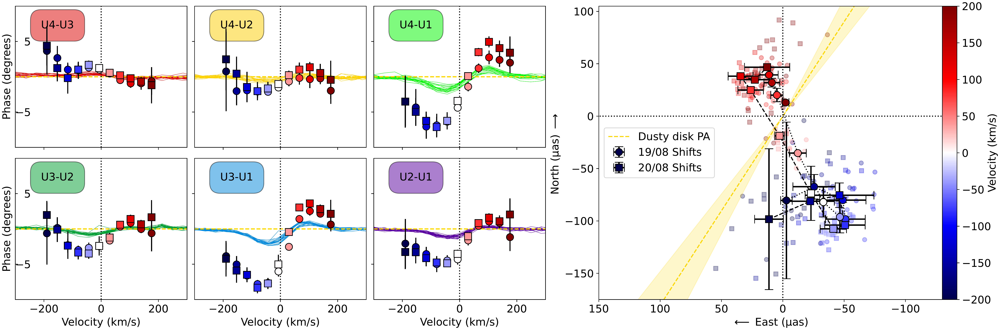
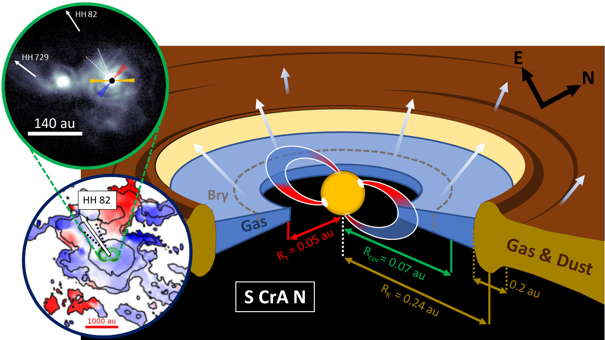

$\newcommand{\ensuremath}{}$
$\newcommand{\xspace}{}$
$\newcommand{\object}[1]{\texttt{#1}}$
$\newcommand{\farcs}{{.}''}$
$\newcommand{\farcm}{{.}'}$
$\newcommand{\arcsec}{''}$
$\newcommand{\arcmin}{'}$
$\newcommand{\ion}[2]{#1#2}$
$\newcommand{\textsc}[1]{\textrm{#1}}$
$\newcommand{\hl}[1]{\textrm{#1}}$
$\newcommand{\footnote}[1]{}$
$\newcommand{\muas}{\upmu\rm{as}}$
$\newcommand{\ms}{m s^{-1}}$
$\newcommand{\kms}{km.s^{-1}}$
$\newcommand{\vsini}{v\sin i}$
$\newcommand{\vsinia}{v\sin i_{\rm A}}$
$\newcommand{\vsinib}{v\sin i_{\rm B}}$
$\newcommand{\vrad}{v_{\rm rad}}$
$\newcommand{\vmic}{v_{\rm mic}}$
$\newcommand{\vmac}{v_{\rm th}}$
$\newcommand{\msun}{M_{\odot}}$
$\newcommand{\msunpyr}{M_{\odot}.yr^{-1}}$
$\newcommand{\Lsun}{L_\odot}$
$\newcommand{\rsun}{R_{\odot}}$
$\newcommand{\bl}{B_{\ell}}$
$\newcommand{\bd}{B_{\rm D}}$
$\newcommand{\ddeg}{^{\circ}}$
$\newcommand{\te}{T_{\rm eff}}$
$\newcommand{\logg}{\log{g}}$
$\newcommand{\prot}{P_{\rm rot}}$
$\newcommand{\Brgam}{Br\gamma}$
$\newcommand{\Th}{^\text{th}}$

# The GRAVITY young stellar object survey

<mark>Appeared on: 2024-08-06</mark> - 

G. Collaboration, et al. -- incl., <mark>M. Benisty</mark>, <mark>P. Garcia</mark>, <mark>T. Henning</mark>, <mark>S. Scheithauer</mark>

**Abstract:** The dust- and gas-rich protoplanetary disks around young stellar systems play a key role in star and planet formation. While considerable progress has recently been made in probing these disks on large scales of a few tens of astronomical units (au), the central au needs to be more investigated. We aim at unveiling the physical processes at play in the innermost regions of the strongly accreting T Tauri Star S CrA N by means of near-infrared interferometric observations. As recent spectropolarimetric observations suggested that S CrA N might undergo intense ejection processes, we focus on the accretion-ejection phenomena and on the star-disk interaction region. We obtained interferometric observations with VLTI/GRAVITY in the K-band during two consecutive nights in August 2022. The analysis of the continuum emission, coupled with the differential analysis acrossthe $\Brgam$ line, allows us to constrain the morphology of the dust and gas distribution in the innermost regions of S CrA N and to investigate their temporal variability. These observations are compared to magnetospheric accretion/ejection models of T Tauri stars and to previous observations to describe the physical processes operating in these regions. The K-band continuum emission is well reproduced with an azimuthally-modulated dusty ring with a half-light radius of 0.24 au ( $\sim$ 20 $R_*$ ), an inclination of $\sim$ 30 $\ddeg$ , and a position angle of $\sim$ 150 $\ddeg$ . As the star alone cannot explain such a large sublimation front, we propose that magnetospheric accretion is an important dust-heating mechanism leading to this continuum emission. The $\Brgam$ emitting region (0.05-0.06 au; 5-7 $R_*$ ) is found to be more compact than the continuum, and of the order or larger than the size of the magnetospheric truncation radius. The on-sky displacements across the $\Brgam$ spectral channels are aligned along a position angle offset by 45 $\ddeg$ from the disk, and extend up to 2 $R_*$ . This is in agreement with radiative transfer models combining magnetospheric accretion and disk winds. These on-sky displacements remain unchanged from one night to the other, while the line flux decreases by 13 \% , suggesting a dominant contribution of wind for the origin of the $\Brgam$ line. Our observations support an origin of the $\Brgam$ line from a combination of (variable) accretion-ejection processes in the inner disk region.

**Figure 7. -** $\Brgam$ differential interferometric observables of S CrA N: Squared differential visibilities (left); Differential phases (middle); u-v plane coverage (upper-right); Line-to-continuum flux ratio in the reference frame of the star, LSR- tellurics-corrected (lower-right). Each color used in the u-v coverage plot corresponds to an interferometric baseline and is consistent from one panel to the other. For the interferometric observables, the plots include the quantities for each frame (solid lines), the median for August 19 (circles), and for August 20 (squares). Uncertainties are given in all plots (vertical bars), and are smaller than the symbol if not visible. Grey shaded regions correspond to the velocities that are not considered for our $\Brgam$ line analysis (see text for details). (*fig:BrGam_Data*)

**Figure 8. -** Asymmetry of the $\Brgam$ emitting region of S CrA N. Left : pure-line differential phases. The pure line differential phases are depicted by blue-to-red color coded symbols for August 19 (circles), and for August 20 (squares), while the observed phases for each individual observation (similar to Fig. \ref{fig:BrGam_Data}) are depicted in solid lines, with their color corresponding to their baseline. Right : on-sky photocenter shifts with respect to the continuum photocenter (in (0, 0) as a function of velocity (coded from blue to red colors).
    The light yellow cones correspond to the uncertainties on the major axis orientation of the inner dusty disk. The background symbols are the displacements obtained from individual files.  (*fig:shifts*)

**Figure 9. -** S CrA N at different scales. Right: Representation of the star-disk interaction region (not to scale), with the characteristic sizes derived in this work. {The obliquity of the magnetosphere is just illustrative as no consolidated value exists}. Top-left: SPHERE polarized intensity image from [Zhang, Ginski and Huang (2023)](), and the directions toward the HH objects associated to S CrA. We also reported the PA of the dusty disk measured from the K-band continuum and the orientation of photocenter shifts as yellow, red and blue cones, respectively. Dashed cones highlight the suggested outflow emission (see text). Bottom-left: ALMA $^{12}$CO(2-1) first moment map from [Gupta, Miotello and Manara (2023)](). The cone is reported from the SPHERE observations, and the HH82 direction is indicated. Both images have been rotated to have the same orientation as the sketch, where the North and East directions are shown. (*fig:schema_scales*)

