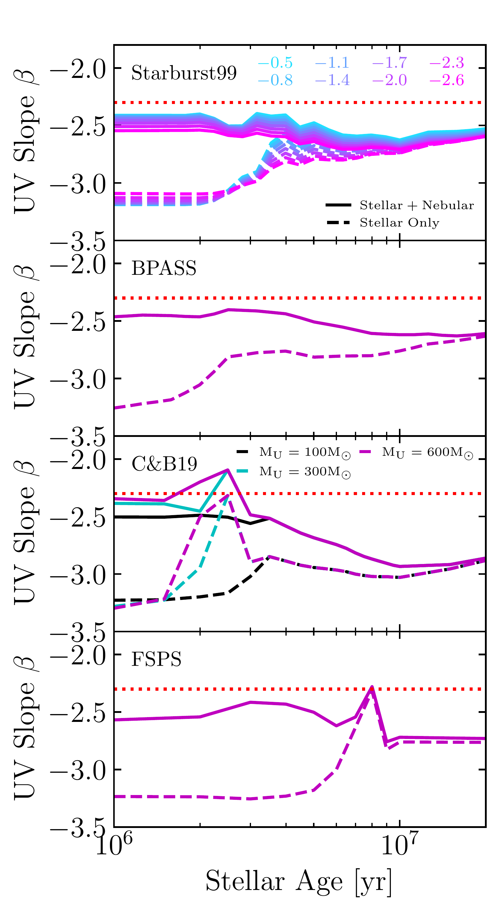
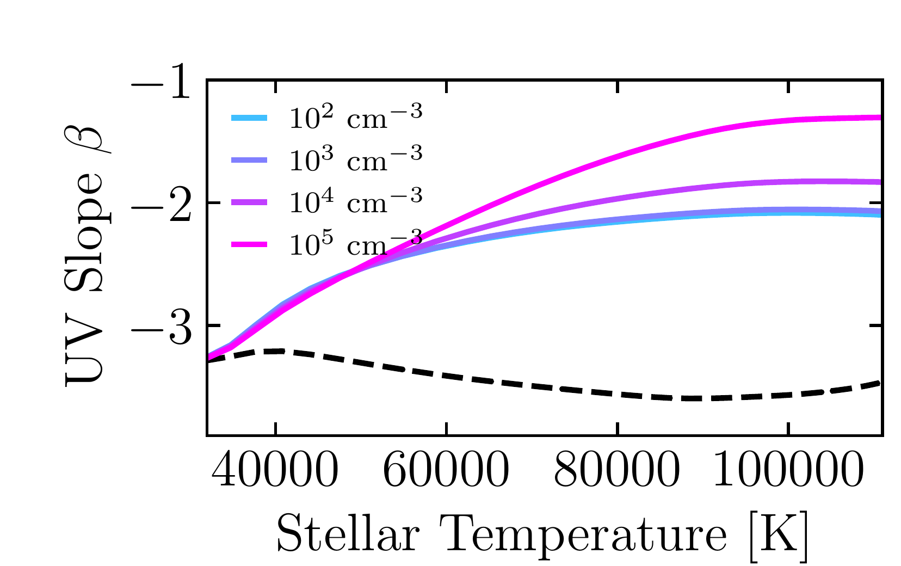
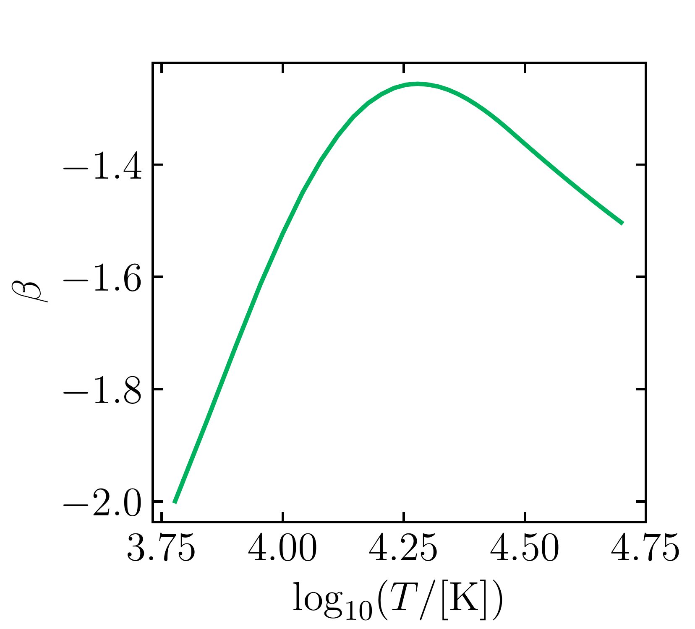
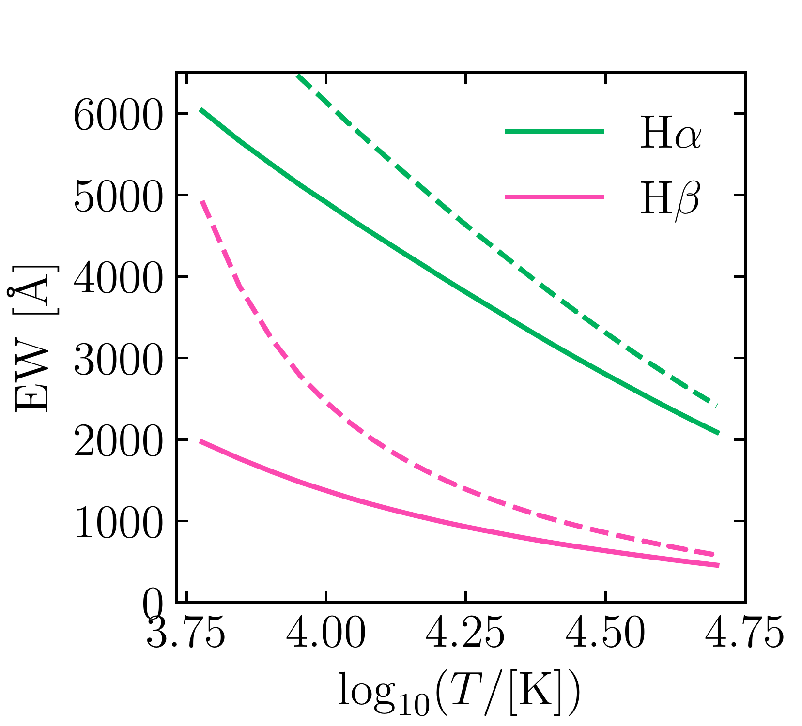
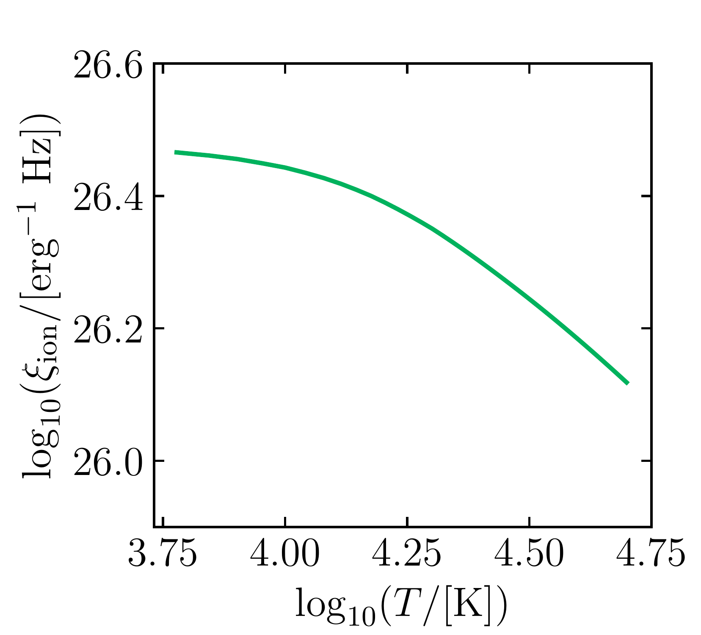
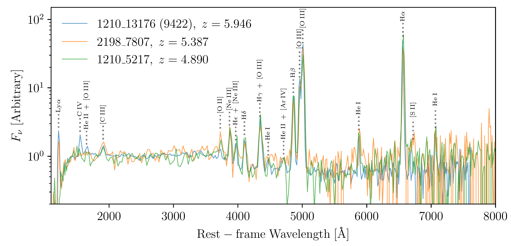

$\newcommand{\ensuremath}{}$
$\newcommand{\xspace}{}$
$\newcommand{\object}[1]{\texttt{#1}}$
$\newcommand{\farcs}{{.}''}$
$\newcommand{\farcm}{{.}'}$
$\newcommand{\arcsec}{''}$
$\newcommand{\arcmin}{'}$
$\newcommand{\ion}[2]{#1#2}$
$\newcommand{\textsc}[1]{\textrm{#1}}$
$\newcommand{\hl}[1]{\textrm{#1}}$
$\newcommand{\footnote}[1]{}$
$\newcommand{\angstrom}{\text{\normalfontÅ}}$
$\newcommand{\cmark}{\textcolor{green}{\ding{51}}}$
$\newcommand{\ct}{C {\small III}}$
$\newcommand{\fesc}{f_{\rm esc}}$
$\newcommand{\fescm}{f_{\rm esc}}$
$\newcommand{\het}{He {\small II}}$
$\newcommand{\kms}{\mbox{{\rm km s^{-1}}}}$
$\newcommand{\lya}{Ly\alpha}$
$\newcommand{\mgt}{Mg {\small II}}$
$\newcommand{\msun}{\mbox{M_{\odot}}}$
$\newcommand{\msunyr}{\mbox{\rm M_{\odot} {\rm yr^{-1}}}}$
$\newcommand{\mstar}{\mbox{M_{*}}}$
$\newcommand{\MUV}{\rm M_{UV}}$
$\newcommand{\mvir}{\mbox{M_{\rm vir}}}$
$\newcommand{\neth}{Ne {\small III}}$
$\newcommand{\ot}{O {\small II}}$
$\newcommand{\oth}{O {\small III}}$
$\newcommand{\SFRten}{\mbox{{\rm SFR}_{\rm 10}}}$
$\newcommand{\xmark}{\textcolor{red}{\ding{55}}}$
$\newcommand{\App}[1]{Appendix~\ref{#1}}$
$\newcommand{\eq}[1]{(\ref{#1})}$
$\newcommand{\Eq}[1]{Eq.~(\ref{#1})}$
$\newcommand{\Eqs}[1]{Eqs.~(\ref{#1})}$
$\newcommand{\Fig}[1]{Fig.~\ref{#1}}$
$\newcommand{\Sec}[1]{\S\ref{#1}}$
$\newcommand{\Tab}[1]{Table~\ref{#1}}$
$\newcommand\Omegab{\Omega_{\rm b}}$
$\newcommand\Omegam{\Omega_{\rm m}}$
$\newcommand\OmegaDM{\Omega_{\rm DM}}$
$\newcommand{\comment}{\textcolor{red}}$

# 21 Balmer Jump Street: The Nebular Continuum at High Redshift and Implications for the Bright Galaxy Problem, UV Continuum Slopes, and Early Stellar Populations$\vspace{-15mm}$

<mark>Appeared on: 2024-08-07</mark> -  _26 pages, 18 figures, submitted to The Open Journal of Astrophysics_

H. Katz, et al. -- incl., <mark>A. d. Graaff</mark>

**Abstract:** We study, from both a theoretical and observational perspective, the physical origin and spectroscopic impact of extreme nebular emission in high-redshift galaxies. The nebular continuum, which can appear during an extreme starburst, is of particular importance as it tends to redden UV slopes and has a significant contribution to the UV luminosities of galaxies. Furthermore, its shape can be used to infer the gas density and temperature of the interstellar medium. First, we provide a theoretical background, showing how different stellar populations (SPS models, initial mass functions (IMFs), and stellar temperatures) and nebular conditions impact observed galaxy spectra. We demonstrate that, for systems with strong nebular continuum emission, 1) UV fluxes can increase by up to 0.7 magnitudes (or more in the case of hot/massive stars) above the stellar continuum, which may help reconcile the surprising abundance of bright high-redshift galaxies and the elevated UV luminosity density at $z\gtrsim10$ , 2) at high gas densities, UV slopes can redden from $\beta\lesssim-2.5$ to $\beta\sim-1$ , 3) observational measurements of $\xi_{\rm ion}$ are grossly underestimated, and 4) UV downturns from two-photon emission can masquerade as damped Ly $\alpha$ systems. Second, we present a dataset of 58 galaxies observed with NIRSpec on JWST at $2.5<z<9.0$ that are selected to have strong nebular continuum emission via the detection of the Balmer jump. Five of the 58 spectra are consistent with being dominated by nebular emission, exhibiting both a Balmer jump and a UV downturn consistent with two-photon emission. For some galaxies, this may imply the presence of hot massive stars and a top-heavy IMF. We conclude by exploring the properties of spectroscopically confirmed $z>10$ galaxies, finding that UV slopes and UV downturns are in some cases redder or steeper than expected from SPS models, which may hint at more exotic (e.g. hotter/more massive stars or AGN) ionizing sources.

**Figure 5. -** UV slope as a function of stellar age for various SPS models (top) or stellar temperature for the individual metal-poor star models (bottom). Solid lines represent the UV slope as measured from total (stellar$+$nebular) emission while dashed lines represent the UV slope of only the stellar component. The dotted red lines indicate a slope of $-2.3$ for reference in all panels. For the Starburst99 models, colors represent different upper-mass IMF slopes (see legend in top panel), while for the C\&B19 models, colors indicate different upper-mass limits (see legend in the third panel). For the individual massive star models, colors indicate the gas density of the nebula.  (*fig:sps_beta*)

**Figure 11. -** (Left) UV slope, $\beta$ as a function of gas temperature for the nebular continuum assuming Case B recombination. (Center) Equivalent widths of H$\alpha$ and H$\beta$ as a function of temperature. Solid and dashed lines show the results with and without two-photon emission, respectively. (Right) $\log_{10}(\xi_{\rm ion})$ as a function of gas temperature for the nebular continuum. (*fig:neb_only_beta*)

**Figure 17. -** Comparison of 1210\_5217 at $z=4.890$ with potential nebular-dominated galaxies 2189\_7807 ($z=5.387$) and GS\_9422 ($z=5.946$). All three show a clear Balmer jump and a very similar UV downturn. Spectral modeling predicts a very high nebular fraction in each of these objects. (*fig:two_phot_spectra*)

