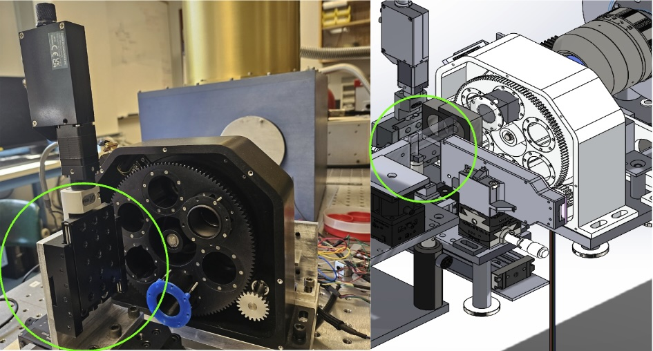
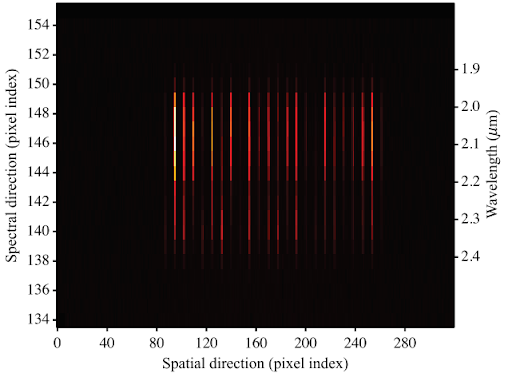
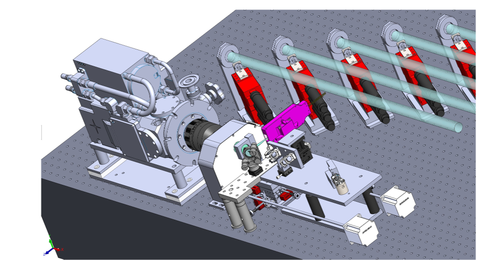

$\newcommand{\ensuremath}{}$
$\newcommand{\xspace}{}$
$\newcommand{\object}[1]{\texttt{#1}}$
$\newcommand{\farcs}{{.}''}$
$\newcommand{\farcm}{{.}'}$
$\newcommand{\arcsec}{''}$
$\newcommand{\arcmin}{'}$
$\newcommand{\ion}[2]{#1#2}$
$\newcommand{\textsc}[1]{\textrm{#1}}$
$\newcommand{\hl}[1]{\textrm{#1}}$
$\newcommand{\footnote}[1]{}$
$\newcommand{\baselinestretch}{1.0}$

# Recent and Upcoming Upgrades for MIRC-X and MYSTIC on the CHARA Array

<mark>Appeared on: 2024-08-09</mark> -  _11 pages, 9 figures, Submitted to SPIE in Yokohama 2024_

N. Ibrahim, et al. -- incl., <mark>D. Mortimer</mark>, <mark>B. Setterholm</mark>

**Abstract:** MIRC-X and MYSTIC are six-telescope near-infrared beam (1.08-2.38 $\mu$ m) combiners at the CHARA Array on Mt Wilson CA, USA. Ever since the commissioning of MIRC-X (J and H bands) in 2018 and MYSTIC (K bands) in 2021, they have been the most popular and over-subscribed instruments at the array. Observers have been able to image stellar objects with sensitivity down to 8.1 mag in H and 7.8 mag in K-band under the very best conditions. In 2022 MYSTIC was upgraded with a new ABCD mode using the VLTI/GRAVITY 4-beam integrated optics chip, with the goal of improving the sensitivity and calibration. The ABCD mode has been used to observe more than 20 T Tauri stars; however, the data pipeline is still being developed. Alongside software upgrades, we detail planned upgrades to both instruments in this paper. The main upgrades are: 1) Adding a motorized filter wheel to MIRC-X along with new high spectral resolution modes 2) Updating MIRC-X optics to allow for simultaneous 6T J+H observations 3) Removing the warm window between the spectrograph and the warm optics in MYSTIC 4) Adding a 6T ABCD mode to MIRC-X in collaboration with CHARA/SPICA 5) Updating the MIRC-X CRED-ONE camera funded by Prof. Kraus from U. Exeter 6) Carrying out science verification of the MIRC-X polarization mode 7) Developing new software for ABCD-mode data reduction and more efficient calibration routines. We expect these upgrades to not only improve the observing experience, but also increase the sensitivity by 0.4 mag in J+H-bands, and 1 mag in K-band.

**Figure 5. -** (left) The filter wheel is assembled and is being tested at UM lab. Special grating holders were 3D printed and can be seen in the blue. A translation stage (circled in green) will hold the different lenses and move desired on into the optical axis so observers can switch between modes (Right) CAD of the filter wheel, the grating holder, and the moving lens system.
 (*fig:wheel*)

**Figure 1. -** Example of MYSTIC ABCD observations as seen on the detector. Four beams are combined and output as 24 parallel lines, sampling four phases of the visibility contrast at each wavelength channel for 6 baselinesmystic (*fig:abcd*)

**Figure 2. -** CAD view of the SPICA-FT (in pink) positioned near the MIRC-X spectrograph spicaft (*fig:SPICAFT*)

