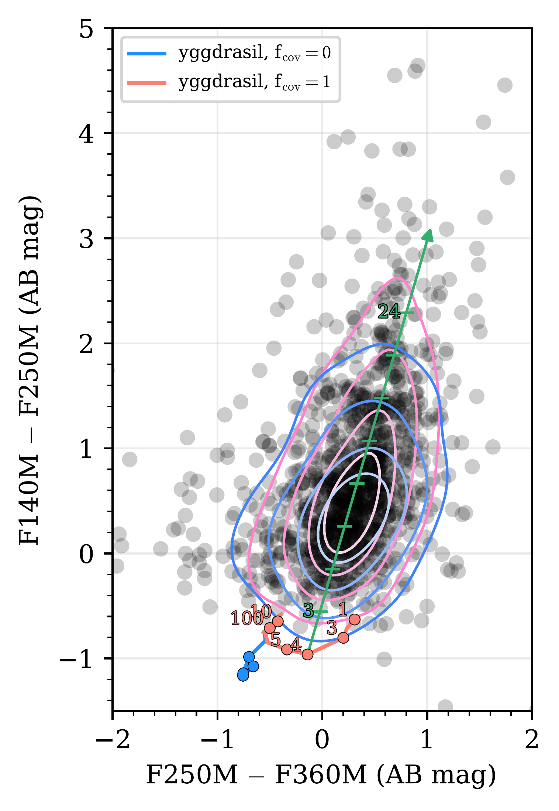

$\newcommand{\ensuremath}{}$
$\newcommand{\xspace}{}$
$\newcommand{\object}[1]{\texttt{#1}}$
$\newcommand{\farcs}{{.}''}$
$\newcommand{\farcm}{{.}'}$
$\newcommand{\arcsec}{''}$
$\newcommand{\arcmin}{'}$
$\newcommand{\ion}[2]{#1#2}$
$\newcommand{\textsc}[1]{\textrm{#1}}$
$\newcommand{\hl}[1]{\textrm{#1}}$
$\newcommand{\footnote}[1]{}$
$\newcommand{\url}[1]{\href{#1}{#1}}$
$\newcommand{\dodoi}[1]{doi:~\href{http://doi.org/#1}{\nolinkurl{#1}}}$
$\newcommand{\doeprint}[1]{\href{http://ascl.net/#1}{\nolinkurl{http://ascl.net/#1}}}$
$\newcommand{\doarXiv}[1]{\href{https://arxiv.org/abs/#1}{\nolinkurl{https://arxiv.org/abs/#1}}}$
$\newcommand{\vdag}{(v)^\dagger}$
$\newcommand$
$\newcommand$
$\newcommand{\starbug}{\textsc{starbug ii}}$
$\newcommand{\cigale}{\textsc{cigale}}$
$\newcommand{\yggdrasil}{\textsc{yggdrasil}}$
$\newcommand{\MJysr}{MJy~sr^{-1}}$
$\newcommand{\msun}{M_\odot}$
$\newcommand{\lsun}{L_\odot}$
$\newcommand{\sourcextractor}{{\tt SourceXtractor++}}$
$\newcommand{\ml}{\Upsilon_*}$
$\newcommand{\mstar}{M_*}$
$\newcommand{\per}{^{-1}}$
$\newcommand{\citetJD}{M.~J. Jiménez-Donaire et al. (in prep.)}$
$\newcommand{\citepJD}{M.~J. Jiménez-Donaire et al. in prep.}$
$\newcommand{\change}$
$\newcommand{\todo}{\textcolor{WildStrawberry}}$
$\newcommand{ÅPF}{\altaffiliation{NSF Astronomy and Astrophysics Postdoctoral Fellow}}$
$\newcommand{\Arizona}{\affiliation{Steward Observatory, University of Arizona, Tucson, AZ 85721, USA}}$
$\newcommand{\Maryland}{\affiliation{Department of Astronomy, University of Maryland, College Park, MD 20742, USA}}$
$\newcommand{\JSI}{\affiliation{Joint Space-Science Institute, University of Maryland, College Park, MD 20742, USA}}$
$\newcommand{\INA}{\affiliation{Instituto Nacional de Astrofísica, Óptica y Electrónica, Luis Enrique Erro 1, Tonantzintla, 72840 Puebla, Mexico}}$
$\newcommand{\BUAP}{\affiliation{Benemérita Universidad Autónoma de Puebla, Av. San Manuel, 72000 Puebla, Mexico}}$
$\newcommand{\STScI}{\affiliation{Space Telescope Science Institute, 3700 San Martin Drive, Baltimore, MD 21218, USA}}$
$\newcommand{\MPIA}{\affiliation{Max Planck Institut for Astronomy, Konigstuhl 17, 69117 Heidelberg, Germany}}$
$\newcommand{\KU}{\affiliation{Department of Physics and Astronomy, University of Kansas, 1251 Wescoe Hall Drive, Lawrence, KS 66045, USA}}$
$\newcommand{\UWyoming}{\affiliation{Department of Physics and Astronomy, University of Wyoming, Laramie, WY 82071, USA}}$
$\newcommand{\Leiden}{\affiliation{Leiden Observatory, Leiden University, P.O.~Box 9513, 2300~RA~Leiden, The Netherlands}}$
$\newcommand{\UGent}{\affiliation{Sterrenkundig Observatorium, Ghent University, Krijgslaan 281 - S9, B-9000 Gent, Belgium}}$
$\newcommand{\France}{\affiliation{Collège de France, 11 Pl. Marcelin Berthelot, 75231 Paris, France}}$
$\newcommand{\ParisObs}{\affiliation{Observatoire de Paris, 61 avenue de l’Observatoire, 75014 Paris, France}}$
$\newcommand{\ESOST}{\affiliation{European Space Agency, c/o STScI, 3700 San Martin Drive, Baltimore, MD 21218, USA}}$
$\newcommand{\ITA}{\affiliation{Universität Heidelberg, Zentrum für Astronomie, Institut für Theoretische Astrophysik, Albert-Ueberle-Str. 2, D-69120 Heidelberg, Germany}}$
$\newcommand{\IWR}{\affiliation{Universität Heidelberg, Interdisziplinäres Zentrum für Wissenschaftliches Rechnen, Im Neuenheimer Feld 205, D-69120 Heidelberg, Germany}}$
$\newcommand{\SOFIA}{\affiliation{Stratospheric Observatory for Infrared Astronomy, NASA Ames Research Center, Mail Stop 204-14, Moffett Field, CA 94035, USA}}$
$\newcommand{\JPL}{\affiliation{Jet Propulsion Laboratory, California Institute of Technology, 4800 Oak Grove Dr., Pasadena, CA 91109, USA}}$
$\newcommand{\UdeC}{\affiliation{Departamento de Astronomía, Universidad de Concepción, Barrio Universitario, Concepción, Chile}}$
$\newcommand{\NMMT}{\affiliation{New Mexico Institute of Mining and Technology, 801 Leroy Place, Socorro, NM 87801, USA}}$
$\newcommand{\NRAOSocorro}{\affiliation{National Radio Astronomy Observatory, P.O. Box O, 1003 Lopezville Road, Socorro, NM 87801, USA}}$
$\newcommand{\OSU}{\affiliation{Department of Astronomy, The Ohio State University, Columbus, OH 43210, USA}}$
$\newcommand{\UGR}{\affiliation{Dept. Física Teórica y del Cosmos, Universidad de Granada, 18071, Granada, Spain }}$
$\newcommand{\OAN}{\affiliation{Observatorio Astronómico Nacional (IGN), C/Alfonso XII, 3, E-28014 Madrid, Spain}}$
$\newcommand{\YS}{\affiliation{Centro de Desarrollos Tecnológicos, Observatorio de Yebes (IGN), 19141 Yebes, Guadalajara, Spain}}$
$\newcommand{\Swinburne}{\affiliation{Centre for Astrophysics and Supercomputing, Swinburne University of Technology, Hawthorn, VIC 3122, Australia}}$
$\newcommand{\ASTROTD}{\affiliation{ARC Centre of Excellence for All Sky Astrophysics in 3 Dimensions (ASTRO 3D)}}$
$\newcommand$
$\newcommand\natexlab{#1}$

# JWST Observations of Starbursts: Massive Star Clusters in the Central Starburst of M 82

<mark>Appeared on: 2024-08-09</mark> -  _Resubmitted to ApJL_

R. C. Levy, et al. -- incl., <mark>F. Walter</mark>

**Abstract:** We present a near infrared (NIR) candidate star cluster catalog for the central kiloparsec of M 82 based on new JWST NIRCam images. We identify star cluster candidates using the F250M filter, finding 1357 star cluster candidates with stellar masses $>10^4$ M $_\odot$ . Compared to previous optical catalogs, nearly all (87 \% ) of the candidates we identify are new. The star cluster candidates have a median intrinsic cluster radius of $\approx$ 1 pc and have stellar masses up to $10^6$ M $_\odot$ . By comparing the color-color diagram to dust-free yggdrasil stellar population models, we estimate that the star cluster candidates have A $_{\rm V}\sim3-24$ mag, corresponding to A $_{\rm 2.5\mu m}\sim0.3-2.1$ mag. There is still appreciable dust extinction towards these clusters into the NIR. We measure the stellar masses of the star cluster candidates, assuming ages of 0 and 8 Myr. The slope of the resulting cluster mass function is $\beta=1.9\pm0.2$ , in excellent agreement with studies of star clusters in other galaxies.

**Figure 4. -** The central 870 pc of M 82 seen with NIRCam showing F140M (blue), F250M (green), and F360M (red) on an asinh scale. $\change${Insets show zoom-ins to 50 pc $\times$ 50 pc regions around some representative massive star cluster candidates.} The circles indicate the massive clusters identified in the NIRCam image, where the radius of the circle is the fitted (deconvolved) radius (see Section \ref{sec:prop} and Table \ref{tab:catalog}). Blue (pink) circles show clusters which do (do not) overlap with the HST catalog \citep[][see Section \ref{ssec:comp_other_cats}]{Mayya2008}. Clusters 1 and 2 are labeled (see Sections \ref{ssec:radii} and \ref{ssec:comp_other_cats}). The right insets show HST three-color images at the same locations (blue: F435W, green: F555W, red: F814W). The light blue circles in the HST insets show the star clusters identified by \citet{Mayya2008} in these selected regions using the same HST data, where the radius of each circle is 5 pc. The pink and blue circles are the same as in the left panels. (*fig:multicolor*)

**Figure 5. -** The cumulative CMFs shown as a fraction of the number of clusters for different assumed ages (colored solid curves). The blue and orange shaded regions on the 0 Myr and 8 Myr curves indicates the approximate range of mass increase due to extinction $\change${which scales with M$_*$ (dark) or which is constant with M$_*$ (light); see Section \ref{sssec:dust} for details.} The gray shaded region shows masses below $10^4$ $\msun$ which are not included in the final catalog. The purple line and shaded region shows the power-law fit for the 0 Myr CMF for M$_*>10^4$ $\msun$. The dashed orange curve shows the cumulative CMF for the nuclear star clusters identified by \citet{Mayya2008} which have an assumed age of 8 Myr. (*fig:cmf*)

**Figure 3. -** $\change${A color-color plot of the clusters (black dots). The contours show the density of the points; contour levels show 10, 25, 50, and 75\% density levels for clusters which overlap with the \citet{Mayya2008} catalog (blue) and those only detected with NIRCam (pink). The colored tracks show $\yggdrasil$ SSP models assuming no ($\rm{f_{cov}}=0$; blue) and maximal ($\rm{f_{cov}}=1$; red) contributions from nebular emission. The green arrow shows the slope of the reddening vector with A$_{\rm V}=3-24$ mag marked in increments of 3. The clusters in M 82 detected with NIRCam show significant reddening with respect to the dust-free SSP tracks.} (*fig:color-color*)

