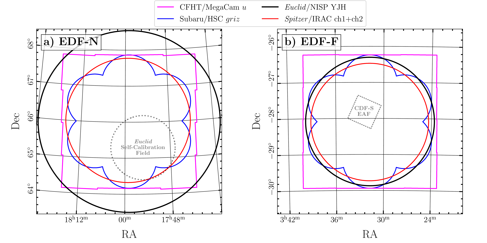
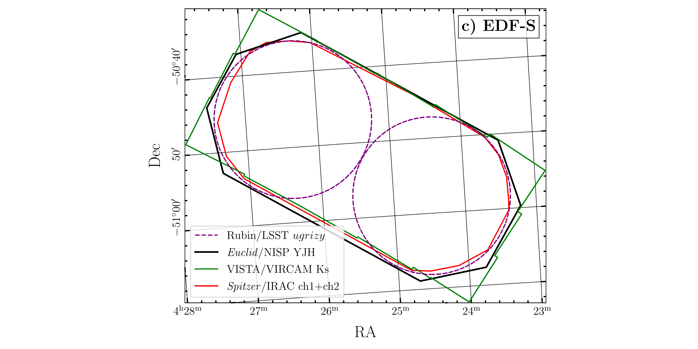
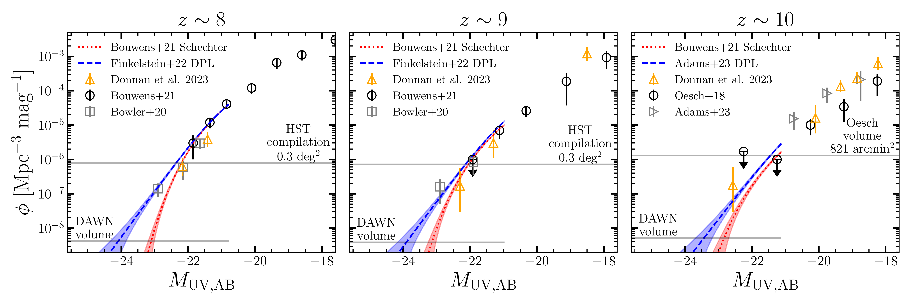
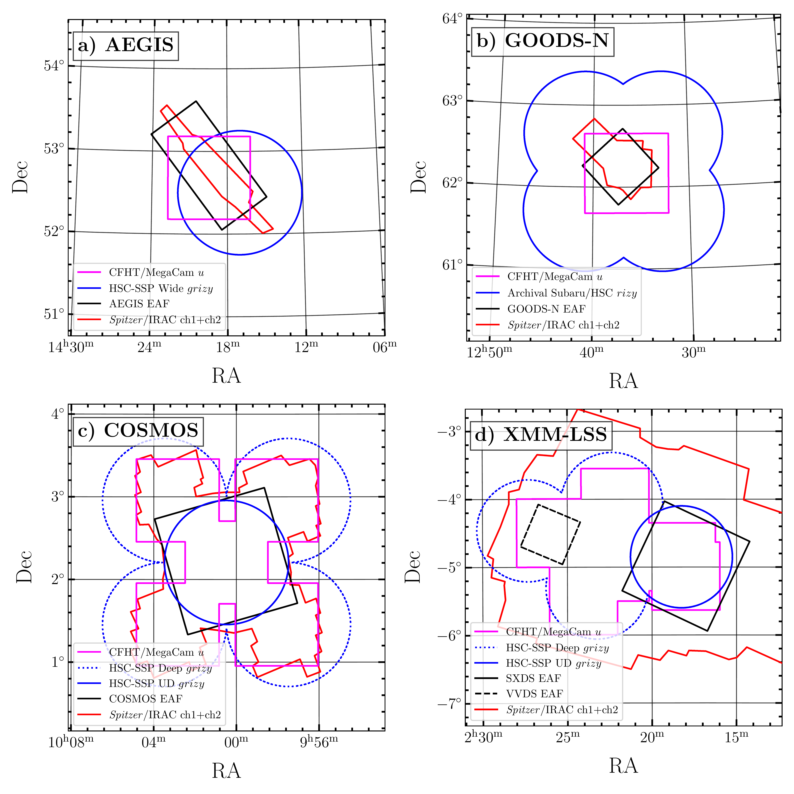

$\newcommand{\ensuremath}{}$
$\newcommand{\xspace}{}$
$\newcommand{\object}[1]{\texttt{#1}}$
$\newcommand{\farcs}{{.}''}$
$\newcommand{\farcm}{{.}'}$
$\newcommand{\arcsec}{''}$
$\newcommand{\arcmin}{'}$
$\newcommand{\ion}[2]{#1#2}$
$\newcommand{\textsc}[1]{\textrm{#1}}$
$\newcommand{\hl}[1]{\textrm{#1}}$
$\newcommand{\footnote}[1]{}$
$\newcommand{\papernumber}$
$\newcommand{\orcid}[1]$

# $\Euclid$ Preparation. $\papernumber$ The Cosmic Dawn Survey (DAWN) of the Euclid Deep and Auxiliary Fields

<mark>Appeared on: 2024-08-13</mark> -  _16 pages, 10 figures, submitted to A&A_

E. Collaboration, et al. -- incl., <mark>K. Jahnke</mark>

**Abstract:** $\Euclid$ will provide deep NIR imaging to $\sim$ 26.5 AB magnitude over $\sim$ 59 deg $^2$ in its deep and auxiliary fields. The Cosmic DAWN survey complements the deep $\Euclid$ data with matched depth multiwavelength imaging and spectroscopy in the UV--IR to provide consistently processed $\Euclid$ selected photometric catalogs, accurate photometric redshifts, and measurements of galaxy properties to a redshift of $z\sim 10$ . In this paper, we present an overview of the survey, including the footprints of the survey fields, the existing and planned observations, and the primary science goals for the combined data set.

**Figure 9. -** Footprints of the DAWN survey image data in the Euclid Deep Fields. Note that the Rubin/LSST footprint in EDF-S shows the expected pointing pattern for the EDF-S Deep Drilling Field and may change once the survey begins \citep{ivezic2019}. (*fig:deep_fields*)

**Figure 7. -** Measurements of the ultraviolet luminosity function $\phi$ at $z = \textrm{8--10}$ from the literature \citep{Oesch2018,Bowler2020,Bouwens2021,Finkelstein2022,Adams2023,Donnan2023}. The red and blue lines show extrapolations to the volume of the DAWN survey based on the best fitting Schechter and double power-law (DPL) functions, with the shaded regions showing associated Poisson uncertainties for the DAWN survey volume. Upper limits based on survey volume are indicated with the horizontal lines. The DAWN volume in each panel assumes an area of 59 deg$^2$, a redshift slice of $\pm0.5$ from the redshift bin center, and a \citet{Planck2018}$\Lambda$CDM cosmology. (*fig:uvlf*)

**Figure 10. -** Footprints of the DAWN survey image data in the EAFs. The coloured lines show the extent of the image data indicated in the legend. Note that the EAF footprints are approximations based on the \Euclid survey plan. Updated footprints that to reflect the actual \Euclid coverage in the EAFs will be provided along with subsequent DAWN data releases. (*fig:EAFs*)

