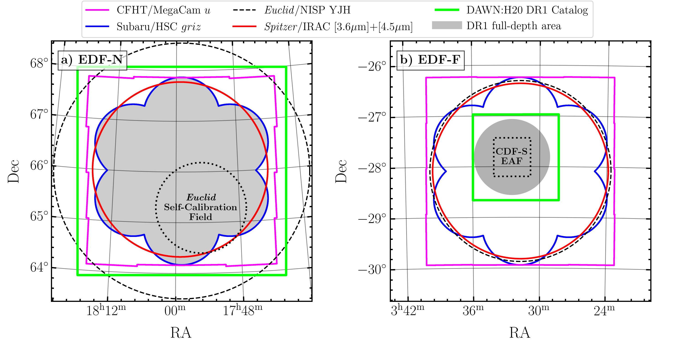
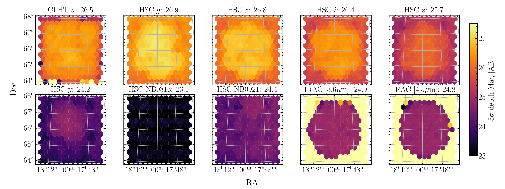
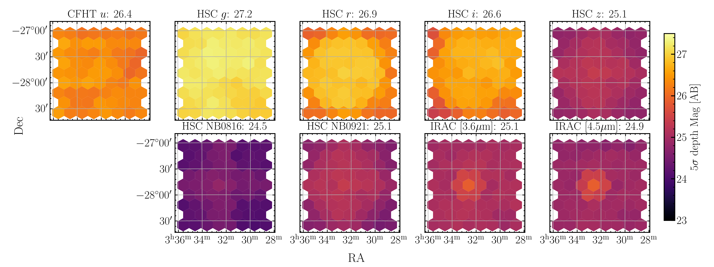

$\newcommand{\ensuremath}{}$
$\newcommand{\xspace}{}$
$\newcommand{\object}[1]{\texttt{#1}}$
$\newcommand{\farcs}{{.}''}$
$\newcommand{\farcm}{{.}'}$
$\newcommand{\arcsec}{''}$
$\newcommand{\arcmin}{'}$
$\newcommand{\ion}[2]{#1#2}$
$\newcommand{\textsc}[1]{\textrm{#1}}$
$\newcommand{\hl}[1]{\textrm{#1}}$
$\newcommand{\footnote}[1]{}$
$\newcommand{\orcid}[1]$
$\newcommand{\photoz}{photo-\textit{z}}$
$\newcommand{\specz}{spec-\textit{z}}$
$\newcommand{\Msol}{{\rm M}_\odot}$
$\newcommand{\classic}{\textsc{Classic}}$
$\newcommand{\lephare}{\texttt{LePhare}}$
$\newcommand{\eazy}{\texttt{EAZY}}$
$\newcommand{\tractor}{\texttt{The Tractor}}$
$\newcommand{\farmer}{\texttt{The Farmer}}$
$\newcommand{\sigmaz}{\sigma_{\Delta z / (1+z_{\rm s})}}$
$\newcommand{\zmin}{z_{\rm phot}^{\rm min}}$
$\newcommand{\zmax}{z_{\rm phot}^{\rm max}}$
$\newcommand{\SEP}{\texttt{SEP}}$
$\newcommand{\chOne}{[3.6\mum]}$
$\newcommand{\chTwo}{[4.5\mum]}$
$\newcommand{\hscpipe}{\texttt{hscpipe}}$

# $\Euclid$ preparation.

<mark>Appeared on: 2024-08-13</mark> - 

E. Collaboration, et al. -- incl., <mark>K. Jahnke</mark>

**Abstract:** The Cosmic Dawn Survey (DAWN survey) provides multiwavelength (UV/optical to mid-IR) data across the combined 59 deg $^{2}$ of the Euclid Deep and Auxiliary fields (EDFs and EAFs). Here, the first public data release (DR1) from the DAWN survey is presented. DR1 catalogues are made available for a subset of the full DAWN survey that consists of two Euclid Deep fields: Euclid Deep Field North (EDF-N) and Euclid Deep Field Fornax (EDF-F). The DAWN survey DR1 catalogues do not include $\Euclid$ data as they are not yet public for these fields. Nonetheless, each field has been covered by the ongoing Hawaii Twenty Square Degree Survey (H20), which includes imaging from CFHT MegaCam in the new $u$ filter and from Subaru Hyper Suprime-Cam (HSC) in the $griz$ filters. Each field is further covered by _Spitzer_ /IRAC 3.6-4.5 $\mu$ m imaging spanning 10 deg $^{2}$ and reaching $\sim$ 25 mag AB (5 $\sigma$ ). All present H20 imaging and all publicly available imaging from the aforementioned facilities are combined with the deep _Spitzer_ /IRAC data to create source catalogues spanning a total area of 16.87 deg $^{2}$ in EDF-N and 2.85 deg $^{2}$ in EDF-F for this first release. Photometry is measured from these multiwavelength data using $\farmer$ , a novel and well-validated model-based photometry code. Photometric redshifts and stellar masses are computed using two independent codes for modeling spectral energy distributions: $\eazy$ and $\lephare$ . Photometric redshifts show good agreement with spectroscopic redshifts ( $\sigma_{\rm NMAD} \sim  0.5, \eta < 8\%$ at $i < 25$ ). Number counts, photometric redshifts, and stellar masses are further validated in comparison to the COSMOS2020 catalogue. The DAWN survey DR1 catalogues are designed to be of immediate use in these two EDFs and will be continuously updated and made available as both new ground-based data and spaced-based data from $\Euclid$ are acquired and made public. Future data releases will provide catalogues of all EDFs and EAFs and include $\Euclid$ data.

**Figure 10. -** Magnitude vs. magnitude error for each unique facility/filter combination, with EDF-N shown in colour and EDF-F shown in grey. Each solid line represents the median magnitude uncertainty as a function of magnitude for a given band. The shaded regions are bounded by the 84th and 16th percentiles of the magnitude error distributions, enclosing 68\% of the objects. The 5$\sigma$ limiting magnitudes measured with 2$\arcsec$  diameter apertures reported in Table \ref{tab:depths} are shown by vertical lines. A horizontal dotted line indicates a 5$\sigma$ model-based photometric uncertainty.  (*fig:mag_magerr*)

**Figure 6. -** Layouts and facility coverage for the two fields included in the DAWN survey DR1 catalogues, EDF-N (left) and EDF-F (right). Also highlighted are areas of particular importance to \Euclid, namely, the \Euclid self-calibration field in EDF-N, and the Chandra Deep Field South (CDF-S) Euclid Auxiliary Field (EAF) in EDF-F. The regions spanned by the DR1 catalogues are illustrated by the green squares. The areas of the DR1 catalogues reaching approximately final integration times by all facilities (or covered to full depth; see Sect. \ref{subsec:area_coverage} and Table \ref{tab:exptimes}) are shown in grey. A future release from the DAWN survey will include catalogues with coverage from all facilities at full-depth spanning the entirety of EDF-N and EDF-F areas are targeted by \Euclid. (*fig:field_layouts*)

**Figure 8. -** Depths and limiting magnitudes measured by the dispersion of empty aperture fluxes for each bandpass (see Sect. \ref{subsec:image_depths} and Appendix \ref{app:depths} for details). The top two rows correspond to EDF-N, and the bottom two rows correspond to EDF-F. The \enquote{full-depth} regions of EDF-N and EDF-F illustrated in Fig. \ref{fig:field_layouts} is apparent by the areas of greater depth in the HSC $griz$(see Sect. \ref{subsec:area_coverage}, Table \ref{tab:exptimes}, and Table \ref{tab:cat_areas}). The quoted value along the top of each panel is the median 5$\sigma$ depth the full-depth region of each  field. Only the areas covered by the DAWN survey DR1 catalogues is shown, corresponding to the green rectangular regions in Fig. \ref{fig:field_layouts}. Future data acquired from CFHT MegaCam and Subaru HSC will expand the areas of both fields and lead to more uniform coverage. The depths are summarized in Table \ref{tab:depths}. (*fig:depths*)

