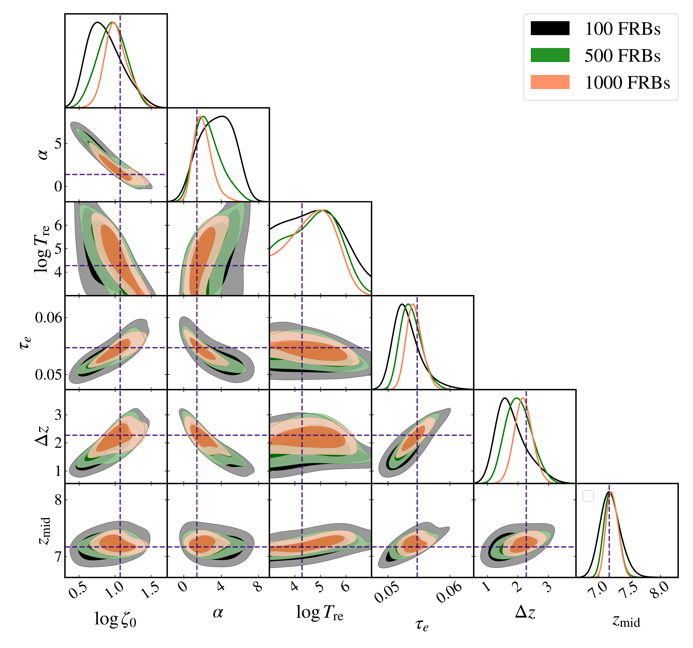
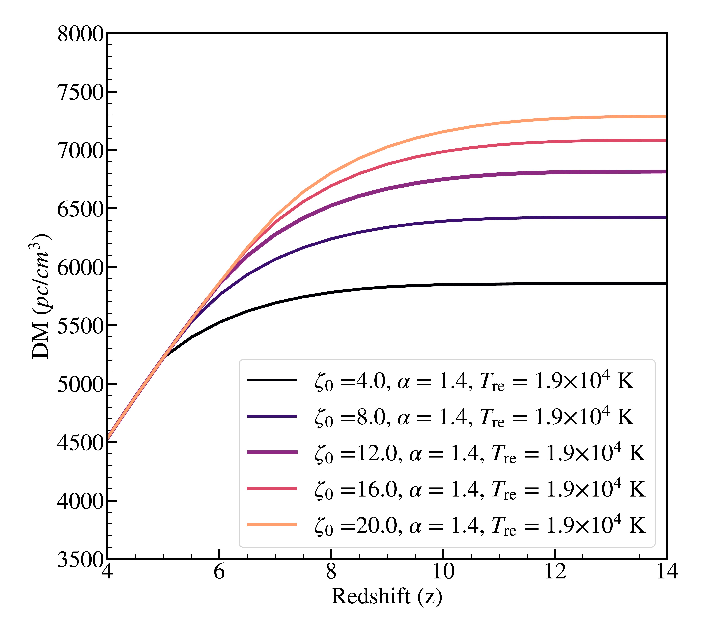
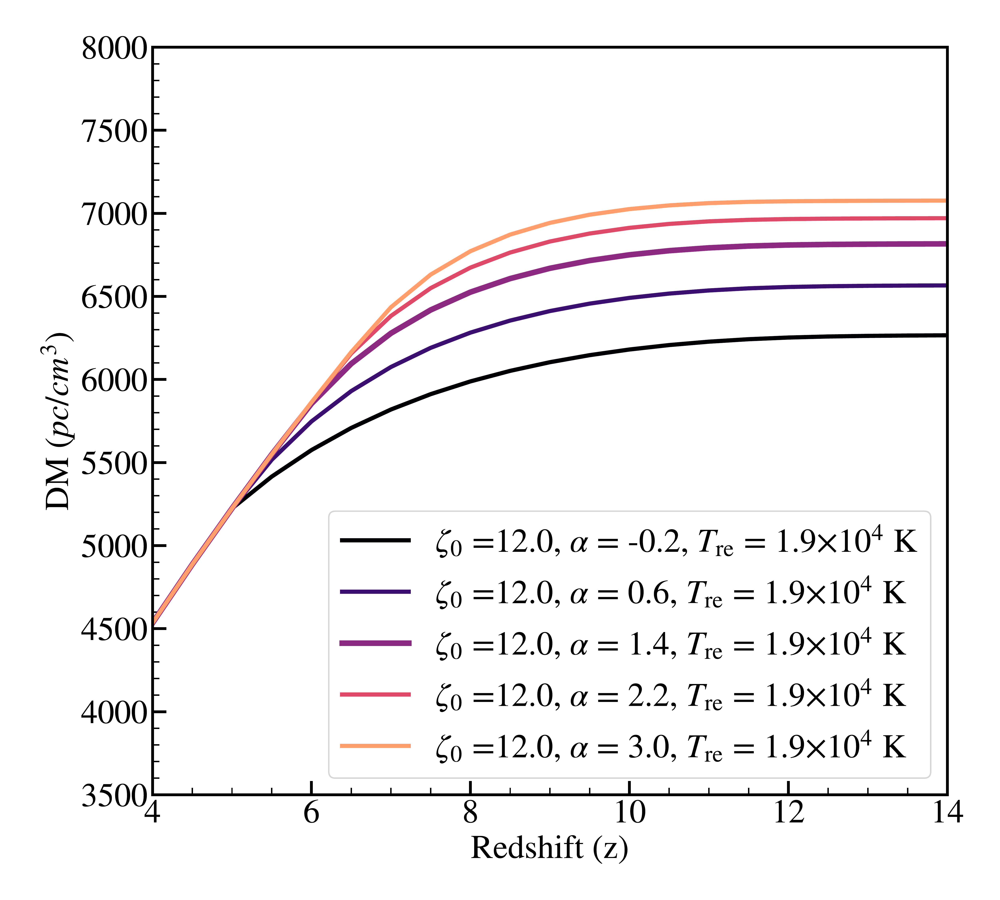
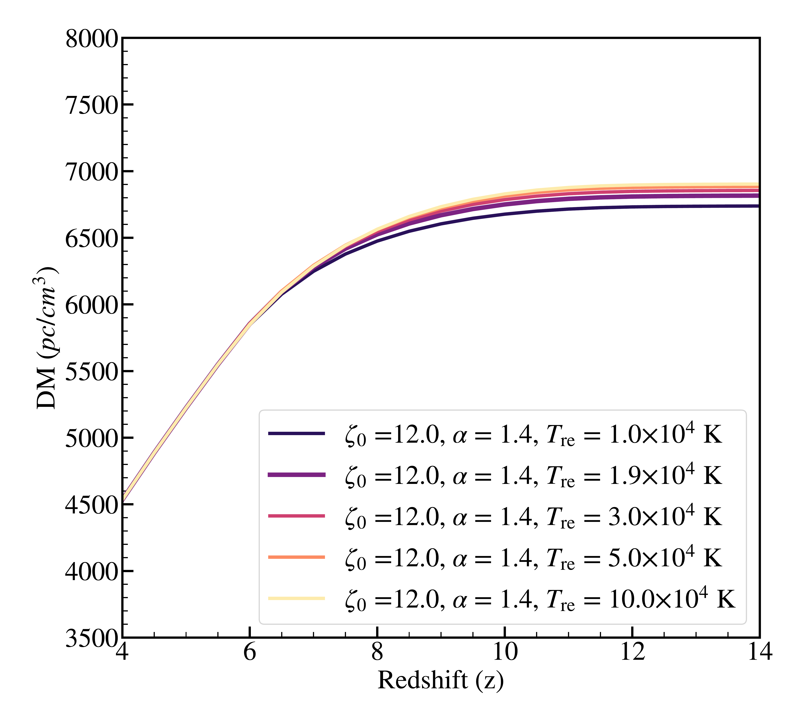
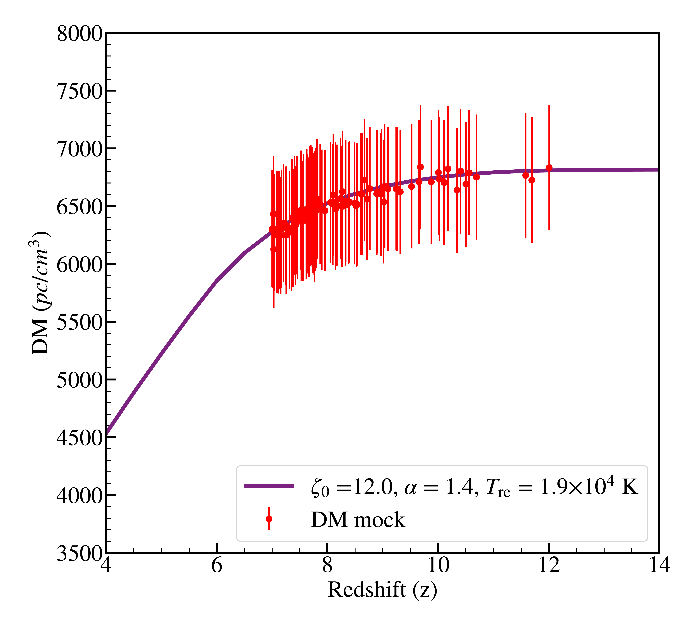

$\newcommand{\ensuremath}{}$
$\newcommand{\xspace}{}$
$\newcommand{\object}[1]{\texttt{#1}}$
$\newcommand{\farcs}{{.}''}$
$\newcommand{\farcm}{{.}'}$
$\newcommand{\arcsec}{''}$
$\newcommand{\arcmin}{'}$
$\newcommand{\ion}[2]{#1#2}$
$\newcommand{\textsc}[1]{\textrm{#1}}$
$\newcommand{\hl}[1]{\textrm{#1}}$
$\newcommand{\footnote}[1]{}$
$\newcommand{\be}{\begin{equation}}$
$\newcommand{\ee}{\end{equation}}$
$\newcommand\bear{#1}\ear{\begin{align}#1\end{align}}$
$\newcommand{\nline}{\notag \\}$
$\newcommand{\f}{\frac}$
$\newcommand{\de}{\mathrm{d}}$
$\newcommand{\del}{\partial}$
$\newcommand{\half}{\frac{1}{2}}$
$\newcommand{\im}{\mathrm{i}}$
$\newcommand{\e}{\mathrm{e}}$
$\newcommand{\Msun}{\mathrm{M}_{\odot}}$
$\newcommand{\eqn}[1]{equation~(\ref{#1})}$
$\newcommand{\eqns}[2]{equations~(\ref{#1}) and~(\ref{#2})}$
$\newcommand{\secn}[1]{Section~\ref{#1}}$
$\newcommand{\appndx}[1]{Appendix~\ref{#1}}$
$\newcommand{\fig}[1]{Fig.~\ref{#1}}$
$\newcommand{\figs}[1]{Figs.~\ref{#1}}$
$\newcommand{\tab}[1]{Table~\ref{#1}}$
$\newcommand{\TRC}[1]{{\color{red}[{\bf TRC:} #1]}}$
$\newcommand{\BM}[1]{{\color{blue}[{\bf }#1]}}$
$\newcommand{\AP}[1]{\textbfit{\color{purple}[AP: #1]}}$
$\newcommand{\red}[1]{{\color{red} #1}}$
$\usepackage[T1]{fontenc}$
$\usepackage{amsmath}$
$\DeclareRobustCommand{\VAN}[3]{#2}$
$\let\VANthebibliography\thebibliography$
$\newcommand{\thebibliography}{\DeclareRobustCommand{\VAN}[3]{##3}\VANthebibliography}$
$\usepackage{graphicx}$
$\usepackage{txfonts}$
$\begin{document}$
$   \title{Prospects of FRBs and Large Scale 21~cm Power Spectra in Constraining the Epoch of Reionization}$
$   \author{Barun Maity$
$          \inst{1}}$
$   \institute{Max-Planck-Institut für Astronomie, Königstuhl 17, D-69117 Heidelberg, Germany\               \email{maity@mpia.de}}$
$   \date{Received XXX; accepted XXX}$
$  \abstract{The Epoch of Reionization (EoR) is a crucial link to grasp the complete evolutionary history of the universe. Several attempts with a variety of observables have been utilized in the past to understand the thermal and ionization evolution of the Intergalactic Medium during EoR. In this study, we explore the simultaneous prospects of two important observables which are expected to be available in the near future, i.e. Dispersion Measure (DM) of high redshift FRBs and large scale 21 cm power spectra. For this purpose, we use an earlier developed explicitly photon conserving semi numerical model, \texttt{SCRIPT} including realistic recombination and radiative feedback effect. We check that DM evolution of 100 mock FRBs at high redshifts (7.0\le z\le15.0) is sufficient to recover the underlying reionization model, while 1000 FRB mocks at redshift range can constrain the reionization timeline within the percentage level uncertainties at 68\% confidence limit. Further, we study the effect of including large scale 21~cm power spectra (using only a single bin, k\sim0.14~h/\mathrm{cMpc}) at three redshifts along with FRB DM distribution. The joint exploration using these two observables can significantly improve the constraints on the various parameters (\lesssim 8\% uncertainties for reionization interval and midpoint at 95\% confidence) alleviating the degeneracies and can narrow down the thermal history of the universe by discarding some of the extreme heating models.}$
$   \keywords{intergalactic medium -- cosmology: theory – dark ages, reionization, first stars -- large-scale structure of Universe}$
$   \maketitle$
$\n\end{document}\end{equation}}$
$\newcommand{\ee}{\end{equation}}$
$\newcommand{\nline}{\notag \\}$
$\newcommand{\f}{\frac}$
$\newcommand{\de}{\mathrm{d}}$
$\newcommand{\del}{\partial}$
$\newcommand{\half}{\frac{1}{2}}$
$\newcommand{\im}{\mathrm{i}}$
$\newcommand{\e}{\mathrm{e}}$
$\newcommand{\Msun}{\mathrm{M}_{\odot}}$
$\newcommand{\eqn}[1]{equation~(\ref{#1})}$
$\newcommand{\eqns}[2]{equations~(\ref{#1}) and~(\ref{#2})}$
$\newcommand{\secn}[1]{Section~\ref{#1}}$
$\newcommand{\appndx}[1]{Appendix~\ref{#1}}$
$\newcommand{\fig}[1]{Fig.~\ref{#1}}$
$\newcommand{\figs}[1]{Figs.~\ref{#1}}$
$\newcommand{\tab}[1]{Table~\ref{#1}}$
$\newcommand{\TRC}[1]{{\color{red}[{\bf TRC:} #1]}}$
$\newcommand{\BM}[1]{{\color{blue}[{\bf }#1]}}$
$\newcommand{\AP}[1]{\textbfit{\color{purple}[AP: #1]}}$
$\newcommand{\red}[1]{{\color{red} #1}}$
$\newcommand{\arraystretch}{0.5}$
$\newcommand\bear{#1}$
$\newcommand{\thebibliography}{\DeclareRobustCommand{\VAN}[3]{##3}\VANthebibliography}$

# Prospects of FRBs and Large Scale 21 cm Power Spectra in Constraining the Epoch of Reionization

<mark>Appeared on: 2024-08-13</mark> -  _Accepted for publication in A&A_

<mark>B. Maity</mark>

**Abstract:** The Epoch of Reionization (EoR) is a crucial link to grasp the complete evolutionary history of the universe. Several attempts with a variety of observables have been utilized in the past to understand the thermal and ionization evolution of the Intergalactic Medium during EoR. In this study, we explore the simultaneous prospects of two important observables which are expected to be available in the near future, i.e. Dispersion Measure (DM) of high redshift FRBs and large scale 21 cm power spectra. For this purpose, we use an earlier developed explicitly photon conserving semi numerical model, \texttt{SCRIPT} including realistic recombination and radiative feedback effect. We check that DM evolution of 100 mock FRBs at high redshifts ( $7.0\le z\le15.0$ ) is sufficient to recover the underlying reionization model, while 1000 FRB mocks at redshift range can constrain the reionization timeline within the percentage level uncertainties at 68 \% confidence limit. Further, we study the effect of including large scale 21 cm power spectra (using only a single bin, $k\sim0.14 h/\mathrm{cMpc}$ ) at three redshifts along with FRB DM distribution. The joint exploration using these two observables can significantly improve the constraints on the various parameters ( $\lesssim 8\%$ uncertainties for reionization interval and midpoint at 95 \% confidence) alleviating the degeneracies and can narrow down the thermal history of the universe by discarding some of the extreme heating models.

**Figure 3. -** The comparison of parameter posteriors for three different sets of FRB mocks, i.e. with 100 (_black_), 500 (_green_) \& 1000 (_orange_) samples. The diagonal panels show the 1D posterior probability distribution while off diagonal panels show the joint 2D posteriors. The contours represent 68\% and 95\% confidence intervals. The dashed line represents the input parameter values used to generate the reionization model which has further been used to create the FRB mocks.  (*fig:corner_constr*)

**Figure 1. -**  The first three panels (a,b,c) show the variation of globally averaged Dispersion Measure (DM) as a function of redshift for different free parameters in our model (i.e. $\zeta_0$, $\alpha$ and $T_{\mathrm{re}}$). We use $\zeta_0=12$, $\alpha=1.4$, and $T_{\mathrm{re}}=1.9\times10^4  \mathrm{K}$ as our fiducial model parameters in the analysis later. For each case, we show the plots for five different parameter values. The last panel (d) shows the fiducial mock DM values (at true redshifts) for 100 samples along with the corresponding input model. The mock data have been generated assuming a typical expectation from upcoming facilities like SKA. (*fig:DM_with_param*)

**Figure 4. -** Plots of 500 random models from the posterior chains for two different sets of FRB mocks (with 100 : _black_; with 1000 : _orange_). At the _left_ panel: we show the evolution of neutral hydrogen fraction with redshift. The red vertical dashed line represents our hard prior on the end of reionization at $z=5.3$. At the _right_ panel: we show the mean IGM temperature evolution. Although we don't use any other observational constraints while pursuing parameter space exploration, we show some of the existing observational estimates for ease of comparison.
    The magenta points at the _left_ represent the recent upper limits on neutral fraction from  ([Jin, Yang and Fan 2023]()) . The cyan points at the _right_ are the constraints on the mean IGM temperature using Ly-$\alpha$ forest spike statistics study  ([Gaikwad, Rauch and Haehnelt 2020]()) . The blue dashed line represents the input reionization model used for generating the FRB mocks.  (*fig:posterior_models*)

